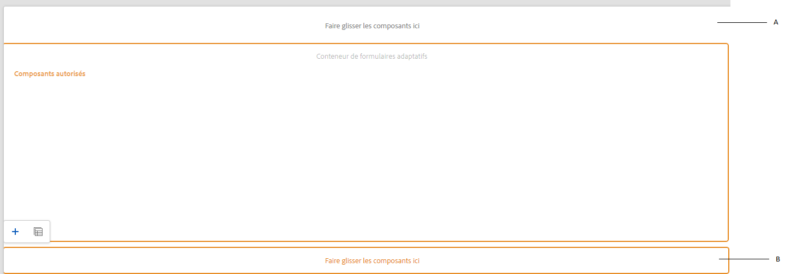

# Création d’un modèle de formulaire adaptatif {#adaptive-form-templates}

Lorsque vous concevez un formulaire, vous ajoutez des champs et des composants pour définir la structure, le contenu et les actions de formulaire dans l’éditeur. Vous ajoutez des champs et des composants dans le `guideRootPanel` du conteneur de formulaires. Avec l’éditeur de modèles, vous pouvez créer un modèle contenant la structure de base et le contenu initial que les auteurs peuvent utiliser pour créer des formulaires.

Par exemple, vous souhaitez que tous les auteurs de formulaire disposent de certaines zones de texte, de boutons de navigation, ainsi qu’un bouton permettant de soumettre un formulaire d’inscription. Vous pouvez créer un modèle avec les composants que les auteurs peuvent utiliser pour créer un formulaire qui soit cohérent avec d’autres formulaires d’inscription. Lorsque les auteurs utilisent le modèle pour créer un formulaire adaptatif, le nouveau formulaire hérite de la structure et des composants que vous avez spécifiés dans le modèle. L’éditeur de modèles permet d’effectuer les opérations suivantes :

* Ajout de composants d’en-tête et de pied de page d’un formulaire dans le calque de structure.
* Fournissez le contenu initial pour le formulaire.
* Spécifiez un thème, des actions Envoyer.

Vous pouvez télécharger et installer le package de contenu de référence [!DNL AEM Forms] à partir du portail de [distribution logicielle](https://experience.adobe.com/#/downloads/content/software-distribution/en/aemcloud.html) pour importer des thèmes et modèles de référence dans votre environnement.

## Utilisation de modèles {#working-with-templates}

Vous pouvez accéder à l’éditeur de modèles à partir du menu Outils en accédant à **[!UICONTROL Adobe Experience Manager]** > **[!UICONTROL Outils]** > **[!UICONTROL Général]** > **[!UICONTROL Modèles]**. Ici, les modèles sont organisés dans des dossiers activés pour les modèles modifiables.

Experience Manager met à disposition un dossier global pour organiser les modèles. Cependant, il n’est pas activé par défaut. Vous pouvez demander à votre administrateur d’activer le dossier global ou de créer un nouveau dossier pour les modèles. Pour plus d’informations sur la création de dossiers, voir [Dossiers de modèles](https://experienceleague.adobe.com/docs/experience-manager-cloud-service/sites/authoring/features/templates.html?lang=fr#editing-templates-template-authors).

### Création d’un modèle {#create-template}

Après avoir créé un dossier, ouvrez-le et suivez les étapes ci-après pour créer un modèle :

1. Appuyez sur **[!UICONTROL Créer]** dans le dossier que vous avez créé.
1. Dans la section Choisir un type de modèle, sélectionnez **[!UICONTROL Modèle de formulaire adaptatif]** et appuyez sur **[!UICONTROL Suivant]**.

1. Dans la section Détails du modèle, indiquez un titre de modèle, puis appuyez sur **[!UICONTROL Créer]**.
Vous pouvez également fournir une description.

1. Appuyez sur **[!UICONTROL Terminé]** pour revenir à la console, ou appuyez sur **[!UICONTROL Ouvrir]** pour ouvrir le modèle dans l’éditeur.

### Interface utilisateur de l’éditeur de modèles {#template-editor-ui}

Lorsque vous ouvrez un modèle à des fins d’édition, vous pouvez voir les composants suivants de l’Éditeur AEM :

* **Barre d’outils de la page**
Contient les options suivantes :

   * **Activer/désactiver le panneau latéral** : affiche ou masque la barre latérale.
   * **Informations sur la page** : permet de spécifier des informations telles que l’heure de publication, les vignettes, les bibliothèques côté client, la stratégie de page et la bibliothèque côté client de conceptions de pages.

   <!-- * **Emulator**: Lets you simulate and customize the look for different devices.-->
   * **Sélecteur de mode** : permet de changer de mode.
Vous pouvez choisir le mode **[!UICONTROL Structure]**, **[!UICONTROL Contenu initial]** ou **[!UICONTROL Contrôle de mise en page]**. Le mode Structure vous permet d’ajouter et de personnaliser l’en-tête et le pied de page. Le Mode Contenu initial vous permet de personnaliser le contenu du formulaire.
   * **Aperçu** : permet de prévisualiser le modèle avant de le publier. Vous pouvez utiliser le sélecteur de calques et l’aperçu pour activer/désactiver les modes de modification et d’aperçu.
* **Barre latérale** : fournit les navigateurs de contenu, de propriétés, de ressources et de composants.
* **Barre d’outils de composant** : quand vous choisissez un composant, vous voyez une barre d’outils qui vous permet de personnaliser le composant.
* **Page** : la zone dans laquelle vous ajoutez le contenu pour créer le modèle.

<!-- See [Introduction to authoring Adaptive Forms](introduction-forms-authoring.md) to understand the Touch UI editor. -->

### Modification d’un modèle {#editing-a-template}

Un modèle de formulaire adaptatif est créé à l’aide de deux calques :

* Structure
* Contenu initial

Le sélecteur de calque est disponible en regard de l’option Aperçu dans le coin supérieur droit de l’écran.

### Structure {#structure}

Lorsque vous sélectionnez le calque de structure dans l’éditeur de modèles, vous pouvez voir les conteneurs de dispositions au-dessus et au-dessous du conteneur de formulaires adaptatifs. Les auteurs peuvent utiliser ces conteneurs de dispositions pour l’en-tête et le pied de page. Vous pouvez ajouter, modifier ou personnaliser l’en-tête et le pied de page. Faites glisser et déposez le composant d’en-tête de formulaire adaptatif dans le conteneur de dispositions au-dessus du conteneur de formulaires adaptatifs pour personnaliser l’en-tête de modèle. Faites glisser et déposez le composant de pied de page de formulaire adaptatif dans le conteneur de dispositions au-dessous du conteneur de formulaires adaptatifs pour personnaliser le pied de page de modèle.

Conteneurs de dispositions dans le calque de structure

**A.** Conteneur de dispositions pour le composant En-tête **B.** Conteneur de dispositions pour le composant Pied de page

Faites glisser et déposez le composant d’en-tête de formulaire adaptatif dans le conteneur de dispositions au-dessus du conteneur de formulaires adaptatifs. Une fois que vous avez ajouté le composant, vous pouvez spécifier les propriétés qui vous permettent d’ajouter un logo et d’indiquer un titre.

De même, lorsque vous faites glisser et déposez le composant de pied de page dans le conteneur de dispositions au-dessous du conteneur de formulaires adaptatifs, vous pouvez fournir les informations de copyright et les détails de l’entreprise.

En-tête et pied de page ajoutés dans le calque de structure

#### Verrouillage/déverrouillage des composants dans le calque de structure {#locking-unlocking-components-in-the-structure-layer}

Lorsque vous modifiez le modèle avec le calque de structure sélectionné, vous pouvez déverrouiller l’en-tête et le pied de page du modèle. Si un composant est déverrouillé dans le modèle, les auteurs du formulaire peuvent modifier le composant dans le formulaire adaptatif qui utilise le modèle. Le verrouillage d’un composant empêche les auteurs du formulaire de le modifier dans le formulaire adaptatif. L’option de verrouillage est disponible dans la barre d’outils des composants.

Par exemple, vous pouvez ajouter le composant d’en-tête dans le modèle. Lorsque vous sélectionnez le composant, vous pouvez voir une option de verrouillage dans la barre d’outils de composant. En règle générale, l’en-tête comprend le nom et le logo de la société, et vous ne souhaitez pas que les auteurs du formulaire modifient ces informations dans un modèle. Dans un formulaire adaptatif créé à l’aide du modèle avec le composant d’en-tête verrouillé, les auteurs du formulaire ne peuvent pas changer le logo ni le nom de la société.

>[!NOTE]
>
>Le verrouillage ou déverrouillage de l’image ou du logo dans le composant d’en-tête, de manière individuelle, n’est pas recommandé. Vous pouvez déverrouiller le composant d’en-tête.

### Contenu initial {#initial-content}

Lorsque l’option Contenu initial est sélectionnée, le conteneur de formulaires adaptatifs du modèle s’affiche comme un formulaire adaptatif à des fins de modification. Comme lors de la création d’un formulaire adaptatif, vous pouvez spécifier des paramètres initiaux, par exemple en sélectionnant un thème et des actions Envoyer.

Les auteurs de formulaires l’utilisent comme base pour créer un formulaire. La structure de flux de contenu est spécifiée dans le calque Contenu initial du modèle. Pour passer à la modification du contenu initial du modèle de formulaire, avant Aperçu dans la barre d’outils de la page, appuyez sur  **>** **[!UICONTROL Contenu initial]**.

Dans le calque Contenu initial, vous créez le modèle de formulaire adaptatif que les auteurs utilisent en tant que base. La création d’un modèle est semblable à la création d’un formulaire : vous utilisez les options disponibles dans la barre latérale. Celle-ci fournit les navigateurs de contenu, de propriétés, de ressources et de composants.

<!-- See [Sidebar](introduction-forms-authoring.md#sidebar). -->

>[!NOTE]
>
>Lorsque vous sélectionnez le stockage de contenu ou StorePDF en tant qu’action Envoyer, vous obtenez une option permettant de spécifier le chemin de stockage. Si vous spécifiez le chemin dans le modèle, tous les formulaires créés à partir de ce modèle ont le même chemin d’accès. Vous pouvez spécifier le chemin de stockage correct. Vous pouvez également veiller à ce que les auteurs de formulaires le mettent à jour pour empêcher que les données de chaque formulaire soient stockées au même emplacement.

#### Création d’un modèle de formulaire adaptatif avec des onglets et des panneaux {#creating-an-adaptive-form-template-with-tabs-and-panels-nbsp}

Par exemple, si vous souhaitez créer un modèle avec les onglets suivants :

* Informations générales
* Informations professionnelle

Vous avez ajouté un logo, fourni un titre et ajouté un pied de page dans le calque de structure. Verrouillez l’en-tête et le pied de page pour empêcher les auteurs de formulaires de les modifier lorsqu’ils utilisent le modèle pour créer des formulaires.

Modifiez le type Structure en type Contenu initial pour le calque et commencez à ajouter du contenu au formulaire. Pour créer une structure à onglets, ajoutez un panneau enfant dans le guideRootPanel du conteneur de formulaires adaptatifs. Pour ajouter un panneau :

* Vous pouvez ajouter un panneau en appuyant sur le bouton **[!UICONTROL +]** lorsque vous sélectionnez l’option **[!UICONTROL Faire glisser les composants ici.]**

* Vous pouvez faire glisser le composant de panneau depuis le navigateur de composants et le déposer dans la barre latérale.
* Vous pouvez ajouter un panneau enfant du `guideRootPanel` depuis la barre d’outils de composant.

Pour créer les onglets Informations générales et Informations professionnelles, ajoutez deux panneaux au panneau enfant du `guideRootPanel`. Sélectionnez les panneaux et tapez sur  pour ouvrir les propriétés dans la barre latérale. Modifiez les noms d’élément en `general-info` et `professional-info`, et les titres en Informations générales et Informations professionnelle, respectivement. Dans la barre latérale, appuyez sur le contenu pour ouvrir l’explorateur de contenu. Dans l’onglet Objets de formulaire, sélectionnez `guideRootPanel`. Dans l’éditeur, le guideRootPanel est sélectionné. Tapez sur  dans la barre d’outils de composant pour ouvrir ses propriétés. Dans le champ Disposition de panneau, sélectionnez **[!UICONTROL Onglets supérieurs]** et appuyez sur **[!UICONTROL Terminé]**. La structure de modèle à onglets est appliquée.

#### Ajout de contenu dans les onglets {#adding-content-in-tabs}

Une fois que vous avez ajouté les panneaux et que vous les avez structurés sous forme d’onglets, vous pouvez ajouter des champs dans les onglets. Lorsque vous sélectionnez un onglet dans l’éditeur, vous pouvez voir l’option **[!UICONTROL Faire glisser les composants]** ici. Vous pouvez faire glisser et déposer les composants tels que les zones de texte, les éléments de liste et les boutons. Vous pouvez faire glisser les composants depuis le navigateur de composants et les déposer dans la barre latérale.

Chaque composant possède des propriétés qui améliorent la capture et la manipulation des données. Par exemple, vous pouvez activer la propriété **[!UICONTROL Champ obligatoire]** d’un composant. Les auteurs peuvent définir un message que vos clients voient lorsqu’ils omettent de remplir un champ obligatoire. Spécifiez le message dans la propriété **[!UICONTROL Message de champ obligatoire]**.

Dans l’exemple de modèle, les champs Nom, Numéro de téléphone et Date de naissance sont ajoutés dans l’onglet Informations générales. Dans l’onglet Informations professionnelles, les champs Employé actuellement, de type d’emploi et Formation ont été ajoutés.

Après avoir ajouté des champs, vous pouvez ajouter des boutons tels qu’Envoyer et Réinitialiser.

### Activation du modèle {#enabling-the-template}

Lorsque vous créez un modèle, il est ajouté en tant que brouillon. Activez le modèle afin de l’utiliser pour créer des formulaires adaptatifs. Pour activer un formulaire :

1. Accédez à **[!UICONTROL Adobe Experience Manager]** > **[!UICONTROL Outils]** > **[!UICONTROL Modèles]**, et ouvrez le dossier dans lequel vous avez créé le modèle.

1. Le modèle que vous avez créé est marqué comme Brouillon.
1. Sélectionnez le modèle, puis appuyez sur **[!UICONTROL Activer]** dans la barre d’outils.
Lorsque vous créez un formulaire adaptatif, vous pouvez voir le modèle affiché lorsque vous êtes invité à choisir un modèle.

## Importation ou exportation d’un modèle {#importing-or-exporting-a-template}

Un formulaire fonctionne avec son modèle. Lorsque vous téléchargez un formulaire adaptatif créé à l’aide d’un modèle personnalisé, celui-ci n’est pas téléchargé. Lorsque vous importez le formulaire dans une autre instance [!DNL AEM Forms], il est importé sans son modèle. Si le modèle d’un formulaire importé n’est pas disponible, le formulaire n’est pas rendu. Vous pouvez compresser le modèle personnalisé à partir du nœud `/conf` dans `https://<server>:<port>/crx/packmgr` et le transférer dans l’instance dans laquelle vous souhaitez charger le formulaire. [!DNL AEM Forms]. Vous pouvez également [créer un modèle à l’aide d’AEM Archetype et le déployer sur votre instance de Cloud Services](https://experienceleague.adobe.com/docs/experience-manager-learn/getting-started-wknd-tutorial-develop/pages-templates.html?lang=fr#prerequisites).

>[!NOTE]
>
> * Vous pouvez associer un [!UICONTROL Schéma de modèle de données de formulaire] à un modèle de formulaire adaptatif dans un éditeur de modèles. Voir [Création d’un formulaire adaptatif](/help/forms/creating-adaptive-form.md#edit-form-model-properties-of-an-adaptive-form-edit-form-model) pour plus d’informations.
> * Vous pouvez également configurer le modèle [!UICONTROL Document d’enregistrement] directement à partir de l’éditeur de formulaire adaptatif ou de l’éditeur de modèle de formulaire adaptatif. Pour de plus amples informations, voir [Générer un document d’enregistrement pour les formulaires adaptatifs](/help/forms/generate-document-of-record-for-non-xfa-based-adaptive-forms.md#document-of-record-support-in-adaptive-form-editor-dor-support-in-adaptiveform).

## Création d’un formulaire adaptatif à l’aide du modèle {#creating-an-adaptive-form-using-the-template}

Une fois que vous avez créé et activé un modèle, il est disponible dans le gestionnaire de formulaires lorsque vous créez un formulaire adaptatif. Pour utiliser un modèle et créer un formulaire adaptatif, voir [Création d’un formulaire adaptatif](creating-adaptive-form.md).

<!--
## Change display option of out of the box templates  {#change-display-option-of-out-of-the-box-templates}

You can create custom templates for Adaptive Forms to define basic structure and initial content. [!DNL AEM Forms] also provides a set of out of the box template for Adaptive Forms. You can choose to show or hide the templates.

Perform the following steps to show and hide templates:

1. Log in to [!DNL AEM Forms] author instance and navigate to **[!UICONTROL Tools]** &gt; **[!UICONTROL Operations]** &gt; **[!UICONTROL Web Console]**.

   >[!NOTE]
   >
   >The URL of AEM web console is https://'[server]:[port]'/system/console/configMgr

1. Locate and open the **FormsManager Configuration** settings:

    * To show or hide out of the box Adaptive Forms template, check or uncheck the **Include Out of the box AF and AD Templates** option.
    * To show or hide out of the box Adaptive Form templates that were added in AEM 6.0 Forms or AEM 6.1 Forms releases but are now deprecated, check or uncheck the **Include AEM 6.0 AF Templates** option. If this option is checked, in order to take effect, it requires the **Include Out of the box AF and AD Templates** configuration to be enabled.

1. Click **Save**. The display options for the out of the box templates are changed. -->

## Recommandations {#recommendations}

* Lorsque vous modifiez les propriétés du formulaire dans l’éditeur de modèles, n’utilisez pas la propriété BindReference.
* Si vous souhaitez ajouter un point d’arrêt, créez-le lorsque vous rédigez un modèle de formulaire adaptatif.
Pour plus d’informations sur les points d’arrêt, voir [Mise en forme réactive](https://experienceleague.adobe.com/docs/experience-manager-cloud-service/sites/authoring/features/responsive-layout.html?lang=fr#authoring).
