# Création et utilisation des thèmes {#creating-and-using-themes}

>[!NOTE]
>
> Adobe recommande d’utiliser la capture de données moderne et extensible [composants principaux](https://experienceleague.adobe.com/docs/experience-manager-core-components/using/adaptive-forms/introduction.html?lang=fr) pour [créer un nouveau Forms adaptatif](/help/forms/creating-adaptive-form-core-components.md) ou [ajouter un Forms adaptatif aux pages AEM Sites](/help/forms/create-or-add-an-adaptive-form-to-aem-sites-page.md). Ces composants représentent une avancée significative dans la création de formulaires adaptatifs, ce qui garantit des expériences utilisateur impressionnantes. Cet article décrit une ancienne approche de création de Forms adaptatif à l’aide de composants de base.

| Version | Lien de l’article |
| -------- | ---------------------------- |
| AEM 6.5 | [Cliquez ici](https://experienceleague.adobe.com/docs/experience-manager-65/forms/adaptive-forms-advanced-authoring/themes.html?lang=fr) |
| AEM as a Cloud Service | Cet article |

Vous pouvez créer et appliquer des thèmes pour styliser un formulaire adaptatif<!-- or an interactive communication-->. Un thème contient des détails de style pour les composants et les panneaux. Ces styles incluent des propriétés telles que les couleurs d’arrière-plan, les couleurs d’état, la transparence, l’alignement et la taille. Lorsque vous appliquez un thème, le style spécifié se reflète sur les composants correspondants. Le thème est géré indépendamment sans référence à un formulaire adaptatif<!-- or interactive communication -->.

Vous pouvez télécharger et installer le package de contenu de référence [!DNL AEM Forms] à partir du portail de [distribution logicielle](https://experience.adobe.com/#/downloads/content/software-distribution/en/aemcloud.html) pour importer des thèmes et modèles de référence dans votre environnement.

## Création, téléchargement ou chargement d’un thème {#creating-downloading-or-uploading-a-theme}

Un thème est créé et enregistré en tant qu’entité distincte, avec des propriétés de métadonnées telles que les formulaires adaptatifs. Il permet de réutiliser un thème dans plusieurs formulaires adaptatifs<!-- or  and interactive communications-->. Vous pouvez également déplacer un thème vers une autre instance et le réutiliser.

### Création d’un thème {#creating-a-theme}

Pour créer un thème :

1. Cliquez sur **[!UICONTROL Adobe Experience Manager]**, sur **[!UICONTROL Formulaires]**, puis sur **[!UICONTROL Thèmes]**.

1. Sur la page Thèmes, cliquez sur **[!UICONTROL Créer]** > **[!UICONTROL Thème]**.
Un assistant de création de thème se lance.

1. Spécifiez le **[!UICONTROL Nom]** du thème.

1. Spécifiez un formulaire pour prévisualiser le thème dans le champ **[!UICONTROL Prévisualisation par défaut pour ce thème]**. Cliquez sur **[!UICONTROL Utiliser la valeur par défaut]** pour utiliser le formulaire par défaut pour prévisualiser le thème.

1. Spécifiez un **[!UICONTROL Conteneur de configurations]**. Vous pouvez choisir un **[!UICONTROL Conteneur de configurations]** comportant les détails de la configuration d’Adobe Font pour votre compte. Vous pouvez également laisser l’option vide pour l’instant et spécifier les détails ultérieurement à partir des [propriétés du thème](#metadata-of-a-theme).

1. Cliquez sur **[!UICONTROL Créer]**, puis sur **[!UICONTROL Modifier]** pour ouvrir le thème dans l’éditeur de thèmes, ou cliquez sur **[!UICONTROL Terminé]** pour revenir à la page de thèmes.

### Différence des thèmes entre Experience Manager 6.5 Forms et les versions antérieures {#difference-in-themes}

Thèmes créés sur une instance de Cloud Service.

* Portent la version numéro 2.

* Sont stockés à `/content/dam/formsanddocuments-themes/<theme-name>/`

* Ne fournissent pas d’option de bibliothèque cliente. Vous ne pouvez pas spécifier de catégorie et de chemin de bibliothèque cliente.

* Ne disposent pas d’autorisations en écriture et de mise à jour sur l’emplacement /apps (le groupe Forms-user ne dispose pas d’autorisations en écriture et de mise à jour sur l’emplacement /apps).

* Avant de télécharger un thème créé sur [!DNL Experience Manager Forms] 6.5 ou des versions antérieures sur une instance de Cloud Service, vérifiez que l’emplacement de la bibliothèque cliente est défini sur `etc/clientlibs/fd/themes`. Si la bibliothèque cliente n’existe pas dans le dossier `etc`, mettez manuellement à jour l’emplacement sur `etc/clientlibs/fd/themes`.  Vous pouvez effectuer la modification sur votre instance [!DNL Experience Manager Forms] 6.5 ou versions antérieures. Après avoir défini l’emplacement de la bibliothèque cliente, un administrateur peut télécharger des thèmes sur l’instance de Cloud Service ou utiliser l’outil de transfert de contenu pour migrer les thèmes de la version 6.5 ou des instances de version précédente vers l’instance de Cloud Service.

  Modifiez également le nom de la catégorie. Si le nom n’est pas modifié, une erreur `theme with same category name exists` peut se produire. Lorsque vous modifiez le nom de la catégorie, cela n’a aucune incidence sur les formulaires adaptatifs qui utilisent le thème.

### Téléchargement d’un thème {#downloading-a-theme}

Vous pouvez exporter des thèmes dans un fichier .zip et les utiliser dans d’autres projets ou instances Experience Manager. Pour télécharger un thème :

1. Cliquez sur **[!UICONTROL Adobe Experience Manager]**, sur **[!UICONTROL Formulaires]**, puis sur **[!UICONTROL Thèmes]**.

1. Dans la page Thèmes, **[!UICONTROL sélectionnez]** un thème, puis cliquez sur **[!UICONTROL Télécharger]**. Une boîte de dialogue contenant les détails du thème s’affiche.

1. Cliquez sur **[!UICONTROL Télécharger]**. Le thème est téléchargé sous forme de fichier .zip.

>[!NOTE]
>
>Si vous téléchargez un thème auquel un formulaire adaptatif est associé et que ce dernier est basé sur un modèle personnalisé, téléchargez également le modèle personnalisé. Lorsque vous chargez le thème et le formulaire adaptatif téléchargés, chargez également le modèle personnalisé associé.

### Chargement d’un thème {#uploading-a-theme}

Un utilisateur disposant de droits d’administrateur peut télécharger un thème créé dans [!DNL Experience Manager Forms] 6.5 ou des versions antérieures.

Pour charger un thème :

1. Cliquez sur **[!UICONTROL Adobe Experience Manager]**, sur **[!UICONTROL Formulaires]**, puis sur **[!UICONTROL Thèmes]**.

1. Sur la page Thèmes, cliquez sur **[!UICONTROL Créer]** > **[!UICONTROL Chargement de fichier]**.
1. Dans l’invite de téléchargement de fichier, recherchez et sélectionnez un package de thème sur votre ordinateur et cliquez sur **[!UICONTROL Charger]**.
Le thème chargé est disponible dans la page Thèmes.

## Métadonnées d’un thème {#metadata-of-a-theme}

Liste de propriétés des métadonnées d’un thème (sur la page Propriétés d’un thème).

<table>
 <tbody>
  <tr>
   <th>
<strong>ID</strong>
 
 
 </th>
   <th><strong>Nom</strong></th>
   <th><strong>Peut être modifié</strong></th>
   <th><strong>Description de la propriété</strong></th>
  </tr>
  <tr>
   <td>1.</td>
   <td>Titre</td>
   <td>Oui</td>
   <td>Nom d’affichage du thème.</td>
  </tr>
  <tr>
   <td>2.</td>
   <td>Description</td>
   <td>Oui</td>
   <td>Description du thème.</td>
  </tr>
  <tr>
   <td>3.</td>
   <td>Type</td>
   <td>Non</td>
   <td>
    <ul>
     <li>Type d’actif.</li>
     <li>La valeur est toujours Thème.</li>
    </ul> </td>
  </tr>
  <tr>
   <td>4.</td>
   <td>Créé</td>
   <td>Non</td>
   <td>Date de création du thème</td>
  </tr>
  <tr>
   <td>5.</td>
   <td>Nom de l’auteur</td>
   <td>Oui</td>
   <td>Auteur du thème. Calculé au moment de la création du thème.</td>
  </tr>
  <tr>
   <td>6.</td>
   <td>Date de la dernière modification</td>
   <td>Non</td>
   <td>Date à laquelle le thème a été modifié la dernière fois.</td>
  </tr>
  <tr>
   <td>7.</td>
   <td>État</td>
   <td>Non</td>
   <td>Statut du thème (modifié/publié).</td>
  </tr>
  <tr>
   <td>8.</td>
   <td>Heure d’activation de la publication</td>
   <td>Oui</td>
   <td>Heure de publication automatique du thème.</td>
  </tr>
  <tr>
   <td>9.</td>
   <td>Heure de désactivation de la publication</td>
   <td>Oui</td>
   <td>Heure de désactivation de la publication automatique du thème.</td>
  </tr>
  <tr>
   <td>10.</td>
   <td>Balises</td>
   <td>Oui</td>
   <td>Libellé associé au thème pour l’identification utilisée pour améliorer la recherche.</td>
  </tr>
  <!-- <tr>
   <td>11.</td>
   <td>References</td>
   <td>Links</td>
   <td>
    <ul>
     <li>Contains 'Referred by' section. Lists forms that use the theme.</li>
     <li>Since the theme does not refer to any other asset, there is no 'Refers' section.</li>
    </ul> </td>
  </tr>
   <tr>
   <td>12.</td>
   <td>Clientlib Location</td>
   <td>Yes</td>
   <td>
    <ul>
     <li>The user-defined repository path within '/etc' where the clientlibs corresponding to this theme are stored.</li>
     <li>Default value - '/etc/clientlibs/fd/themes' + relative path of theme asset.</li>
     <li>If the location does not exist, the folder hierarchy is auto-generated.</li>
     <li>When this value is changed, the clientlib node structure is moved to the new location entered.  <em><strong>Note:</strong> If you change default clientlib location, in the CRXDE repository assign <code>crx:replicate, rep:write, rep:glob:*, rep:itemNames:: js.txt, jcr:read </code>to <code>forms-users</code> and <code>crx:replicate</code>, <code>jcr:read </code>to <code>fd-service</code> in the new location. Also attach another ACL by adding <code>deny jcr:addChildNodes</code> for <code>forms-user</code></em></li>
    </ul> </td>
  </tr> 
  <tr>
   <td>13.</td>
   <td>Clientlib Category Name</td>
   <td>Yes</td>
   <td>
    <ul>
     <li>The user-defined clientlib category name for this theme.</li>
     <li>An error is displayed if the name is already in use by some other existing theme.</li>
     <li>Default value - computed using theme location.</li>
     <li>When this value is changed, the category name is updated on the corresponding clientlib node. Updating Clientlib Category Name in the jsp files is not required because clientlib category name is used by reference.</li>
    </ul> </td>
  </tr> -->
 </tbody>
</table>

## À propos de l’éditeur de thèmes {#about-the-theme-editor}

C’est une interface conviviale pour les utilisateurs professionnels et les concepteurs Web/développeurs qui fournit les fonctionnalités nécessaires pour spécifier le style de différents éléments <!-- and interactive communication --> des formulaires adaptatifs facilement. Lorsque vous créez un thème, il est stocké en tant qu’entité distincte comme les formulaires <!--  , interactive communications, letters, document fragments, and data dictionaries-->.

L’éditeur de thèmes vous permet de personnaliser les styles des composants mis en forme dans un thème. Vous pouvez personnaliser l’apparence d’un formulaire <!-- or interactive communication --> sur un appareil.

L’éditeur de thèmes est divisé en deux panneaux :

* **Zone de travail** : apparaît du côté droit. Elle montre un exemple de formulaire adaptatif <!--  or interactive communication --> dans lequel toutes les modifications de style sont immédiatement répercutées. Vous pouvez également sélectionner des objets directement à partir de la zone de travail pour consulter les styles qui y sont associés et les modifier. Une règle de résolution de l’appareil dans la partie supérieure régit la zone de travail. La sélection d’un point d’arrêt de résolution de la règle affiche l’aperçu de l’exemple de formulaire <!--  or interactive communication --> à la résolution appropriée. La zone de travail est expliquée en détails [ci-dessous](themes.md#using-canvas).

* **Barre latérale*** S’affiche sur le côté gauche. Elle comporte les éléments suivants :

   * **Sélecteur :** affiche le composant sélectionné pour le style, ainsi que ses propriétés dont vous pouvez définir le style. Le sélecteur représente tous les composants d’un type. Si vous sélectionnez un composant de zone de texte dans un thème pour la mise en forme, toutes les zones de texte de votre formulaire <!-- or interactive communication --> héritent du style. Les sélecteurs vous permettent de choisir un composant générique ou un composant spécifique pour le style. Par exemple, un composant de champ est un composant générique, et une zone de texte est un composant spécifique.

     **Mettre en forme un composant générique :** un champ peut être un champ de zone numérique, tel que l’âge, ou un champ de zone de texte, tel qu’une adresse.
Lorsque vous mettez en forme un champ, tous les champs tels que l’âge, le nom et l’adresse sont stylisés.

     **Mise en forme d’un composant spécifique** : un composant spécifique a un impact sur les objets de la catégorie spécifique. Lorsque vous appliquez un style au composant numérique de la zone dans le thème, seul l’objet numérique de zone hérite du style.

     Par exemple, un champ de type boîte de texte tel que l’adresse est plus long et un champ de type boîte numérique tel que l’âge est plus court. Vous pouvez sélectionner un champ de zone numérique, réduire sa longueur et l’appliquer à votre formulaire. La largeur de tous les champs de zone numérique est réduite dans votre formulaire.

     Lorsque vous personnalisez tous les composants de champ avec une couleur d’arrière-plan spécifique, tous les champs tels que l’âge, le nom et l’adresse héritent de la couleur d’arrière-plan. Lorsque vous sélectionnez une zone numérique, telle que l’âge, et réduisez sa largeur, toutes les zones numériques telles que l’âge et le nombre de personnes dans une famille sont réduites. La largeur des champs de texte n’est pas modifiée.

   * **Etat :** vous permet de personnaliser les styles d’un objet dans un état spécifique. Par exemple, vous pouvez spécifier l’aspect d’un objet lorsqu’il est à l’état par défaut, mis au point, désactivé, survolé ou d’erreur.
   * **Catégories de propriété :** les propriétés de style sont divisées en différentes catégories. Par exemple : Dimension et position, Texte, Arrière-plan, Bordure et Effets. Sous chaque catégorie, vous fournissez des informations de mise en forme. Par exemple, sous Arrière-plan, vous pouvez indiquer la Couleur d’arrière-plan, l’Image et le Dégradé de l’arrière-plan.

   * **Avancé :** vous permet d’ajouter le CSS personnalisé à un objet, ce qui remplace les contrôles visuels de propriétés définis en cas de chevauchement.

   * **Affichage CSS** : vous permet d’afficher le fichier CSS du composant sélectionné.

  En outre, dans la barre latérale, vous verrez une flèche dans la partie inférieure. Lorsque vous cliquez sur la flèche, vous bénéficiez de deux options supplémentaires : **Simuler la réussite** et **Simuler une erreur.** Ces options, ainsi que les options décrites ci-dessus, sont expliquées en détails [ci-dessous](themes.md#using-rail).

[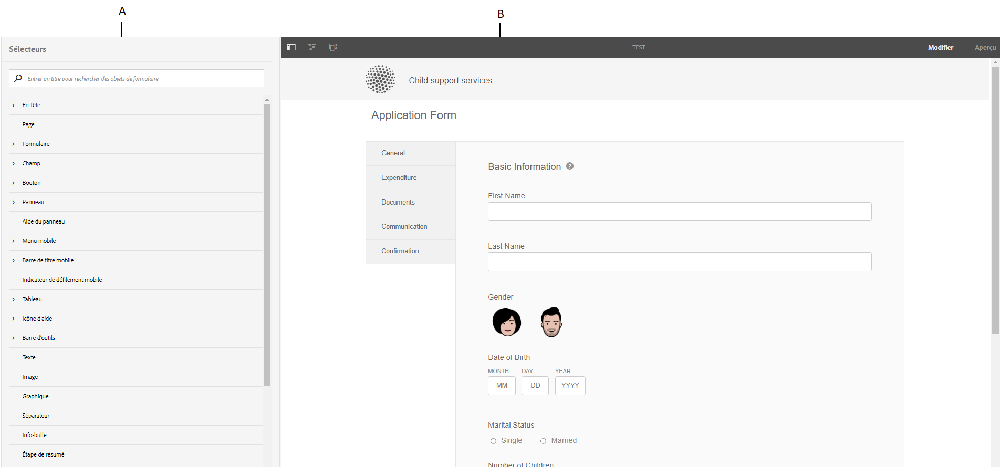](assets/themes-1.png) **A.** Barre latérale **B.** Zone de travail

### Mise en forme des composants {#styling-components}

Vous pouvez utiliser un thème dans plusieurs formulaires adaptatifs<!-- and interactive communications -->, ce qui importe la mise en forme des composants de formulaire que vous avez spécifiée dans le thème. Vous pouvez mettre en forme différents composants, tels que les titres, la description, les panneaux, les champs, les icônes et les zones de texte. Utilisez des widgets pour configurer les propriétés des composants dans un thème. La connaissance préalable du code CSS ou LESS n’est pas obligatoire mais souhaitée, même si la section Remplacements de CSS vous permet d’écrire un code CSS ou de fournir des sélecteurs personnalisés. La section Remplacements de CSS apparaît lorsque vous sélectionnez un composant dans la barre latérale.

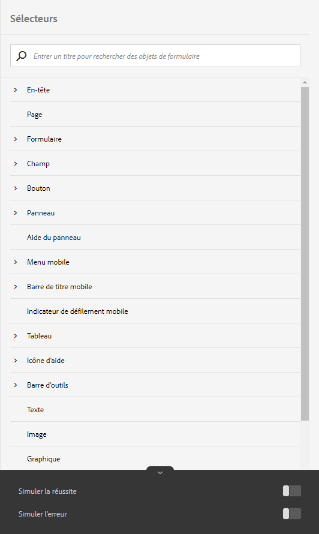

Les options de la barre latérale vous permettent de sélectionner et de mettre en forme différents composants.

Cliquer sur le bouton Modifier au niveau d’un composant dans la barre latérale sélectionne le composant dans Zone de travail et vous permet de mettre en forme le composant à l’aide des options de la barre latérale.

Certains composants tels que la zone de texte, la zone numérique, le bouton radio et la case à cocher sont classés sous des composants génériques comme Champ. Par exemple, vous souhaitez personnaliser le style des boutons radio. Pour sélectionner des boutons radio à mettre en forme, sélectionnez **[!UICONTROL Champ]** > **[!UICONTROL Widget]** > **[!UICONTROL Bouton radio]**.

### Mettre en forme les mises en page de panneaux {#styling-panel-layouts-br}

Les thèmes dans [!DNL AEM Forms] prennent en charge la mise en forme d’éléments de la disposition des panneaux dans vos formulaires<!-- and  interactive communications -->. La mise en forme d’éléments de mises en page prêtes à l’emploi et personnalisées est prise en charge.

Les panneaux prêts à l’emploi comprennent :

* Onglets sur la gauche
* Onglets dans la partie supérieure
* Accordéon
* Assistant
* réactif
* Mise en page mobile

   * Titres de panneau dans l’en-tête
   * Sans titres de panneau dans l’en-tête

Les sélecteurs varient pour chaque mise en page.
La mise en forme des dispositions personnalisées à partir de l’éditeur de thèmes implique ce qui suit :

* La définition des composants pour une mise en page pouvant être mise en forme, et les sélecteurs CSS pour identifier de manière unique ces composants.
* La définition des propriétés CSS pouvant être appliquées sur ces composants.
* Définissez la mise en forme de ces composants de manière interactive à partir de l’interface utilisateur.

### Différents styles pour différentes tailles d’écran {#different-styles-for-different-screen-sizes-br}

Les dispositions sur les appareils de bureau et mobiles ont parfois des styles légèrement ou entièrement différents. Pour les appareils mobiles, la tablette et le téléphone partagent des dispositions similaires, à l’exception des tailles des composants.

Utilisez des points d’arrêt de l’éditeur de thèmes pour définir une autre mise en forme pour différents formats d’écran. Vous pouvez sélectionner un appareil ou une résolution de base sur lesquels vous commencez à générer le thème ; les variantes de mise en forme pour les autres résolutions sont générées automatiquement. Vous pouvez explicitement modifier la mise en forme pour toutes les résolutions.

>[!NOTE]
>
><!-- or interactive communication-->Le thème est d’abord créé à l’aide d’un formulaire, puis appliqué sur différents formulaires<!-- or interactive communications-->. Les points d’arrêt utilisés lors de la création du thème peuvent être différents du formulaire <!-- or interactive communication --> sur lequel le thème est appliqué. <!-- or interactive communication -->Les requêtes multimédias CSS sont basées sur le formulaire utilisé lors de la création du thème, et non sur le formulaire auquel le thème est appliqué.<!-- or interactive communication -->

### Mettre en forme des modifications en contexte des propriétés de la barre latérale lors de la sélection d’objets {#styling-properties-context-changes-in-sidebar-on-selecting-objects}

Lorsque vous sélectionnez un composant dans Zone de travail, ses propriétés de mise en forme sont répertoriées dans la barre latérale. Sélectionnez le type d&#39;objet et son état, puis indiquez sa mise en forme.

### Styles récemment utilisés dans l’éditeur de thèmes {#recently-used-styles-in-theme-editor}

L’éditeur de thèmes met en cache jusqu’à dix styles appliqués à un composant. Vous pouvez utiliser les styles mis en cache avec d’autres composants d’un thème. Les styles récemment utilisés sont disponibles juste en dessous du composant sélectionné dans la barre latérale sous forme de liste. Au début, la liste de styles récemment utilisée est vide.

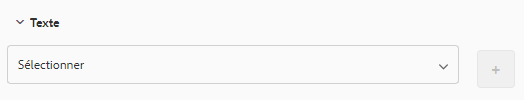

Lorsque vous mettez en forme un composant, les styles sont mis en cache et répertoriés dans la zone de liste. Dans cet exemple, le libellé de la zone de texte est mis en forme pour modifier la taille et la couleur de la police. Vous pouvez suivre les mêmes étapes pour choisir une image ou modifier les couleurs pour appliquer un style à un composant. Observez comment le style est mis en cache et répertorié dans la zone de liste lorsque le style du libellé du champ est modifié.

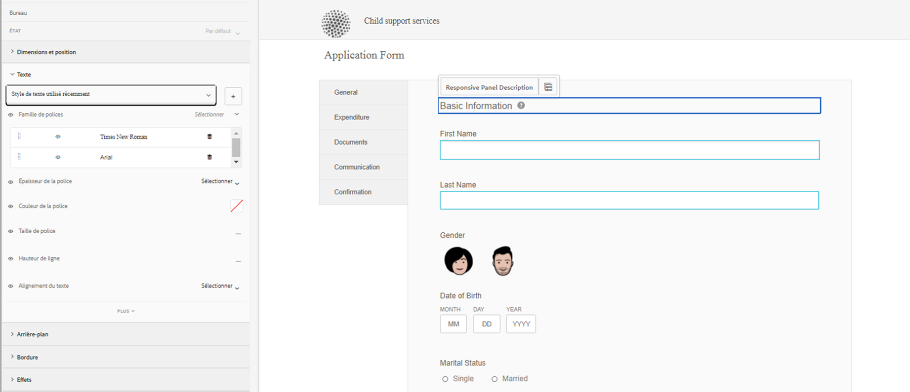

Dans cet exemple, le style du libellé du champ est modifié. Lorsque l’option Description du panneau réactif est sélectionnée pour le style, une entrée de liste est ajoutée à la bibliothèque de ressources. L’entrée dans la bibliothèque de ressources peut être utilisée pour modifier le style de la description du panneau réactif.

Lorsqu’un style est ajouté à la bibliothèque de ressources, il est disponible pour d’autres thèmes et dans le [mode Style](inline-style-adaptive-forms.md) de l’éditeur de formulaires UI. De même, lorsque vous utilisez le mode Style de l’éditeur <!-- or interactive communication editor -->de formulaires pour personnaliser un composant, le style est mis en cache et disponible dans les thèmes.

Le bouton Plus de la bibliothèque de ressources vous permet d’enregistrer le style de façon permanente avec le nom de votre choix. Le bouton Plus enregistre le style, même si vous ne cliquez pas sur le bouton Enregistrer dans la barre latérale pour appliquer le style à un composant. Le bouton Plus permettant d’enregistrer un style pour une utilisation ultérieure n’est pas disponible en mode Style.

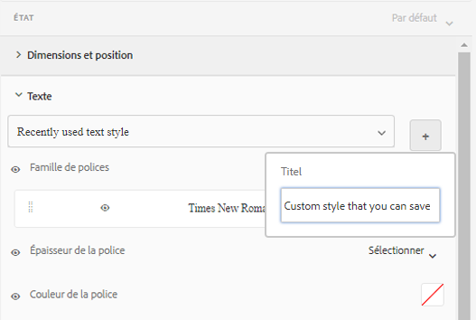

Lorsque vous indiquez un nom personnalisé pour un style, le style est lié à un thème et n’est plus disponible pour les autres thèmes. Pour supprimer un style enregistré :

1. Dans la barre d’outils ZONE DE TRAVAIL, cliquez sur **[!UICONTROL Options du thème]**  > **[!UICONTROL Gérer les styles]**.
1. Dans la boîte de dialogue Gérer les styles, sélectionnez un style enregistré, cliquez sur **[!UICONTROL Supprimer]**.

   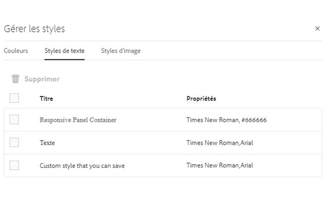

### Prévisualiser, enregistrer et ignorer les modifications en direct {#live-preview-save-and-discard-changes}

Les modifications apportées à la mise en forme sont immédiatement répercutées dans le formulaire <!-- or interactive communication --> chargé dans la zone de travail. L’aperçu en direct vous permet de définir et de visualiser de manière interactive l’impact de la mise en forme. Lorsque vous modifiez la mise en forme d’un composant, le bouton **[!UICONTROL Terminé]** est activé dans la barre latérale. Pour conserver les modifications, utilisez le bouton **[!UICONTROL Terminé]**.

>[!NOTE]
>
>Lorsqu’un caractère non valide est saisi dans un champ, la couleur de la limite du champ devient rouge et un message d’erreur s’affiche dans le coin supérieur gauche de l’écran. Par exemple, si vous saisissez des lettres dans une zone de texte qui accepte les caractères numériques comme entrées, la couleur de la bordure de la zone de saisie devient rouge. Vous ne pouvez pas enregistrer un tel thème sans résoudre l’erreur affichée au centre en bas de l’écran.

### Thème avec un autre formulaire adaptatif {#theme-with-another-adaptive-form}

Lorsque vous créez un thème, il est créé à l’aide d’un formulaire fourni avec l’éditeur de thèmes. Vous indiquez la mise en forme pour les composants de ce formulaire. Au lieu du formulaire fourni avec l’éditeur de thèmes, vous pouvez sélectionner un formulaire <!-- or interactive communication --> de votre choix pour définir une mise en forme et prévisualiser ses résultats.

Pour remplacer le formulaire actuel ou <!-- interactive communication --> dans la zone de travail de l’éditeur de thèmes :

1. Dans le panneau ÉDITEUR DE THÈMES, cliquez sur **[!UICONTROL Options du thème]**  >**[!UICONTROL Configurer]**.

1. Dans l’onglet Général, recherchez et sélectionnez un <!-- or interactive communication --> formulaire adaptatif **[!UICONTROL ou une pour le champ Formulaire adaptatif]**.

### Rétablir/annuler {#redo-undo}

Vous pouvez annuler ou rétablir les modifications indésirables qui se produisent accidentellement. Utilisez les boutons Rétablir/annuler de la Zone de travail.

Les boutons Rétablir/annuler apparaissent lorsque vous mettez en forme un composant dans l’éditeur de thèmes.

## Utilisation de l’éditeur de thèmes {#using-the-theme-editor}

L’éditeur de thèmes vous permet de modifier un thème que vous avez créé ou téléchargé. Accédez à **[!UICONTROL Formulaires et documents]** > **[!UICONTROL Thèmes]**, sélectionnez un thème et ouvrez-le. Le thème s’ouvre dans l’éditeur de thèmes.

Comme nous l’avons mentionné ci-dessus, l’éditeur de thèmes présente deux panneaux : Barre latérale et Zone de travail.
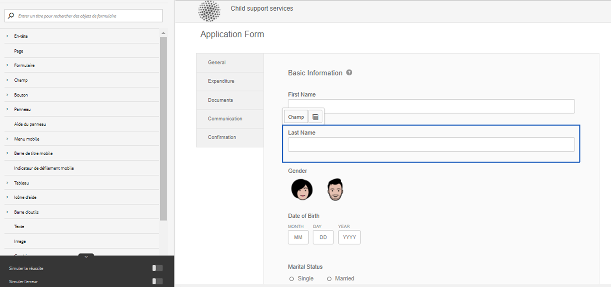

Personnalisation du style de réussite du composant Widget de zone de texte dans l’éditeur de thèmes. Le composant est sélectionné dans la zone de travail, et son état est sélectionné dans la barre latérale. Les options de mise en forme disponibles dans la barre latérale sont utilisées pour personnaliser l’aspect d’un composant.

### Utiliser la zone de travail {#using-canvas}

Le thème est créé à l’aide du formulaire prêt à l’emploi ou du formulaire <!-- or interactive communication --> de votre choix. La zone de travail affiche un aperçu du formulaire ou de la <!-- interactive communication --> utilisé(e) pour créer le thème avec les personnalisations spécifiées dans le thème. La règle au-dessus du formulaire est utilisée pour déterminer la disposition selon la taille de l’affichage de votre appareil.

Dans la barre d’outils de la zone de travail se trouvent les éléments suivants :

* **[!UICONTROL Activer/désactiver le panneau latéral]**  : permet d’afficher ou de masquer la barre latérale.
* **[!UICONTROL Options du thème]**  : propose trois options.

   * Configurer : propose des options pour sélectionner le formulaire de prévisualisation <!-- or interactive communication , base clientlib, -->et la configuration Adobe Fonts.
   * Afficher le thème CSS : génère des CSS pour le thème sélectionné.
   * Gérer les styles : fournit des options de gestion des styles de texte et d’images
   * Aide : exécute une visite guidée de l’image de l’éditeur de thèmes.

* **[!UICONTROL Émulateur]**  : vous permet de simuler l’aspect de votre thème pour différentes tailles d’affichage. Une taille d’affichage est traitée comme un point d’arrêt dans l’émulateur. Vous pouvez sélectionner un point d’arrêt et spécifier un style pour ce point. Par exemple, Bureau et Tablette sont deux points d’arrêt. Vous pouvez spécifier différents styles pour chaque point d’arrêt.

Lorsque vous sélectionnez un composant dans la zone de travail, la barre d’outils du composant s’affiche au-dessus. La barre d’outils de composant vous permet de sélectionner des composants ou de passer aux composants génériques. Par exemple, vous sélectionnez une zone de texte numérique dans un panneau. Les options suivantes s’affichent dans la barre d’outils du composant :

* **[!UICONTROL Widget de zone numérique]** : vous permet de sélectionner le composant pour personnaliser son aspect dans la barre latérale.
* **[!UICONTROL Widget de champ]** : vous permet de sélectionner le composant générique pour la mise en forme. Dans cet exemple, tous les composants de saisie de texte (zone de texte/zone numérique/exécution numérique pas à pas/saisie de date) sont sélectionnés pour la mise en forme.

*  : permet de sélectionner le composant parent pour la mise en forme. Si vous sélectionnez une zone numérique et sélectionnez cette icône, le composant de champ est sélectionné. Si vous sélectionnez le composant de champ et sélectionnez cette icône, le panneau est sélectionné. Si vous continuez à appuyer sur cette icône pour la sélection, vous finissez par sélectionner le style de la mise en forme.

>[!NOTE]
>
>Les options disponibles dans la barre d’outils de composants varient en fonction du composant sélectionné.

### Utiliser la barre latérale {#using-rail}

La barre latérale dans l’éditeur de thèmes fournit des options pour personnaliser les styles pour les composants d’un thème et pour utiliser des sélecteurs. Les sélecteurs vous permettent de sélectionner un groupe de composants ou des composants individuels ; vous pouvez également rechercher des sélecteurs dans la barre latérale. Vous pouvez écrire des sélecteurs pour les composants personnalisés.

Lorsque vous sélectionnez un composant dans la zone de travail ou des sélecteurs dans la barre latérale, cette dernière affiche toutes les options vous permettant de personnaliser les styles.
Vous trouverez ci-dessous les options qui s’affichent dans la barre latérale lorsque vous sélectionnez un composant :

* État
* Feuille de propriété
* Simuler une erreur/un succès

#### État {#state}

Un état est un indicateur d’interaction utilisateur avec un composant. Par exemple, lorsqu’un utilisateur saisit des données erronées dans une zone de texte, l’état des modifications de la zone de texte passe à un état d’erreur. L’éditeur de thèmes vous permet de spécifier un état spécifique.

Les options de personnalisation des styles d’état varient en fonction des différents composants.

#### Feuille de propriété {#property-sheet}

<table>
 <tbody>
  <tr>
   <td><strong>Propriété</strong></td>
   <td><strong>Utilisez</strong></td>
  </tr>
  <tr>
   <td>
Dimensions et position
 </td>
   <td>
Permet de mettre en forme l’alignement, la taille, le positionnement et le placement des composants dans le thème. 
 
Les options disponibles sont les paramètres d’affichage, le remplissage, la marge, la largeur, la hauteur et l’indice Z.
 
Vous pouvez également utiliser le mode Mise en page pour définir la largeur des composants à l’aide d’une interface simple par glisser-déposer. Pour plus d’informations, voir <a href="resize-using-layout-mode.md">Utilisation du mode Mise en page pour redimensionner les composants</a>.
 </td>
  </tr>
  <tr>
   <td>
Texte
 </td>
   <td>
Vous permet de personnaliser les styles de texte dans le composant du thème.
 
Par exemple, vous souhaitez modifier l’aspect du texte saisi dans la zone de texte.
 
Vos options sont les suivantes : famille de polices, épaisseur, couleur, taille, hauteur de ligne, alignement du texte, espacement, interlettrage, retrait du texte, surlignement, italique, transformation de texte, alignement vertical, ligne de base et orientation. 
 </td>
  </tr>
  <tr>
   <td>
Contexte 
 </td>
   <td>
Vous permet de remplir l’arrière-plan du composant par une image ou une couleur. 
 </td>
  </tr>
  <tr>
   <td>
Bordure
 </td>
   <td>
Permet de choisir l’aspect de la bordure du composant. Par exemple, vous souhaitez que la zone de texte ait une bordure rouge foncé épaisse, avec une ligne en pointillé. 
 
Les options disponibles sont : largeur, style, rayon et couleur de la bordure.
 </td>
  </tr>
  <tr>
   <td>
Effets
 </td>
   <td>
Vous permet d’ajouter des effets spéciaux aux composants, tels que l’opacité, le mode de fusion et les ombres. 
 </td>
  </tr>
  <tr>
   <td>
Avancé
 </td>
   <td>
Permet d’ajouter :

    <ul>
     <li>Propriétés pour les pseudo éléments <code>::before</code> et <code>::after</code> pour ajouter du contenu après ou avant le contenu du sélecteur et le mettre en forme.  Voir <a href="https://www.w3schools.com/css/css_pseudo_elements.asp" target="_blank">Pseudo-éléments CSS</a>.</li>
     <li>Code CSS personnalisé intégré à un composant.</li>
    </ul> 
Lorsque vous ajoutez un code CSS personnalisé, il remplace la personnalisation que vous avez ajoutée à l’aide des options de la barre latérale. 
 </td>
  </tr>
 </tbody>
</table>

#### Simuler une erreur/la réussite {#simulate-error-success}

Les options Simuler une erreur et une réussite sont situées en bas de la barre latérale. Vous pouvez les afficher à l’aide de la flèche afficher/masquer visible en bas de la barre latérale. À l’aide de l’éditeur de thèmes, vous pouvez définir le style des différents états d’un composant.

Par exemple, vous ajoutez un champ numérique dans votre formulaire, puis indiquez son style dans l’éditeur de thèmes. Lorsque les utilisateurs saisissent une valeur alphanumérique dans le champ, vous souhaitez que la couleur d’arrière-plan de la zone de texte change. Sélectionnez le champ numérique dans le thème, et utilisez l’option d’état dans la barre latérale. Vous sélectionnez l’état d’erreur dans la barre latérale et modifiez la couleur d’arrière-plan en rouge. Pour prévisualiser le comportement, vous pouvez utiliser l’option Simuler une erreur disponible dans la barre latérale. Les options Simuler une erreur et une réussite sont décrites en détails ci-dessous :

* **Simuler la réussite** :
vous permet de voir à quoi ressemble un composant si vous spécifiez sa mise en forme pour l’état de réussite. Par exemple, dans un formulaire, les clients définissent le mot de passe. Les utilisateurs peuvent définir un mot de passe en fonction des directives que vous donnez. Lorsqu’un utilisateur saisit un mot de passe en suivant tous les conseils que vous avez fournis, la zone de texte se met en vert. Lorsque la zone de texte passe au vert, elle est en état de réussite. Vous pouvez spécifier la mise en forme d’un composant dans l’état de réussite et simuler son aspect à l’aide de l’option Simuler la réussite.

* **Simuler une erreur**:
vous permet de voir à quoi ressemble un composant si vous spécifiez sa mise en forme pour l’état d’erreur. Par exemple, dans un formulaire, les clients définissent le mot de passe. Les utilisateurs peuvent définir un mot de passe en fonction des directives que vous donnez. Lorsqu’un utilisateur saisit un mot de passe qui ne suit pas toutes les directives données, la zone de texte passe au rouge. Lorsque la zone de texte passe au rouge, elle est en état d’erreur. Vous pouvez spécifier la mise en forme d’un composant à l’état d’erreur, et simuler son aspect à l’aide de l’option Simuler une erreur.

### Mise en forme d’un composant {#styling-a-component}

Par exemple, dans votre formulaire, vous disposez de deux types de zones de texte : une qui accepte uniquement les valeurs numériques et d’autres qui acceptent des valeurs alphanumériques. Vous pouvez personnaliser la mise en forme de la zone de texte acceptant les valeurs numériques uniquement (une zone numérique).

Pour personnaliser la mise en forme d’un composant particulier (une zone numérique dans cet exemple), procédez comme suit :

1. Dans l’éditeur de thèmes, sélectionnez la zone numérique dans la zone de travail.
1. Lorsque vous sélectionnez la zone numérique, vous pouvez afficher la barre d’outils des composants avec trois options :

   * **[!UICONTROL Widget de zone numérique]**
   * **[!UICONTROL Widget de champ]**

1. Sélectionnez **[!UICONTROL Widget de zone numérique]**.
1. Le titre de la barre latérale passe à Widget de zone numérique et affiche des options pour personnaliser son aspect.
Utilisez l’option **[!UICONTROL Dimension et position]** dans la barre latérale pour personnaliser la taille du composant. Vérifiez que l’état est bien **[!UICONTROL Par défaut]**.

Au lieu de sélectionner **[!UICONTROL Widget de zone numérique]**, sélectionnez **[!UICONTROL Widget de champ]** dans la barre d’outils de composants et effectuez les étapes ci-dessus. Quand vous sélectionnez des dimensions pour l’option **[!UICONTROL Widget de champ]**, toutes les zones de texte, à l’exception de la zone numérique, ont la même taille.

### Mise en forme des champs pour un état donné {#styling-fields-given-state}

Avec la barre d’outils de composants, vous pouvez également spécifier la mise en forme des composants pour les différents états. Par exemple, si un composant est désactivé, il est à l’état désactivé. Les états généralement utilisés d’un composant que vous pouvez mettre en forme dans l’éditeur de thèmes sont les suivants : Par défaut, Activé, Désactivé, Erreur, Succès et Survol. Vous pouvez sélectionner un composant dans la zone de travail et utiliser l’option État de la zone de travail pour personnaliser son aspect.

Pour personnaliser la mise en forme d’un composant dans un état spécifique, procédez comme suit :

1. Sélectionnez un composant dans la zone de travail, puis sélectionnez l’option appropriée dans la barre d’outils de composants.
La barre latérale affiche les options de personnalisation de la mise en forme du composant.
1. Sélectionnez un état dans la barre latérale. Par exemple, l’état Erreur.
1. Utilisez des options telles que **[!UICONTROL Bordure, Arrière-plan]** dans la barre latérale pour personnaliser l’aspect des composants.
1. Utilisez l’option **[!UICONTROL Simuler une erreur]** en bas de la barre latérale pour voir à quoi ressemble la mise en page lors de la modification.

Lorsque vous personnalisez la mise en forme d’un composant après avoir spécifié son état, la personnalisation s’affiche pour le composant uniquement pour l’état spécifié. Par exemple, si vous personnalisez la mise en forme du composant alors que l’état Survol est sélectionné. La personnalisation s’affiche pour le composant lorsque vous déplacez le pointeur de la souris sur le composant du formulaire rendu auquel vous appliquez le thème.<!-- or interactive communication -->

Pour simuler le comportement d’états autres que l’erreur et la réussite, utilisez le mode Aperçu. Pour utiliser le mode Aperçu, cliquez sur **[!UICONTROL Aperçu]** dans la barre d’outils de la page.

### Mise en forme des mises en page pour des écrans de plus petite taille {#styling-layouts-for-smaller-displays}

Utilisez la règle dans la zone de travail pour sélectionner des points d’arrêt pour les appareils équipés de plus petits écrans. Cliquez sur l’émulateur  dans la zone de travail pour afficher la règle et les points d’arrêt. Les points d’arrêt vous permettent de prévisualiser un formulaire <!-- or interactive communication --> pour les formats d’affichage de différents appareils tels que les téléphones et les tablettes. Plusieurs formats d’affichage sont pris en charge dans l’éditeur de thèmes.

Pour mettre en forme des composants pour différents points d’arrêt :

1. Dans la zone de travail, sélectionnez un point d’arrêt au-dessus de la règle.
Un point d’arrêt représente un appareil mobile et son format d’affichage.
1. Utilisez la barre latérale pour personnaliser la mise en forme des composants <!-- or interactive communication --> de formulaire dans le thème pour le format d’affichage sélectionné.
1. Vérifiez que la personnalisation est enregistrée.

Vous pouvez mettre en forme des <!-- or interactive communication -->composants de formulaire pour plusieurs appareils. Les composants de <!-- and interactive communication -->formulaire pour les ordinateurs de bureau et les appareils mobiles ont parfois des styles totalement différents.

### Utiliser des polices web dans un thème {#using-web-fonts-in-a-theme}

Vous pouvez désormais utiliser les polices disponibles dans un service Web dans un formulaire adaptatif <!-- or interactive communication -->. [Adobe Fonts](https://fonts.adobe.com/), le service prêt à l’emploi de polices Web d’Adobe, est disponible sous forme de configuration. Pour utiliser Adobe Fonts, créez un kit, ajoutez-y des polices et obtenez l’identifiant du kit auprès de [Adobe Fonts](https://fonts.adobe.com/).

Pour configurer Adobe Fonts dans Experience Manager, effectuez les étapes suivantes :

1. Dans l’instance d’auteur, cliquez sur  **[!UICONTROL Adobe Experience Manager]** > **[!UICONTROL Outils]**  > **[!UICONTROL Déploiement]** > **[!UICONTROL Services cloud]**.
1. Sur la page **[!UICONTROL Cloud Services]**, accédez à l’option **[!UICONTROL Adobe Fonts]** et ouvrez-la. Ouvrez le dossier de configuration, puis cliquez sur **[!UICONTROL Créer]**.
1. Dans la boîte de dialogue **[!UICONTROL Créer une configuration]**, indiquez un titre pour la configuration et cliquez sur **[!UICONTROL Créer]**.

   Vous êtes redirigé sur la page de configuration.

1. Dans la boîte de dialogue Modifier le composant qui s’affiche, indiquez votre ID de kit, puis cliquez sur **[!UICONTROL OK]**.

Pour configurer un thème pour utiliser la configuration Adobe Fonts, effectuez les étapes suivantes :

1. Dans l’instance de l’auteur, ouvrez un thème dans l’éditeur de thèmes.
1. Dans l’éditeur de thèmes, cliquez sur **[!UICONTROL Options du thème]**  > **[!UICONTROL Configurer]**.
1. Dans le champ **[!UICONTROL Configuration d’Adobe Fonts]**, sélectionnez un kit et cliquez sur **[!UICONTROL Enregistrer]**.

   Maintenant, vous pouvez voir que les polices sont ajoutées à la propriété font-family du thème.

<!-- >
### Listing and selecting fonts in theme editor {#listing-and-selecting-fonts-in-theme-editor}

You can use the theme configuration service to add more fonts to the theme editor. Perform the following steps to add fonts:

1. Log in to Experience Manager Web Console with administrative privileges. URL for the Experience Manager Web Console is `https://'[server]:[port]'/system/console/configMgr`.
1. Open **[!UICONTROL Adaptive Form Theme Configuration Service]**.

   

1. Click +, specify the name of the font, and click **Save**. The font is added and available in theme editor. -->

#### Sélectionner des polices dans l’éditeur de thèmes {#selecting-fonts-in-theme-editor}

Vous pouvez utiliser le bouton + pour ajouter une police. Lorsque vous ajoutez une police, elle est répertoriée dans la barre latérale.

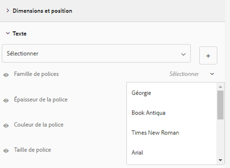

Outre l’option de configuration du thème, vous pouvez également ajouter votre police à partir de l’éditeur de thème lui-même. Saisissez la police que vous souhaitez utiliser dans le champ de famille de polices sous la barre latérale et appuyez sur la touche Entrée de votre clavier.

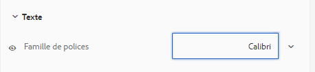

Lorsque vous sélectionnez une police, elle est ajoutée sous la liste des familles de polices. Vous pouvez utiliser l’option Masque dans l’éditeur de thèmes pour désactiver ou activer les polices répertoriées.

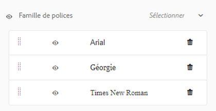

Vous pouvez voir la modification de la police du composant.

Le champ Famille de polices prend en charge plusieurs polices. Lorsque vous saisissez une police, le navigateur la recherche et l’applique au composant sélectionné. Si le navigateur ne trouve pas de police, il recherche une police qui se trouve à côté de celle-ci dans la famille. Vous pouvez commencer par saisir la police spécifique que vous recherchez. Si vous ne trouvez pas la police que vous souhaitez utiliser, vous pouvez saisir une police générique dans la famille et l’utiliser.

#### Masquage les styles appliqués dans l’éditeur de thèmes {#mask-styles-applied-in-theme-editor}

Vous pouvez masquer les styles appliqués dans un thème. Dans la barre latérale de l’éditeur de thèmes, vous pouvez utiliser l’icône  pour désactiver un style appliqué. Par exemple, si vous modifiez les dimensions d’un composant dans un formulaire <!-- or interactive communication -->, vous pouvez utiliser le bouton de masquage situé à gauche d’une propriété pour la désactiver. Lorsque vous enregistrez un thème, les options de masquage sélectionnées sont conservées.

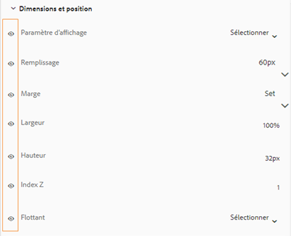

L’exemple ci-dessous montre des styles masqués et non masqués dans un thème.

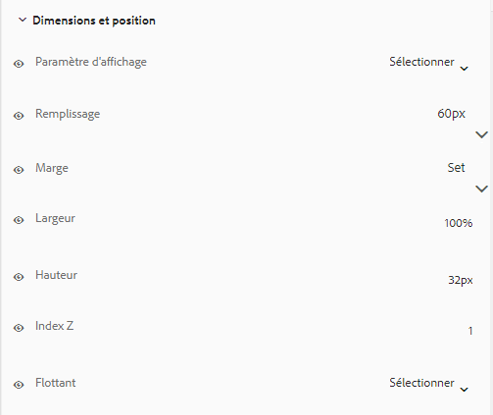

## Appliquer un thème à un formulaire {#applying-a-theme-to-a-form-or-interactive-communication-br}

Pour appliquer un thème à un formulaire adaptatif :

1. Ouvrez votre formulaire en mode d’édition. Pour ouvrir un formulaire en mode d’édition, sélectionnez-le et cliquez sur **[!UICONTROL Ouvrir]**.
1. En mode d’édition, sélectionnez un composant, puis cliquez sur  > **[!UICONTROL Conteneur de formulaires adaptatifs]**, puis sur .

   Vous pouvez modifier les propriétés de votre formulaire dans la barre latérale.

1. Dans la barre latérale, cliquez sur **[!UICONTROL Mise en forme]**.
1. Sélectionnez votre thème dans le menu déroulant **[!UICONTROL Thème de formulaire adaptatif]** et cliquez sur **[!UICONTROL Terminé]** 

Vous pouvez également définir un thème pour un formulaire adaptatif lorsque vous le créez.

<!-- To apply a theme to an interactive communication:

1. Open your interactive communication in edit mode. To open a interactive communication in edit mode, select a form and click **Open**.
1. In the edit mode, select a component, then click  &gt;**Document Container**, and then click .

   You can edit properties of your form in the sidebar.

1. In the sidebar, under **Basic**, select your theme from the **Theme** drop-down and click **Done**  -->

### Modifier le thème d’un formulaire au moment de l’exécution {#change-theme-of-a-form-at-runtime}

Un thème définit le style de différents composants d’un formulaire. Vous pouvez utiliser la propriété `themeOverride` pour modifier le thème d’un formulaire de façon dynamique. Voici une URL typique de formulaire :

`https://<server>:<port>/content/forms/af/test.html`

Vous pouvez utiliser le paramètre themeOverride pour appliquer un thème au moment de l’exécution.

`https://<server>:<port>/content/forms/af/test.html?themeOverride=/content/dam/formsanddocuments-themes/simpleEnrollmentTheme`

L’option `themeOverride` vous permet de fournir un chemin d’accès à un thème. Elle modifie le thème du formulaire et l’actualise avec des styles mis à jour.

## Obtenir un aspect spécifique à l’aide des thèmes {#specific-af-appearance}

Avec [!DNL AEM Forms] et le thème de la zone de travail prête à l’emploi par défaut, il existe de nombreux autres thèmes. Si vous souhaitez concevoir votre formulaire <!-- or interactive communication --> à l’aide d’autres thèmes, avec des modifications supplémentaires, copiez le thème à partir du dossier de la bibliothèque des thèmes. Collez les thèmes copiés en dehors du dossier de la bibliothèque de thèmes et modifiez le thème copié en fonction des modifications que vous souhaitez apporter.

Pour copier un thème, procédez comme suit :

1. Dans l’instance de création, accédez à **[!UICONTROL Adobe Experience Manager]** > **[!UICONTROL Formulaires]** > **[!UICONTROL Thèmes]**.
1. Ouvrez le dossier de la bibliothèque des thèmes.
1. Dans le dossier de la bibliothèque de thèmes, placez le pointeur sur le thème prêt à l’emploi correspondant, puis appuyez sur **[!UICONTROL Copier]**.
1. Collez le thème copié en dehors du dossier de la bibliothèque de thèmes.
1. Personnalisez le thème copié.

Après avoir personnalisé le thème, appliquez-le à votre formulaire <!-- or interactive communication -->.

>[!NOTE]
>
>Ne modifiez pas les thèmes disponibles dans le dossier de la bibliothèque de thèmes. Ce dossier contient des thèmes système. Toute modification apportée à ces thèmes est remplacée lors de l’installation d’une version plus récente ou d’un correctif logiciel d’[!DNL AEM Forms].

## Impact sur d’autres cas d’utilisation de formulaire adaptatif {#impact-on-other-adaptive-form-use-cases}

* **Publier/dépublier un formulaire** : à la publication d’un formulaire, le thème appliqué est également publié (si ce n’est pas déjà fait)
* **Importer/exporter un formulaire :** à l’importation ou à l’exportation d’un formulaire, son thème associé est automatiquement importé ou exporté également.
* **Références d’un formulaire :** la section Référence dans les références du formulaire contient une entrée supplémentaire pour le thème.
* **Heure de la dernière modification d’un formulaire :** mise à jour lors de la modification du thème associé.
<!-- * **A/B Testing:** You can apply a different theme to two versions of the form in A/B testing. The information of the two themes is individually stored on the two guide containers. -->

## Séquence de génération CSS {#css-generation-sequence}

Lorsque vous sélectionnez Affichage CSS, l’éditeur de thème collecte toutes les informations de style et crée une page CSS. Il collecte des informations dans l’ordre suivant :

<!-- 1. Styling defined in the theme's base client library. -->
1. La mise en forme définie par l’utilisateur, spécifiée à l’aide des propriétés dans la barre latérale.
1. Le style CSS fourni à l’aide de l’option de remplacement de CSS.

Par exemple, la couleur d’arrière-plan d’une zone de texte est bleue<!-- in the base client library-->. Vous la remplacez par la couleur rose à l’aide des propriétés de la barre latérale. Lorsque vous générez un fichier CSS, la couleur d’arrière-plan de la zone de texte est rose. Après la modification de la couleur d’arrière-plan à l’aide des propriétés, un autre auteur utilise l’option de remplacement de CSS pour modifier la zone de texte de couleur d’arrière-plan en blanc. Lorsque vous générez des fichiers CSS, la couleur d’arrière-plan blanche apparaît dans le CSS généré.

## Débogage des styles {#debugging-styles}

Lorsque vous spécifiez des styles pour les composants dans l’éditeur de thèmes, un fichier CSS est généré. Lorsque vous définissez le style d’un composant générique, plusieurs composants intégrés sont également mis en forme. Par exemple, lorsque vous définissez le style d’un champ, la zone de texte et l’étiquette qu’elle contient sont également mises en forme. Lorsque vous mettez en forme la zone de texte dans le champ, elle obtient son propre CSS. Si vous souhaitez déboguer le CSS généré pour le champ et le composant, l’éditeur de thèmes fournit des options qui vous permettent d’afficher le CSS.

Vous pouvez voir le fichier CSS généré à l’aide des options suivantes :

* Option **Affichage CSS** dans la barre latérale : lorsque vous sélectionnez un composant dans le thème, vous pouvez voir l’option AFFICHAGE CSS dans la barre latérale. Elle affiche le fichier CSS généré, y compris le CSS pour les pseudo éléments `::before` et `::after`.
* Option **Afficher le thème CSS** dans la barre d’outils de la zone de travail : dans la barre d’outils de la zone de travail, cliquez sur  > **[!UICONTROL Afficher le thème CSS]**. Vous pouvez voir tout le thème CSS généré à partir des propriétés que vous définissez dans l’éditeur de thèmes.

## Dépannage, recommandations et bonnes pratiques {#troubleshooting-recommendations-and-best-practices}

* **éviter les actifs d’un autre thème**

  Lorsque vous modifiez un thème, vous pouvez parcourir et ajouter des actifs (tels que des images) d’autres thèmes. Par exemple, vous pouvez modifier l’arrière-plan d’une page. Par exemple, lorsque vous sélectionnez la **[!UICONTROL Page]**  > **[!UICONTROL Arrière plan]** > **[!UICONTROL Ajoutez]** > **[!UICONTROL Image]**, une boîte de dialogue s’affiche et vous permet de parcourir et d’ajouter des images dans l’autre thème.

* Vous pouvez rencontrer des problèmes avec votre thème actuel si un actif est ajouté à partir d’un autre thème et l’autre thème est déplacé ou supprimé. Nous vous recommandons d’éviter de parcourir les actifs d’autres thèmes et de les ajouter.

<!-- * **Using base clientlib, theme editor, and inline styling**

    * **Base clientlib**:

      Base client library contains styling information. To use styling information in client-side libraries in themes.

        1. Navigate to **[!UICONTROL Experience Manager]** &gt; **[!UICONTROL Forms]** &gt; **[!UICONTROL Themes]**.
        1. In the Themes page, select a theme and click **[!UICONTROL Properties]**.
        1. In the Properties page that opens, click **[!UICONTROL Advanced]**.
        1. In the Advanced tab, in the Clientlib Location field, browse, and select the client-library you want to use.
        1. Click **[!UICONTROL Save]**.

      The styling you specify in client library is imported in the theme that uses it. For example, you specify styling for text box, numeric box, and switch in the client library. When you import your client library in the theme, styling for text box, numeric box, and switch is imported. You can then style other components using theme editor. -->
    Vous pouvez également créer un thème, créer des copies de ce thème, puis modifiez la mise en forme fournie dans les thèmes copiés pour des cas d’utilisation similaires.
    Voir [Obtention d’une apparence spécifique à l’aide de Thèmes](#specific-af-apparence)
    
    * **Éditeur de thèmes :**
    
    l’éditeur de thèmes vous permet de créer des thèmes pour mettre en forme votre formulaire &lt;!-- ou communication interactive -->. Vous pouvez spécifier la mise en forme de composants dans un thème, ce qui permet d’assurer la cohérence de l’aspect dans les différents formulaires que vous développez. La spécification des informations de style dans un thème, puis l’application du thème à un formulaire sont recommandées.
    
    * **Style intégré :**
    
     vous pouvez mettre en forme des composants à l’aide du mode Style de l’éditeur de formulaires &lt;!-- ou de communications interactives --> multicanal lorsque vous utilisez un formulaire. L’utilisation du mode Style pour modifier la mise en forme d’un composant de formulaire remplace la mise en forme indiquée dans le thème. Si vous choisissez de modifier le style de certains composants d’un formulaire spécifique, voir [Style intégré de composants](inline-style-adaptive-forms.md)

<!-- * **Using client-side libraries**

  If you want to create client libraries to import styling information, see [Using Client-Side Libraries](https://experienceleague.adobe.com/docs/experience-manager-cloud-service/implementing/developing/clientlibs.html). After you create a client library, you can import it in your theme using the steps mentioned above. -->

* **Modification de la largeur de disposition du panneau conteneur**

  Il n’est pas recommandé de modifier la largeur de disposition du panneau conteneur. Lorsque vous spécifiez la largeur d’un panneau de contenu, il devient statique et ne s’adapte pas aux différents affichages.

* **Dans quel cas utiliser l’éditeur de formulaires ou l’éditeur de thèmes pour travailler sur l’en-tête et le pied de page**

  Utilisez l’éditeur de thèmes si vous souhaitez mettre en forme l’en-tête et le pied de page à l’aide d’options de style telles que le style de police, l’arrière-plan et la transparence.
Si vous souhaitez fournir des informations comme une image de logo, le nom de l’entreprise dans l’en-tête et des informations de copyright dans le pied de page, utilisez les options de l’éditeur de formulaires.

## Voir également {#see-also}

{{see-also}}
