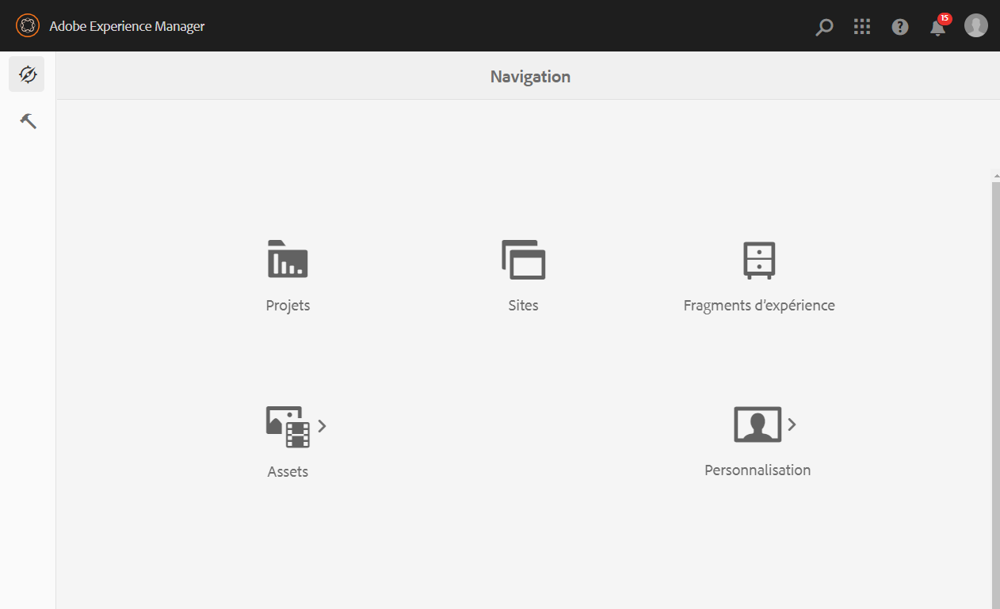
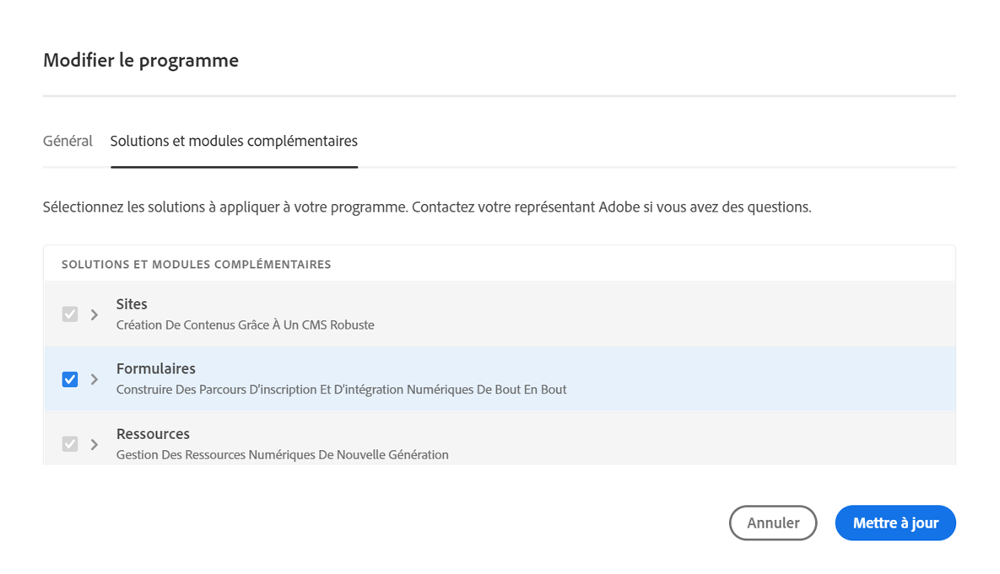

# Configuration {#installation-and-configuration}

Vous pouvez rencontrer certains des problèmes ci-dessous lors de la configuration d’un environnement Cloud Service :

## L’option Formulaires n’est pas disponible

L’option **[!UICONTROL Formulaires]** n’est pas disponible dans la page **[!UICONTROL Navigation]**.

Pour activer l’option **[!UICONTROL Formulaires]** :

1. Connectez-vous à [Cloud Manager](https://experience.adobe.com/)
1. Recherchez votre programme et cliquez sur l’icône . La page Modifier le programme de votre programme s’affiche.
1. Ouvrez l’onglet **[!UICONTROL Solutions et modules complémentaires]**.
1. Sélectionnez l’option **[!UICONTROL Formulaires]**, puis cliquez sur **[!UICONTROL Mettre à jour]**.

   

1. [Créez](https://experienceleague.adobe.com/docs/experience-manager-cloud-manager/using/how-to-use/configuring-pipeline.html?lang=fr#how-to-use) et [exécutez](https://experienceleague.adobe.com/docs/experience-manager-cloud-manager/using/how-to-use/deploying-code.html?lang=fr) des pipelines de production et hors production.

Une fois le pipeline créé et déployé, l’option **[!UICONTROL Formulaires]** dans la page **[!UICONTROL Navigation]**.

<!--  
## Environment creation fails {#environment-creation-fails}

Users are unable to create an [!DNL AEM Forms] as a Cloud Service environment. The environment creation fails after running for some time.

A missing profile can lead to environment creation failure. Check that the profile exists in Admin Console. If the profile does not exist, perform the following steps to create the profile:

1. Log in to [Admin Console](https://adminconsole.adobe.com/). Use Adobe ID of administrator provisioned to use Automated Forms Conversion Service to login. Do not any other ID or Federated ID to login.
1. Click the **[!UICONTROL Automated Forms Conversion Service]** option.
1. Click **[!UICONTROL New Profile]** in the Products tab.
1. Specify Name, Display Name, and Description for the profile. Click **[!UICONTROL Done]**. A profile is created.

If the profile exists and issues still persist, contact Adobe Support. -->

## Échec du pipeline de création {#build-pipeline-fails}

Les utilisateurs ne peuvent pas exécuter le pipeline de création. Le pipeline échoue après un certain temps d’exécution.

Pour résoudre ce problème, ouvrez Cloud Manager, sélectionnez l’option **[!UICONTROL Mettre à jour]** pour votre environnement, puis exécutez le pipeline.

## Les lots ne sont pas à l’état actif {#bundles-inactive-state}

Pour résoudre le problème, procédez comme suit :

1. Démarrez AEM et attendez qu’il démarre complètement jusqu’à ce que tous les lots soient démarrés.
1. Arrêtez AEM (Ctrl + C).
1. Placez le fichier `.far` de Forms dans le dossier d’installation.
1. Redémarrez le serveur AEM.