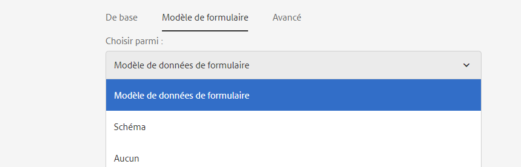
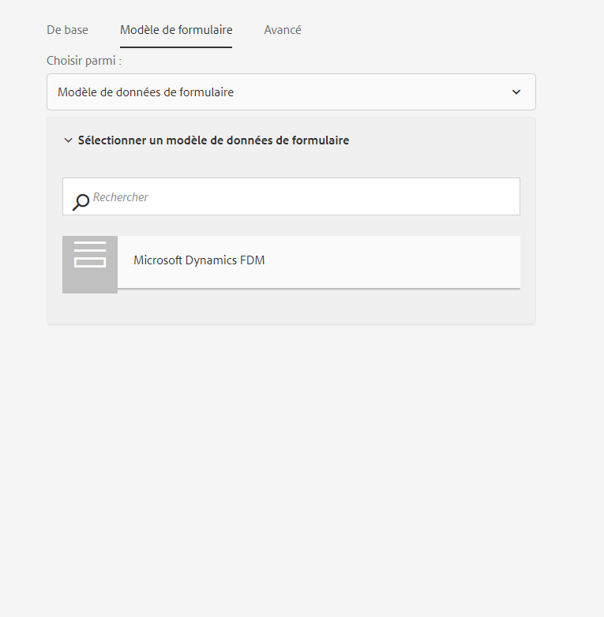
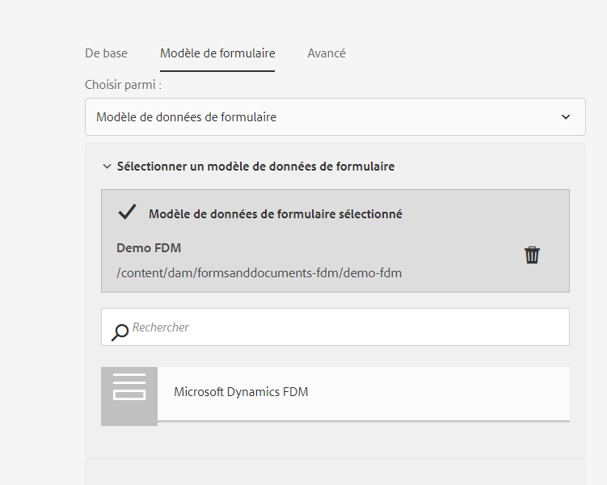
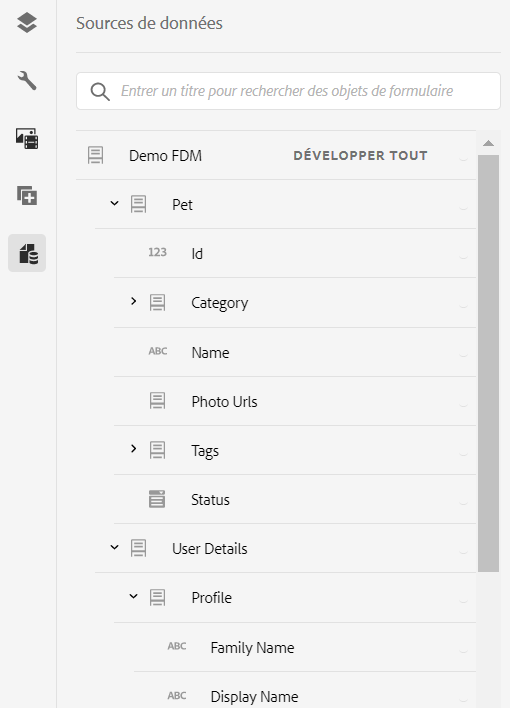
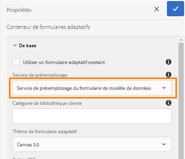
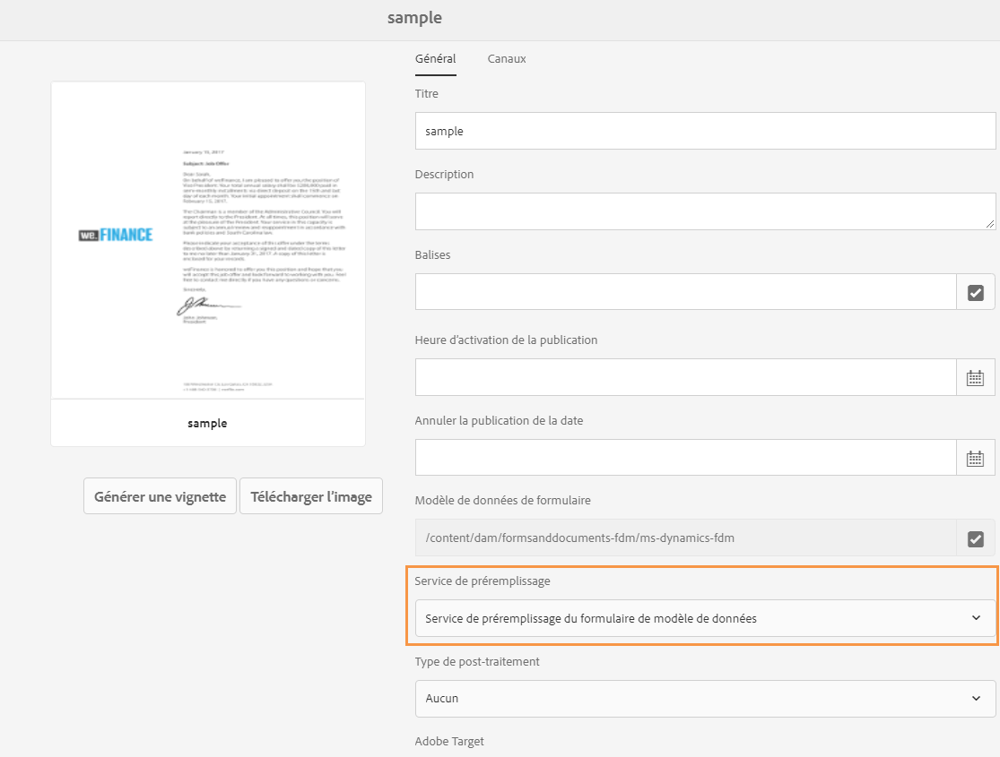
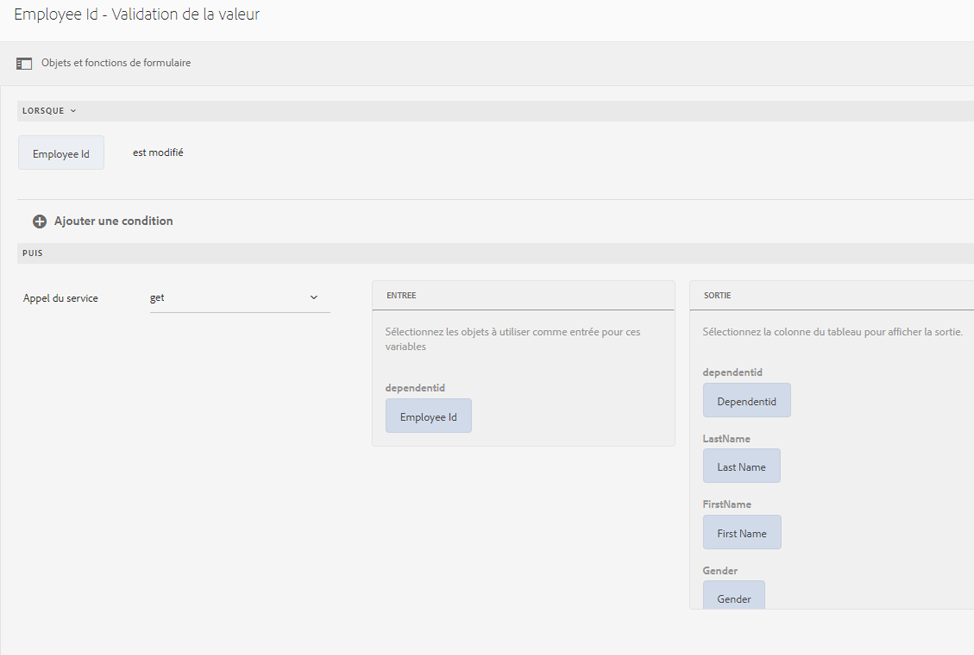

# Utilisation du modèle de données de formulaire (FDM) {#use-form-data-model}

| Version | Lien de l’article |
| -------- | ---------------------------- |
| AEM 6.5 | [Cliquez ici](https://experienceleague.adobe.com/docs/experience-manager-65/forms/form-data-model/using-form-data-model.html) |
| AEM as a Cloud Service | Cet article |

[!DNL Experience Manager Forms] intégration de données vous permet d’utiliser des sources de données back-end pour créer un modèle de données de formulaire (FDM) que vous pouvez utiliser comme schéma dans divers processus de <!--and interactive communications--> de Forms adaptatif. Elle nécessite la configuration des sources de données et la création d’un modèle de données de formulaire (FDM) basé sur les objets et services de modèle de données disponibles dans les sources de données. Pour plus d’informations, consultez les sections suivantes :

* [Intégration de données [!DNL Experience Manager Forms]](data-integration.md)
* [Configurer des sources de données](configure-data-sources.md)
* [Créer un modèle de données de formulaire (FDM)](create-form-data-models.md)
* [Utilisation d’un modèle de données de formulaire (FDM)](work-with-form-data-model.md)

Un modèle de données de formulaire (FDM) est une extension du schéma JSON que vous pouvez utiliser pour :

* [créer des formulaires adaptatifs et des fragments](#create-af) ;
  <!--* [Create interactive communications and building blocks like text, list, and condition fragments](#create-ic)-->
* [Aperçu avec des données d’exemple](#preview-ic)
* [Utilisation du service de modèle de données de formulaire](#prefill)
* [écrire les données de formulaires adaptatifs envoyés dans les sources de données ;](#write-af)
* [appeler les services à l’aide des règles de formulaire adaptatif.](#invoke-services)

## Applicabilité et cas d’utilisation

### Assurance

## AEM Forms peut-il s’intégrer aux systèmes principaux d’assurance ?

Oui. AEM Forms prend en charge l’intégration à l’aide des API REST et SOAP, ce qui lui permet de se connecter aux systèmes d’administration des politiques, de gestion des réclamations et de gestion de la relation client (CRM).

## AEM Forms peut-il écrire des données de formulaire dans les systèmes d’assurance ?

Oui. AEM Forms prend en charge l’écriture différée des données sur les systèmes principaux dans le cadre de l’envoi de formulaires et de l’exécution de workflows.

## Les clients peuvent-ils charger des documents de réclamation en toute sécurité à l’aide d’AEM Forms ?

Oui. AEM Forms prend en charge le chargement sécurisé de documents dans le cadre des envois de formulaires, avec des contrôles d’accès et une gestion sécurisée des données conformes aux exigences de sécurité de l’entreprise.

## Création de formulaires adaptatifs et de fragments {#create-af}

Vous pouvez créer des [Forms adaptatif](creating-adaptive-form.md) et des fragments de formulaire adaptatif <!-- [Adaptive Form Fragments](adaptive-form-fragments.md) --> basés sur un modèle de données de formulaire (FDM). Pour utiliser un modèle de données de formulaire (FDM) lors de la création d’un formulaire adaptatif ou d’un fragment de formulaire adaptatif, procédez comme suit :

1. Dans l’onglet Modèle de formulaire de l’écran Ajouter des propriétés, sélectionnez **[!UICONTROL Modèle de données de formulaire]** dans la liste déroulante **[!UICONTROL Sélectionner à partir de]**.

   

2. Cliquez pour développer **[!UICONTROL Sélectionner le modèle de données de formulaire]**. Tous les modèles de données de formulaire (FDM) disponibles sont répertoriés.

   Sélectionnez un modèle de données de formulaire.

   

3. (**Fragments de formulaire adaptatif uniquement**) Vous pouvez créer un fragment de formulaire adaptatif basé sur un seul objet de modèle de données dans un modèle de données de formulaire (FDM). Développez la liste déroulante **[!UICONTROL Définitions de modèle de données de formulaire]**. Il répertorie tous les objets de modèle de données dans le modèle de données de formulaire (FDM) spécifié. Sélectionnez un objet de modèle de données dans la liste.

   

   Une fois le formulaire adaptatif ou le fragment de formulaire adaptatif basé sur un modèle de données de formulaire (FDM) créé, les objets de modèle de données de formulaire apparaissent dans l’onglet **[!UICONTROL Sources de données]** de l’explorateur de contenu dans le créateur de formulaires adaptatifs.

   >[!NOTE]
   >
   >Pour un fragment de formulaire adaptatif, seul l’objet de modèle de données sélectionné au moment de la création et ses objets de modèle de données associés apparaissent dans l’onglet Objets de modèle de données.

   

   Vous pouvez effectuer un glisser-déposer des objets de modèle de données sur le formulaire adaptatif ou le fragment pour ajouter des champs de formulaire. Les champs de formulaire ajoutés conservent les propriétés des métadonnées et la liaison avec les propriétés de l’objet de modèle de données. La liaison garantit que les valeurs de champ sont mises à jour dans les sources de données correspondantes lors de l’envoi du formulaire et préremplies lorsque le formulaire est rendu.

<!-- ## Create interactive communications {#create-ic}

You can create an interactive communication based on a Form Data Model that you can use to prefill interactive communication with data from configured data sources. In addition, the building blocks of an interactive communication, such as text, list, and condition document fragments can be based on a form data model.

You can choose a Form Data Model when creating an interactive communication or a document fragment. The following image shows the General tab of the Create Interactive Communication dialog.

General tab of Create Interactive Communication dialog

For more information, see:

[Create an interactive communication](create-interactive-communication.md)

[Text in Interactive Communications](texts-interactive-communications.md)

[Conditions in Interactive Communications](conditions-interactive-communications.md)

[List fragments](lists.md) -->

## Aperçu avec des données d’exemple {#preview-ic}

L’éditeur de modèle de données de formulaire vous permet de générer et de modifier des exemples de données pour les objets de modèle de données dans le modèle de données de formulaire (FDM). Vous pouvez utiliser ces données pour prévisualiser et tester les formulaires adaptatifs <!--interactive communications and-->. Vous devez générer les données d’exemple avant la prévisualisation, comme décrit dans la section [Utilisation d’un modèle de données de formulaire](work-with-form-data-model.md#sample).

<!--To preview an interactive communication with sample Form Data Model data:

1. On [!DNL  Experience Manager] author instance, navigate to **[!UICONTROL Forms > Forms & Documents]**.
1. Select an interactive communication and select **[!UICONTROL Preview]** in the toolbar to select **[!UICONTROL Web Channel]**, **[!UICONTROL Print Channel]**, or **[!UICONTROL Both Channels]** to preview the interactive communication.
1. In the Preview [*channel*] dialog, ensure that **[!UICONTROL Test Data of Form Data Model]** is selected and select **[!UICONTROL Preview]**.

The interactive communication opens with prefilled sample data.

-->

Pour prévisualiser un formulaire adaptatif avec des exemples de données, ouvrez le formulaire adaptatif en mode création et sélectionnez **[!UICONTROL Aperçu]**.

## Préremplissage à l’aide du service de modèle de données de formulaire {#prefill}

[!DNL Experience Manager Forms] fournit un service de préremplissage de modèle de données de formulaire prêt à l’emploi que vous pouvez activer pour les <!--and interactive communications--> Forms adaptatifs basés sur un modèle de données de formulaire (FDM). Le service de préremplissage récupère les sources de données des objets de modèle de données dans le formulaire adaptatif <!--and interactive communication--> et préremplit les données en conséquence lors du rendu du formulaire ou de la communication.

Pour activer le service de préremplissage de modèle de données de formulaire pour un formulaire adaptatif, ouvrez les propriétés du conteneur de formulaires adaptatifs et sélectionnez **[!UICONTROL Service de préremplissage de modèle de données de formulaire]** dans la liste déroulante **[!UICONTROL Service de préfiltrage]** de l’accordéon De base. Ensuite, enregistrez les propriétés.

<!--To configure Form Data Model prefill service in an interactive communication, you can select Form Data Model Prefill Service in the Prefill Service drop-down while creating it or later by modifying the properties.

Edit Properties dialog for an interactive communication-->

## Écriture des données de formulaires adaptatifs envoyés dans les sources de données {#write-af}

Lorsqu’un utilisateur envoie un formulaire basé sur un modèle de données de formulaire (FDM), vous pouvez configurer le formulaire pour écrire les données envoyées pour un objet de modèle de données dans ses sources de données. Pour réaliser ce cas d’utilisation, [!DNL Experience Manager Forms] fournissez [Action d’envoi de modèle de données de formulaire](configuring-submit-actions.md), disponible par défaut uniquement pour les Forms adaptatives basées sur un modèle de données de formulaire (FDM). Elle écrit les données envoyées pour un objet de modèle de données dans sa source de données.

Pour configurer l’action d’envoi de modèle de données de formulaire :

1. Ouvrez l’explorateur de contenu, puis sélectionnez le composant **[!UICONTROL Conteneur de guide]** de votre formulaire adaptatif.
1. Cliquez sur l’icône des propriétés du conteneur de guide . La fenêtre du conteneur de formulaires adaptatifs s’ouvre.
1. Cliquez sur l’onglet **[!UICONTROL Envoi]**.
1. Dans la liste déroulante **[!UICONTROL Action d’envoi]**, sélectionnez **[!UICONTROL Envoyer à l’aide du modèle de données de formulaire]**.

   

1. Spécifiez le **[!UICONTROL Modèle de données à envoyer]**.
1. Cliquez sur **[!UICONTROL Terminé]**

Lors de l’envoi du formulaire, les données de l’objet de modèle de données configuré sont écrites dans la source de données correspondante. En outre, vous pouvez envoyer une pièce jointe de formulaire à l’aide d’un modèle de données de formulaire (FDM) et d’un document d’enregistrement (DE) à la source de données. Pour plus d’informations sur le modèle de données de formulaire (FDM), voir [[!DNL AEM Forms] Intégration de données](data-integration.md).

<!---->

>[!NOTE]
>
> AEM as a Cloud Service propose différentes actions d’envoi prêtes à l’emploi pour gérer les envois de formulaires. Pour en savoir plus sur ces options, consultez l’article [Action d’envoi de formulaire adaptatif](/help/forms/configure-submit-actions-core-components.md).

Vous pouvez également envoyer des pièces jointes de formulaire à une source de données à l’aide de la propriété d’objet de modèle de données binaire. Procédez comme suit pour envoyer des pièces jointes à une source de données JDBC :

1. Ajoutez un objet de modèle de données qui inclut une propriété binaire au modèle de données de formulaire (FDM).
1. Dans le formulaire adaptatif, faites glisser le composant **[!UICONTROL Pièce jointe]** depuis l’explorateur Composants vers le formulaire adaptatif.
1. Sélectionnez le composant ajouté, puis sélectionnez  pour ouvrir l’explorateur de propriétés du composant.
1. Dans le champ Référence de liaison, sélectionnez  et accédez à la propriété binaire que vous avez ajoutée dans le modèle de données de formulaire (FDM). Configurez d’autres propriétés en fonction de vos besoins.

   Sélectionnez  pour enregistrer les propriétés. Le champ de pièce jointe est désormais lié à la propriété binaire du modèle de données de formulaire (FDM).

1. Dans la section Envoi des propriétés du conteneur de formulaires adaptatifs, activez l’option **[!UICONTROL Envoyer les pièces jointes de formulaire]**. Cela permet d’envoyer la pièce jointe dans le champ de propriété binaire à la source de données lors de l’envoi du formulaire.

## Appel des services dans des formulaires adaptatifs à l’aide de règles {#invoke-services}

Dans un formulaire adaptatif basé sur un modèle de données de formulaire (FDM), vous pouvez [&#x200B; créer des règles &#x200B;](rule-editor.md) pour appeler les services configurés dans le modèle de données de formulaire (FDM). L’opération **[!UICONTROL Appeler des services]** d’une règle répertorie tous les services disponibles dans le modèle de données de formulaire (FDM) et vous permet de sélectionner des champs d’entrée et de sortie pour le service. Vous pouvez également utiliser le type de règle **[!UICONTROL Définir la valeur]** pour appeler un service de modèle de données de formulaire et définir la valeur d’un champ sur la sortie renvoyée par le service.

Par exemple, la règle suivante appelle un service get qui utilise l’ID d’employé comme entrée et les valeurs renvoyées sont renseignées dans les champs ID, Nom, Prénom et Sexe correspondants du formulaire.

En outre, vous pouvez utiliser l’API `guidelib.dataIntegrationUtils.executeOperation` pour écrire un code JavaScript dans l’éditeur de code pour l’éditeur de règles. <!-- For API details, see [API to invoke Form Data Model service](invoke-form-data-model-services.md).-->

### Appeler un modèle de données de formulaire (FDM) à l’aide de fonctions personnalisées {#invoke-form-data-model-using-custom-functions}

Vous pouvez [appeler un modèle de données de formulaire à partir de l’éditeur de règles à l’aide de fonctions personnalisées](/help/forms/rule-editor.md#custom-functions-in-rule-editor-custom-functions). Pour appeler le modèle de données de formulaire (FDM), ajoutez un modèle de données de formulaire à la place sur la liste autorisée. Pour ajouter un modèle de données de formulaire à une liste autorisée :

1. Accédez à la console web Experience Manager à l’adresse `https://server:host/system/console/configMgr`.
1. Recherchez **[!UICONTROL liste autorisée de niveau formulaire adaptatif du modèle de données de formulaire pour l’appel de service - Fabrique de configuration]**.
1. Cliquez sur l’icône  pour ajouter la configuration.
1. Ajoutez **[!UICONTROL Modèle de chemin de contenu]** pour spécifier l’emplacement de votre Forms adaptative.  Par défaut, la valeur est `/content/forms/af/(.*)`, ce qui inclut l’ensemble du Forms adaptatif. Vous pouvez également spécifier le chemin d’accès d’un formulaire adaptatif spécifique.
1. Ajoutez **[!UICONTROL Modèle de chemin d’accès du modèle de données de formulaire]** pour spécifier l’emplacement du modèle de données de formulaire (FDM). Par défaut, la valeur est `/content/dams/formsanddocuments-fdm/(.*)`, ce qui inclut tout le modèle de données de formulaire (FDM). Vous pouvez également spécifier le chemin d’accès d’un modèle de données de formulaire (FDM) spécifique.
1. Enregistrez les paramètres.

La configuration ajoutée est enregistrée sous l’option **[!UICONTROL Liste autorisée au niveau du formulaire adaptatif du modèle de données de formulaire pour l’appel du service - Fabrique de configurations]**.

>[!VIDEO](https://video.tv.adobe.com/v/3423977/adaptive-forms-custom-function-rule-editor)

>[!NOTE]
>
> Pour appeler un modèle de données de formulaire (FDM) à partir de l’éditeur de règles à l’aide de fonctions personnalisées via un projet d’archétype AEM :
>
>1. [Créez un fichier de configuration](https://github.com/adobe/aem-core-forms-components/blob/master/it/config/src/main/content/jcr_root/apps/system/config/com.adobe.aemds.guide.factory.impl.AdaptiveFormFDMConfigurationFactoryImpl~core-components-it.cfg.json).
>1. Définissez les propriétés getContentPathPattern et getFormDataModelPathPattern.
>1. Déployez le projet.

## Articles connexes

{{af-submit-action}}

