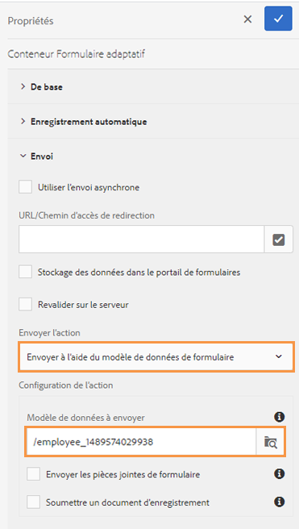

# Utilisation d’un modèle de données de formulaire {#use-form-data-model}

| Version | Lien de l’article |
| -------- | ---------------------------- |
| AEM 6.5 | [Cliquez ici](https://experienceleague.adobe.com/docs/experience-manager-65/forms/form-data-model/using-form-data-model.html) |
| AEM as a Cloud Service | Cet article |

L’intégration de données [!DNL Experience Manager Forms] vous permet d’utiliser des sources de données back-end pour créer un modèle de données de formulaire que vous pouvez utiliser comme schéma dans divers processus <!--and interactive communications--> de formulaires adaptatifs. Elle nécessite la configuration des sources de données et la création d’un modèle de données de formulaire basé sur les objets et services de modèle de données disponibles dans les sources de données. Pour plus d’informations, consultez les sections suivantes :

* [Intégration de données [!DNL Experience Manager Forms]](data-integration.md)
* [Configuration des sources de données](configure-data-sources.md)
* [Création d’un modèle de données de formulaire](create-form-data-models.md)
* [Utilisation d’un modèle de données de formulaire](work-with-form-data-model.md)

Un modèle de données de formulaire est une extension du schéma JSON que vous pouvez utiliser pour :

* [créer des formulaires adaptatifs et des fragments](#create-af) ;
  <!--* [Create interactive communications and building blocks like text, list, and condition fragments](#create-ic)-->
* [Aperçu avec des exemples de données](#preview-ic)
* [utiliser le service de modèle de données de formulaire ;](#prefill)
* [écrire les données de formulaires adaptatifs envoyés dans les sources de données ;](#write-af)
* [appeler les services à l’aide des règles de formulaire adaptatif.](#invoke-services)

## Création de formulaires adaptatifs et de fragments {#create-af}

Vous pouvez créer des [formulaires adaptatifs](creating-adaptive-form.md) et des fragments de formulaire adaptatif <!-- [Adaptive Form Fragments](adaptive-form-fragments.md) --> basés sur un modèle de données de formulaire. Pour utiliser un modèle de données de formulaire lors de la création d’un formulaire adaptatif ou d’un fragment de formulaire adaptatif, procédez comme suit :

1. Dans l’onglet Modèle de formulaire de l’écran Ajouter des propriétés, sélectionnez **[!UICONTROL Modèle de données de formulaire]** dans la liste déroulante **[!UICONTROL Sélectionner à partir de]**.

   

1. Appuyez pour développer le **[!UICONTROL modèle de données de formulaire sélectionné]**. Tous les modèles de données de formulaire disponibles sont répertoriés.

   Sélectionnez un modèle de données à partir de .

   

1. (**Fragments de formulaire adaptatif uniquement**) Vous pouvez créer un fragment de formulaire adaptatif basé sur un seul objet de modèle de données dans un modèle de données de formulaire. Développer **[!UICONTROL Définitions de modèle de données de formulaire]** menu déroulant. Il répertorie tous les objets de modèle de données dans le modèle de données de formulaire spécifié. Sélectionnez un objet de modèle de données dans la liste.

   

   Une fois le formulaire adaptatif ou le fragment de formulaire adaptatif basé sur un modèle de données de formulaire créé, les objets de modèle de données de formulaire apparaissent dans l’onglet **[!UICONTROL Objets de modèle de données]** de l’explorateur de contenu dans l’éditeur de formulaires adaptatifs.

   >[!NOTE]
   >
   >Pour un fragment de formulaire adaptatif, seul l’objet de modèle de données sélectionné au moment de la création et ses objets de modèle de données associés apparaissent dans l’onglet Objets de modèle de données.

   

   Vous pouvez effectuer un glisser-déposer des objets de modèle de données sur le formulaire adaptatif ou le fragment pour ajouter des champs de formulaire. Les champs de formulaire ajoutés conservent les propriétés de métadonnées et la liaison avec les propriétés de l’objet de modèle de données. La liaison permet de s’assurer que les valeurs de champ sont mises à jour dans les sources de données correspondantes lors de l’envoi du formulaire et préremplies lors de la génération du formulaire.

<!-- ## Create interactive communications {#create-ic}

You can create an interactive communication based on a Form Data Model that you can use to prefill interactive communication with data from configured data sources. In addition, the building blocks of an interactive communication, such as text, list, and condition document fragments can be based on a form data model.

You can choose a Form Data Model when creating an interactive communication or a document fragment. The following image shows the General tab of the Create Interactive Communication dialog.

General tab of Create Interactive Communication dialog

For more information, see:

[Create an interactive communication](create-interactive-communication.md)

[Text in Interactive Communications](texts-interactive-communications.md)

[Conditions in Interactive Communications](conditions-interactive-communications.md)

[List fragments](lists.md) -->

## Aperçu avec des exemples de données {#preview-ic}

L’éditeur de modèle de données de formulaire vous permet de générer et de modifier des exemples de données pour les objets de modèle de données dans le modèle de données de formulaire. Vous pouvez utiliser ces données pour prévisualiser et tester les formulaires adaptatifs <!--interactive communications and-->. Vous devez générer les exemples de données avant la prévisualisation, comme décrit dans la section [Utilisation d’un modèle de données de formulaire](work-with-form-data-model.md#sample).

<!--To preview an interactive communication with sample Form Data Model data:

1. On [!DNL  Experience Manager] author instance, navigate to **[!UICONTROL Forms > Forms & Documents]**.
1. Select an interactive communication and tap **[!UICONTROL Preview]** in the toolbar to select **[!UICONTROL Web Channel]**, **[!UICONTROL Print Channel]**, or **[!UICONTROL Both Channels]** to preview the interactive communication.
1. In the Preview [*channel*] dialog, ensure that **[!UICONTROL Test Data of Form Data Model]** is selected and tap **[!UICONTROL Preview]**.

The interactive communication opens with prefilled sample data.

-->

De même, pour prévisualiser un formulaire adaptatif avec des exemples de données, ouvrez le formulaire adaptatif en mode création et appuyez sur **[!UICONTROL Prévisualiser]**.

## Préremplissage à l’aide du service de modèle de données de formulaire {#prefill}

[!DNL Experience Manager Forms] fournit un service de préremplissage de modèle de données de formulaire prêt à l’emploi que vous pouvez activer pour les formulaires adaptatifs <!--and interactive communications-->basés sur un modèle de données de formulaire. Le service de préremplissage récupère les sources de données des objets de modèle de données dans le formulaire adaptatif <!--and interactive communication--> et préremplit les données en conséquence lors du rendu du formulaire ou de la communication.

Pour activer le service de préremplissage de modèle de données de formulaire pour un formulaire adaptatif, ouvrez les propriétés du conteneur de formulaires adaptatifs et sélectionnez **[!UICONTROL Service de préremplissage de modèle de données de formulaire]** dans la liste déroulante **[!UICONTROL Service de préfiltrage]** de l’accordéon De base. Ensuite, enregistrez les propriétés.

<!--To configure Form Data Model prefill service in an interactive communication, you can select Form Data Model Prefill Service in the Prefill Service drop-down while creating it or later by modifying the properties.

Edit Properties dialog for an interactive communication-->

## Écriture des données de formulaires adaptatifs envoyés dans les sources de données {#write-af}

Lorsqu’un utilisateur envoie un formulaire basé sur un modèle de données de formulaire, vous pouvez configurer le formulaire pour écrire les données envoyées pour un objet de modèle de données dans ses sources de données. Pour réaliser ce cas d’utilisation, [!DNL Experience Manager Forms] fournit une [action d’envoi de modèle de données de formulaire](configuring-submit-actions.md), disponible par défaut uniquement pour les formulaires adaptatifs basés sur un modèle de données de formulaire. Elle écrit les données envoyées pour un objet de modèle de données dans sa source de données.

Pour configurer l’action d’envoi de modèle de données de formulaire, ouvrez les propriétés du conteneur de formulaires adaptatifs et sélectionnez **[!UICONTROL Envoyer à l’aide du modèle de données de formulaire]** dans la liste déroulante Action d’envoi sous l’accordéon Envoi. Ensuite, recherchez et sélectionnez un objet de modèle de données dans la liste **[!UICONTROL Nom de l’objet de modèle de données à envoyer]**. Enregistrez les propriétés.

Lors de l’envoi du formulaire, les données de l’objet de modèle de données configuré sont écrites dans la source de données correspondante.

<!---->

Vous pouvez également envoyer des pièces jointes de formulaire à une source de données à l’aide de la propriété d’objet de modèle de données binaire. Procédez comme suit pour envoyer des pièces jointes à une source de données JDBC :

1. Ajoutez un objet de modèle de données qui inclut une propriété binaire au modèle de données de formulaire.
1. Dans le formulaire adaptatif, faites glisser le composant **[!UICONTROL Pièce jointe]** depuis l’explorateur Composants vers le formulaire adaptatif.
1. Appuyez pour sélectionner le composant ajouté et appuyez sur  pour ouvrir l’explorateur Propriétés du composant.
1. Dans le champ Référence de liaison, appuyez sur  et naviguez pour sélectionner la propriété binaire que vous avez ajoutée dans le modèle de données de formulaire. Configurez d’autres propriétés en fonction de vos besoins.

   Appuyez sur  pour enregistrer les propriétés. Le champ de pièce jointe est maintenant lié à la propriété binaire du modèle de données de formulaire.

1. Dans la section Envoi des propriétés du conteneur de formulaires adaptatifs, activez l’option **[!UICONTROL Envoyer les pièces jointes de formulaire]**. Elle envoie la pièce jointe dans le champ de propriété binaire à la source de données lors de l’envoi du formulaire.

## Appel des services dans des formulaires adaptatifs à l’aide de règles {#invoke-services}

Dans un formulaire adaptatif basé sur un modèle de données de formulaire, vous pouvez [créer des règles](rule-editor.md) pour appeler les services configurés dans le modèle de données de formulaire. La variable **[!UICONTROL Appeler les services]** dans une règle répertorie tous les services disponibles dans le modèle de données de formulaire et vous permet de sélectionner les champs d’entrée et de sortie du service. Vous pouvez également utiliser le type de règle **[!UICONTROL Définir la valeur]** pour appeler un service de modèle de données de formulaire et définir la valeur d’un champ sur la sortie renvoyée par le service.

Par exemple, la règle suivante appelle un service get qui utilise l’ID d’employé comme entrée et les valeurs renvoyées sont renseignées dans les champs ID, Nom, Prénom et Sexe correspondants du formulaire.

En outre, vous pouvez utiliser l’API `guidelib.dataIntegrationUtils.executeOperation` pour écrire un code JavaScript dans l’éditeur de code pour l’éditeur de règles. <!-- For API details, see [API to invoke Form Data Model service](invoke-form-data-model-services.md).-->
