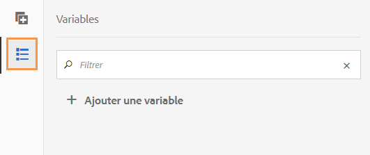
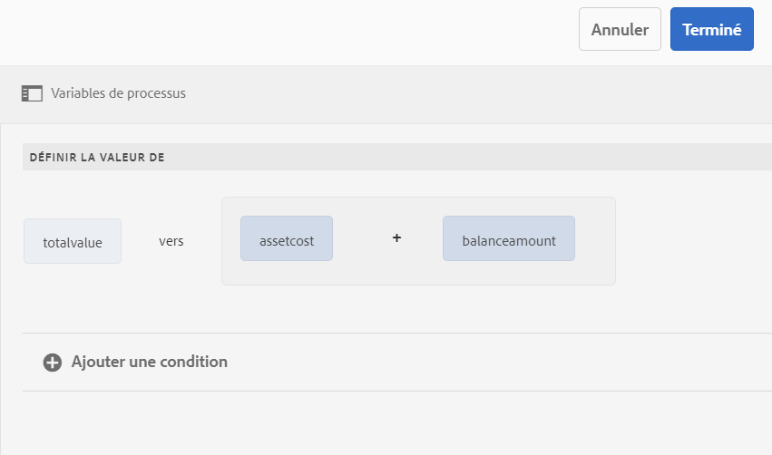
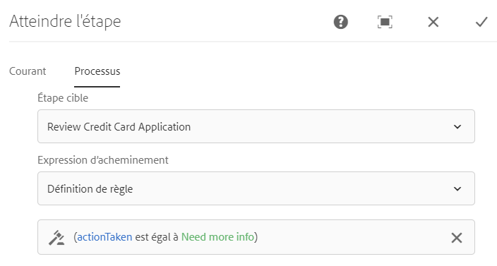

# Variables dans les workflows AEM basés sur l’utilisation de Forms {#variables-in-aem-forms-workflows}

| Version | Lien de l’article |
| -------- | ---------------------------- |
| AEM 6.5 | [Cliquez ici](https://experienceleague.adobe.com/docs/experience-manager-65/forms/workflows/variable-in-aem-workflows.html?lang=fr) |
| AEM as a Cloud Service | Cet article |

Une variable dans un modèle de processus permet de stocker une valeur en fonction de son type de données. Vous pouvez utiliser le nom de la variable dans n’importe quelle étape de processus pour extraire la valeur stockée dans la variable. Vous pouvez également utiliser des noms de variable pour définir des expressions afin de prendre des décisions de routage.

Dans des modèles de processus AEM, vous pouvez :

* [Créer une variable](variable-in-aem-workflows.md#create-a-variable) d’un type de données en fonction du type d’informations que vous souhaitez y stocker.
* [Définir une valeur pour la variable](variable-in-aem-workflows.md#set-a-variable) à l’aide de l’étape de processus Définir la variable.
* [Utiliser la variable](variable-in-aem-workflows.md#use-a-variable) dans toutes les étapes de processus [!DNL AEM Forms] pour extraire la valeur stockée et dans les étapes de division OU ou d’accès pour définir une expression de routage.

La vidéo ci-dessous indique comment créer, définir et utiliser des variables dans des modèles de processus AEM :

>[!VIDEO](assets/variables_introduction_1_1.mp4)

Les variables sont une extension de l’interface [MetaDataMap](https://helpx.adobe.com/experience-manager/6-5/sites/developing/using/reference-materials/javadoc/com/adobe/granite/workflow/metadata/MetaDataMap.html) existante. Vous pouvez utiliser [MetaDataMap](https://helpx.adobe.com/fr/experience-manager/6-5/sites/developing/using/reference-materials/javadoc/com/adobe/granite/workflow/metadata/MetaDataMap.html) dans ECMAScript pour accéder aux métadonnées enregistrées à l’aide de variables.

## Création d’une variable {#create-a-variable}

Vous pouvez créer des variables à l’aide de la section Variables disponible dans le sidekick du modèle de processus. Les variables de processus AEM prennent en charge les types de données suivants :

* **Types de données primitifs** : Long, Doublon, Boolean, Date et String
* **Types de données complexes** : [Document](https://helpx.adobe.com/fr/experience-manager/6-5/forms/javadocs/com/adobe/aemfd/docmanager/Document.html), instance [XML](https://docs.oracle.com/javase/8/docs/api/org/w3c/dom/Document.html), [JSON](https://static.javadoc.io/com.google.code.gson/gson/2.3/com/google/gson/JsonObject.html) et modèle de données de formulaire.

>[!NOTE]
>
>Les processus ne prennent en charge que le format ISO8601 pour les variables de type Date.

Le type de données ArrayList permet de créer des collections de variables. Vous pouvez créer une variable ArrayList pour tous les types de données primitifs et complexes. Par exemple, créez une variable ArrayList et sélectionnez String comme sous-type pour stocker plusieurs valeurs de chaîne à l’aide de la variable.

Pour créer une variable :

1. Sur une instance AEM, accédez à Outils  > Processus > Modèles.
1. Sélectionnez **[!UICONTROL Créer]**, puis définissez le titre, ainsi qu’un nom facultatif, pour le modèle de workflow. Sélectionnez le modèle, puis **[!UICONTROL Modifier]**.
1. Sélectionnez l’icône des variables disponible dans le sidekick du modèle de workflow et sélectionnez **[!UICONTROL Ajouter une variable]**.

   

1. Dans la boîte de dialogue Ajouter une variable, spécifiez le nom et sélectionnez le type de la variable.
1. Sélectionnez le type de données dans la liste déroulante **[!UICONTROL Type]** et spécifiez les valeurs suivantes :

   * Type de données primitif : indiquez une valeur par défaut facultative pour la variable.
   * JSON ou XML : spécifiez un chemin d’accès facultatif au schéma JSON ou XML. Le système valide le chemin d’accès au schéma lors du mappage et du stockage des propriétés disponibles dans ce schéma sur une autre variable.
   * Modèle de données de formulaire (FDM) : spécifiez un chemin d’accès au modèle de données de formulaire.
   * ArrayList : spécifiez un sous-type pour la collection.

1. Spécifiez une description facultative pour la variable et sélectionnez  pour enregistrer les modifications. La variable s’affiche dans la liste disponible dans le volet de gauche.

Lorsque vous créez des variables, prenez en compte les bonnes pratiques suivantes :

* Créez autant de variables que le nécessite un processus. Toutefois, pour conserver les ressources de base de données, utilisez le nombre minimal de variables nécessaires et réutilisez des variables chaque fois que cela est possible.
* Les variables sont sensibles à la casse. Veillez à référencer les variables en utilisant la même casse dans votre processus.
* Évitez d’utiliser des caractères spéciaux dans le nom d’une variable.

## Définition d’une variable {#set-a-variable}

Vous pouvez utiliser l’étape Définir une variable pour définir la valeur d’une variable et l’ordre de définition des valeurs. La variable est définie dans l’ordre dans lequel les mappages de variables sont répertoriés à l’étape Définir une variable.

Les modifications apportées aux valeurs de variable n’affectent que l’instance du processus concernée par la modification. Par exemple, lorsqu’un processus est lancé et que les données de variable sont modifiées, les modifications n’affectent que cette instance du processus. Les modifications n’affectent pas les autres instances du processus lancées précédemment ou ultérieurement.

En fonction du type de données de la variable, vous pouvez définir la valeur d’une variable à l’aide de l’une des options suivantes :

* **Littéral** : utilisez cette option lorsque vous connaissez la valeur exacte à spécifier. Vous pouvez également spécifier un JSON sous la forme d’une chaîne.

* **Expression** : utilisez l’option lorsque la valeur à utiliser est calculée en fonction d’une expression. L’expression est créée dans l’éditeur d’expressions fourni.

* **Notation de point JSON** : l’option permet d’extraire une valeur d’une variable de type JSON ou FDM.
* **XPATH** : l’option permet d’extraire une valeur d’une variable de type XML.

* **Relatif à la charge** : utilisez l’option lorsque la valeur à enregistrer dans la variable est disponible à un chemin d’accès relatif à la charge utile.

* **Chemin d’accès absolu** : utilisez l’option lorsque la valeur à enregistrer dans la variable est disponible à un chemin d’accès absolu.

Vous pouvez également mettre à jour des éléments spécifiques d’une variable de type JSON ou XML à l’aide de la notation JSON DOT ou XPATH.

### Ajout d’un mappage entre les variables {#add-mapping-between-variables}

Pour ajouter un mappage entre des variables :

1. Dans la page de modification du workflow, sélectionnez l’icône Étapes disponible dans le sidekick du modèle de workflow.
1. Faites glisser l’étape **[!UICONTROL Définir une variable]** vers l’éditeur de workflow, sélectionnez l’étape, puis  (Configurer).
1. Dans la boîte de dialogue Définir une variable, sélectionnez **[!UICONTROL Mappage]** > **[!UICONTROL Ajouter un mappage]**.
1. Dans la section **Mapper une variable**, sélectionnez la variable dans laquelle stocker des données, sélectionnez le mode de mappage et spécifiez une valeur à stocker dans la variable. Les modes de mappage varient en fonction du type de variable.
1. Mappez davantage de variables pour créer une expression significative. Sélectionnez  pour enregistrer les modifications.

### Exemple 1 : Exécutez une requête dans une variable XML pour définir la valeur d’une variable de chaîne {#example-query-an-xml-variable-to-set-value-for-a-string-variable}

Sélectionnez une variable de type XML pour stocker un fichier XML. Exécutez une requête dans la variable XML pour définir la valeur d’une variable de chaîne pour la propriété disponible dans le fichier XML. Le champ **Spécifier XPATH pour la variable XML** permet de définir la propriété à stocker dans la variable de chaîne.

Dans cet exemple, sélectionnez une variable XML **formdata** pour stocker le fichier **cc-app.xml**. Exécutez une requête la variable **formdata** pour définir la valeur de la variable de chaîne **email** afin de stocker la valeur de la propriété **emailAddress** disponible dans le fichier **cc-app.xml**.

>[!VIDEO](https://helpx.adobe.com/content/dam/help/en/experience-manager/6-5/forms/using/set_variable_example1.mp4 "Définition de la valeur d’une variable")

### Exemple 2 : Utilisez une expression pour stocker la valeur en fonction d’autres variables {#example2}

Utilisez une expression pour calculer la somme des variables et stocker le résultat dans une variable.

Dans cet exemple, utilisez l’éditeur d’expressions pour définir une expression afin de calculer la somme des variables **assetcost** et **balanceamount** et de stocker le résultat dans une variable **totalvalue**.

>[!VIDEO](https://helpx.adobe.com/content/dam/help/en/experience-manager/6-5/forms/using/variables_expression.mp4)

## Utilisation de l’éditeur d’expressions {#use-expression-editor}

Vous utilisez également des expressions pour calculer la valeur d’une variable lors de l’exécution. Les variables fournissent un éditeur d’expressions pour définir les expressions.

Utilisez l’éditeur d’expressions pour :

* définir la valeur des variables à l’aide d’autres variables de processus, de nombres ou d’expressions mathématiques.
* Utiliser des variables de processus, une chaîne, un nombre ou une expression dans une expression mathématique
* Ajoutez des conditions pour définir les valeurs des variables.
* Ajoutez des opérateurs entre les conditions.



Il repose sur l’éditeur de règles de formulaires adaptatifs avec les modifications suivantes. L’éditeur de règles dans les variables :

* ne prend pas en charge les fonctions ;
* ne fournit pas d’interface utilisateur pour afficher un résumé des règles ;
* ne possède pas d’éditeur de code ;
* ne prend pas en charge l’activation et la désactivation de la valeur d’un objet ;
* ne prend pas en charge la définition de la propriété d’un objet ;
* ne prend pas en charge l’appel d’un service Web.

Pour plus d’informations, voir [Éditeur de règles de formulaire adaptatif](rule-editor.md).

## Utiliser une variable {#use-a-variable}

Vous pouvez utiliser des variables pour extraire des entrées et des sorties ou enregistrer le résultat d’une étape. L’éditeur de processus fournit deux types d’étapes de processus :

* Étapes de workflow avec prise en charge des variables
* Étapes de workflow sans prise en charge des variables

### Étapes de workflow avec prise en charge des variables {#workflow-steps-with-support-for-variables}

L’étape Accéder à, l’étape Division OU et toutes les étapes de workflow [!DNL AEM Forms] prennent en charge les variables.

#### Étape Division OU {#or-split-step}

L’étape de division OU divise le processus et une seule branche est active par la suite. Cette étape permet d’ajouter des chemins de traitement conditionnels dans le processus. Vous ajoutez des étapes de processus à chaque branche selon vos besoins.

Vous pouvez définir l’expression de routage d’une branche à l’aide d’une définition de règle, d’un script ECMA ou d’un script externe.

Vous pouvez utiliser des variables pour définir l’expression de routage à l’aide de l’éditeur d’expressions. Pour plus d’informations sur l’utilisation des expressions de routage pour l’étape de division OU, voir [Étape de division OU](https://experienceleague.adobe.com/docs/experience-manager-65/developing/extending-aem/extending-workflows/workflows-step-ref.html?lang=fr#or-split).

Dans cet exemple, avant de définir l’expression de routage, utilisez [exemple 2](variable-in-aem-workflows.md#example2) pour définir la valeur de la variable **totalvalue**. La branche 1 est principale si la valeur de la variable **totalvalue** est supérieure à 50 000. De même, vous pouvez définir une règle pour faire de la branche 2 la branche principale si la valeur de la variable **totalvalue** est inférieure à 50 000.

>[!VIDEO](https://helpx.adobe.com/content/dam/help/en/experience-manager/6-5/forms/using/variables_orsplit_example.mp4)

De même, sélectionnez un chemin d’accès au script externe ou spécifiez le script ECMA pour les expressions de routage afin d’évaluer la branche principale. Sélectionnez **[!UICONTROL Renommer la branche]** pour définir un autre nom pour la branche.

<!-- For more examples, see [Create a workflow model](aem-forms-workflow.md#create-a-workflow-model). -->

#### Étape d’accès {#go-to-step}

L’**étape d’accès** permet de spécifier l’étape suivante du modèle de workflow à exécuter, selon le résultat d’une expression de routage.

Tout comme l’étape de division OU, vous pouvez définir l’expression de routage de l’étape d’accès à l’aide d’une définition de règle, d’un script ECMA ou d’un script externe.

Vous pouvez utiliser des variables pour définir l’expression de routage à l’aide de l’éditeur d’expressions. Pour plus d’informations sur l’utilisation des expressions de routage pour l’étape d’accès, voir [Étape d’accès](https://experienceleague.adobe.com/docs/experience-manager-65/developing/extending-aem/extending-workflows/workflows-step-ref.html?lang=fr#goto-step).



Dans cet exemple, l’étape d’accès spécifie la demande de vérification de la carte de crédit comme étape suivante si la valeur de la variable **actiontaken** est égale à **Informations supplémentaires nécessaires**.

Pour plus d’exemples sur l’utilisation de la définition de règle dans l’étape d’accès, voir [Simulation d’une boucle For](https://experienceleague.adobe.com/docs/experience-manager-65/developing/extending-aem/extending-workflows/workflows-step-ref.html?lang=fr#simulateforloop).

#### Étapes de workflows basés sur l’utilisation de Forms {#forms-workflow-centric-workflow-steps}

Toutes les étapes de processus [!DNL AEM Forms] prennent en charge les variables. Pour plus d’informations, consultez la section [Workflow basé sur l’utilisation de Forms sur OSGi](aem-forms-workflow-step-reference.md).

### Étapes de processus sans prise en charge des variables {#workflow-steps-without-support-for-variables}

Vous pouvez utiliser l’interface [MetaDataMap](https://helpx.adobe.com/fr/experience-manager/6-5/sites/developing/using/reference-materials/javadoc/com/adobe/granite/workflow/metadata/MetaDataMap.html) pour accéder à des variables dans des étapes de processus qui ne prennent pas en charge les variables.

#### Extraction de la valeur d’une variable {#retrieve-the-variable-value}

Les API suivantes dans le script ECMA permettent d’extraire des valeurs de variables existantes en fonction du type de données :

| Type de données de la variable | API |
|---|---|
| Primitif (long, doublon, booléen, date et chaîne) | workItem.getWorkflowData().getMetaDataMap().get(variableName, type) |
| Document | Packages.com.adobe.aemfd.docmanager.Document doc = workItem.getWorkflowData().getMetaDataMap().get(&quot;docVar&quot;, Packages.com.adobe.aemfd.docmanager.Document.class); |
| XML | Packages.org.w3c.dom.Document xmlObject = workItem.getWorkflowData().getMetaDataMap().get(variableName, Packages.org.w3c.dom.Document.class); |
| Modèle de données de formulaire (FDM) | Packages.com.adobe.aem.dermis.api.FormDataModelInstance fdmObject = workItem.getWorkflowData().getMetaDataMap().get(variableName, Packages.com.adobe.aem.dermis.api.FormDataModelInstance.class); |
| JSON | Packages.com.google.gson.JsonObject jsonObject = workItem.getWorkflowData().getMetaDataMap().get(variableName, Packages.com.google.gson.JsonObject.class); |


**Exemple**

Extrayez la valeur du type de données de chaîne à l’aide de l’API suivante :

```javascript
workItem.getWorkflowData().getMetaDataMap().get(accname, Packages.java.lang.String)
```

#### Mise à jour de la valeur d’une variable {#update-the-variable-value}

L’API suivante dans le script ECMA permet de mettre à jour la valeur d’une variable :

```javascript
workItem.getWorkflowData().getMetaDataMap().put(variableName, value)
```

**Exemple**

```javascript
workItem.getWorkflowData().getMetaDataMap().put(salary, 50000)
```

Met à jour la valeur de la variable **salaire** sur 50 000.

### Définition des variables pour appeler des processus {#apiinvokeworkflow}

Vous pouvez utiliser une API pour définir des variables et les transmettre pour appeler des instances de processus.

[workflowSession.startWorkflow](https://helpx.adobe.com/experience-manager/6-5/sites/developing/using/reference-materials/javadoc/com/adobe/granite/workflow/WorkflowSession.html#startWorkflow-com.adobe.granite.workflow.model.WorkflowModel-com.adobe.granite.workflow.exec.WorkflowData-java.util.Map-) utilise le modèle, wfData et metaData comme arguments. Utilisez MetaDataMap pour définir la valeur de la variable.

Dans cette API, la variable **variableName** est définie sur **value** à l’aide de metaData.put(variableName, value);

```javascript
import com.adobe.granite.workflow.model.WorkflowModel;
import com.adobe.granite.workflow.metadata.MetaDataMap;
import com.adobe.aemfd.docmanager.Document;

/*Assume that you already have a workflowSession and modelId along with the payloadType and payload*/
WorkflowData wfData = workflowSession.newWorkflowData(payloadType, payload);
MetaDataMap metaData = wfData.getMetaDataMap();
metaData.put(variableName, value); //Create a variable "variableName" in your workflow model
WorkflowModel model = workflowSession.getModel(modelId);
workflowSession.startWorkflow(model, wfData, metaData);
```

**Exemple**

Initialisez l’objet de document **doc** à un chemin d’accès (&quot;a/b/c&quot;) et définissez la valeur de la variable **docVar** sur le chemin d’accès stocké dans l’objet de document.

```javascript
import com.adobe.granite.workflow.WorkflowSession;
import com.adobe.granite.workflow.exec.WorkflowData;
import com.adobe.granite.workflow.model.WorkflowModel;
import com.adobe.granite.workflow.metadata.MetaDataMap;
import com.adobe.aemfd.docmanager.Document;

/*This example assumes that you already have a workflowSession and modelId along with the payloadType and payload */
WorkflowData wfData = workflowSession.newWorkflowData(payloadType, payload);
MetaDataMap metaData = wfData.getMetaDataMap();
Document doc = new Document("/a/b/c");// initialize a document object
metaData.put("docVar",doc); //Assuming that you have created a variable "docVar" of type Document in your workflow model
WorkflowModel model = workflowSession.getModel(modelId);
workflowSession.startWorkflow(model, wfData, metaData);
```

## Modification d’une variable {#edit-a-variable}

1. Dans la page de modification du workflow, sélectionnez l’icône Variables disponible dans le sidekick du modèle de workflow. La section Variables du volet gauche affiche toutes les variables existantes.
1. Sélectionnez l’icône  (Modifier) en regard du nom de la variable que vous souhaitez modifier.
1. Modifiez les informations de la variable et sélectionnez  pour enregistrer les modifications. Vous ne pouvez pas modifier les champs **[!UICONTROL Nom]** et **[!UICONTROL Type]** d’une variable.

## Supprimer une variable {#delete-a-variable}

Avant de supprimer la variable, supprimez toutes les références de la variable du processus. Assurez-vous que la variable n’est pas utilisée dans le processus.

Pour supprimer une variable :

1. Dans la page de modification du workflow, sélectionnez l’icône Variables disponible dans le sidekick du modèle de workflow. La section Variables du volet gauche affiche toutes les variables existantes.
1. Sélectionnez l’icône Supprimer en regard du nom de la variable que vous souhaitez supprimer.
1. Sélectionnez  pour confirmer et supprimer la variable.

## Références {#references}

Pour plus d’exemples sur l’utilisation des variables dans les étapes de workflow [!DNL AEM Forms], voir [Variables dans les workflows AEM](https://experienceleague.adobe.com/docs/experience-manager-learn/forms/variables-aem-workflow/introduction.html?lang=fr).
