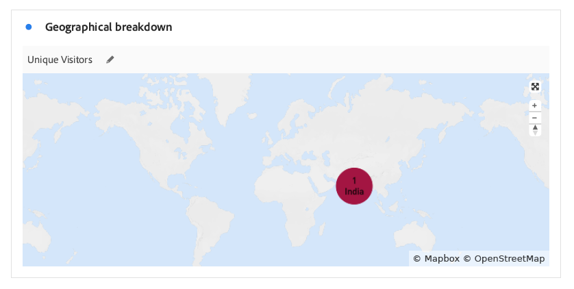
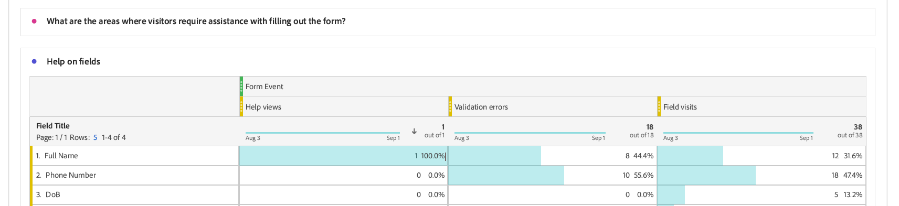

# Affichage et compréhension des rapports d’analyse de Forms adaptatif {#viewing-and-understanding-aem-forms-analytics-reports}

| Version | Lien de l’article |
| -------- | ---------------------------- |
| AEM as a Cloud Service | Cet article |
| AEM 6.5 | [Cliquez ici](https://experienceleague.adobe.com/docs/experience-manager-65/forms/integrate-aem-forms-with-experience-cloud-solutions/view-understand-aem-forms-analytics-reports.html?lang=fr) |

Dans le paysage en rapide évolution de l’analyse numérique, il est impératif de rester à l’écoute des tendances mondiales pour prendre des décisions éclairées et optimiser les expériences digitales. Pour résoudre ce problème, le Forms adaptatif s’intègre de manière transparente à Adobe Analytics afin de capturer et de suivre les mesures de performances des formulaires et documents que vous avez publiés. L’objectif derrière l’analyse de ces mesures est de prendre des décisions basées sur les données, en utilisant des mesures et des analyses afin d’améliorer l’utilisation et l’efficacité des formulaires.

Grâce à la capture et au suivi des indicateurs clés de performance, les entreprises peuvent identifier les domaines d’amélioration, optimiser les expériences client et, au bout du compte, obtenir de meilleurs résultats pour créer des expériences client exceptionnelles.

## Configuration d’Adobe Analytics en Forms adaptatif {#setup-adobe-analytics-to-aem-forms}

Pour le rapport AEM Forms Analytics, vous devez d’abord intégrer Adobe Analytics à AEM Forms par le biais de l’automatisation de la configuration d’Experience Cloud. L’automatisation de la configuration d’Experience Cloud dans le Forms adaptatif nécessite une licence Adobe Analytics, la collecte de données (anciennement Adobe Launch) pour gérer les scripts de suivi et l’intégration à l’API Experience Platform Launch pour une agrégation des données et une génération d’informations rationalisées. Consultez [Activer Adobe Analytics pour un formulaire adaptatif à l’aide de l’automatisation de la configuration Experience Cloud](/help/forms/enable-adobe-analytics-adaptive-form-using-experience-cloud-setup-automation.md) pour obtenir des informations complètes sur la configuration.

## Affichage du rapport Adobe Analytics de Forms adaptatif {#view-adobe-analytics-report}

1. Sur votre instance AEM, accédez à **[!UICONTROL Forms]** >> **[!UICONTROL Forms et document]**.
1. Sélectionnez votre formulaire, vous voyez qu’Adobe Analytics est intégré, comme illustré sur la gauche, au Forms activé pour Adobe Analytics.

   {width="100%"}

1. Cliquez sur **Adobe Analytics** pour afficher votre rapport et analyser les données de performances.

## Comprendre le rapport d’analyse de Forms adaptatif {#understanding-aem-forms-analytics-reports}

Adobe Analytics propose un tableau complet de mesures de performances des Forms adaptatifs, conçues pour fournir des informations précieuses sur l’utilisation des formulaires. Ces mesures sont les suivantes :

### **Quelles sont les performances du Forms adaptatif ?** {#how-your-adaptive-form-is-performing}

Elle contient les mesures Rendus de formulaire, Envois de formulaire, Erreurs de validation et Visiteurs uniques qui vous permettent d’évaluer l’utilisation et l’efficacité de vos formulaires :

* **Rendus de formulaire** : les rendus de formulaire indiquent le nombre de fois que le formulaire a été rendu ou ouvert.

* **Envois de formulaires** : les envois de formulaires indiquent le nombre de fois où les formulaires adaptatifs sont remplis et envoyés avec succès par les utilisateurs.

* **Erreurs de validation** : les erreurs de validation affichent le nombre total d’erreurs liées à la validation qui se sont produites dans les champs des formulaires.

* **Visiteurs uniques** : les visiteurs uniques représentent le nombre de fois où le formulaire est généré par un visiteur. Pour plus d’informations sur les visiteurs uniques, voir [Visiteurs uniques, visites et comportement du client](https://experienceleague.adobe.com/docs/analytics/components/metrics/visits.html?lang=fr).

  {width="100%"}

### **Visiteurs de vos formulaires** {#visitors-to-your-forms}

Vous obtiendrez ainsi des informations précieuses sur l’activité des visiteurs et visiteuses sur vos formulaires :

* **Visites et envois** : il décrit la fréquence des visites sur vos formulaires dans une période et le nombre correspondant d’envois de formulaire. Pour plus d’informations sur ce clic [Visites](https://experienceleague.adobe.com/docs/analytics/components/metrics/visits.html?lang=fr).
* **Visiteurs uniques et leur nombre total de visites** : il fait la distinction entre les nouveaux utilisateurs et les utilisateurs récurrents. Par exemple, un visiteur ou une visiteuse peut se rendre sur votre site tous les jours pendant un mois, mais il ou elle compte toujours comme un visiteur unique. Consultez [Visiteurs uniques](https://experienceleague.adobe.com/docs/analytics/components/metrics/unique-visitors.html?lang=fr) pour obtenir des informations détaillées.

  {width="100%"}

### **Type d’appareil** {#device-type}

Le type d’appareil permet d’identifier le type d’appareil utilisé pour accéder à vos formulaires. Il classe le type d’appareil comme type d’appareil mobile. Par exemple, dans ce cas, il s’agit de Type d’appareil mobile : Autre et Type d’appareil mobile : Téléphone mobile. Les différents types d’appareils mobiles incluent le téléphone mobile, la tablette, le lecteur multimédia, la console de jeux, etc.

{width="100%"}

### **Répartition géographique** {#geographical-breakdown}

Il indique l’emplacement à partir duquel les Forms sont accessibles. Elle fournit des informations spécifiques à la région sur les utilisateurs du formulaire. Par exemple, vous pouvez voir que les informations spécifiques à la région sur un utilisateur du formulaire sont en Inde, comme illustré dans l’image.

{width="100%"}

### **Principales sources de trafic et formulaires populaires** {#top-sources-of-traffic-and-popular-forms}

Cela vous permet d’identifier la source principale ou le lien à partir duquel vos formulaires sont référencés. Par exemple, dans l’image donnée ci-dessous, vous voyez les instances de recherche de vos formulaires adaptatifs où 18,9 % sont **dactylographiés/marqués d’un signet**, 70,49 % selon **moteurs de recherche** et 24 % proviennent de **autres sites web**. Vous pouvez définir des éléments de dimension en fonction de vos besoins. Vous pouvez également trier les formulaires les plus consultés ou les plus populaires.

{width="100%"}

### **Activité des utilisateurs dans les meilleurs formulaires** {#user-activity-on-top-forms}

Une vue complète de l’interaction des utilisateurs avec les visites de champ, les rendus de formulaire, les erreurs de validation, les formulaires abandonnés et les envois de formulaire fournit des informations sur les formulaires les plus actifs. Dans l’image ci-dessous, vous pouvez constater que le formulaire de demande est le plus actif en fonction des mesures d’événement de formulaire.

{width="100%"}

### **Chronologie de la visite des formulaires** {#timeline-for-time-spent-on-forms}

Il s’agit du temps que les utilisateurs et utilisatrices passent sur vos formulaires au fil du temps, ce qui vous aide à identifier les modèles d’engagement.

{width="100%"}

### **Zones où les visiteurs et visiteuses ont besoin d’aide pour remplir le formulaire** {#areas-requiring-assistance}

Les mesures telles que les vues d’aide, les erreurs de validation et les visites sur le terrain indiquent où les utilisateurs ont besoin d’aide et comment nous pouvons suivre les erreurs dans les champs. Par exemple, dans l’image ci-dessous, vous pouvez le voir dans un formulaire avec des champs tels que **Nom complet**, **Numéro de téléphone**, **DoB**. Le champ **Nom complet** comporte 12 visites, sur 12 visites, 8 visites ont une erreur de validation et 1 a cliqué sur l’icône d’aide pour afficher l’aide sur ce champ. Vous pouvez afficher les données de mesure pour d’autres champs de formulaire.

{width="100%"}

### **Dernier champ de formulaire que les visiteurs et visiteuses ont consulté avant d’abandonner le formulaire** {#last-form-field-that-visitors-viewed}

Il vous permet d’analyser les champs du formulaire dans lesquels les utilisateurs et utilisatrices ont passé du temps avant d’abandonner le formulaire. Par exemple, dans l’image ci-dessous, sur 5 formulaires abandonnés, 2 sont restés dans le champ **Nom complet**, 2 dans le champ **Numéro de téléphone** et 1 dans le champ **Saisie de texte**.

{width="100%"}

## Voir également {#see-also}

* [Activation d’Adobe Analytics pour un formulaire adaptatif à l’aide de l’automatisation de la configuration Experience Cloud](/help/forms/enable-adobe-analytics-adaptive-form-using-experience-cloud-setup-automation.md)
* [Ajouter un formulaire adaptatif à une page AEM Sites ou un fragment d’expérience](/help/forms/create-or-add-an-adaptive-form-to-aem-sites-page.md)
* [Intégration d’AEM Forms à Adobe Analytics](/help/forms/integrate-aem-forms-with-adobe-analytics.md)
