# Utilisation du modèle de données de formulaire (FDM) {#work-with-form-data-model}

| Version | Lien de l’article |
| -------- | ---------------------------- |
| AEM 6.5 | [Cliquez ici](https://experienceleague.adobe.com/docs/experience-manager-65/forms/form-data-model/work-with-form-data-model.html?lang=fr) |
| AEM as a Cloud Service | Cet article |


L’éditeur de modèle de données de formulaire (FDM) fournit une interface utilisateur intuitive et des outils pour modifier et configurer un modèle de données de formulaire (FDM). L’éditeur vous permet d’ajouter et de configurer des objets, des propriétés et des services de modèle de données provenant de sources de données associées dans le modèle de données de formulaire (FDM). En outre, il vous permet de créer des objets et des propriétés de modèle de données sans sources de données et de les lier ultérieurement aux objets et propriétés de modèle de données respectifs. Vous pouvez également générer et modifier des exemples de données pour les propriétés d’objet de modèle de données que vous pouvez utiliser pour préremplir des formulaires adaptatifs <!--and interactive communications--> lors de la prévisualisation. Vous pouvez tester les objets et les services de modèle de données configurés dans un modèle de données de formulaire (FDM) pour vous assurer qu’il est correctement intégré aux sources de données.

Si vous découvrez l’intégration des données Forms et que vous n’avez pas configuré de source de données ni créé de modèle de données de formulaire (FDM), consultez les rubriques suivantes :

* [Intégration de données [!DNL Experience Manager Forms]](data-integration.md)
* [Configurer des sources de données](configure-data-sources.md)
* [Créer un modèle de données de formulaire (FDM)](create-form-data-models.md)

Lisez la suite pour plus de détails sur les diverses tâches et configurations que vous pouvez effectuer à l’aide de l’éditeur de modèle de données de formulaire.

>[!NOTE]
>
>Vous devez être membre des groupes **fdm-author** et **forms-user** pour pouvoir créer et utiliser le modèle de données de formulaire (FDM). Contactez votre administrateur [!DNL Experience Manager] pour devenir membre des groupes.

## Ajout d’objets et de services de modèle de données {#add-data-model-objects-and-services}

Si vous avez créé un modèle de données de formulaire (FDM) avec des sources de données, vous pouvez utiliser l’éditeur de modèle de données de formulaire pour ajouter des objets et des services de modèle de données, configurer leurs propriétés, créer des associations entre les objets de modèle de données et tester le modèle de données de formulaire (FDM) et les services.

Vous pouvez ajouter des objets et des services de modèle de données à partir des sources de données disponibles dans le modèle de données de formulaire (FDM). Lorsque des objets de modèle de données ajoutés apparaissent dans l’onglet Modèle, les services ajoutés apparaissent dans l’onglet Services.

Pour ajouter des objets et services de modèle de données :

1. Connectez-vous à l’instance d’auteur [!DNL Experience Manager], accédez à **[!UICONTROL Forms > Intégrations de données]** et ouvrez le modèle de données de formulaire (FDM) dans lequel vous souhaitez ajouter des objets de modèle de données.
1. Dans le volet Sources de données, développez les sources de données pour afficher les objets et services de modèle de données disponibles.
1. Sélectionnez les objets et services de modèle de données à ajouter au modèle de données de formulaire (FDM) et sélectionnez **[!UICONTROL Ajouter la sélection]**.

   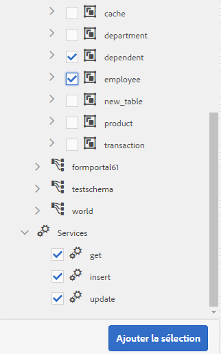

   Objets et services de modèle de données sélectionnés

   L’onglet **[!UICONTROL Modèle]** affiche une représentation graphique de tous les objets de modèle de données et de leurs propriétés ajoutés au modèle de données de formulaire (FDM). Chaque objet de modèle de données est représenté par une case dans le modèle de données de formulaire (FDM).

   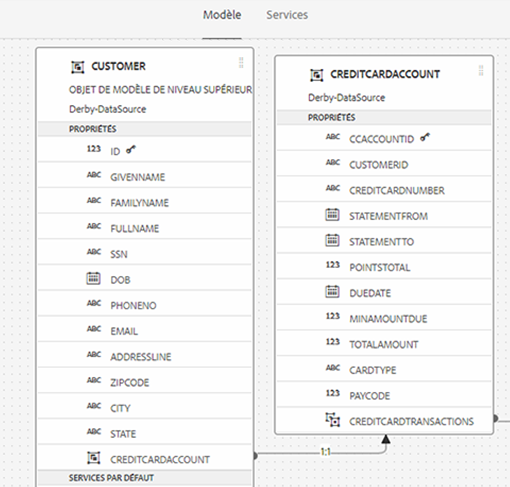

   L’onglet **[!UICONTROL Modèle]** affiche les objets de modèle de données ajoutés

   >[!NOTE]
   >
   >Vous pouvez appuyer sur des zones d’objet de modèle de données et les faire glisser pour les organiser dans la zone de contenu. Tous les objets de modèle de données ajoutés dans le modèle de données de formulaire (FDM) sont grisés dans le volet Sources de données.

   L’onglet **[!UICONTROL Services]** répertorie les services ajoutés.

   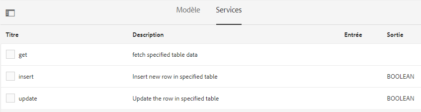

   L’onglet **[!UICONTROL Services]** affiche les services de modèle de données

   >[!NOTE]
   >
   >En plus des objets et services de modèle de données, le document de métadonnées de service OData inclut des propriétés de navigation qui définissent l’association entre deux objets de modèle de données. Pour plus d’informations, voir [Utilisation des propriétés de navigation des services OData](#work-with-navigation-properties-of-odata-services).

1. Sélectionnez **[!UICONTROL Enregistrer]** pour enregistrer l’objet de modèle de formulaire.

   >[!NOTE]
   >
   >Vous pouvez appeler les services que vous avez configurés dans l’onglet Services d’un modèle de données de formulaire (FDM) à l’aide des règles de formulaire adaptatif. Les services configurés sont disponibles dans l’action Appeler les services de l’éditeur de règles. Pour plus d’informations sur l’utilisation de ces services dans des règles de formulaire adaptatif, voir les règles Appeler des services et Définir la valeur des règles dans l’[éditeur de règles](rule-editor.md).

## Création des objets de modèle de données et des propriétés enfant {#create-data-model-objects-and-child-properties}

### Création des objets de modèle de données {#create-data-model-objects}

Vous pouvez ajouter des objets de modèle de données à partir de sources de données configurées et vous pouvez également créer des objets ou des entités de modèle de données sans sources de données. Cela s’avère particulièrement utile si vous n’avez pas configuré de sources de données dans le modèle de données de formulaire (FDM).

Pour créer un objet de modèle de données sans sources de données :

1. Connectez-vous à l’instance d’auteur [!DNL Experience Manager], accédez à **[!UICONTROL Forms > Intégrations de données]** et ouvrez le modèle de données de formulaire (FDM) dans lequel vous souhaitez créer un objet ou une entité de modèle de données.
1. Sélectionnez **[!UICONTROL Créer une entité]**.
1. Dans la boîte de dialogue [!UICONTROL Créer un modèle de données], spécifiez un nom pour l’objet de modèle de données et sélectionnez **[!UICONTROL Ajouter]**. Un objet de modèle de données est ajouté au modèle de données de formulaire (FDM). L’objet de modèle de données ajouté n’est pas lié à une source de données et n’a aucune propriété comme indiqué dans l’image suivante.

   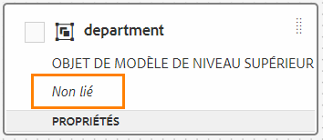

Ensuite, vous pouvez ajouter des propriétés enfant dans des objets de modèle de données non liés.

### Ajout des propriétés enfant {#child-properties}

L’éditeur de modèle de données de formulaire vous permet de créer des propriétés enfants dans un objet de modèle de données. Lors de sa création, la propriété n’est liée à aucune propriété dans une source de données. Vous pouvez ensuite lier la propriété enfant à une autre propriété dans l’objet de modèle de données conteneur.

Pour créer une propriété enfant :

1. Dans un modèle de données de formulaire, sélectionnez un objet de modèle de données puis **[!UICONTROL Créer une propriété enfant]**.
1. Dans la boîte de dialogue **[!UICONTROL Créer une propriété enfant]**, spécifiez un nom et un type de données pour la propriété dans les champs **[!UICONTROL Nom]** et **[!UICONTROL Type]**, respectivement. Vous avez la possibilité d’indiquer un titre et une description pour la propriété.
1. Activez Calculé si la propriété est une propriété calculée. La valeur d’une propriété calculée est évaluée en fonction d’une règle ou d’une expression. Pour plus d’informations, voir [Modifier les propriétés](#properties).
1. Si l’objet de modèle de données est lié à une source de données, la propriété enfant ajoutée est automatiquement liée à la propriété de l’objet de modèle de données parent avec le même nom et le même type de données.

   Pour lier manuellement une propriété enfant à une propriété d’objet de modèle de données, sélectionnez l’icône de navigation en regard du champ **[!UICONTROL Référence de liaison]**. La boîte de dialogue **[!UICONTROL Sélection d’objet]** répertorie toutes les propriétés de l’objet modèle de données parent. Sélectionnez une propriété puis l’icône en forme de coche. Notez que vous pouvez uniquement sélectionner une propriété du même type de données que la propriété enfant.

1. Sélectionnez **[!UICONTROL Done]** (Terminé) pour enregistrer la propriété enfant et **[!UICONTROL Save]** (Enregistrer) pour enregistrer le modèle de données de formulaire (FDM). La propriété enfant est maintenant ajoutée à l’objet de modèle de données.

Après avoir créé des objets et des propriétés de modèle de données, vous pouvez continuer à créer le Forms adaptatif <!--and interactive communications--> en fonction du modèle de données de formulaire (FDM). Par la suite, lorsque des sources de données sont disponibles et configurées, vous pouvez lier le modèle de données de formulaire (FDM) à des sources de données. La liaison est automatiquement mise à jour dans les formulaires adaptatifs <!--and interactive communications--> associés. Pour plus d’informations sur la création d’un Forms adaptatif <!--and interactive communications--> à l’aide du modèle de données de formulaire (FDM), voir [&#x200B; Utilisation du modèle de données de formulaire](using-form-data-model.md).

### Liaison des objets et des propriétés de modèle de données {#bind-data-model-objects-and-properties}

Lorsque les sources de données que vous souhaitez intégrer au modèle de données de formulaire (FDM) sont disponibles, vous pouvez les ajouter au modèle de données de formulaire (FDM) comme décrit dans la section [Mettre à jour les sources de données](create-form-data-models.md#update). Ensuite, procédez comme suit pour lier les objets et propriétés de modèle de données non liés :

1. Dans le modèle de données de formulaire, sélectionnez la source de données non liée que vous souhaitez lier à une source de données.
1. Sélectionnez **[!UICONTROL Modifier les propriétés]**.
1. Dans le volet **[!UICONTROL Modifier les propriétés]**, sélectionnez l’icône de navigation en regard du champ **[!UICONTROL Liaison]**. Elle ouvre la boîte de dialogue **[!UICONTROL Sélectionner l’objet]** qui répertorie les sources de données ajoutées dans le modèle de données de formulaire (FDM).

   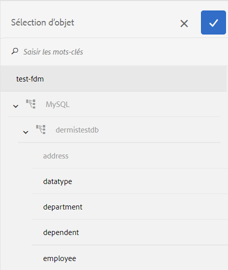

1. Développez l’arborescence des sources de données, sélectionnez un objet de modèle de données à lier puis l’icône en forme de coche.
1. Sélectionnez **[!UICONTROL Terminé]** pour enregistrer les propriétés, puis sélectionnez **[!UICONTROL Enregistrer]** pour enregistrer le modèle de données du formulaire. L’objet de modèle de données est maintenant lié à une source de données. Notez que l’objet de modèle de données n’est plus marqué comme Non lié.

   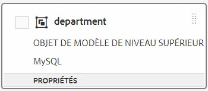

## Configuration des services {#configure-services}

Pour lire et écrire des données pour un objet de modèle de données, procédez comme suit pour configurer les services en lecture et en écriture :

1. Cochez la case en haut d’un objet de modèle de données pour le sélectionner et sélectionnez **[!UICONTROL Modifier les propriétés]**.

   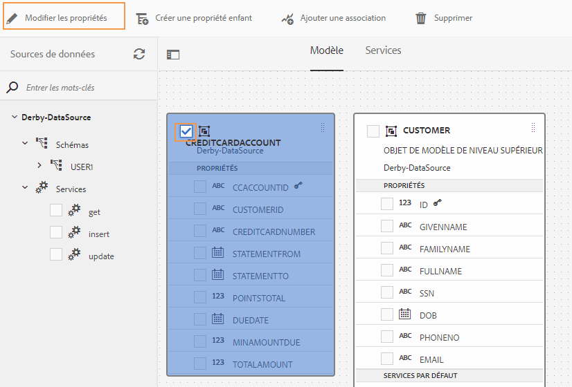

   Modification des propriétés pour configurer les services de lecture et d’écriture pour un objet de modèle de données

   La boîte de dialogue [!UICONTROL Modifier les propriétés] s’ouvre.

   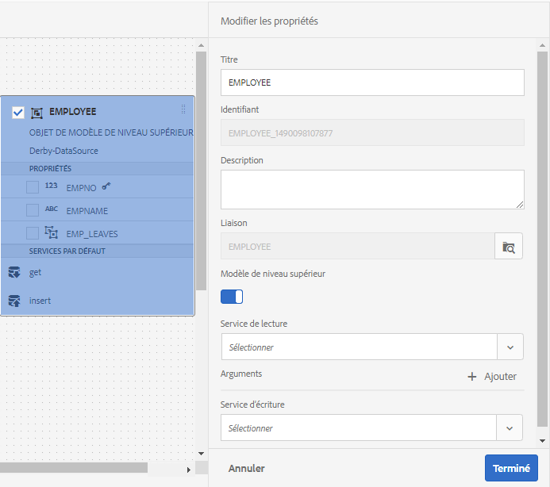

   Boîte de dialogue Modifier les propriétés

   >[!NOTE]
   >
   >En plus des objets et services de modèle de données, le document de métadonnées de service OData inclut des propriétés de navigation qui définissent l’association entre deux objets de modèle de données. Lorsque vous ajoutez une source de données de service OData à un modèle de données de formulaire (FDM), un service est disponible dans Form Data Model (FDM) pour toutes les propriétés de navigation d’un objet de modèle de données. Vous pouvez utiliser ce service pour lire les propriétés de navigation de l’objet de modèle de données correspondant.
   >
   >
   >Pour plus d’informations sur l’utilisation du service, voir [Utilisation des propriétés de navigation des services OData](#work-with-navigation-properties-of-odata-services).

1. Activez/désactivez **[!UICONTROL Objet de niveau supérieur]** pour spécifier si l’objet de modèle de données est un objet de modèle de niveau supérieur.

   Les objets de modèle de données configurés dans un modèle de données de formulaire (FDM) peuvent être utilisés dans l’onglet Objets de modèle de données de l’explorateur de contenu d’un formulaire adaptatif basé sur le modèle de données de formulaire (FDM). Lorsque vous ajoutez une association entre deux objets de modèle de données, l’objet de modèle de données à associer est imbriqué sous l’objet de modèle de données auquel vous l’associez dans l’onglet **[!UICONTROL Objets de modèle de données]**. Si le modèle de données imbriqué est un objet de niveau supérieur, il apparaît également séparément dans l’onglet **[!UICONTROL Objets de modèle de données]**. Par conséquent, vous en voyez deux entrées, l’une à l’intérieur et l’autre à l’extérieur de la hiérarchie imbriquée, ce qui pourrait perturber les auteurs de formulaires. Pour que l’objet de modèle de données associé apparaisse uniquement dans la hiérarchie imbriquée, désactivez la propriété Objet de niveau supérieur.

1. Sélectionnez les services de lecture et d’écriture pour les objets de modèle de données sélectionnés. Les arguments pour les services apparaissent.

   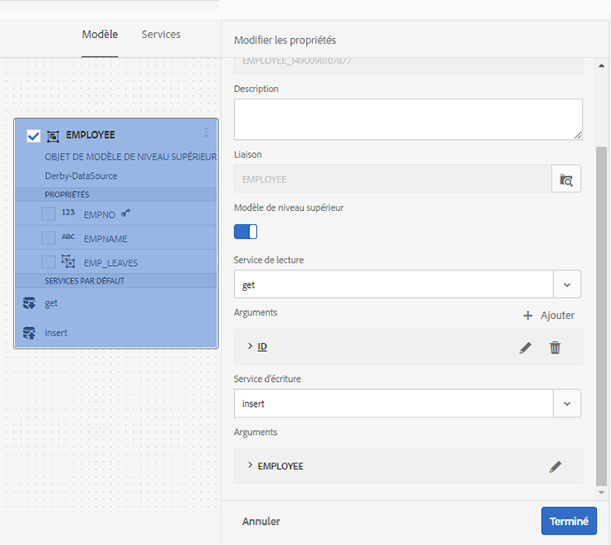

   Services de lecture et d’écriture configurés pour la source de données des employés

1. Sélectionnez  pour l’argument de service de lecture afin de [lier l’argument à une valeur Attribut du profil utilisateur, Attribut de requête ou Littéral](#bindargument) et spécifiez la valeur de liaison.
1. Sélectionnez **[!UICONTROL Done]** pour enregistrer l’argument, **[!UICONTROL Done]** pour enregistrer les propriétés, puis **[!UICONTROL Save]** pour enregistrer le modèle de données de formulaire (FDM).

### Liaison des arguments du service de lecture {#bindargument}

Liez l’argument du service de lecture à une valeur Attribut du profil utilisateur, Attribut de requête ou Littéral en fonction d’une valeur de liaison. La valeur est transmise au service en tant qu’argument pour récupérer les détails associés à la valeur spécifiée à partir de la source de données.

#### Valeur Littéral {#literal-value}

Sélectionnez **[!UICONTROL Littéral]** dans le menu déroulant **[!UICONTROL Liaison à]** et entrez une valeur dans le champ **[!UICONTROL Valeur de liaison]**. Les détails associés à la valeur sont récupérés à partir de la source de données. Utilisez cette option pour récupérer les détails associés à une valeur statique.

Dans cet exemple, les détails associés à **4367655678**, en tant que valeur de l’argument `mobilenum`, sont récupérés à partir de la source de données. Les détails associés, si vous transmettez la valeur d’un argument de numéro de mobile, peuvent inclure des propriétés telles que le nom du client, l’adresse du client et la ville.

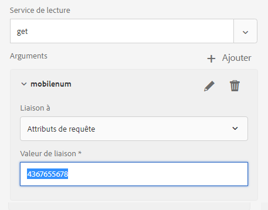

#### Attribut du profil utilisateur {#user-profile-attribute}

Sélectionnez **[!UICONTROL Attribut du profil utilisateur]** dans le menu déroulant **[!UICONTROL Liaison à]** et saisissez le nom de l’attribut dans le champ **[!UICONTROL Valeur de liaison]**. Les détails de l’utilisateur connecté à l’instance [!DNL Experience Manager] sont récupérés à partir de la source de données en fonction du nom de l’attribut.

Le nom d’attribut spécifié dans le champ **[!UICONTROL Valeur de liaison]** doit inclure le chemin de liaison complet jusqu’au nom d’attribut de l’utilisateur. Ouvrez l’URL suivante pour accéder aux détails de l’utilisateur sur CRXDE :

`https://[server-name]:[port]/crx/de/index.jsp#/home/users/`

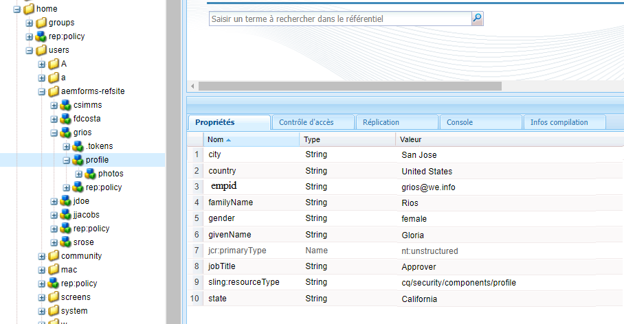

Dans cet exemple, spécifiez `profile.empid` dans le champ **[!UICONTROL Valeur de liaison]** de l’utilisateur `grios`.

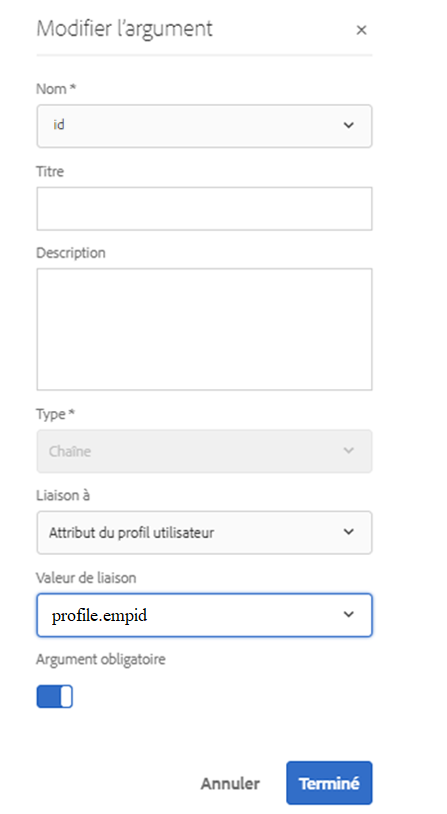

L’argument `id` prend la valeur de l’attribut `empid` du profil utilisateur et le transmet en tant qu’argument au service de lecture. Il lit et renvoie les valeurs des propriétés associées à partir de l’objet de modèle de données de l’employé pour le `empid` associé à l’utilisateur connecté.

#### Attribut de requête {#request-attribute}

Utilisez l’attribut de requête pour récupérer les propriétés associées à partir de la source de données.

1. Sélectionnez **[!UICONTROL Attribut de requête]** dans le menu déroulant **[!UICONTROL Liaison à]** et saisissez le nom de l’attribut dans le champ **[!UICONTROL Valeur de liaison]**.

1. Créez une [superposition](https://experienceleague.adobe.com/docs/experience-manager-cloud-service/implementing/developing/full-stack/overlays.html?lang=fr#developing) pour head.jsp. Pour créer la superposition, ouvrez CRX DE et copiez le fichier `https://<server-name>:<port number>/crx/de/index.jsp#/libs/fd/af/components/page2/afStaticTemplatePage/head.jsp` dans `https://<server-name>:<port number>/crx/de/index.jsp#/apps/fd/af/components/page2/afStaticTemplatePage/head.jsp`

   >[!NOTE]
   >
   > * Si vous utilisez un modèle statique, superposez le fichier head.jsp à l’adresse suivante :
   >   `/libs/fd/af/components/page2/afStaticTemplatePage/head.jsp`
   > * Si vous utilisez un modèle modifiable, superposez le fichier aftemplatedpage.jsp à l’adresse suivante :
   >   `/libs/fd/af/components/page2/aftemplatedpage/aftemplatedpage.jsp`

1. Définissez [!DNL paramMap] pour l’attribut de requête. Par exemple, incluez le code suivant dans le fichier .jsp du dossier des applications :

   ```javascript
   <%Map paraMap = new HashMap();
    paraMap.put("<request_attribute>",request.getParameter("<request_attribute>"));
    request.setAttribute("paramMap",paraMap);
   ```

   Par exemple, utilisez le code ci-suivant pour récupérer la valeur de petid à partir de la source de données :


   ```javascript
   <%Map paraMap = new HashMap();
   paraMap.put("petId",request.getParameter("petId"));
   request.setAttribute("paramMap",paraMap);%>
   ```

Les détails sont récupérés à partir de la source de données en fonction du nom d’attribut spécifié dans la requête.

Par exemple, la spécification de l’attribut en tant que `petid=100` dans la requête extrait les propriétés associées à la valeur d’attribut de la source de données.

## Ajout des associations {#add-associations}

Généralement, des associations sont créées entre des objets de modèle de données dans une source de données. L’association peut lier un objet à un ou plusieurs objets. Par exemple, plusieurs personnes à charge peuvent être associées à un employé ou une employée. Il s’agit d’une association d’un objet à plusieurs objets, désignée par `1:n` sur la ligne reliant les objets de modèle de données associés. Toutefois, si une association renvoie un nom d’employé unique pour un ID d’employé donné, elle est appelée association un-à-un.

Lorsque vous ajoutez des objets de modèle de données associés dans une source de données à un modèle de données de formulaire (FDM), leurs associations sont conservées et affichées comme connectées par des lignes de flèche. Vous pouvez ajouter des associations entre des objets de modèle de données dans des sources de données disparates dans un modèle de données de formulaire (FDM).

>[!NOTE]
>
>Les associations prédéfinies dans une source de données JDBC ne sont pas conservées dans le modèle de données de formulaire (FDM). Vous devez les créer manuellement.

Pour ajouter une association :

1. Cochez la case en haut d’un objet de modèle de données pour le sélectionner et sélectionnez **[!UICONTROL Ajouter une association]**. La boîte de dialogue Ajouter une association s’ouvre.

   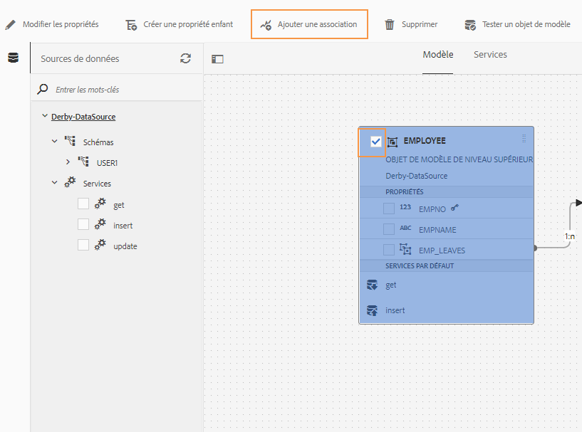

   >[!NOTE]
   >
   >En plus des objets et services de modèle de données, le document de métadonnées de service OData inclut des propriétés de navigation qui définissent l’association entre deux objets de modèle de données. Vous pouvez utiliser ces propriétés de navigation lors de l’ajout d’associations dans Form Data Model (FDM). Pour plus d’informations, voir [Utilisation des propriétés de navigation des services OData](#work-with-navigation-properties-of-odata-services).

   La boîte de dialogue [!UICONTROL Ajouter une association] s’ouvre.

   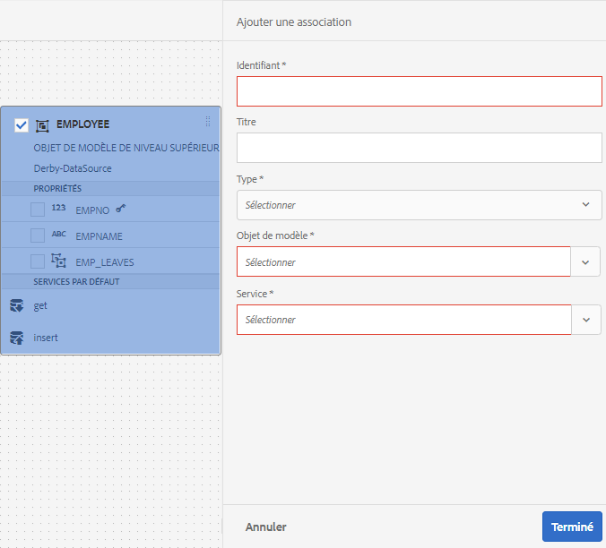

   Boîte de dialogue Ajouter une association

1. Dans le volet Ajouter une association :

   * Spécifiez un titre pour l’association.
   * Sélectionnez le type d’association : **[!UICONTROL un à un]** ou **[!UICONTROL un à plusieurs]**.
   * Sélectionnez l’objet de modèle de données à associer.
   * Sélectionnez le service de lecture pour lire les données de l’objet de modèle sélectionné. L’argument de service de lecture s’affiche. Modifiez l’argument, si nécessaire, et liez-le à la propriété de l’objet de modèle de données à associer.

   Dans l’exemple suivant, l’argument par défaut pour le service de lecture de l’objet de modèle de données Personnes à charge est `dependentid`.

   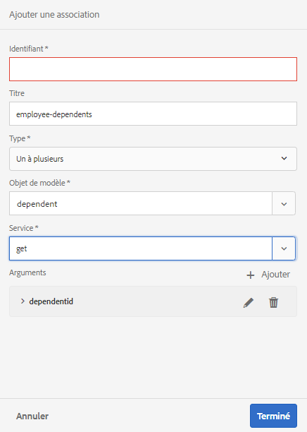

   L’argument par défaut pour le service de lecture Personnes à charge est dependentid

   Toutefois, l’argument doit être une propriété commune entre l’objet de modèle de données associé, qui est `Employeeid` dans cet exemple. Par conséquent, l’argument `Employeeid` doit être lié à la propriété `id` de l’objet de modèle de données Employé pour extraire les détails des personnes à charge associés de l’objet de modèle de données Personnes à charge.

   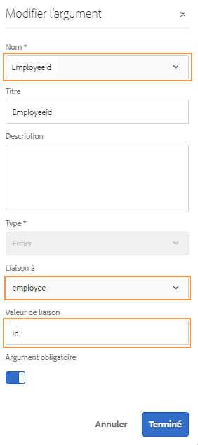

   Argument mis à jour et liaison

   Sélectionnez **[!UICONTROL Terminé]** pour enregistrer l’argument.

1. Sélectionnez **[!UICONTROL Done]** (Terminé) pour enregistrer l’association, puis **[!UICONTROL Save]** (Enregistrer) pour enregistrer le modèle de données de formulaire (FDM).
1. Répétez les étapes pour créer plus d’associations si nécessaire.

>[!NOTE]
>
>L’association ajoutée apparaît dans la zone d’objet de modèle de données avec le titre spécifié et une ligne reliant les objets de modèle de données associés.
>
>Vous pouvez modifier une association en cochant la case correspondante et en sélectionnant **[!UICONTROL Modifier l’association]**.

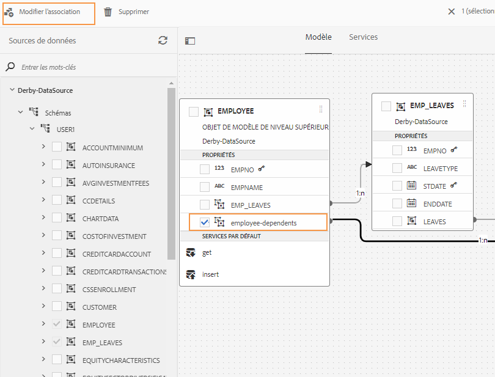

## Modification des propriétés {#properties}

Vous pouvez modifier les propriétés des objets de modèle de données, leurs propriétés et les services ajoutés dans le modèle de données de formulaire (FDM).

Pour modifier les propriétés :

1. Cochez la case en regard d’un objet de modèle de données, d’une propriété ou d’un service dans le modèle de données de formulaire (FDM).
1. Sélectionnez **[!UICONTROL Modifier les propriétés]**. Le volet **[!UICONTROL Modifier les propriétés]** de l’objet de modèle, de la propriété ou du service sélectionné s’ouvre.

   * **[!UICONTROL Objet de modèle de données]** : spécifiez les services de lecture et d’écriture et modifiez les arguments.
   * **[!UICONTROL Propriété]** : spécifiez le type, le sous-type et le format de la propriété. Vous pouvez également spécifier si la propriété sélectionnée est la clé principale de l’objet de modèle de données.
   * **[!UICONTROL Service]** : spécifiez l’objet de modèle d’entrée, le type de sortie et les arguments du service. Pour un service Get, vous pouvez spécifier s’il doit renvoyer un tableau.

     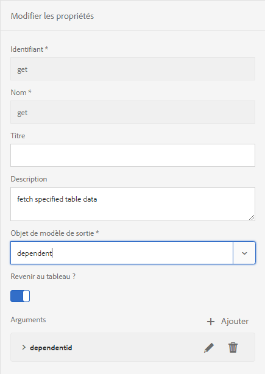

   Boîte de dialogue Modifier les propriétés pour un service Get

1. Sélectionnez **[!UICONTROL Done]** (Terminé) pour enregistrer les propriétés, puis **[!UICONTROL Save]** (Enregistrer) pour enregistrer le modèle de données de formulaire (FDM).

### Créer des propriétés calculées {#computed}

Une propriété calculée est celle dont la valeur est calculée sur la base d’une règle ou d’une expression. Une règle vous permet de définir la valeur d’une propriété calculée sur une chaîne littérale, un nombre, le résultat d’une expression mathématique ou la valeur d’une autre propriété dans le modèle de données de formulaire (FDM).

Par exemple, vous pouvez créer une propriété calculée **FullName** dont la valeur est le résultat de la concaténation des propriétés existantes **FirstName** et **LastName**. Pour ce faire :

1. Créez une nouvelle propriété nommée `FullName` dont le type de données est Chaîne.
1. Activez **[!UICONTROL Calculé]** et sélectionnez **[!UICONTROL Terminé]** pour créer la propriété.

   

   La propriété calculée FullName est créée. Identifiez l’icône en regard de la propriété comme illustration d’une propriété calculée.

   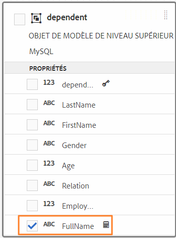

1. Sélectionnez la propriété FullName puis **[!UICONTROL Modifier la règle]**. Une fenêtre Éditeur de règles s’ouvre.
1. Dans la fenêtre Éditeur de règles, sélectionnez **[!UICONTROL Créer]**. Une fenêtre de règles **[!UICONTROL Définir la valeur]** s’ouvre.

   Dans la liste déroulante Sélectionner une option, sélectionnez **[!UICONTROL Expression mathématique]**. Les autres options disponibles sont **[!UICONTROL Objet de modèle de données de formulaire]** et **[!UICONTROL Chaîne]**.

1. Dans l’expression mathématique, sélectionnez **[!UICONTROL FirstName]** et **[!UICONTROL LastName]** dans les premier et second objets, respectivement. Sélectionnez **[!UICONTROL plus]** en tant qu’opérateur.

   Sélectionnez **[!UICONTROL Terminé]**, puis **[!UICONTROL Fermer]** pour fermer la fenêtre de l’éditeur de règles. La règle se présente comme suit :

   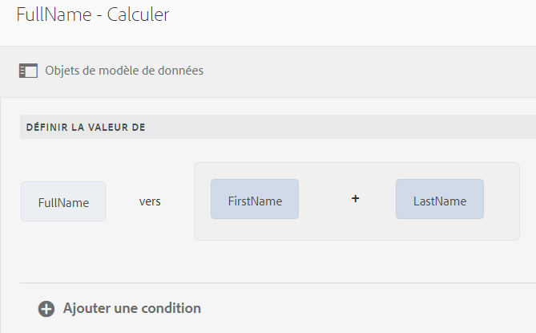

1. Sur le modèle de données de formulaire (FDM), sélectionnez **[!UICONTROL Enregistrer]**. La propriété calculée est configurée.

## Utilisation des propriétés de navigation des services OData {#work-with-navigation-properties-of-odata-services}

Dans les services OData, les propriétés de navigation sont utilisées pour définir des associations entre deux objets de modèle de données. Ces propriétés sont définies sur un type d’entité ou un type complexe. Par exemple, dans l’extrait suivant du fichier de métadonnées des exemples de services OData [TripPin](https://www.odata.org/blog/trippin-new-odata-v4-sample-service/), l’entité de personne contient trois propriétés de navigation : Friends, BestFriend et Trips.

Pour plus d’informations sur les propriétés de navigation, voir la [documentation OData](https://docs.oasis-open.org/odata/odata/v4.0/errata03/os/complete/part3-csdl/odata-v4.0-errata03-os-part3-csdl-complete.html#_Toc453752536).

```xml
<edmx:Edmx xmlns:edmx="https://docs.oasis-open.org/odata/ns/edmx" Version="4.0">
<script/>
<edmx:DataServices>
<Schema xmlns="https://docs.oasis-open.org/odata/ns/edm" Namespace="Microsoft.OData.Service.Sample.TrippinInMemory.Models">
<EntityType Name="Person">
<Key>
<PropertyRef Name="UserName"/>
</Key>
<Property Name="UserName" Type="Edm.String" Nullable="false"/>
<Property Name="FirstName" Type="Edm.String" Nullable="false"/>
<Property Name="LastName" Type="Edm.String"/>
<Property Name="MiddleName" Type="Edm.String"/>
<Property Name="Gender" Type="Microsoft.OData.Service.Sample.TrippinInMemory.Models.PersonGender" Nullable="false"/>
<Property Name="Age" Type="Edm.Int64"/>
<Property Name="Emails" Type="Collection(Edm.String)"/>
<Property Name="AddressInfo" Type="Collection(Microsoft.OData.Service.Sample.TrippinInMemory.Models.Location)"/>
<Property Name="HomeAddress" Type="Microsoft.OData.Service.Sample.TrippinInMemory.Models.Location"/>
<Property Name="FavoriteFeature" Type="Microsoft.OData.Service.Sample.TrippinInMemory.Models.Feature" Nullable="false"/>
<Property Name="Features" Type="Collection(Microsoft.OData.Service.Sample.TrippinInMemory.Models.Feature)" Nullable="false"/>
<NavigationProperty Name="Friends" Type="Collection(Microsoft.OData.Service.Sample.TrippinInMemory.Models.Person)"/>
<NavigationProperty Name="BestFriend" Type="Microsoft.OData.Service.Sample.TrippinInMemory.Models.Person"/>
<NavigationProperty Name="Trips" Type="Collection(Microsoft.OData.Service.Sample.TrippinInMemory.Models.Trip)"/>
</EntityType>
```

Lorsque vous configurez un service OData dans un modèle de données de formulaire (FDM), toutes les propriétés de navigation d’un conteneur d’entités sont mises à disposition via un service dans le modèle de données de formulaire (FDM). Dans cet exemple de service OData TripPin, les trois propriétés de navigation dans le conteneur d’entités `Person` peuvent être lues à l’aide d’un service `GET LINK` dans le modèle de données de formulaire (FDM).

L’exemple suivant met en évidence le service `GET LINK of Person /People` dans le modèle de données de formulaire (FDM), qui est un service combiné pour les trois propriétés de navigation dans l’entité `Person` du service OData TripPin.

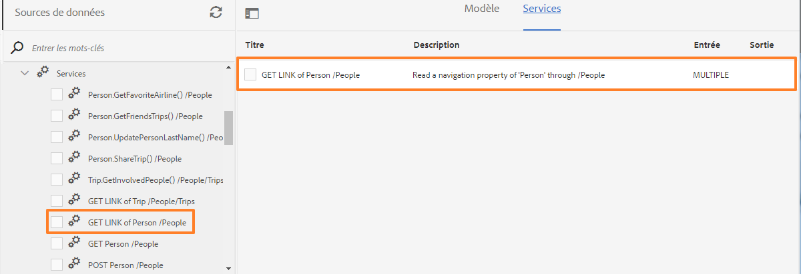

Une fois que vous avez ajouté le service `GET LINK` à l’onglet Services dans le modèle de données de formulaire (FDM), vous pouvez modifier les propriétés pour choisir l’objet de modèle de sortie et la propriété de navigation à utiliser dans le service. Par exemple, le service `GET LINK of Person /People` dans l’exemple suivant utilise Trip comme objet de modèle de sortie et la propriété de navigation Trips.


>[!NOTE]
>
>Les valeurs disponibles dans le champ **[!UICONTROL Valeur par défaut]** de l’argument **NavigationPropertyName** dépendent de l’état du bouton bascule **[!UICONTROL Revenir au tableau ?Bouton bascule]**. Lorsqu’il est activé, il affiche les propriétés de navigation du type Collection.

Dans cet exemple, vous pouvez également choisir l’objet de modèle de sortie Person et l’argument de propriété de navigation Friends ou BestFriend (selon que **[!UICONTROL Revenir au tableau ?]** est activé ou désactivé).

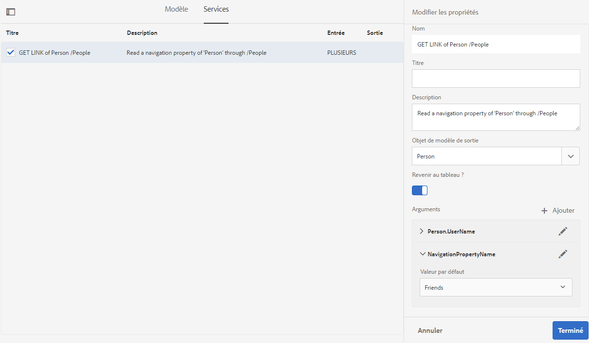

De même, vous pouvez choisir un service `GET LINK` et configurer ses propriétés de navigation lors de l’ajout d’associations dans le modèle de données de formulaire (FDM). Toutefois, pour pouvoir sélectionner une propriété de navigation, assurez-vous que le champ **[!UICONTROL Liaison à]** est défini sur **[!UICONTROL Littéral]**.

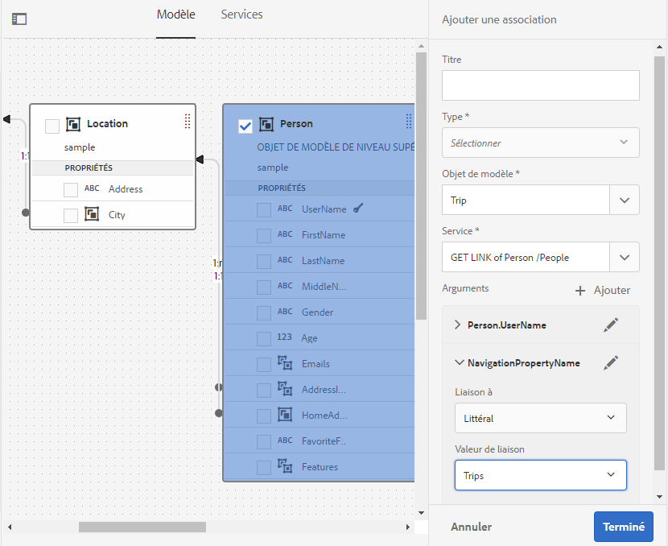

## Génération et modification des exemples de données {#sample}

L’éditeur de modèle de données de formulaire (FDM) vous permet de générer des données d’exemple pour toutes les propriétés d’objet de modèle de données, y compris les propriétés calculées, dans un modèle de données de formulaire (FDM). Il s’agit d’un ensemble de valeurs aléatoires conformes au type de données configuré pour chaque propriété. Vous pouvez également modifier et enregistrer des données qui sont conservées même si vous régénérez les données d’exemple.

Procédez comme suit pour générer et modifier des exemples de données :

1. Ouvrez un modèle de données de formulaire (FDM) et sélectionnez **[!UICONTROL Modifier les exemples de données]**. Cela génère et affiche les exemples de données dans la fenêtre Modifier les exemples de données.

   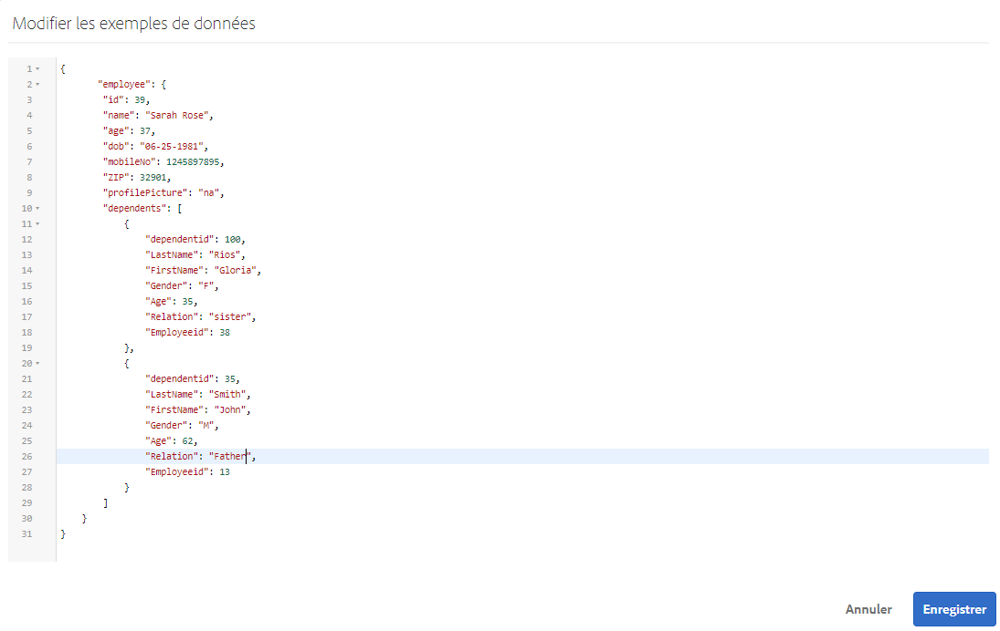

1. Dans la fenêtre **[!UICONTROL Modifier les données d’exemple]**, modifiez les données, si nécessaire, et sélectionnez **[!UICONTROL Enregistrer]**.

<!--Next, you can use the sample data to prefill and test interactive communications based on the form data model. For more information, see [Use form data model](using-form-data-model.md).-->

## Test des objets et des services de modèle de données {#test-data-model-objects-and-services}

Votre modèle de données de formulaire (FDM) est configuré, mais avant de le mettre en service, vous pouvez tester si les objets et services de modèle de données configurés fonctionnent comme prévu. Pour tester les objets et les services de modèle de données :

1. Sélectionnez un objet ou un service de modèle de données dans le modèle de données de formulaire (FDM) et sélectionnez respectivement **[!UICONTROL Objet de modèle de test]** ou **[!UICONTROL Service de test]**.

   La fenêtre Tester le modèle de données de formulaire s’ouvre.

   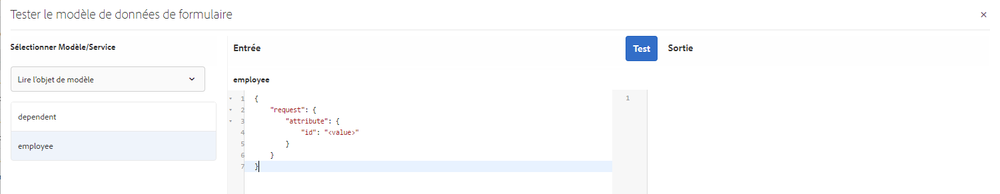

1. Dans la fenêtre [!UICONTROL Tester le modèle de données de formulaire], sélectionnez l’objet ou le service de modèle de données à tester dans le volet de saisie.

1. Indiquez une valeur d’argument dans le code de test et sélectionnez **[!UICONTROL Tester]**. Un test réussi renvoie la sortie dans le volet Sortie.

   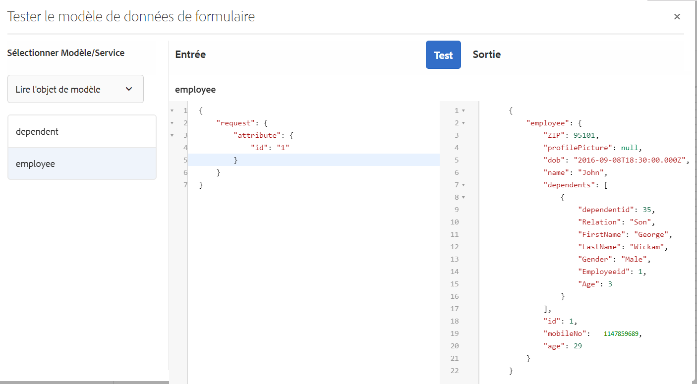

De même, vous pouvez tester d’autres objets et services de modèle de données dans le modèle de données de formulaire (FDM).

## Validation automatisée des données d’entrée {#automated-validation-of-input-data}

Le modèle de données de formulaire (FDM) valide les données reçues en tant qu’entrée lors de l’appel de l’API DermisBridge (en fonction des critères de validation disponibles dans le modèle de données de formulaire). La validation est basée sur l’indicateur `ValidationOptions` défini dans l’objet de requête utilisé pour appeler l’API.

L’indicateur peut être défini sur l’une des valeurs suivantes :

* **FULL** : FDM effectue la validation en fonction de toutes les contraintes.
* **OFF** : aucune validation.
* **BASIC** : FDM effectue la validation en fonction des contraintes « required » et « nullable »

Si aucune valeur n’est définie pour l’indicateur `ValidationOptions`, la validation **BASIC** est effectuée sur les données d’entrée.

Voici un exemple de définition de l’indicateur de validation sur **FULL** :

```java
operationOptions.setValidationOptions(ValidationOptions.FULL);
```

>[!NOTE]
>
>La valeur que vous fournissez pour un attribut dans les données d’entrée doit correspondre au type de données défini pour l’attribut dans le document de métadonnées.\
>Si la valeur ne correspond pas au type de données défini pour l’attribut, l’API DermisBridge affiche une exception quelle que soit la valeur de l’indicateur `ValidationOptions`. Si le niveau de journal est défini sur Débogage, une erreur est consignée dans le fichier **error.log**.

Le modèle de données de formulaire (FDM) valide les données d’entrée en fonction d’une liste de contraintes de type de données. La liste des contraintes pour les données d’entrée peut varier en fonction de la source de données.

Le tableau suivant répertorie les contraintes des données d’entrée en fonction de la source de données :

<table>
 <tbody> 
  <tr> 
   <td>Contraintes</td> 
   <td>Description</td> 
   <td>Source de données d’entrée</td> 
  </tr> 
  <tr> 
   <td>required</td> 
   <td>Si la valeur est true, le paramètre doit être inclus dans les données d’entrée.</td> 
   <td>Swagger, WSDL et base de données</td> 
  </tr> 
  <tr> 
   <td>nullable</td> 
   <td>Si la valeur est true, la valeur du paramètre peut être définie sur Null dans les données d’entrée.</td> 
   <td>WSDL, Odata et base de données</td> 
  </tr> 
  <tr> 
   <td>maximum</td> 
   <td>Spécifie la limite supérieure pour les valeurs numériques. La valeur maximale spécifiée comme limite supérieure peut également être affectée au paramètre dans les données d’entrée.</td> 
   <td>Swagger et WSDL</td> 
  </tr> 
  <tr> 
   <td>minimum</td> 
   <td>Définit la limite inférieure pour les valeurs numériques. La valeur minimale spécifiée comme limite inférieure peut également être affectée au paramètre dans les données d’entrée.</td> 
   <td>Swagger et WSDL</td> 
  </tr> 
  <tr> 
   <td>exclusiveMaximum</td> 
   <td>Spécifie la limite supérieure pour les valeurs numériques. La valeur maximale spécifiée comme limite supérieure ne doit pas être affectée au paramètre dans les données d’entrée.</td> 
   <td>Swagger et WSDL</td> 
  </tr> 
  <tr> 
   <td>exclusiveMinimum</td> 
   <td>Définit la limite inférieure pour les valeurs numériques. La valeur minimale spécifiée comme limite inférieure ne doit pas être affectée au paramètre dans les données d’entrée.</td> 
   <td>Swagger et WSDL</td> 
  </tr> 
  <tr> 
   <td>minLength</td> 
   <td>Indique la limite inférieure pour le nombre de caractères inclus dans une chaîne. La valeur minimale spécifiée comme limite inférieure peut également être affectée au paramètre dans les données d’entrée.</td> 
   <td>Swagger et WSDL</td> 
  </tr> 
  <tr> 
   <td>maxLength</td> 
   <td>Indique la limite supérieure pour le nombre de caractères inclus dans une chaîne. La valeur maximale spécifiée comme limite supérieure peut également être affectée au paramètre dans les données d’entrée.</td> 
   <td>Swagger, WSDL, Odata et base de données</td> 
  </tr> 
  <tr> 
   <td>pattern</td> 
   <td>Indique une séquence fixe de caractères. La chaîne d’entrée n’est validée avec succès que si les caractères sont conformes au modèle spécifié.</td> 
   <td>Swagger</td> 
  </tr> 
  <tr> 
   <td>minItems</td> 
   <td>Indique le nombre minimum d’éléments dans un tableau. La valeur minimale spécifiée comme limite inférieure peut également être affectée au paramètre dans les données d’entrée.</td> 
   <td>Swagger et WSDL</td> 
  </tr> 
  <tr> 
   <td>maxItems</td> 
   <td>Indique le nombre maximum d’éléments dans un tableau. La valeur maximale spécifiée comme limite supérieure peut également être affectée au paramètre dans les données d’entrée.</td> 
   <td>Swagger et WSDL</td> 
  </tr> 
  <tr> 
   <td>uniqueItems</td> 
   <td>Si la valeur est true, tous les éléments du tableau doivent être uniques dans les données d’entrée.</td> 
   <td>Swagger</td> 
  </tr> 
  <tr> 
   <td>enum (chaîne)<br /> <br /> </td> 
   <td>Limite la valeur d’un paramètre dans les données d’entrée à un ensemble fixe de valeurs de chaîne. Il doit s’agir d’un tableau contenant au moins un élément, où chaque élément est unique.</td> 
   <td>Swagger, WSDL et Odata</td> 
  </tr> 
  <tr> 
   <td>enum (nombre)<br /> <br /> </td> 
   <td>Limite la valeur d’un paramètre dans les données d’entrée à un ensemble fixe de valeurs numériques. Il doit s’agir d’un tableau contenant au moins un élément, où chaque élément est unique.</td> 
   <td>WSDL</td> 
  </tr> 
 </tbody> 
</table>

Dans cet exemple, les données d’entrée sont validées en fonction des contraintes maximales, minimales et requises définies dans le fichier Swagger. Les données d’entrée répondent aux critères de validation uniquement si l’ID de commande est présent et que sa valeur est comprise entre 1 et 10.

```json
   parameters: [
   {
   name: "orderId",
   in: "path",
   description: "ID of pet that must be fetched",
   required: true,
   type: "integer",
   maximum: 10,
   minimum: 1,
   format: "int64"
   }
   ]
```

Une exception s’affiche si les données d’entrée ne répondent pas aux critères de validation. Si le niveau de journal est défini sur **Débogage**, une erreur est consignée dans le fichier **error.log**. Par exemple,

```verilog
21.01.2019 17:26:37.411 *ERROR* com.adobe.aem.dermis.core.validation.JsonSchemaValidator {"errorCode":"AEM-FDM-001-044","errorMessage":"Input validations failed during operation execution.","violations":{"/orderId":["numeric instance is greater than the required maximum (maximum: 10, found: 16)"]}}
```

## Étapes suivantes {#next-steps}

Vous disposez d’un modèle de données de formulaire de travail (FDM) prêt à l’emploi dans les processus de Forms adaptatif <!--and interactive communications-->. Pour plus d’informations, voir [Utiliser le modèle de données de formulaire (FDM)](using-form-data-model.md).
