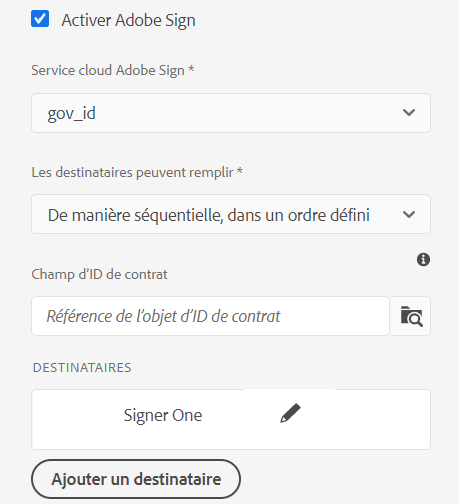
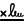
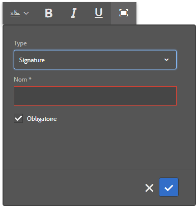
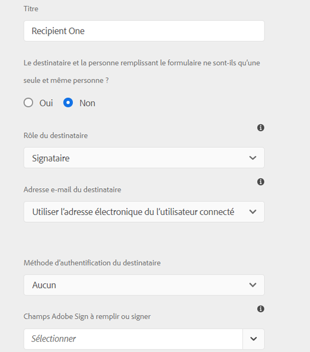
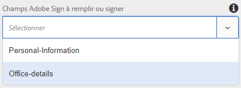
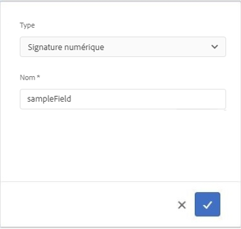

# Utilisation de [!DNL Adobe Sign] dans un formulaire adaptatif {#using-adobe-sign-in-an-adaptive-form}

>[!NOTE]
>
> Adobe recommande d’utiliser la capture de données moderne et extensible [composants principaux](https://experienceleague.adobe.com/docs/experience-manager-core-components/using/adaptive-forms/introduction.html?lang=fr) pour [créer un nouveau Forms adaptatif](/help/forms/creating-adaptive-form-core-components.md) ou [ajouter un Forms adaptatif aux pages AEM Sites](/help/forms/create-or-add-an-adaptive-form-to-aem-sites-page.md). Ces composants représentent une avancée significative dans la création de formulaires adaptatifs, ce qui garantit des expériences utilisateur impressionnantes. Cet article décrit une ancienne approche de création de Forms adaptatif à l’aide de composants de base.


| Version | Lien de l’article |
| -------- | ---------------------------- |
| AEM 6.5 | [Cliquez ici](https://experienceleague.adobe.com/docs/experience-manager-65/forms/adaptive-forms-advanced-authoring/working-with-adobe-sign.html?lang=fr) |
| AEM as a Cloud Service | Cet article |


[!DNL Adobe Sign] permet des processus de signature électronique pour les formulaires adaptatifs. Les signatures électroniques améliorent les processus de traitement des documents pour les services juridiques, commerciaux, des ressources humaines, etc.

Dans un scénario [!DNL Adobe Sign] classique et de formulaires adaptatifs, un utilisateur remplit un formulaire adaptatif pour demander un service qui requiert des signatures d’une ou de plusieurs parties. Par exemple, une demande de prêt hypothécaire et de carte de crédit nécessite des signatures légales de tous les emprunteurs et codemandeurs. Pour activer les processus de signature électronique pour des scénarios similaires, vous pouvez intégrer [!DNL Adobe Sign] à un formulaire adaptatif. Voici quelques autres exemples d’utilisation d’[!DNL Adobe Sign] :

* Vous pouvez établir des contrats à partir de tout appareil à l’aide de processus entièrement automatisés d’offre, de devis et de contrat.
* Vous pouvez exécuter plus rapidement les processus de ressources humaines et offrir à vos employés une expérience digitale plus satisfaisante.
* Vous pouvez réduire considérablement les durées des cycles de mise en œuvre des contrats et intégrer plus rapidement vos fournisseurs.
* Créez des processus numériques pour automatiser les processus courants.

L’intégration d’[!DNL Adobe Sign] à [!DNL AEM Forms] prend en charge les éléments suivants :

* Processus de signature d’utilisateur unique et multiutilisateur
* Processus de signature séquentiels et simultanés
* Signature de formulaires en tant qu’utilisateur anonyme ou connecté
* Processus de signature dynamiques (intégration au workflow [!DNL AEM Forms])
* Authentification par le biais d’une base de connaissances, d’un téléphone, de profils sociaux et d’un ID gouvernement
* Attribuez des rôles à chaque destinataire du contrat. Adobe Sign offre pour les niveaux de service professionnel et entreprise la possibilité d’étendre les [rôles aux destinataires du contrat](#addsignerstoanadaptiveform).

<!-- * In-form and out-of-form signing experiences -->

## Conditions préalables {#prerequisites}

Avant d’utiliser [!DNL Adobe Sign] dans un formulaire adaptatif :

* Vérifiez qu’[!DNL AEM Forms] as a Cloud Service est configuré pour utiliser Adobe Sign. Pour plus de détails, voir [Intégration d’Adobe Sign à [!DNL AEM Forms]](adobe-sign-integration-adaptive-forms.md).
* Gardez la liste des destinataires prête. Vous devez disposer d’au moins une adresse e-mail pour chaque destinataire.

## Configuration d’[!DNL Adobe Sign] pour un formulaire adaptatif {#configure-adobe-sign-for-an-adaptive-form}

Pour configurer [!DNL Adobe Sign] pour un formulaire adaptatif, vous devez effectuer les opérations suivantes :

1. [Activation d’ [!DNL Adobe Sign]  pour un formulaire adaptatif](#enableadobsignforanadaptiveform)
1. [Ajout de champs [!DNL Adobe Sign] à un formulaire adaptatif](#addadobesignfieldstoanadaptiveform)
1. [Sélection d’un service cloud  [!DNL Adobe Sign]  pour un formulaire adaptatif](#select-adobe-sign-cloud-service-and-signing-order)

1. [Ajout d’un destinataire  [!DNL Adobe Sign]  à un formulaire adaptatif](#addsignerstoanadaptiveform)
1. [Sélection d’une action d’envoi pour un formulaire adaptatif](#selectsubmitactionforanadaptiveform)



### Activation d’[!DNL Adobe Sign] pour un formulaire adaptatif  {#enableadobesign}

Vous pouvez activer [!DNL Adobe Sign] pour un formulaire adaptatif existant ou créer un formulaire adaptatif prenant en charge [!DNL Adobe Sign]. Choisissez l’une des méthodes suivantes :

* [Création d’un formulaire adaptatif prenant en charge [!DNL Adobe Sign] &#x200B;](#create-an-adaptive-form-for-adobe-sign)
* [Activation d’ [!DNL Adobe Sign]  pour un formulaire adaptatif existant](#editafsign)

#### Création d’un formulaire adaptatif pour Adobe Sign {#create-an-adaptive-form-for-adobe-sign}

Pour créer un formulaire adaptatif prenant en charge les signatures :

1. Accédez à **[!UICONTROL Adobe Experience Manager]** > **[!UICONTROL Formulaires]** > **[!UICONTROL Formulaires et documents]**.
1. Sélectionnez **[!UICONTROL Créer]** et **[!UICONTROL Formulaire adaptatif]**. Une liste de modèles s’affiche. Sélectionnez un modèle, puis sélectionnez **[!UICONTROL Suivant]**.
1. Dans l’onglet **[!UICONTROL De base]** :

   1. Précisez les **[!UICONTROL Nom]** et **[!UICONTROL Titre]** pour le formulaire adaptatif.

   1. Sélectionnez le [conteneur de configurations](adobe-sign-integration-adaptive-forms.md#configure-adobe-sign-with-aem-forms) créé lors de l’ [!DNL Adobe Sign] intégration d’[&#x200B; à [!DNL AEM Forms]](adobe-sign-integration-adaptive-forms.md).

   Le conteneur de configurations contient les services [!DNL Adobe Sign] Cloud Services configurés pour votre environnement. Ces services peuvent être sélectionnés dans le créateur de formulaires adaptatifs.

1. Dans l’onglet **[!UICONTROL Modèle de formulaire]**, sélectionnez l’une des options suivantes :

   * Si vous disposez d’un modèle de formulaire personnalisé et que vous avez besoin d’un document d’enregistrement basé sur le modèle de formulaire, sélectionnez l’option **[!UICONTROL Associer le modèle de formulaire en tant que modèle de document d’enregistrement]**, puis un modèle de document d’enregistrement. Lorsque vous utilisez cette option, les documents envoyés pour signature n’affichent que les champs basés sur le modèle de formulaire associé. Ils n’affichent pas tous les champs du formulaire adaptatif.

   * Si vous ne disposez pas d’un modèle de formulaire personnalisé, sélectionnez l’option **[!UICONTROL Générer un document d’enregistrement]**. Lorsque vous utilisez cette option, le document envoyé pour signature affiche tous les champs du formulaire adaptatif.

1. Sélectionnez **[!UICONTROL Créer]**. Un formulaire adaptatif prenant en charge les signatures est créé. Vous pouvez y ajouter vos champs [!DNL Adobe Sign] et envoyer le formulaire pour signature.

#### Activation d’[!DNL Adobe Sign] pour un formulaire adaptatif {#editafsign}

Pour utiliser [!DNL Adobe Sign] dans un formulaire adaptatif existant :

1. Accédez à **[!UICONTROL Adobe Experience Manager]** > **[!UICONTROL Formulaires]** > **[!UICONTROL Formulaires et documents]**.
1. Sélectionnez le formulaire adaptatif, puis sélectionnez **[!UICONTROL Propriétés]**.
1. Dans l’onglet **[!UICONTROL De base]**, sélectionnez le [conteneur de configurations](adobe-sign-integration-adaptive-forms.md#configure-adobe-sign-with-aem-forms) créé lors de l’intégration d’[!DNL Adobe Sign] à [!DNL AEM Forms].
1. Dans l’onglet **[!UICONTROL Mode Formulaire]**, sélectionnez l’une des options suivantes :

   * Si vous disposez d’un modèle de formulaire personnalisé et que vous avez besoin d’un document d’enregistrement basé sur le modèle de formulaire, sélectionnez l’option **[!UICONTROL Associer le modèle de formulaire en tant que modèle de document d’enregistrement]**, puis un modèle de document d’enregistrement. Lorsque vous utilisez cette option, les documents envoyés pour signature n’affichent que les champs basés sur le modèle de formulaire associé. Ils n’affichent pas tous les champs du formulaire adaptatif.

   * Si vous ne disposez pas d’un modèle de formulaire personnalisé, sélectionnez l’option **[!UICONTROL Générer un document d’enregistrement]**. Lorsque vous utilisez cette option, le document envoyé pour signature affiche tous les champs du formulaire adaptatif.

1. Sélectionnez **[!UICONTROL Enregistrer et fermer]**. Le formulaire adaptatif est activé pour [!DNL Adobe Sign]. Vous pouvez maintenant y ajouter vos champs [!DNL Adobe Sign] et envoyer le formulaire pour signature.

### Ajout de champs [!DNL Adobe Sign] à un formulaire adaptatif {#addadobesignfieldstoanadaptiveform}

[!DNL Adobe Sign] dispose de plusieurs champs pouvant être placés sur un formulaire adaptatif. Ces champs acceptent divers types de données tels que les signatures, les initiales, la société ou le titre et aident à collecter des informations supplémentaires lors de la signature. Vous pouvez utiliser le composant Bloc [!DNL Adobe Sign] pour placer des champs [!DNL Adobe Sign] à différents endroits dans un formulaire adaptatif.

Pour ajouter des champs à un formulaire adaptatif et personnaliser diverses options liées à ces champs :

1. Faites glisser et déposez le composant **[!UICONTROL Bloc Adobe Sign]** de l’explorateur de composants dans le formulaire adaptatif. Le composant Bloc [!DNL Adobe Sign] dispose de tous les champs [!DNL Adobe Sign] pris en charge. Par défaut, il ajoute un champ **[!UICONTROL Signature]** sur le formulaire adaptatif.

   

   Par défaut, le bloc [!DNL Adobe Sign] n’est pas visible dans le formulaire adaptatif publié. Il est visible uniquement dans les documents de signature. Vous pouvez modifier la visibilité du bloc [!DNL Adobe Sign] dans les propriétés du composant Bloc [!DNL Adobe Sign].

   >[!NOTE]
   >
   > * L’utilisation du bloc [!DNL Adobe Sign] n’est pas obligatoire pour utiliser [!DNL Adobe Sign] dans un formulaire adaptatif. Si vous n’utilisez pas le bloc [!DNL Adobe Sign] et ajoutez des champs pour les destinataires, le champ de signature par défaut est affiché en bas des documents de signature.
   > * Utilisez le bloc [!DNL Adobe Sign] seulement pour les formulaires adaptatifs qui génèrent automatiquement un document d’enregistrement. Si vous utilisez un fichier XDP personnalisé pour générer un document d’enregistrement ou un formulaire adaptatif basé sur un modèle de formulaire, le bloc [!DNL Adobe Sign] n’est pas pris en charge.


1. Sélectionnez le composant **[!UICONTROL Bloc Adobe Sign]** et sélectionnez l’icône **[!UICONTROL Modifier]** . Il affiche des options pour ajouter des champs et mettre en forme l’apparence d’un champ.

   

   **A.** Sélection et ajout de champs [!DNL Adobe Sign]. **B.** Développement du bloc [!DNL Adobe Sign] en mode plein écran

1. Sélectionnez l’icône **[!UICONTROL Champ Adobe Sign]**  . Elle affiche des options permettant de sélectionner et d’ajouter des champs [!DNL Adobe Sign].

   Développez le champ déroulant **[!UICONTROL Type]** pour sélectionner un champ de [!DNL Adobe Sign], puis sélectionnez l’icône Terminé  pour ajouter le champ sélectionné [!DNL Adobe Sign] bloc. Le champ déroulant **[!UICONTROL Type]** comprend les types de champs Signature, Informations du destinataire et Données. Intégration d’[!DNL Adobe Sign] aux champs de prise en charge [!DNL Forms] d’AEM répertoriés dans la liste déroulante [!UICONTROL Type] uniquement. Pour plus d’informations sur les champs [!DNL Adobe Sign], voir la [documentation Adobe Sign](https://helpx.adobe.com/fr/sign/help/field-types.html).

   

   Il est obligatoire de fournir un nom unique pour un champ. Vous pouvez également sélectionner l’option requise pour marquer un champ comme obligatoire. En plus de l’option **[!UICONTROL Nom]** et **[!UICONTROL Obligatoire]**, certains champs [!DNL Adobe Sign] ont plus d’options. Par exemple, masque et multiligne. De plus, précisez un nom unique pour chaque champ [!DNL Adobe Sign] que les champs se trouvent dans des blocs [!DNL Adobe Sign] identiques ou non.

   Si vous sélectionnez **[!UICONTROL Signature numérique]** dans la liste déroulante, vous pouvez appliquer des signatures numériques au formulaire adaptatif :

   * En ligne, à l’aide de signatures cloud, vous pouvez signer avec un [ID numérique](https://helpx.adobe.com/fr/sign/kb/digital-certificate-providers.html) hébergé par un prestataire d’approbation.
   * Localement, en téléchargeant le document avec Adobe Acrobat ou Reader à l’aide d’une carte à puce, d’un jeton USB ou d’un ID numérique basé sur des fichiers.

### Activation d’[!DNL Adobe Sign] pour un formulaire adaptatif {#enableadobsignforanadaptiveform}

Par défaut, [!DNL Adobe Sign] n’est pas activé pour un formulaire adaptatif. Pour l’activer :

1. Dans le navigateur de contenu, sélectionnez **[!UICONTROL Conteneur de formulaire]**, puis sélectionnez l’icône **[!UICONTROL Configurer]** . L’explorateur de propriétés s’ouvre et affiche les propriétés du conteneur de formulaires adaptatifs.
1. Dans l’explorateur de propriétés, développez l’accordéon **[!UICONTROL Signature électronique]** et sélectionnez l’option **[!UICONTROL Activer Adobe Sign]**. Elle active [!DNL Adobe Sign] pour un formulaire adaptatif.

### Sélection d’[!DNL Adobe Sign] Cloud Service et d’un ordre de signature {#select-adobe-sign-cloud-service-and-signing-order}

Vous pouvez configurer plusieurs services [!DNL Adobe Sign] pour une instance d’AEM [!DNL Forms]. Il est recommandé de disposer d’un ensemble distinct de services pour chaque fonction (ressources humaines, service financier, etc.). Cela facilite le suivi et la création de rapports sur les documents signés. Par exemple, une banque a plusieurs services. Vous pouvez avoir une configuration séparée pour chaque service pour un meilleur suivi des documents.

Un document peut également avoir plusieurs destinataires. Par exemple, une demande de carte de crédit peut avoir plusieurs demandeurs. Une banque exige la signature de tous les demandeurs avant de commencer le traitement de la demande. Pour les scénarios multidestinataires, vous pouvez choisir de signer le document dans un ordre séquentiel ou simultané.

Pour sélectionner un Cloud Service et l’ordre de signature :


1. Dans le navigateur de contenu, sélectionnez **[!UICONTROL Conteneur de formulaire]**, puis sélectionnez l’icône **[!UICONTROL Configurer]** . L’explorateur de propriétés s’ouvre et affiche les propriétés du conteneur de formulaires adaptatifs.
1. Dans l’explorateur de propriétés, développez l’accordéon **[!UICONTROL Signature électronique]** et sélectionnez l’option **[!UICONTROL Activer Adobe Sign]**. Elle active [!DNL Adobe Sign] pour un formulaire adaptatif.
1. Sélectionnez un Cloud Service dans la liste des Cloud Services [!DNL Adobe Sign] déjà configurés.

   Si la liste **[!UICONTROL Adobe Sign Cloud Service]** est vide, consultez l’article [Configuration d’ [!DNL Adobe Sign] avec [!DNL AEM Forms]](adobe-sign-integration-adaptive-forms.md) pour configurer le service.

   La liste déroulante répertorie les Cloud Services présents dans le dossier `global` dans Outils > **[!UICONTROL Cloud Services]** > **[!UICONTROL Adobe Sign]**. En outre, la liste déroulante répertorie également les Cloud Services qui existent dans le dossier que vous sélectionnez dans le champ **[!UICONTROL Conteneur de configurations]** lorsque vous créez un formulaire adaptatif.

1. Sélectionnez l’option pour configurer l’action d’envoi à l’aide de **[!UICONTROL Envoyer le formulaire]**. Vous pouvez sélectionner l’une des deux options suivantes :
   * **Envoyer le formulaire (et envoyer le contrat pour signature)** : cette option envoie immédiatement le formulaire, puis envoie le formulaire à signer aux destinataires.
   * **Envoyer le formulaire (une fois que chaque destinataire a terminé la cérémonie de signature)** : cette option envoie le Forms adaptatif uniquement une fois que tous les signataires ont terminé le processus de signature. Vous pouvez configurer l’intervalle afin de vérifier le statut de signature de tous les signataires. Pour plus d’informations, voir [Configurer [!DNL Adobe Acrobat Sign] planificateur](/help/forms/adobe-sign-integration-adaptive-forms.md#configure-dnl-adobe-acrobat-sign-scheduler-to-sync-the-signing-status).

1. Sélectionnez l’ordre de signature dans la boîte de dialogue **[!UICONTROL Les destinataires peuvent remplir]**. Les destinataires peuvent signer un formulaire adaptatif de manière **[!UICONTROL séquentielle]** (l’un après l’autre) ou **[!UICONTROL simultanée]** (dans n’importe quel ordre).

   En ordre séquentiel, un seul destinataire reçoit le contrat Adobe Sign à la fois. Une fois que le destinataire a terminé l’action assignée, le contrat est envoyé au prochain destinataire, et ainsi de suite.

   En ordre simultané, tous les destinataires reçoivent le contrat Adobe Sign et peuvent agir en parallèle les uns des autres.

1. Utilisez le champ ID de contrat pour associer un bindref à l’ID de contrat (AgreementId). Celui-ci ajoute l’ID de contrat à la section afBoundData des données d’envoi pour les formulaires basés sur un schéma. L’ID de contrat est également ajouté à la section afSubmissionInfo dans les données envoyées pour tous les formulaires compatibles avec Adobe Sign. Vous pouvez utiliser l’ID de contrat pour le suivi de l’état de contrat à l’aide de code personnalisé (requiert une implémentation personnalisée).

   >[!NOTE]
   >
   > Si un formulaire adaptatif est créé à l’aide d’un modèle de données de formulaire (FDM), le champ ID de contrat apparaît dans la boîte de dialogue.

1. [Ajouter des destinataires à un formulaire adaptatif](working-with-adobe-sign.md#addsignerstoanadaptiveform) et sélectionnez l’icône Terminé  pour enregistrer les modifications.

### Ajout de destinataires à un formulaire adaptatif {#addsignerstoanadaptiveform}

Vous pouvez avoir un ou plusieurs destinataires pour un contrat Adobe Sign. Lorsque vous ajoutez un destinataire, vous pouvez également configurer les informations d’authentification du destinataire et choisir si l’utilisateur et le destinataire du formulaire sont la même personne. Suivez les étapes suivantes pour ajouter et fournir diverses informations sur un destinataire :

1. Dans le navigateur de contenu, sélectionnez **[!UICONTROL Conteneur de formulaire]**, puis sélectionnez l’icône **[!UICONTROL Configurer]** . Il ouvre l’explorateur de propriétés avec les propriétés du conteneur de formulaires adaptatifs.
1. Dans l’explorateur de propriétés, développez l’accordéon **[!UICONTROL Signature électronique]** et sélectionnez l’option **[!UICONTROL Activer Adobe Sign]**. Elle active [!DNL Adobe Sign] pour un formulaire adaptatif.
1. Sélectionnez **[!UICONTROL Ajouter un destinataire]**. Un destinataire est ajouté au formulaire adaptatif. Vous pouvez ajouter plusieurs destinataires à un formulaire adaptatif. Tous les destinataires reçoivent un contrat Adobe Sign lors de l’envoi du formulaire adaptatif.
   

1. Cliquez sur l’icône **[!UICONTROL Modifier]**  pour spécifier les informations suivantes sur le destinataire :

   * **[!UICONTROL Titre] :** spécifiez un titre pour identifier de manière unique un destinataire.

   * **[!UICONTROL Le destinataire et la personne remplissant le formulaire ne sont-ils qu’une seule et même personne ?] :** sélectionnez **[!UICONTROL Oui]** si l’utilisateur et le premier destinataire du formulaire sont la même personne. <!-- If the option is set to **No,** then do not use the signature step component in the Adaptive Form. If the form contains a Signature Step component, then the field is automatically set to Yes. -->

   * **[!UICONTROL Rôle du destinataire] :** sélectionnez le rôle d’un destinataire. Les niveaux de service professionnel et entreprise d’Adobe Sign offrent la possibilité d’étendre les rôles [aux destinataires du contrat](https://helpx.adobe.com/fr/sign/using/set-up-signer-approver-roles.html) en plus du **Signataire**, afin de mieux répondre aux exigences de leurs workflows.

   * **[!UICONTROL Adresse e-mail du destinataire] :** précisez l’adresse e-mail du destinataire. Le destinataire reçoit le contrat Adobe Sign à l’adresse électronique indiquée. Vous pouvez choisir d’utiliser une adresse e-mail fournie dans un champ de formulaire, dans le profil utilisateur Experience Manager de l’utilisateur connecté ou d’entrer manuellement une adresse e-mail. Il s’agit d’une étape obligatoire.

     >[!NOTE]
     >
     >Assurez-vous que l’adresse e-mail du premier destinataire ou du seul destinataire (s’il existe un destinataire unique) n’est pas identique au compte [!DNL Adobe Sign] utilisé pour configurer les services cloud AEM.

   * **[!UICONTROL Méthode d’authentification du destinataire] :** indiquez la méthode d’authentification d’un destinataire avant d’ouvrir le contrat Adobe Sign. Vous pouvez choisir le téléphone, la base de connaissances, l’authentification par identité sociale et la [carte d’identité](https://helpx.adobe.com/fr/sign/using/adobesign-authentication-government-id.html) pour [!DNL Adobe Acrobat Sign]. Pour [!DNL Adobe Acrobat Sign for Government], vous pouvez choisir entre l’authentification par téléphone et l’authentification basée sur les connaissances.

   >[!NOTE]
   >
   > * Par défaut, l’authentification par identité sociale offre une option d’authentification via Facebook, Google et LinkedIn. Vous pouvez contacter le service d’assistance [!DNL Adobe Sign] pour activer d’autres fournisseurs d’authentification sociale.
   >

   * Champs **[!DNL Adobe Sign]à remplir ou à signer :** sélectionnez les champs [!DNL Adobe Sign] pour le destinataire. Un formulaire adaptatif peut avoir plusieurs champs [!DNL Adobe Sign]. Vous pouvez choisir d’activer des champs spécifiques pour un destinataire. Le champ affiche tous les blocs [!DNL Adobe Sign] disponibles. Lorsque vous sélectionnez un bloc, tous les champs du bloc sont sélectionnés. Vous pouvez utiliser l’icône X pour désélectionner un champ.

   

   L’image ci-dessus a deux exemples de blocs [!DNL Adobe Sign] : Personal-Information (informations personnelles) et Office-details (détails du bureau)

   Sélectionnez l’icône . Le destinataire est ajouté.

### Sélection d’une action d’envoi pour un formulaire adaptatif {#selectsubmitactionforanadaptiveform}

Après avoir ajouté des champs [!DNL Adobe Sign] à un formulaire adaptatif, activé [!DNL Adobe Sign] à partir du conteneur de formulaire, sélectionné le service cloud [!DNL Adobe Sign] et ajouté des destinataires de contrat Adobe Sign, sélectionnez une action d’envoi appropriée pour le formulaire adaptatif. Pour plus d’informations sur les actions Envoyer des formulaires adaptatifs, voir [Configuration de l’action Envoyer](configuring-submit-actions.md).

Les actions de signature et d’envoi d’un formulaire sont indépendantes l’une des l’autre. L’envoi d’un formulaire adaptatif a lieu dès qu’un accord Adobe Sign est créé après l’envoi d’un formulaire par un utilisateur. [!DNL AEM Forms] as a Cloud Service n’attend pas que les destinataires signent ou effectuent d’autres actions pour envoyer un formulaire adaptatif. Un formulaire est envoyé dès qu’un utilisateur clique sur le bouton Envoyer ou qu’une étape Résumé affiche le résumé du formulaire.

En outre, un formulaire adaptatif prenant en charge [!DNL Adobe Sign] incorpore l’ID de contrat Adobe Sign pour envoyer des données. Vous pouvez utiliser l’ID de contrat pour le suivi de l’état de contrat à l’aide de code personnalisé (requiert une implémentation personnalisée).

L’ID de l’accord Adobe Sign (agreementId) est inclus dans les données d’envoi du formulaire adaptatif. Par défaut, il se trouve dans le nœud `afSubmissionInfo` des données envoyées.

```xml
   <?xml version="1.0" encoding="UTF-8"?>
   <afData>
      <afUnboundData>
         <data>
            <textbox1613455050902>ff</textbox1613455050902>
         </data>
      </afUnboundData>
      <afBoundData>
         <data xmlns:xfa="http://www.xfa.org/schema/xfa-data/1.0/" />
      </afBoundData>
      <afSubmissionInfo>
         <lastFocusItem>guide[0].guide1[0].guideRootPanel[0].textbox1613455050902[0]</lastFocusItem>
         <stateOverrides />
         <signers>
            <signer0>
               <email />
            </signer0>
         </signers>
         <afPath>/content/dam/formsanddocuments/testsign</afPath>
         <afSubmissionTime>20210311031009</afSubmissionTime>
         <agreementId>xxxxxxxxxxxxxxxxxxxxxxxxxxxxxxxxxxxxxxxxxxxxx</agreementId>
      </afSubmissionInfo>
   </afData>
```

Vous pouvez également associer un bindref à l’ID de contrat (agreementId). Il ajoute l’ID de contrat à la section afBoundData des données envoyées. Par exemple, dans les données envoyées suivantes, l’ID de contrat est lié au nœud `<userName>` :

```xml
      <?xml version="1.0" encoding="UTF-8"?>
      <afData>
         <afUnboundData>
            <data />
         </afUnboundData>
         <afBoundData>
            <config xmlns:xfa="http://www.xfa.org/schema/xfa-data/1.0/" xmlns:xsi="http://www.w3.org/2001/XMLSchema-instance">
               <userName>3AAABLblqZhC2MWu7GFauKh45j_t2ih8mAtmbdIcNSl1HgQubhMJfDaDfylyN7NQiYRam_44ISKm45enIOafHqWZrdaxShf9r</userName>
               <dateOfBirth>0001-01-01</dateOfBirth>
            </config>
         </afBoundData>
         <afSubmissionInfo>
            <lastFocusItem>guide[0].guide1[0].guideRootPanel[0].projectDetails[0]</lastFocusItem>
            <stateOverrides />
            <signers>
               <signer0>
                  <email />
               </signer0>
            </signers>
            <afPath>/content/dam/formsanddocuments/testathon2021-1/gaurav/xsd-based</afPath>
            <afSubmissionTime>20210311095211</afSubmissionTime>
            <agreementId>xxxxxxxxxxxxxxxxxxxxxxxxxxxxxxxxxxxxxxxxxxxx</agreementId>
         </afSubmissionInfo>
      </afData>
```

<!-- Remove when forms portal goes live
>[!NOTE]
>
>Data of the Adaptive Form is stored temporarily on Forms Portal. Adobe recommends using [custom storage for Forms Portal](/help/forms/using/configuring-draft-submission-storage.md). It ensures that the PII (personally identifiable information) data is not stored on AEM servers. 
-->

Votre expérience de signature de formulaire est prête. Vous pouvez prévisualiser le formulaire pour vérifier l’expérience de signature. Sur le formulaire publié, les champs de bloc [!DNL Adobe Sign] sont affichés lorsqu’un destinataire reçoit le formulaire à signer dans un e-mail. Lorsque l’option **[!UICONTROL Le destinataire et la personne remplissant le formulaire ne sont-ils qu’une seule et même personne ?]** si Oui est sélectionné et que la condition est remplie, l’utilisateur est redirigé vers le contrat Adobe Sign après les envois. Il peut signer le document immédiatement, au lieu d’attendre que le contrat apparaisse dans l’e-mail.

## Configuration des signatures cloud pour un formulaire adaptatif {#configure-cloud-signatures-for-an-adaptive-form}

Les signatures numériques basées sur le cloud ou les signatures distantes sont une nouvelle génération de signatures numériques qui fonctionnent sur les postes de travail, les appareils mobiles et le web, et qui répondent aux niveaux de conformité et d’assurance les plus élevés pour l’authentification des destinataires. Vous pouvez signer un formulaire adaptatif avec des signatures numériques basées sur le cloud.

Après [modification des propriétés de formulaire adaptatif pour Adobe Sign](working-with-adobe-sign.md#enableadobesign), effectuez les étapes suivantes pour ajouter un champ de signature cloud à un formulaire adaptatif :

1. Faites glisser et déposez le composant **[!UICONTROL Bloc Adobe Sign]** de l’explorateur de composants dans le formulaire adaptatif. Le composant [!UICONTROL Bloc Adobe Sign] dispose de tous les champs [!DNL Adobe Sign] pris en charge. Par défaut, il ajoute un champ **[!UICONTROL Signature]** sur le formulaire adaptatif.

   

1. Sélectionnez le composant **[!UICONTROL Bloc Adobe Sign]** et sélectionnez l’icône **[!UICONTROL Modifier]** . Il affiche des options pour ajouter des champs et mettre en forme l’apparence d’un champ.

   

   **A.** Sélection et ajout de champs [!DNL Adobe Sign]. **B.** Développement du bloc [!DNL Adobe Sign] en mode plein écran

1. Sélectionnez l’icône **[!UICONTROL Champ Adobe Sign]** . Elle affiche des options permettant de sélectionner et d’ajouter des champs [!DNL Adobe Sign].

   Développez le champ déroulant **[!UICONTROL Type]** pour sélectionner **[!UICONTROL Signature numérique]** et sélectionnez l’icône **[!UICONTROL Terminé]** pour ajouter le champ sélectionné au bloc [!DNL Adobe Sign].

   

   Il est obligatoire de fournir un nom unique pour un champ.

   Appliquez des signatures numériques au formulaire adaptatif à l’aide des éléments suivants :

   * Signatures cloud : signez avec un [ID numérique](https://helpx.adobe.com/fr/sign/kb/digital-certificate-providers.html) hébergé par un prestataire de confiance.
   * Adobe Acrobat ou Reader : téléchargez et ouvrez le document avec Adobe Acrobat ou Reader pour le signer à l’aide d’une carte à puce, un jeton USB ou un ID numérique basé sur des fichiers.

     >[!NOTE]
     >
     > La signature numérique s’applique également à [!DNL Adobe Acrobat Sign for Government], mais vous ne pouvez pas l’appliquer à l’aide de signatures cloud.

   Après avoir ajouté le champ de signature cloud au formulaire adaptatif, effectuez les étapes suivantes pour terminer le processus de configuration :

   * [Activation d’Adobe Sign pour un formulaire adaptatif](#enableadobsignforanadaptiveform)
   * [Sélection d’Adobe Sign Cloud Service pour un formulaire adaptatif](#selectadobesigncloudserviceforanadaptiveform)
   * [Ajout de destinataires à un formulaire adaptatif](#addsignerstoanadaptiveform)
   * [Sélection d’une action d’envoi pour un formulaire adaptatif](#selectsubmitactionforanadaptiveform)

### Configuration de la page de remerciements ou du composant d’étape de résumé {#configure-the-thank-you-page-or-summary-step-component}

Le composant **[!UICONTROL Étape de résumé]** envoie automatiquement le formulaire, indique les informations dans la page Résumé personnalisée et affiche le résumé du formulaire envoyé. Il prend toute la largeur disponible pour le formulaire. Il est recommandé de ne pas avoir d’autre composant sur la section contenant le composant Étape de résumé.

## Questions fréquemment posées {#frequently-asked-questions}

**Question :** Vous pouvez incorporer un formulaire adaptatif dans un autre formulaire adaptatif. Le formulaire adaptatif intégré peut-il être activé pour [!DNL Adobe Sign] ?
**Réponse :** Non, Experience Manager Forms ne prend pas en charge l’utilisation d’un formulaire adaptatif incorporant un formulaire adaptatif activé pour [!DNL Adobe Sign] à des fins de signature.

**Question :** Lorsque je crée un formulaire adaptatif à l’aide du modèle avancé et que je l’ouvre pour le modifier, le message d’erreur « La signature électronique ou les destinataires ne sont pas configurés correctement » s’affiche. Comment résoudre le message d’erreur ?
**Réponse :** Le formulaire adaptatif créé à l’aide du modèle avancé est configuré pour utiliser [!DNL Adobe Sign]. Pour résoudre l’erreur, créez et sélectionnez une configuration cloud [!DNL Adobe Sign] et configurez un destinataire [!DNL Adobe Sign] pour le formulaire adaptatif.

**Question :** Puis-je utiliser des balises de texte [!DNL Adobe Sign] dans un composant de texte statique d’un formulaire adaptatif ?
**Réponse :** Oui, vous pouvez utiliser des balises de texte dans un composant de texte pour ajouter des champs [!DNL Adobe Sign] à un formulaire adaptatif doté de l’option Document d’enregistrement (option de document d’enregistrement généré automatiquement uniquement). Pour en savoir plus sur la procédure et les règles de création d’une balise de texte, voir la [documentation d’Adobe Sign](https://helpx.adobe.com/fr/sign/using/text-tag.html). Notez également que les formulaires adaptatifs offrent une prise en charge limitée des balises de texte. Vous pouvez utiliser les balises de texte pour créer uniquement les champs pris en charge par le [bloc Adobe Sign](working-with-adobe-sign.md#configure-cloud-signatures-for-an-adaptive-form).

## Résolution des problèmes {#troubleshoot}

### Échecs des accords [!DNL Adobe Sign] {#adobe-sign-agreement-failures}

**Problème**
Lorsque le service [!DNL Adobe Sign] est configuré pour un formulaire adaptatif, il ne parvient pas à créer un accord [!DNL Adobe Sign] pour le formulaire adaptatif sous-jacent.

**Résolution**

* Vérifiez la [configuration d’Adobe Sign Cloud Service](adobe-sign-integration-adaptive-forms.md) utilisée dans le formulaire adaptatif.
* Vérifiez que l’application API sur le serveur [!DNL Adobe Sign] utilisé pour configurer [!DNL Adobe Sign] Cloud Service dispose des autorisations requises.
* Si vous utilisez plusieurs [!DNL Adobe Sign] Cloud Services, faites pointer l’**[!UICONTROL URL oAuth]** de tous les services vers la même **[!UICONTROL partition Adobe Sign]**.

* Utilisez des adresses e-mail distinctes pour configurer le compte [!DNL Adobe Sign] et pour le premier destinataire et le destinataire unique. L’adresse e-mail du premier destinataire ou du seul destinataire (s’il existe un destinataire unique) ne peut pas être identique au compte [!DNL Adobe Sign] utilisé pour configurer les services cloud AEM.

>[!MORELIKETHIS]
>
>* [Intégrer [!DNL Adobe Sign] à [!DNL AEM Forms]](adobe-sign-integration-adaptive-forms.md)
>* [Recommandations relatives à l’utilisation d’ [!DNL Adobe Sign] avec les formulaires adaptatifs](https://medium.com/adobetech/using-adobe-sign-to-e-sign-an-adaptive-form-heres-the-best-way-to-do-it-dc3e15f9b684)


## Voir également {#see-also}

{{see-also}}
