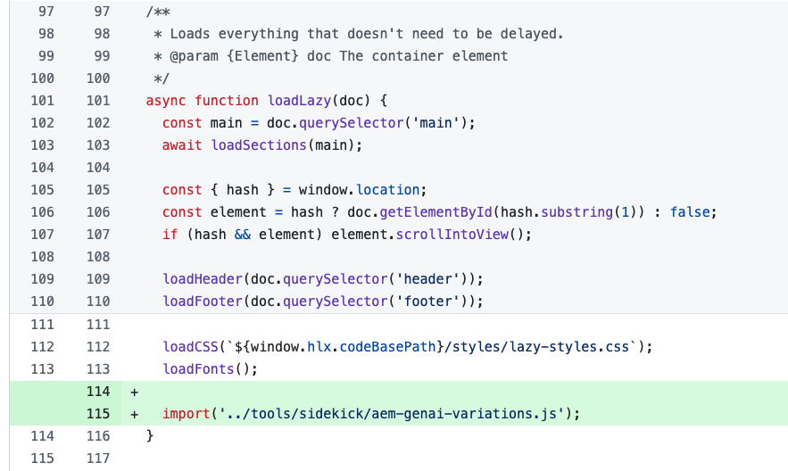

# Générer des variations - Intégration aux éditeurs AEM {#generate-variations-integrated-in-aem-editors}

Si vous recherchez un moyen d’optimiser vos canaux numériques et d’accélérer la création de contenu, vous pouvez utiliser Générer des variations, intégré dans les éditeurs AEM.

L’application Générer des Variations utilise l’intelligence artificielle (IA) générative pour créer des variations de contenu en fonction de vos entrées. Après avoir créé des variations, vous pouvez utiliser le contenu de votre site web et mesurer également leur succès à l’aide de la fonctionnalité [Expérimentation](https://www.aem.live/docs/experimentation) d’[Edge Delivery Services](/help/edge/overview.md).

Cela permet d’accélérer la vitesse du contenu en créant rapidement du contenu de marque en quelques minutes. Cela permet alors d’améliorer la conversion avec de nouvelles variantes de copie.

Vous pouvez [accéder à Générer des variations](#access-generate-variations) à partir des éditeurs suivants ([une fois qu’ils ont été configurés](#access-generate-variations)) :

* [le sidekick d’AEM Edge Delivery Services ; pour la création à base de documents](#access-aem-sidekick)
* [l’éditeur universel](#access-aem-universal-editor)
* [l’éditeur de fragments de contenu](#access-aem-content-fragment-editor)

>[!IMPORTANT]
>
>Cette page utilise la création à base de documents à titre d’exemple. Toutefois, les principes s’appliquent aux autres éditeurs.

>[!NOTE]
>
>Dans tous les cas, pour utiliser Générer des variations, vous devez vous assurer de remplir les [conditions d’accès préalables](#access-prerequisites).

>[!NOTE]
>
>Il est recommandé d’utiliser cette version, car même si la version autonome de [Générer des variations est toujours directement accessible](/help/generative-ai/generate-variations.md), elle sera abandonnée à l’avenir.

Vous pouvez ensuite :

* [Sélectionner le contenu sur lequel vous souhaitez travailler](#select-the-content) - à partir des blocs existants de votre contenu
   * Le bloc sélectionné oriente ce qui est affiché et les actions disponibles.
* [Décrire les modifications souhaitées](#describe-the-changes-you-want)
* [Générer des variations de votre contenu](#generate-copy), puis [effectuer d’autres actions si nécessaire](#take-further-action-on-a-variation)
* [Sélectionner et utiliser une variation](#use-a-generated-variation)
* Vérifier votre [historique](#history)
* Afficher vos [favoris](#favorites)

## Mentions légales et notes d’utilisation {#legal-usage-note}

<!--
Generative AI and Generate Variations for AEM are powerful tools – but **you** are responsible for use of the output.

Your inputs to the service should be tied to a context. This context can be your branding materials, website content, data, schemas for such data, templates, or other trusted documents.

You must evaluate the accuracy of any output as appropriate to your use case.

Before using Generate Variations you are recommended to read the [Adobe Experience Cloud Generative AI User Guidelines](https://www.adobe.com/legal/licenses-terms/adobe-dx-gen-ai-user-guidelines.html).
-->

[L’utilisation de Générer des variations](#generative-action-usage) est liée à la consommation d’actions génératives.

>[!NOTE]
>
>Consultez la [Fiche d’information sur la sécurité pour en savoir sur la fonctionnalité Générer des variations dans AEM](https://www.adobe.com/content/dam/cc/fr/trust-center/ungated/whitepapers/experience-cloud/aem-sites-generate-variations-security-fact-sheet.pdf).

## Vue d’ensemble {#overview}

Lorsque vous ouvrez Générer des variations intégré à un éditeur, vous voyez l’extension sous la forme d’un panneau flottant doté de trois onglets.


* L’éditeur :
   * Ceci présente le flux de contenu dans l’éditeur.
   * Vous pouvez y sélectionner un bloc de contenu à utiliser dans **Générer des variations**.
* **Générer des variations** :
   * Est un panneau flottant avec trois onglets, qui peut être déplacé comme vous le souhaitez ;
   * [Générer](#get-started-with-generate-variations) :
      * Affiche le [contenu sélectionné](#select-the-content).
      * Fournit des exemples de **suggestions** pour les modifications.
      * Permet de [décrire les modifications souhaitées](#describe-the-changes-you-want).
      * Permet de [générer](#generate-copy) de nouvelles variations.
      * Affiche les variations générées. <!--, together with their [brand score](#the-brand-score).-->
      * [Effectuez d’autres actions sur une variation](#take-further-action-on-a-variation).
      * [Utilisez une variation générée](#use-a-generated-variation).
   * [Historique](#history) :
      * Affiche votre historique de générations récent.
   * [Favoris](#favorites) :
      * Affiche les résultats des générations précédentes que vous avez ajoutées aux Favoris.
   * **Conditions de l’IA générative Adobe** : liens vers [les directives d’utilisation de l’IA générative Adobe Experience Cloud](https://www.adobe.com/fr/legal/licenses-terms/adobe-dx-gen-ai-user-guidelines.html).

## Commencer avec Générer des variations {#get-started-with-generate-variations}

L’interface vous guide tout au long du processus de génération de contenu. Après l’ouverture de l’interface, la première étape consiste à sélectionner le bloc de contenu à utiliser.

### Sélectionner le contenu {#select-the-content}

Dans le flux de contenu principal de l’éditeur, sélectionnez le contenu pour lequel vous souhaitez générer des variations. Cette **sélection** s’affiche dans l’onglet **Générer**.

### Décrire les modifications souhaitées {#describe-the-changes-you-want}

Pour générer des variations du contenu, vous devez décrire les modifications que vous souhaitez apporter. Vous pouvez sélectionner l’une des **suggestions** données ou fournir votre propre description.

Vous pouvez également spécifier des **modificateurs** pour fournir plus de contexte :

* **Référencer une page web**
Fournissez une URL pour apporter plus de contexte.
* **Charger le résumé du contenu**
Mettez à jour un fichier `.docx` contenant les détails du résumé de contenu (10 Mo ou moins).

### Générer la copie {#generate-copy}

Une fois décrites les modifications que vous souhaitez apporter, sélectionnez **Générer** pour afficher les réponses de l’IA générative.


<!--
### The Brand Score {#the-brand-score}

The brand score shows you how on-brand the generated variation is.
-->

### Exécuter une autre action sur une variation {#take-further-action-on-a-variation}

Lorsque vous sélectionnez une seule variation, vous pouvez appliquer les actions suivantes :

* **Modifier**
   * Vous pouvez modifier le texte de la variation générée.

      * Vous pouvez prévisualiser vos mises à jour dans la page web.

   * Enregistrez vos modifications pour une utilisation ultérieure.
* **Favori**
   * Marquez cette variation pour vous en servir ultérieurement.
   * Une fois marquée, elle s’affiche sous l’onglet [Favoris](#favorites).
* **Justification de l’IA**
   * Cette fonction accroît la transparence en fournissant une brève description de la raison pour laquelle l’IA générative a généré cette variation particulière.

### Utiliser une variation générée {#use-a-generated-variation}

Pour utiliser le contenu généré avec l’IA générative, vous devez d’abord effectuer une sélection, puis **Exporter au format CSV**.

Après l’export, vous pouvez utiliser le contenu ailleurs, par exemple lors de la création de contenu pour votre site web. Vous pouvez également exécuter une [expérience](https://www.aem.live/docs/experimentation).

>[!NOTE]
>
>Lorsque l’accès à Générer des variations est possible depuis [l’éditeur universel AEM](#access-aem-universal-editor) ou [l’éditeur de fragment de contenu d’AEM](#access-aem-content-fragment-editor), le contenu généré sélectionné est automatiquement enregistré dans AEM.

## Historique {#history}

Cet onglet affiche votre activité passée, après la sélection de **Générer**. Une entrée **Historique** est ajoutée.

Si, ultérieurement, vous sélectionnez le même contenu dans le flux principal et ouvrez l’onglet **Historique**, toutes les variations générées pour ce bloc seront affichées.

## Favoris {#favorites}

Après avoir examiné le contenu, vous pouvez enregistrer les variations sélectionnées en tant que favoris.

Une fois enregistrées, elles s’affichent sous **Favoris**. Les favoris sont conservés (jusqu’à ce que vous les **supprimiez** ou que vous effaciez la mémoire cache du navigateur).

* Vous pouvez **Modifier**, **Retirer des favoris** ou afficher la **Justification de l’IA** pour une entrée.
* Une fois qu’une variation est sélectionnée, vous pouvez également **Exporter au format CSV**.

## Utilisation de l’action générative {#generative-action-usage}

La gestion de l’utilisation dépend de l’action effectuée :

* Générer des variations

  Une génération de variante de copie correspond à une action générative. En tant que client ou cliente, vous disposez d’un certain nombre d’actions génératives avec votre licence AEM. Une fois le droit de base utilisé, vous pouvez acheter des actions supplémentaires.

  >[!NOTE]
  >
  >Consultez [Adobe Experience Manager : Cloud Service | Description du produit](https://helpx.adobe.com/legal/product-descriptions/aem-cloud-service.html) pour plus d’informations sur les droits de base et contactez votre équipe en charge des comptes si vous souhaitez acheter des actions génératives supplémentaires.

## Accès à Générer des variations {#access-generate-variations}

Après avoir rempli les conditions préalables, vous pouvez accéder à Générer des variations à partir d’AEM as a Cloud Service ou du sidekick Edge Delivery Services.

### Conditions préalables d’accès {#access-prerequisites}

Pour utiliser Générer des variations, vous devez vous assurer que les conditions préalables sont remplies :

* [Accès à Experience Manager as a Cloud Service avec Edge Delivery Services](#access-to-aemaacs-with-edge-delivery-services)

#### Accès à Experience Manager as a Cloud Service avec Edge Delivery Services{#access-to-aemaacs-with-edge-delivery-services}

Les utilisateurs et utilisatrices qui doivent accéder à la fonction Générer des variations doivent disposer de l’autorisation requise pour accéder à un environnement Experience Manager as a Cloud Service avec Edge Delivery Services.

>[!NOTE]
>
>Si votre contrat pour AEM Sites as a Cloud Service n’inclut pas Edge Delivery Services, vous devrez signer un nouveau contrat pour y accéder.
>
>Contactez votre équipe en charge des comptes pour savoir comment vous pouvez passer à AEM Sites as a Cloud Service avec Edge Delivery Services.

Pour accorder l’accès à des utilisateurs et utilisatrices spécifiques, attribuez le profil de produit correspondant à leur compte d’utilisateur ou d’utilisatrice. Pour plus d’informations, voir [Attribuer des profils de produit AEM](/help/journey-onboarding/assign-profiles-cloud-manager.md).

### Obtenir un accès à partir du sidekick AEM pour la création basée sur des documents {#access-aem-sidekick}

L’accès depuis le sidekick AEM est utilisé pour la [création basée sur des documents](/help/edge/wysiwyg-authoring/authoring.md).

Une configuration est nécessaire pour pouvoir accéder à la fonction Générer des variations à partir du sidekick (Edge Delivery Services).

>[!NOTE]
>
>Consultez le document [Installation du sidekick AEM](https://www.aem.live/docs/sidekick-extension) pour savoir comment installer et configurer le sidekick.

Pour utiliser la fonction Générer des variations dans le sidekick (Edge Delivery Services), incluez les configurations suivantes dans vos projets Edge Delivery Services.

1. Activez notre application dans :

   * `tools/sidekick/config.json`

   Celle-ci doit être fusionnée dans votre configuration existante, puis déployée.

   Par exemple :

   ```prompt
   {
     "plugins": [
       {
         "id": "aem-genai-variations",
         "titleI18n": {
           "en": "Generate with AI"
         },
         "environments": [
           "preview"
         ],
         "includePaths": [
           "**.docx**"
         ],
         "event": "aem-genai-variations-sidekick"
       }
     ]
   }
   ```

1. Créer :

   * `/tools/sidekick/aem-genai-variations.js`

   Vous devez créer ce fichier avec le contenu suivant :

   ```prompt
   (function () {
     let isAEMGenAIVariationsAppLoaded = false;
     function loadAEMGenAIVariationsApp() {
       const script = document.createElement('script');
       script.src = 'https://experience.adobe.com/solutions/aem-sites-genai-aem-genai-variations-mfe/static-assets/resources/sidekick/client.js?source=plugin';
       script.onload = function () {
         isAEMGenAIVariationsAppLoaded = true;
       };
       script.onerror = function () {
         console.error('Error loading AEMGenAIVariationsApp.');
       };
       document.head.appendChild(script);
     }
   
     function handlePluginButtonClick() {
       if (!isAEMGenAIVariationsAppLoaded) {
         loadAEMGenAIVariationsApp();
       }
     }
   
     // The code snippet for the Sidekick V1 extension, https://chromewebstore.google.com/detail/aem-sidekick/ccfggkjabjahcjoljmgmklhpaccedipo?hl=en
     const sidekick = document.querySelector('helix-sidekick');
     if (sidekick) {
       // sidekick already loaded
       sidekick.addEventListener('custom:aem-genai-variations-sidekick', handlePluginButtonClick);
     } else {
       // wait for sidekick to be loaded
       document.addEventListener('sidekick-ready', () => {
         document.querySelector('helix-sidekick')
           .addEventListener('custom:aem-genai-variations-sidekick', handlePluginButtonClick);
       }, { once: true });
     }
   
     // The code snippet for the Sidekick V2 extension, https://chromewebstore.google.com/detail/aem-sidekick/igkmdomcgoebiipaifhmpfjhbjccggml?hl=en
     const sidekickV2 = document.querySelector('aem-sidekick');
     if (sidekickV2) {
       // sidekick already loaded
       sidekickV2.addEventListener('custom:aem-genai-variations-sidekick', handlePluginButtonClick);
     } else {
       // wait for sidekick to be loaded
       document.addEventListener('sidekick-ready', () => {
         document.querySelector('aem-sidekick')
           .addEventListener('custom:aem-genai-variations-sidekick', handlePluginButtonClick);
       }, { once: true });
     }
   }());
   ```

1. Mettre à jour :

   * `/scripts/scripts.js`

   Une mise à jour doit être effectuée afin d’inclure l’instruction suivante dans la fonction `loadLazy()` :

   ```prompt
     import('../tools/sidekick/aem-genai-variations.js');
   ```

   Cela garantit que `/tools/sidekick/aem-genai-variations.js` est chargé dans le cadre du processus de chargement différé.

   

1. Vous devrez peut-être alors vous assurer que les utilisateurs et utilisatrices ont [Accès à Experience Manager as a Cloud Service avec Edge Delivery Services](#access-to-aemaacs-with-edge-delivery-services).

1. Vous pouvez ensuite accéder à la fonction en sélectionnant **Générer avec l’IA** dans la barre d’outils du sidekick :

   

### Obtenir un accès à partir de l’éditeur universel AEM {#access-aem-universal-editor}

L’accès à partir de l’[éditeur universel AEM](/help/sites-cloud/authoring/universal-editor/authoring.md) est mis en œuvre sous la forme d’une extension.

* Pour plus d’informations sur la création à l’aide de l’éditeur universel, consultez le document [Création de contenu avec l’éditeur universel](/help/sites-cloud/authoring/universal-editor/authoring.md#generate-variations).
* Pour plus d’informations sur la manière d’activer l’extension, consultez le document [Extension Manager dans AEM Experience Manager](https://developer.adobe.com/uix/docs/extension-manager/).

### Obtenir un accès à partir de l’éditeur de fragment de contenu AEM {#access-aem-content-fragment-editor}

L’accès à partir de l’[éditeur de fragment de contenu AEM](/help/sites-cloud/administering/content-fragments/authoring.md#generate-variations-ai) est mis en œuvre sous la forme d’une extension. Pour plus de détails, voir la section [Extension Manager dans AEM Experience Manager](https://developer.adobe.com/uix/docs/extension-manager/).

## Informations supplémentaires {#further-information}

Pour plus d’informations, vous pouvez également consulter :

* [Générer des variations GenAI sur GitHub](https://github.com/adobe/aem-genai-assistant#setting-up-aem-genai-assistant)
* [Expérimentation Edge Delivery Services](https://www.aem.live/docs/experimentation)
* [IA générative dans les produits Experience Cloud](https://experienceleague.adobe.com/fr/docs/core-services/interface/features/generative-ai)

   * [IA générative dans les produits Experience Cloud - Adobe Experience Manager](https://experienceleague.adobe.com/fr/docs/core-services/interface/features/generative-ai#aem)

* [Page de destination de génération de variations dans Experience Cloud](https://experience.adobe.com/solutions/aem-sites-genai-aem-genai-variations-mfe/static-assets/resources/ga.html)

## Historique des versions {#release-history}

Pour plus d’informations sur les versions actuelle et antérieures, voir les [Notes de mise à jour de Générer des variations](/help/generative-ai/release-notes-generate-variations.md).
