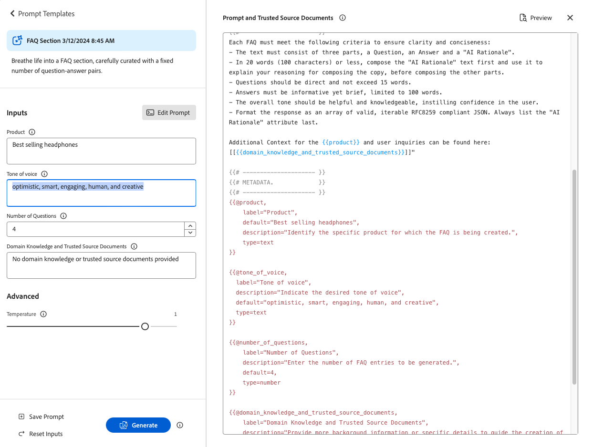

# Générer des variations {#generate-variations}


>[!NOTE]
>
>Il est recommandé d’accéder à [Générer des variations intégrées dans les éditeurs AEM](/help/generative-ai/generate-variations-integrated-editor.md), car la version décrite sur cette page sera abandonnée à l’avenir.

Si vous recherchez un moyen d’optimiser vos canaux numériques et d’accélérer la création de contenu, vous pouvez utiliser Générer des variations. Générer des variations utilise l’intelligence artificielle (IA) générative pour créer des variations de contenu basées sur des prompts. Ces prompts sont fournis par Adobe ou créés et gérés par les utilisateurs et utilisatrices. Après avoir créé des variations, vous pouvez utiliser le contenu de votre site web et mesurer également leur succès à l’aide de la fonctionnalité [Expérimentation](https://www.aem.live/docs/experimentation) d’[Edge Delivery Services](/help/edge/overview.md).

Vous pouvez [accéder à Générer des variations](#access-generate-variations) depuis :

* [Adobe Experience Manager (AEM) as a Cloud Service](#access-aemaacs)
* [le sidekick d’AEM Edge Delivery Services](#access-aem-sidekick)
* [l’éditeur de fragments de contenu](/help/sites-cloud/administering/content-fragments/authoring.md#generate-variations-ai)

>[!NOTE]
>
>Dans tous les cas, pour utiliser Générer des variations, vous devez vous assurer de remplir les [conditions d’accès préalables](#access-prerequisites).

Vous pouvez ensuite :

* [Commencer](#get-started) avec un modèle de prompt créé par Adobe pour un cas d’utilisation spécifique.
* Vous pouvez [modifier un prompt existant](#edit-the-prompt)
* Ou [créer et utiliser vos propres prompts](#create-prompt) :
   * [Enregistrer vos prompts](#save-prompt) pour une utilisation ultérieure
   * [Accéder à des prompts partagés et les utiliser](#select-prompt) dans l’ensemble de votre organisation
* Définir les segments d’[audience](#audiences) à utiliser dans le prompt lors de la [génération de contenu personnalisé spécifique à l’audience](#generate-copy).
* Prévisualiser la sortie à côté du prompt avant d’apporter des modifications et d’affiner les résultats si nécessaire.
* Utiliser [Adobe Express pour générer des images](#generate-image) en fonction des variations de copie ; cela utilise les fonctionnalités d’IA générative de Firefly.
* Sélectionner le contenu que vous souhaitez utiliser sur votre site web ou dans le cadre d’une expérience.

## Mentions légales et notes d’utilisation {#legal-usage-note}

L’IA générique et Générer des variations pour AEM sont des outils puissants, mais **vous** êtes responsable de l’utilisation de la sortie.

Les entrées que vous saisissez lorsque vous utilisez le service doivent être liées à un contexte. Ce contexte peut être votre matériel de branding, le contenu du site web, des données, les schémas de ces données, des modèles ou d’autres documents approuvés.

Vous devez évaluer la précision des sorties en fonction de votre cas d’utilisation.

Avant d’utiliser Générer des variations, vous devez accepter les [Instructions d’utilisation de l’IA générative d’Adobe](https://www.adobe.com/fr/legal/licenses-terms/adobe-dx-gen-ai-user-guidelines.html).

[L’utilisation de Générer des variations](#generative-action-usage) est liée à la consommation d’actions génératives.

## Vue d’ensemble {#overview}

Lorsque vous ouvrez Générer des variations (et développez le panneau de gauche), les éléments suivants apparaissent :


* Panneau de droite
   * Cela dépend de la sélection que vous effectuez dans le volet de navigation de gauche.
   * Par défaut, les **modèles de prompt** s’affichent.
* Panneau de navigation de gauche
   * À gauche de **Générer des variations**, vous trouverez une option (menu latéral) pour développer ou masquer le panneau de navigation de gauche.
   * **Modèles de prompt** :
      * Affiche des liens vers divers prompts, notamment des prompts :
         * Fournis par Adobe pour vous aider à générer du contenu (ils comportent l’icône d’Adobe).
         * Créés par vous.
         * Créée au sein de votre organisation IMS (ils comportent une icône représentant plusieurs têtes).
      * Comprend le lien [Nouveau prompt](#create-prompt) pour créer votre propre prompt.
      * Vous pouvez **Supprimer** des prompts créés par vous ou au sein de votre organisation IMS. Pour ce faire, utilisez le menu accessible avec l’ellipse de la carte concernée.
   * [Favoris](#favorites) : affiche les résultats des générations précédentes que vous avez ajoutées aux Favoris.
   * [Récents](#recents) : fournit des liens vers des prompts que vous avez récemment utilisés ainsi que les entrées associées.
   * **Aide et questions fréquentes** : liens vers la documentation, y compris les questions fréquentes.
   * **Instructions d’utilisation** : liens vers les directives légales.

## Prise en main {#get-started}

L’interface vous guide tout au long du processus de génération de contenu. Après avoir ouvert l’interface, la première étape consiste à sélectionner le prompt à utiliser.

### Sélection d’un prompt {#select-prompt}

Dans le panneau principal, vous pouvez sélectionner :

* un modèle de prompt fourni par Adobe pour commencer à générer du contenu,
* la commande [Nouveau prompt](#create-prompt) pour créer votre propre prompt,
* un modèle que vous avez créé pour un usage exclusif,
* un modèle que vous, ou une personne de votre entreprise, avez créé.

Pour différencier :

* Les prompts fournis par Adobe comportent l’icône d’Adobe.
* Les prompts disponibles dans l’ensemble de votre organisation IMS comportent une icône représentant plusieurs têtes.
* Vos prompts privés ne sont pas spécialement marqués.


### Saisie d’entrées {#provide-inputs}

Pour chaque prompt, vous devez fournir certaines informations afin que l’IA générative renvoie du contenu approprié.

Les champs de saisie vous indiquent les informations à fournir. Pour vous aider, certains champs comportent des valeurs par défaut que vous pouvez utiliser ou modifier selon vos besoins, ainsi que des descriptions expliquant les exigences.

Certains champs de saisie clés s’appliquent à plusieurs prompts (certains champs ne sont pas toujours disponibles) :

* **Quantité de**/**Nombre de**
   * Vous pouvez sélectionner le nombre de variations de contenu à créer en une génération.
   * Selon le prompt, il peut s’agir de l’une des différentes étiquettes, par exemple Quantité, Nombre de variations, Nombre d’idées, etc.
* **Source d’audience**/**audience cible**
   * Permet de générer du contenu personnalisé pour une audience spécifique.
   * Adobe fournit des audiences par défaut ; vous pouvez aussi spécifier des audiences supplémentaires ; voir [Audiences](#audiences).
* **Contexte supplémentaire**
   * Insérez du contenu pour permettre à l’IA générative d’élaborer une meilleure réponse en fonction de l’entrée. Par exemple, si vous créez une bannière web pour une page ou un produit spécifique, vous souhaiterez peut-être inclure des informations sur la page ou le produit.
* **Température**
Sert à modifier la température de l’IA générative d’Adobe :
   * Une température plus élevée s’éloigne du prompt, et laisse davantage de place au hasard et à la créativité.
   * Une température plus basse est plus déterministe et reste plus proche du contenu du prompt.
   * Par défaut, la température est définie sur 1. Vous pouvez tester différentes températures si les résultats générés ne vous conviennent pas.
* **Modification du prompt**
   * [Vous pouvez modifier le prompt sous-jacent](#edit-the-prompt) pour affiner les résultats générés.

### Générer la copie {#generate-copy}

Après avoir rempli les champs de saisie et/ou modifié le prompt, vous pouvez commencer à générer du contenu et consulter les réponses.

Sélectionnez **Générer** pour afficher les réponses générées par l’IA générative. Les variations de contenu générées s’affichent sous le prompt qui les a générées.


>[!NOTE]
>
>La plupart des modèles de prompt d’Adobe incluent un **motif d’IA** dans la réponse de variation. Cela permet d’expliquer en toute transparence pourquoi l’IA générative a généré cette variation.

Lorsque vous sélectionnez une variation, vous pouvez effectuer les actions suivantes :

* **Favori**
   * Marquez comme **Favori** pour une utilisation ultérieure (s’affichera dans [Favoris](#favorites)).
* Pouce vers le haut/vers le bas
   * Utilisez les pouces vers le haut ou vers le bas pour indiquer à Adobe la qualité des réponses.
* **Copier**
   * Copiez dans le presse-papiers pour l’utiliser lors de la création de contenu sur votre site web ou dans le cadre d’une [expérience](https://www.aem.live/docs/experimentation).
* **Supprimer**

Si vous devez affiner les entrées ou le prompt, vous pouvez effectuer des ajustements et sélectionner à nouveau **Générer** pour obtenir de nouvelles réponses. Le nouveau prompt et la nouvelle réponse s’affichent sous le prompt et la réponse initiales. Vous pouvez faire défiler vers le haut ou vers le bas pour afficher les différents ensembles de contenu.

Au-dessus de chaque ensemble de variations se trouve le prompt qui en est à l’origine, ainsi que l’option **Réutiliser**. Si vous avez besoin de réexécuter un prompt avec ses entrées, sélectionnez **Réutiliser** pour les recharger dans **Entrées**.

### Générer une image {#generate-image}

Après avoir généré des variations de texte, vous pouvez générer des images dans Adobe Express à l’aide des fonctionnalités d’IA générative de Firefly.

>[!NOTE]
>
>**Générer une image** n’est disponible que si vous disposez d’un droit Adobe Express dans le cadre de votre organisation IMS et que l’accès vous est accordé dans Admin Console.

Sélectionnez une variation, suivie de **Générer une image**, pour ouvrir directement **Texte vers image** dans [Adobe Express](https://www.adobe.com/fr/express/). Le prompt est prérempli en fonction de la sélection de votre variante et les images sont automatiquement générées conformément à ce prompt.


Vous pouvez apporter d’autres modifications :

* [écrire votre propre prompt dans Adobe Express](https://helpx.adobe.com/fr/firefly/generate-images-with-text-to-image/generate-images-using-text-prompts/writing-effective-text-prompts.html) en décrivant ce que vous souhaitez voir,
* régler les options **Texte vers image**,
* puis **Actualiser** les images générées.

Vous pouvez également utiliser **Explorer plus** pour d’autres possibilités.

Une fois terminé, sélectionnez l’image souhaitée et **Enregistrer** pour fermer Adobe Express. L’image est renvoyée et enregistrée avec la variation.


Ici, vous pouvez placer le pointeur de la souris sur l’image pour afficher les éléments d’action pour :

* **Copier** : [copier l’image dans le presse-papiers pour l’utiliser ailleurs](#use-content).
* **Modifier** : ouvrir Adobe Express pour apporter des modifications à l’image.
* **Télécharger** : télécharger l’image sur votre ordinateur local.
* **Supprimer** : supprimer l’image de la variation.

>[!NOTE]
>
>Les [Content Credentials](https://helpx.adobe.com/fr/creative-cloud/help/content-credentials.html) ne sont pas conservées lorsqu’elles sont utilisées pour une création basée sur des documents.

### Utilisation du contenu {#use-content}

Pour utiliser le contenu généré avec l’IA générative, vous devez copier le contenu dans le presse-papiers pour l’utiliser ailleurs.

Pour ce faire, utilisez les icônes de copie :

* Pour le texte : utilisez l’icône de copie visible dans le panneau des variations.
* Pour l’image : placez le pointeur de la souris sur l’image pour afficher l’icône de copie.

Une fois la copie effectuée dans le presse-papiers, vous pouvez coller les informations lors de la création de contenu pour votre site web. Vous pouvez également exécuter une [expérience](https://www.aem.live/docs/experimentation).

## Favoris {#favorites}

Après avoir examiné le contenu, vous pouvez enregistrer les variations sélectionnées en tant que favoris.

Une fois enregistrées, elles s’affichent dans **Favoris** dans le volet de navigation de gauche. Les favoris sont conservés (jusqu’à ce que vous les **supprimiez** ou que vous effaciez la mémoire cache du navigateur).

* Vous pouvez copier/coller les favoris et les variations dans le presse-papiers pour les utiliser lors de la création de votre site web.
* Vous pouvez **supprimer** des favoris.

## Récents {#recents}

Cette section fournit des liens vers votre activité récente. Lorsque vous sélectionnez **Générer**, une entrée **Récente** est ajoutée. Elle porte le nom du prompt et comporte la date et l’heure. Si vous sélectionnez un lien, le prompt se charge, les champs de saisie sont renseignés et les variations générées s’affichent.

## Modifier le prompt {#edit-the-prompt}

Vous pouvez modifier le prompt sous-jacent. Vous pouvez effectuer les opérations suivantes :

* Si les résultats générés doivent être affinés
* Vous souhaitez modifier et [enregistrer le prompt](#save-prompt) pour une utilisation ultérieure.

Sélectionnez **Modifier le prompt** :


L’éditeur de prompt s’ouvre et vous pouvez apporter des modifications :


### Ajout d’entrées de prompt {#add-prompt-inputs}

Lorsque vous créez ou modifiez un prompt, vous pouvez ajouter des champs de saisie. Les champs de saisie agissent comme des variables dans le prompt et permettent d’utiliser le même prompt dans divers scénarios. Ils permettent aux utilisateurs et aux utilisatrices de définir des éléments spécifiques du prompt, sans avoir à l’écrire entièrement.

* Un champ est défini par des accolades doubles `{{ }}` contenant un nom d’espace réservé.
Par exemple, `{{tone_of_voice}}`.

  >[!NOTE]
  >
  >N’ajoutez pas d’espace entre les accolades doubles.

* Il est également défini sous `METADATA`, avec les paramètres suivants :
   * `label`
   * `description`
   * `default`
   * `type`

#### Exemple : ajouter un nouveau champ de texte - Ton {#example-add-new-text-field-tone-of-voice}

Pour ajouter un nouveau champ de texte intitulé **Ton**, utilisez la syntaxe suivante dans votre prompt :

```prompt
{{@tone_of_voice, 
  label="Tone of voice",
  description="Indicate the desired tone of voice",
  default="optimistic, smart, engaging, human, and creative",
  type=text
}}
```



<!--
#### Example: Add new dropdown field - Page Type {#example-add-new-dropdown-field-page-type}

To create an input field Page Type providing a dropdown selection:

1. Create a spreadsheet named `pagetype.xls` in the top-level directory of your folder structure.
1. Edit the spreadsheet:

   1. Create two columns: **Key** and **Value**.
   1. In the **Key** column, enter labels that will appear in the dropdown.
   1. In the **Value** column, describe the key value so the generative AI has context.

1. In your prompt, refer to the title of the spreadsheet along with the appropriate type. 

   ```prompt
   {{@page_type, 
     label="Page Type",
     description="Describes the type of page",
     spreadsheet=pagetype
   }}
   ```
-->

## Création d’un prompt {#create-prompt}

Lorsque vous sélectionnez **Nouveau prompt** dans **Modèles de prompt**, un nouveau panneau vous permet de saisir un nouveau prompt. Vous pouvez ensuite définir les prompts ainsi que la **température** pour **générer** le contenu.

Pour plus d’informations sur l’enregistrement du prompt pour plus tard, voir [Enregistrement du prompt](#save-prompt).

Pour plus d’informations sur l’ajout de vos propres entrées de prompt, voir [Ajout d’entrées de prompt](#add-prompt-inputs).

Si vous souhaitez conserver la mise en forme dans l’interface d’utilisation et lorsque vous copiez-collez le prompt dans le flux de création basé sur un document, incluez les éléments suivants dans le prompt :

<!-- CHECK - are the double-quotes needed? -->

* `"Format the response as an array of valid, iterable RFC8259 compliant JSON"`

L’image suivante présente les avantages de cette opération :

* dans le premier exemple, le `Title` et la `Description` sont combinés.
* dans le deuxième exemple, ils sont mis en forme séparément grâce à la requête JSON inclue dans le prompt.


## Enregistrer le prompt {#save-prompt}

Après avoir modifié ou créé des prompts, vous pouvez les enregistrer pour une utilisation ultérieure, soit pour votre organisation IMS, soit pour vous. Le prompt enregistré apparaîtra sous la forme d’une carte **Modèle de prompt**.

Lorsque vous avez modifié le prompt, l’option **Enregistrer** est disponible au bas de la section Entrées, à gauche de **Générer**.

Lorsque vous sélectionnez cette option, la boîte de dialogue **Enregistrer le prompt** s’ouvre :


1. Ajoutez un **nom de prompt unique** qui servira à identifier le prompt dans les **modèles de prompt**.
   1. Un nouveau nom unique crée un modèle de prompt.
   1. Un nom existant remplace ce prompt et un message s’affiche.
1. Vous pouvez aussi ajouter une description.
1. Activez ou désactivez l’option **Partagée à l’échelle de l’organisation**, selon que le prompt doit être privé ou mis à disposition dans l’ensemble de votre organisation IMS. Ce statut s’affiche dans la [carte obtenue qui s’affiche dans les modèles de prompt](#select-prompt).
1. **Enregistrez** le prompt ou **annulez** l’action.

>[!NOTE]
>
>Vous recevrez une notification si vous remplacez/mettez à jour un prompt existant.

>[!NOTE]
>
>À partir de **Modèles de prompt**, vous pouvez supprimer des prompts (à l’aide du menu accessible avec l’ellipse) créés par vous ou au sein de votre organisation IMS.

## Audiences {#audiences}

Pour générer du contenu personnalisé, l’IA générative doit connaître l’audience. Adobe fournit un certain nombre d’audiences par défaut, mais vous pouvez ajouter les vôtres.

Lorsque vous ajoutez une audience, vous devez la décrire en langage naturel. Par exemple :

* pour créer une audience :
   * `Student`
* vous pouvez dire :
   * `The audience consists of students, typically individuals who are pursuing education at various academic levels, such as primary, secondary, or tertiary education. They are engaged in learning and acquiring knowledge in diverse subjects, seeking academic growth, and preparing for future careers or personal development.`

Deux sources d’audience sont prises en charge :

* [Adobe Target](#audience-adobe-target)
* [Fichier CSV](#audience-csv-file)


### Audience - Adobe Target {#audience-adobe-target}

La sélection d’une audience **Adobe Target** dans le prompt permet de personnaliser la génération du contenu pour cette audience.

>[!NOTE]
>
>Pour utiliser cette option, votre organisation IMS doit avoir accès à Adobe Target.

1. Sélectionnez **Adobe Target**.
1. Sélectionnez ensuite l’**audience cible** dans la liste fournie.

   >[!NOTE]
   >
   >Pour utiliser une audience **Adobe Target**, vous devez remplir le champ de description. Dans le cas contraire, l’audience s’affiche dans la liste déroulante comme étant indisponible. Pour ajouter une description, accédez à Target et [ajoutez une description de l’audience](https://experienceleague.adobe.com/fr/docs/target-learn/tutorials/audiences/create-audiences).

   

#### Ajout d’une audience Adobe Target {#add-adobe-target-audience}

Voir [Création d’audiences](https://experienceleague.adobe.com/fr/docs/target-learn/tutorials/audiences/create-audiences) pour savoir comment créer une audience dans Adobe Target.

### Audience - Fichier CSV {#audience-csv-file}

La sélection d’une audience **Fichier CSV** dans le prompt permet de personnaliser la génération du contenu en fonction de l’**audience cible** sélectionnée.

Adobe fournit plusieurs audiences.

1. Sélectionnez **Fichier CSV**.
1. Sélectionnez ensuite l’**audience cible** dans la liste fournie.

   

#### Ajout d’un fichier CSV d’audience {#add-audience-csv-file}

Vous pouvez ajouter un fichier CSV provenant de diverses plateformes (Google Drive, Dropbox, SharePoint, par exemple) qui peut fournir une URL vers le fichier une fois qu’il est rendu public.

>[!NOTE]
>
>Sur les plateformes de partage, vous *devez* avoir la possibilité de rendre le fichier public.

Par exemple, pour ajouter une audience à partir d’un fichier sur Google Drive :

1. Dans Google Drive, créez un fichier de feuille de calcul comportant deux colonnes :
   1. La première colonne s’affiche dans la liste déroulante.
   1. La deuxième colonne correspond à la description de l’audience.
1. Publiez le fichier :
   1. Fichier -> Partager -> publier sur le web -> CSV
1. Copiez l’URL vers le fichier publié.
1. Accédez à Générer des variations.
1. Ouvrez l’éditeur de prompt.
1. Recherchez l’audience **Adobe Target** dans les métadonnées et remplacez l’URL.

   >[!NOTE]
   >
   >Assurez-vous que les guillemets (&quot;) sont conservés au début et à la fin de l’URL.

   Par exemple :

   

## Utilisation de l’action générative {#generative-action-usage}

La gestion de l’utilisation dépend de l’action effectuée :

* Générer des variations

  Une génération de variante de copie correspond à une action générative. En tant que client ou cliente, vous disposez d’un certain nombre d’actions génératives avec votre licence AEM. Une fois le droit de base utilisé, vous pouvez acheter des actions supplémentaires.

  >[!NOTE]
  >
  >Consultez [Adobe Experience Manager : Cloud Service | Description du produit](https://helpx.adobe.com/fr/legal/product-descriptions/aem-cloud-service.html) pour plus d’informations sur les droits de base et contactez votre équipe en charge des comptes si vous souhaitez acheter des actions génératives supplémentaires.

* Adobe Express

  L’utilisation de la génération d’images est gérée par les droits d’Adobe Express et les [crédits génératifs](https://helpx.adobe.com/fr/firefly/using/generative-credits-faq.html).

## Accès à Générer des variations {#access-generate-variations}

Après avoir rempli les conditions préalables, vous pouvez accéder à Générer des variations à partir d’AEM as a Cloud Service ou du sidekick Edge Delivery Services.

### Conditions préalables d’accès {#access-prerequisites}

Pour utiliser Générer des variations, vous devez vous assurer que les conditions préalables sont remplies :

* [Accès à Experience Manager as a Cloud Service avec Edge Delivery Services](#access-to-aemaacs-with-edge-delivery-services)

#### Accès à Experience Manager as a Cloud Service avec Edge Delivery Services{#access-to-aemaacs-with-edge-delivery-services}

Les utilisateurs et utilisatrices qui doivent accéder à la fonction Générer des variations doivent disposer de l’autorisation requise pour accéder à un environnement Experience Manager as a Cloud Service avec Edge Delivery Services.

>[!NOTE]
>
>Si votre contrat pour AEM Sites as a Cloud Service n’inclut pas Edge Delivery Services, vous devrez signer un nouveau contrat pour y accéder.
>
>Contactez votre équipe en charge des comptes pour savoir comment vous pouvez passer à AEM Sites as a Cloud Service avec Edge Delivery Services.

Pour accorder l’accès à des utilisateurs et utilisatrices spécifiques, attribuez le profil de produit correspondant à leur compte d’utilisateur ou d’utilisatrice. Pour plus d’informations, voir [Attribuer des profils de produit AEM](/help/journey-onboarding/assign-profiles-cloud-manager.md).

### Accès depuis AEM as a Cloud Service {#access-aemaacs}

La fonction Générer des variations est accessible à partir du [Panneau de navigation](/help/sites-cloud/authoring/basic-handling.md#navigation-panel) d’AEM as a Cloud Service :


### Accès depuis le sidekick AEM {#access-aem-sidekick}

Une configuration est nécessaire pour pouvoir accéder à la fonction Générer des variations à partir du sidekick (Edge Delivery Services).

1. Consultez le document [Installation du sidekick AEM](https://www.aem.live/docs/sidekick-extension) pour savoir comment installer et configurer le sidekick.

1. Pour utiliser la fonction Générer des variations dans le sidekick (Edge Delivery Services), incluez la configuration suivante dans vos projets Edge Delivery Services sous :

   * `tools/sidekick/config.json`

   Celle-ci doit être fusionnée dans votre configuration existante, puis déployée.

   Par exemple :

   ```prompt
   {
     // ...
     "plugins": [
       // ...
       {
         "id": "generate-variations",
         "title": "Generate Variations",
         "url": "https://experience.adobe.com/aem/generate-variations",
         "passConfig": true,
         "environments": ["preview","live", "edit"],
         "includePaths": ["**.docx**"]
       }
       // ...
     ]
   }
   ```

1. Vous devrez peut-être alors vous assurer que les utilisateurs et utilisatrices ont [Accès à Experience Manager as a Cloud Service avec Edge Delivery Services](#access-to-aemaacs-with-edge-delivery-services).

1. Vous pouvez ensuite accéder à la fonction en sélectionnant **Générer des variations** dans la barre d’outils du sidekick :

   

## Informations supplémentaires {#further-information}

Pour plus d’informations, vous pouvez également consulter :

* [Générer des variations GenAI sur GitHub](https://github.com/adobe/aem-genai-assistant#setting-up-aem-genai-assistant)
* [Expérimentation Edge Delivery Services](https://www.aem.live/docs/experimentation)
* [IA générative dans AEM as a Cloud Service](/help/ai-in-aem/overview.md#generative-ai-in-aem)

## FAQ {#faqs}

### Sortie mise en forme {#formatted-outpu}

**La réponse générée ne me fournit pas la sortie mise en forme dont j’ai besoin. Comment modifier le format ? Exemple : j’ai besoin d’un titre et d’un sous-titre, mais la réponse ne fournit que le titre.**

1. Ouvrez le prompt en mode d’édition.
1. Accédez aux exigences.
1. Vous trouverez des exigences relatives à la sortie.
   1. Exemple : « Le texte doit comprendre trois parties, un titre, un corps et un libellé de bouton. » ou « Mettre en forme la réponse sous forme de tableau d’objets JSON valide avec les attributs Title, Body et ButtonLabel ».
1. Modifiez le fichier selon vos besoins.

   >[!NOTE]
   >
   >Si la nouvelle sortie saisie comporte des restrictions de nombre de mots/caractères, créez une exigence.

   Exemple : « Le texte du titre ne doit pas dépasser 10 mots ou 50 caractères, espaces compris. »
1. Enregistrez le prompt en vue d’une utilisation ultérieure.

### Longueur de la réponse {#length-of-response}

**La réponse générée est trop longue ou trop courte. Comment modifier la longueur ?**

1. Ouvrez le prompt en mode d’édition.
1. Accédez aux exigences.
1. À chaque sortie correspond une limite de mots/caractères.
   1. Exemple : « Le texte du titre ne doit pas dépasser 10 mots ou 50 caractères, espaces compris. »
1. Modifiez le fichier selon vos besoins.
1. Enregistrez le prompt en vue d’une utilisation ultérieure.

### Amélioration des réponses {#improve-responses}

**Les réponses que j’obtiens ne correspondent pas exactement ce que je recherche. Que puis-je faire pour les améliorer ?**

1. Essayez de modifier la température dans Paramètres avancés.
   1. Une température plus élevée s’éloigne du prompt, et laisse davantage de place au hasard et à la créativité.
   1. Une température plus basse est plus déterministe et s’en tient à ce qui est dans le prompt.
1. Ouvrez le prompt actuel en mode d’édition et passez-le en revue. Accordez une attention particulière à la section sur les exigences qui décrit le ton et d’autres critères importants.

### Commentaires dans un prompt {#comments-in-prompt}

**Comment utiliser les commentaires dans un prompt ?**

Les commentaires dans un prompt servent à inclure des notes, des explications ou des instructions qui ne sont pas destinées à faire partie de la sortie. Ces commentaires sont encapsulés dans une syntaxe spécifique : ils commencent et se terminent par des accolades doubles et commencent par un symbole dièse (par exemple, `{{# Comment Here }}`). Les commentaires permettent de clarifier la structure ou l’intention du prompt sans affecter la réponse générée.

### Recherche d’un prompt partagé {#find-a-shared-prompt}

**Que faire si je ne trouve pas le modèle de prompt que quelqu’un a partagé ?**

Dans ce cas, il y a plusieurs choses à vérifier :

1. Utilisez l’URL de votre environnement.
Par exemple, https://experience.adobe.com/#/aem/generate-variations.
1. Vérifiez que vous avez sélectionné la bonne organisation IMS.
1. Vérifiez que le prompt a été enregistré comme Partagé.

### Prompts personnalisés dans la version v2.0.0 {#custom-prompts-v200}

**Dans la version v.2.0.0, mes prompts personnalisés ont disparu, que puis-je faire ?**

Si vous passez à la version v2.0.0, les modèles de prompt personnalisés seront endommagés et ne seront donc pas disponibles.

Pour les récupérer :

1. Accédez au dossier prompt-template dans SharePoint.
1. Copiez le prompt.
1. Ouvrez l’application Générer des variations.
1. Sélectionnez la carte Nouveau prompt.
1. Collez le prompt.
1. Vérifiez que le prompt fonctionne.
1. Enregistrez le prompt.

## Historique des versions {#release-history}

Pour plus d’informations sur les versions actuelle et antérieures, voir les [Notes de mise à jour de Générer des variations](/help/generative-ai/release-notes-generate-variations.md).
