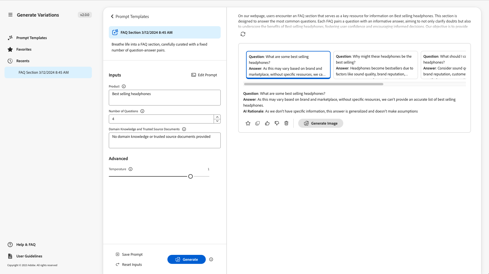

# Générer des variations {#generate-variations}

Si vous recherchez un moyen d’optimiser vos canaux numériques et d’accélérer la création de contenu, vous pouvez utiliser Générer des variations. Generate Variations (Générer des variations) utilise l’intelligence artificielle (IA) générative pour créer des variations de contenu basées sur des invites ; ces invites sont fournies par Adobe ou créées et gérées par les utilisateurs. Après avoir créé des variations, vous pouvez utiliser le contenu de votre site web et mesurer également leur succès à l’aide de la fonctionnalité [Expérience](https://www.aem.live/docs/experimentation) de [Edge Delivery Services](/help/edge/overview.md).

Vous pouvez [accéder à Generate Variations](#access-generate-variations) à partir de :

* [dans Adobe Experience Manager (AEM) as a Cloud Service](#access-aemaacs)
* [le Sidekick des Edge Delivery Services AEM](#access-aem-sidekick)
* [dans l’éditeur de fragments de contenu](/help/sites-cloud/administering/content-fragments/authoring.md#generate-variations-ai)

>[!NOTE]
>
>Dans tous les cas, pour utiliser Générer des variations, vous devez vous assurer que les [conditions d’accès préalables](#access-prerequisites) sont remplies.

Vous pouvez ensuite :

* [Commencer](#get-started) à l’aide d’un modèle d’invite créé par Adobe pour un cas d’utilisation spécifique.
* Vous pouvez [modifier une invite existante](#edit-the-prompt)
* Ou [créez et utilisez vos propres invites](#create-prompt) :
   * [Enregistrez vos invites](#save-prompt) pour une utilisation ultérieure
   * [ Accédez et utilisez des invites partagées ](#select-prompt) à partir de l’ensemble de votre organisation.
* Définissez les segments [audience](#audiences) à utiliser dans l’invite lors de la [ génération de contenu personnalisé spécifique à l’audience](#generate-copy).
* Prévisualisez la sortie à côté de l&#39;invite, avant d&#39;apporter des modifications et d&#39;affiner les résultats si nécessaire.
* Utilisez l’Adobe Express [pour générer des images](#generate-image) en fonction des variations de copie ; cela utilise les fonctionnalités d’IA générée de Firefly.
* Sélectionnez le contenu que vous souhaitez utiliser sur votre site web ou dans le cadre d’une expérience.

## Mentions légales et notes d’utilisation {#legal-usage-note}

L’IA générique et les variations de génération pour AEM sont des outils puissants, mais **vous** est responsable de l’utilisation de la sortie.

Vos entrées du service doivent être liées à un contexte. Ce contexte peut être votre matériel de marque, le contenu du site web, les données, les schémas de données, les modèles ou d’autres documents de confiance.

Vous devez évaluer la précision de toute sortie selon votre cas d’utilisation.

Avant d’utiliser Générer des variations, vous devez accepter les [Directives d’utilisation d’Adobe Generative AI](https://www.adobe.com/legal/licenses-terms/adobe-dx-gen-ai-user-guidelines.html).

[L’utilisation de l’option Générer des variations](#generative-action-usage) est liée à la consommation d’actions génératives.

## Vue d’ensemble {#overview}

Lorsque vous ouvrez Générer des variations (et développez le panneau de gauche), vous voyez :


* Panneau droit
   * Cela dépend de la sélection que vous effectuez dans le volet de navigation de gauche.
   * Par défaut, les **modèles d’invitation** s’affichent.
* Navigation de gauche
   * À gauche de **Générer des variations**, il existe une option (menu sandwich) pour développer ou masquer le panneau de navigation de gauche.
   * **Demander les modèles** :
      * Affiche des liens vers les diverses invites ; celles-ci peuvent inclure des invites :
         * Fourni par Adobe pour vous aider à générer du contenu ; marqué avec l’icône d’Adobe.
         * Créé par vous-même.
         * Créé au sein de votre organisation IMS ; avec une icône représentant plusieurs têtes.
      * Inclut le lien [Nouvelle invite](#create-prompt) pour créer votre propre invite.
      * Vous pouvez **Supprimer** invites créées par vous-même ou au sein de votre organisation IMS. Pour ce faire, utilisez le menu accessible avec l’ellipse de la carte appropriée.
   * [Favoris](#favorites) : affiche les résultats des générations précédentes que vous avez marquées comme Favoris.
   * [Récents](#recents) : fournit des liens vers des invites et leurs entrées, que vous avez récemment utilisées.
   * **Aide et FAQ** : liens vers la documentation, y compris les questions fréquentes.
   * **Directives utilisateur** : liens vers les directives juridiques.

## Prise en main {#get-started}

L’interface vous guide tout au long du processus de génération de contenu. Après avoir ouvert l’interface, la première étape consiste à sélectionner l’invite à utiliser.

### Sélectionner une invite {#select-prompt}

Dans le panneau principal, vous pouvez sélectionner :

* un modèle d&#39;invite fourni par Adobe pour commencer à générer du contenu,
* [Nouvelle invite](#create-prompt) pour créer votre propre invite,
* un modèle que vous avez créé pour votre utilisation uniquement,
* un modèle que vous, ou une personne de votre entreprise, avez créé.

Pour différencier :

* Les invites fournies par l’Adobe sont marquées de l’icône d’Adobe
* Les invites disponibles dans l’ensemble de votre organisation IMS sont signalées par une icône en forme d’en-tête multiple.
* Vos invites privées ne sont pas spécialement marquées.


### Fournir des entrées {#provide-inputs}

Chaque invite doit vous fournir certaines informations afin qu’elle puisse récupérer le contenu approprié à partir de l’IA générative.

Les champs de saisie vous guident tout au long des informations nécessaires. Pour vous aider, certains champs ont des valeurs par défaut que vous pouvez utiliser ou modifier selon vos besoins, ainsi que des descriptions expliquant les exigences.

Plusieurs champs de saisie clés sont communs à plusieurs invites (certains champs ne sont pas toujours disponibles) :

* **Nombre de**/**Nombre de**
   * Vous pouvez sélectionner le nombre de variations de contenu à créer en une génération.
   * Selon l’invite, il peut s’agir de l’une des différentes étiquettes, par exemple Nombre, Nombre de variations, Nombre d’idées, etc.
* **Audience Source**/**Audience cible**
   * Permet de générer du contenu personnalisé pour une audience spécifique.
   * Adobe fournit des audiences par défaut ; ou vous pouvez spécifier des audiences supplémentaires ; voir [Audiences](#audiences).
* **Contexte supplémentaire**
   * Insérez du contenu pertinent pour permettre à Generative AI d’élaborer une meilleure réponse en fonction de l’entrée. Par exemple, si vous créez une bannière web pour une page ou un produit spécifique, vous souhaiterez peut-être inclure des informations sur la page ou le produit.
* **Température**
Utilisez pour modifier la température de l’API générique d’Adobe :
   * Une température plus élevée s&#39;éloigne de l&#39;invite et mène à plus de variation, de aléatoire et de créativité.
   * Une température plus basse est plus déterministe et reste plus proche de ce qui se trouve dans l’invite.
   * Par défaut, la température est définie sur 1. Vous pouvez tester différentes températures si les résultats générés ne sont pas à votre convenance.
* **Modifier l’invite**
   * L’invite [sous-jacente peut être modifiée](#edit-the-prompt) pour affiner les résultats générés.

### Générer la copie {#generate-copy}

Après avoir renseigné les champs de saisie et/ou modifié l’invite, vous êtes prêt à générer le contenu et à consulter les réponses.

Sélectionnez **Générer** pour afficher les réponses générées par l’IA générative. Les variations de contenu générées s’affichent sous l’invite qui les a générées.



>[!NOTE]
>
>La plupart des modèles d’invite d’Adobe incluent un **motif d’AI** dans la réponse de variation. Cela permet d’expliquer en toute transparence pourquoi l’IA générative a généré cette variation particulière.

Lorsque vous sélectionnez une variation unique, les actions suivantes sont disponibles :

* **Favori**
   * Marquer comme **Favori** pour une utilisation ultérieure (s’affichera dans [Favoris](#favorites)).
* Menu déroulant/pouces vers le haut
   * Utilisez les pouces vers le haut ou vers le bas pour signaler l’Adobe de la qualité des réponses.
* **Copier**
   * Copiez dans le Presse-papiers pour l’utiliser lors de la création de contenu sur votre site web ou dans une [expérience](https://www.aem.live/docs/experimentation).
* **Supprimer**

Si vous devez affiner les entrées ou l’invite, vous pouvez effectuer des ajustements et sélectionner à nouveau **Générer** pour obtenir un ensemble de nouvelles réponses. La nouvelle invite et la nouvelle réponse s’affichent sous l’invite et la réponse initiales. Vous pouvez faire défiler vers le haut ou vers le bas pour afficher les différents ensembles de contenu.

Au-dessus de chaque ensemble de variations se trouve l’invite qui les a créées, ainsi qu’une option **Réutiliser**. Si vous avez besoin de réexécuter une invite avec ses entrées, sélectionnez **Réutiliser** pour les recharger dans **Entrées**.

### Générer une image {#generate-image}

Après avoir généré des variations de texte, vous pouvez générer des images en Adobe Express à l’aide des fonctionnalités Generative AI de Firefly.

>[!NOTE]
>
>**Générer l’image** n’est disponible que si vous disposez d’un droit d’Adobe Express dans le cadre de votre organisation IMS et que l’accès vous est accordé dans l’Admin Console.

Sélectionnez une variation, suivie de **Générer l&#39;image**, pour ouvrir directement **Texte vers image** dans [Adobe Express](https://www.adobe.com/fr/express/). L’invite est prérenseignée en fonction de la sélection de votre variante et les images sont automatiquement générées conformément à cette invite.


Vous pouvez apporter d’autres modifications :

* [écrivez votre propre invite dans Adobe Express](https://helpx.adobe.com/firefly/using/tips-and-tricks.html) en décrivant ce que vous souhaitez voir,
* régler les options **Texte sur image**,
* puis **Actualiser** les images générées.

Vous pouvez également utiliser **Explorer plus** pour d’autres possibilités.

Une fois terminé, sélectionnez l’image souhaitée et **Enregistrer** pour fermer l’Adobe Express. L’image est renvoyée et enregistrée avec la variation.


Vous pouvez y placer le pointeur de la souris sur l’image pour afficher les éléments d’action pour :

* **Copier** : [copier l’image dans le Presse-papiers pour l’utiliser ailleurs](#use-content)
* **Modifier** : ouvrez l’Adobe Express pour pouvoir apporter des modifications à l’image.
* **Télécharger** : téléchargez l’image sur votre ordinateur local
* **Supprimer** : supprimer l’image de la variation

>[!NOTE]
>
>[Les Contents credentials](https://helpx.adobe.com/creative-cloud/help/content-credentials.html) ne sont pas conservés lorsqu’ils sont utilisés dans la création basée sur des documents.

### Utiliser du contenu {#use-content}

Pour utiliser le contenu généré avec l’IA générative, vous devez copier le contenu dans le Presse-papiers en vue de l’utiliser ailleurs.

Pour ce faire, utilisez les icônes de copie :

* Pour le texte : utilisez l’icône de copie visible dans le panneau des variations.
* Pour l’image : placez le pointeur de la souris sur l’image pour afficher l’icône de copie.

Une fois la copie effectuée dans le Presse-papiers, vous pouvez coller les informations à utiliser lors de la création de contenu pour votre site web. Vous pouvez également exécuter une [expérience](https://www.aem.live/docs/experimentation).

## Favoris {#favorites}

Après avoir examiné le contenu, vous pouvez enregistrer les variations sélectionnées en tant que favoris.

Une fois enregistrés, ils s’affichent sous **Favoris** dans le volet de navigation de gauche. Les favoris sont conservés (jusqu’à ce que vous **les supprimiez** ou que vous effaciez le cache du navigateur).

* Les favoris et les variations peuvent être copiés/collés dans le Presse-papiers pour une utilisation dans le contenu de votre site web.
* Les favoris peuvent être **supprimés**.

## Récents {#recents}

Cette section fournit des liens vers votre activité récente. Une entrée **Récent** est ajoutée après avoir sélectionné **Générer**. Il contient le nom de l’invite et un horodatage. Si vous sélectionnez un lien, l’invite est chargée, les champs de saisie sont renseignés selon les besoins et les variations générées s’affichent.

## Modifier l’invite {#edit-the-prompt}

L’invite sous-jacente peut être modifiée. Vous pouvez effectuer les opérations suivantes :

* Si les résultats générés que vous obtenez doivent être affinés.
* Vous souhaitez modifier et [enregistrer l’invite](#save-prompt) pour une utilisation ultérieure

Sélectionnez **Modifier l’invite** :


L’éditeur d’invite s’ouvre, où vous pouvez apporter vos modifications :


### Ajouter des entrées d’invite {#add-prompt-inputs}

Lorsque vous créez ou modifiez une invite, vous pouvez ajouter des champs de saisie. Les champs de saisie agissent comme des variables dans l’invite et permettent d’utiliser la même invite dans divers scénarios. Ils permettent aux utilisateurs de définir des éléments spécifiques de l’invite, sans avoir à écrire l’intégralité de l’invite.

* Un champ est défini avec des accolades doubles `{{ }}` encadrant un nom d’espace réservé.
Par exemple, `{{tone_of_voice}}`.

  >[!NOTE]
  >
  >Les espaces ne sont pas autorisés entre les accolades doubles.

* Elle est également définie sous `METADATA`, avec les paramètres suivants :
   * `label`
   * `description`
   * `default`
   * `type`

#### Exemple : Ajouter un nouveau champ de texte - Tronque de la voix {#example-add-new-text-field-tone-of-voice}

Pour ajouter un nouveau champ de texte intitulé **Tone of Voice**, utilisez la syntaxe suivante dans votre invite :

```prompt
{{@tone_of_voice, 
  label="Tone of voice",
  description="Indicate the desired tone of voice",
  default="optimistic, smart, engaging, human, and creative",
  type=text
}}
```


<!--
#### Example: Add new dropdown field - Page Type {#example-add-new-dropdown-field-page-type}

To create an input field Page Type providing a dropdown selection:

1. Create a spreadsheet named `pagetype.xls` in the top-level directory of your folder structure.
1. Edit the spreadsheet:

   1. Create two columns: **Key** and **Value**.
   1. In the **Key** column, enter labels that will appear in the dropdown.
   1. In the **Value** column, describe the key value so the generative AI has context.

1. In your prompt, refer to the title of the spreadsheet along with the appropriate type. 

   ```prompt
   {{@page_type, 
     label="Page Type",
     description="Describes the type of page",
     spreadsheet=pagetype
   }}
   ```
-->

## Création d’une invite {#create-prompt}

Lorsque vous sélectionnez **Nouvelle invite** dans **Modèles d’invite**, un nouveau panneau vous permet de saisir une nouvelle invite. Vous pouvez ensuite les spécifier, ainsi que la **température**, pour le contenu **Générer**.

Voir [Save Invite](#save-prompt) pour plus d’informations sur l’enregistrement de l’invite à l’avenir.

Pour plus d’informations sur l’ajout de vos propres entrées d’invite, voir [Ajout d’entrées d’invite](#add-prompt-inputs) .

Si vous souhaitez conserver la mise en forme dans l’interface utilisateur et, une fois copiée et collée dans le flux de création basé sur un document, incluez les éléments suivants dans l’invite :

<!-- CHECK - are the double-quotes needed? -->

* `"Format the response as an array of valid, iterable RFC8259 compliant JSON"`

L’image suivante présente les avantages de cette opération :

* dans le premier exemple, les `Title` et `Description` sont combinés
* dans le deuxième exemple, ils sont formatés séparément : cela a été fait en incluant la requête JSON dans l’invite.


## Enregistrer le prompt {#save-prompt}

Après avoir modifié ou créé des invites, vous pouvez les enregistrer pour une utilisation ultérieure, soit pour votre organisation IMS, soit pour vous-même. L’invite enregistrée apparaîtra sous la forme d’une carte **Modèle d’invite**.

Lorsque vous avez modifié l’invite, l’option **Enregistrer** est disponible au bas de la section Entrées, à gauche de **Générer**.

Lorsque cette option est sélectionnée, la boîte de dialogue **Save Invite** s’ouvre :


1. Ajoutez un **nom d’invite unique** ; utilisé pour identifier l’invite dans les **modèles d’invitation**.
   1. Un nouveau nom unique crée un modèle d’invite.
   1. Un nom existant remplace cette invite ; un message s’affiche.
1. Vous pouvez éventuellement ajouter une description.
1. Activez ou désactivez l’option **Partagé dans toute l’organisation**, selon que l’invite doit être privée ou mise à votre disposition dans l’ensemble de votre organisation IMS. Cet état s’affiche dans la carte [résultante affichée dans les modèles d’invite](#select-prompt).
1. **Enregistrez** l’invite ou **Annuler** l’action.

>[!NOTE]
>
>Vous êtes informé (averti) si vous remplacez/mettez à jour une invite existante.

>[!NOTE]
>
>À partir de **Modèles d’invite**, vous pouvez supprimer des invites (à l’aide du menu accessible avec l’ellipse) créées par vous-même ou au sein de votre organisation IMS.

## Audiences {#audiences}

Pour générer du contenu personnalisé, l’IA générative doit avoir une compréhension de l’audience. Adobe fournit un certain nombre d’audiences par défaut, ou vous pouvez ajouter les vôtres.

Lors de l’ajout d’une audience, vous devez décrire l’audience en langage naturel. Par exemple :

* pour créer une audience :
   * `Student`
* vous pourriez dire :
   * `The audience consists of students, typically individuals who are pursuing education at various academic levels, such as primary, secondary, or tertiary education. They are engaged in learning and acquiring knowledge in diverse subjects, seeking academic growth, and preparing for future careers or personal development.`

Deux sources d’audience sont prises en charge :

* [Adobe Target](#audience-adobe-target)
* [fichier CSV](#audience-csv-file)


### Audience - Adobe Target {#audience-adobe-target}

La sélection d’une audience **Adobe Target** dans l’invite permet de personnaliser la génération du contenu pour cette audience.

>[!NOTE]
>
>Pour utiliser cette option, votre organisation IMS doit avoir accès à Adobe Target.

1. Sélectionnez **Adobe Target**.
1. Sélectionnez ensuite le **public cible** requis dans la liste fournie.

   >[!NOTE]
   >
   >Pour utiliser une audience **Adobe Target**, le champ de description doit être renseigné. Dans le cas contraire, l’audience s’affiche dans la liste déroulante comme étant indisponible. Pour ajouter une description, accédez à Target et [ajoutez une description de l’audience](https://experienceleague.adobe.com/en/docs/target-learn/tutorials/audiences/create-audiences).

   

#### Ajout d’une audience Adobe Target {#add-adobe-target-audience}

Voir [Création d’audiences](https://experienceleague.adobe.com/en/docs/target-learn/tutorials/audiences/create-audiences) pour créer une audience dans Adobe Target.

### Audience - fichier CSV {#audience-csv-file}

La sélection d’une audience **fichier CSV** dans l’invite permet de personnaliser la génération du contenu à l’audience **cible** sélectionnée.

Adobe fournit un certain nombre d’audiences à utiliser.

1. Sélectionnez **fichier CSV**.
1. Sélectionnez ensuite le **public cible** requis dans la liste fournie.

   

#### Ajout d’un fichier CSV Audience {#add-audience-csv-file}

Vous pouvez ajouter un fichier CSV provenant de diverses plateformes (Google Drive, Dropbox, SharePoint, par exemple) qui peut fournir une URL au fichier une fois qu’il est rendu public.

>[!NOTE]
>
>Sur les plateformes de partage, vous *devez* avoir la possibilité de rendre le fichier accessible au public.

Par exemple, pour ajouter une audience à partir d’un fichier sur Google Drive :

1. Dans Google Drive, créez un fichier de feuille de calcul comportant deux colonnes :
   1. La première colonne s’affiche dans la liste déroulante.
   1. La deuxième colonne correspond à la description de l’audience.
1. Publish du fichier :
   1. Fichier -> Partager -> publier sur le web -> CSV
1. Copiez l’URL dans le fichier publié.
1. Accédez à Générer des variations.
1. Ouvrez l’éditeur d’invite.
1. Recherchez l’audience **Adobe Target** dans les métadonnées et remplacez l’URL.

   >[!NOTE]
   >
   >Assurez-vous que les guillemets doubles (&quot;) sont conservés aux deux extrémités de l’URL.

   Par exemple :

   

## Utilisation de l’action générique {#generative-action-usage}

La gestion de l’utilisation dépend de l’action effectuée :

* Générer des variations

  Une génération de variante de copie est égale à une action générative. En tant que client, vous disposez d’un certain nombre d’actions génératives accompagnant votre licence AEM. Une fois le droit de base utilisé, vous avez la possibilité d’acheter des actions supplémentaires.

  >[!NOTE]
  >
  >Voir [Adobe Experience Manager : Cloud Service | Description du produit ](https://helpx.adobe.com/legal/product-descriptions/aem-cloud-service.html) pour plus d’informations sur les droits de base et contactez votre équipe de compte si vous souhaitez acheter des actions plus génératives.

* Adobe Express

  L’utilisation de la génération d’images est gérée par les droits d’Adobe Express et les [crédits génératifs](https://helpx.adobe.com/firefly/using/generative-credits-faq.html).

## Accéder à Générer des variations {#access-generate-variations}

Après avoir rempli les conditions préalables, vous pouvez accéder à Générer des variations à partir d’AEM as a Cloud Service ou du Sidekick des Edge Delivery Services.

### Conditions préalables d’accès {#access-prerequisites}

Pour utiliser Générer des variations, vous devez vous assurer que les conditions préalables sont remplies :

* [Accès à l’as a Cloud Service Experience Manager avec les Edge Delivery Services](#access-to-aemaacs-with-edge-delivery-services)

#### Accès à l’as a Cloud Service Experience Manager avec les Edge Delivery Services{#access-to-aemaacs-with-edge-delivery-services}

Les utilisateurs qui doivent accéder à l’option Générer des variations doivent avoir droit à un environnement as a Cloud Service Experience Manager avec des Edge Delivery Services.

>[!NOTE]
>
>Si votre contrat pour AEM Sites as a Cloud Service n’inclut pas de Edge Delivery Services, vous devrez signer un nouveau contrat pour y accéder.
>
>Contactez votre équipe de compte pour discuter avec les Edge Delivery Services de la manière dont vous pouvez passer à AEM Sites as a Cloud Service.

Pour accorder l’accès à des utilisateurs spécifiques, attribuez leur compte d’utilisateur au profil de produit correspondant. Voir [Attribution de profils de produit AEM pour plus d’informations](/help/journey-onboarding/assign-profiles-cloud-manager.md).

### Accès depuis AEM as a Cloud Service {#access-aemaacs}

Generate Variations est accessible à partir du [panneau de navigation](/help/sites-cloud/authoring/basic-handling.md#navigation-panel) d’AEM as a Cloud Service :


### Accès depuis l’AEM Sidekick {#access-aem-sidekick}

Une configuration est nécessaire pour pouvoir accéder à la fonction Générer des variations à partir du Sidekick (de Edge Delivery Services).

1. Consultez le document [Installation de l’AEM Sidekick](https://www.aem.live/docs/sidekick-extension) pour savoir comment installer et configurer le Sidekick.

1. Pour utiliser la fonctionnalité Générer des variations dans le Sidekick (de Edge Delivery Services), incluez la configuration suivante dans vos projets Edge Delivery Services sous :

   * `tools/sidekick/config.json`

   Il doit être fusionné dans votre configuration existante, puis déployé.

   Par exemple :

   ```prompt
   {
     // ...
     "plugins": [
       // ...
       {
         "id": "generate-variations",
         "title": "Generate Variations",
         "url": "https://experience.adobe.com/aem/generate-variations",
         "passConfig": true,
         "environments": ["preview","live", "edit"],
         "includePaths": ["**.docx**"]
       }
       // ...
     ]
   }
   ```

1. Vous devrez peut-être alors vous assurer que les utilisateurs ont [accès à un as a Cloud Service Experience Manager avec des Edge Delivery Services](#access-to-aemaacs-with-edge-delivery-services).

1. Vous pouvez ensuite accéder à la fonction en sélectionnant **Générer des variations** dans la barre d’outils du Sidekick :

   

## Informations supplémentaires {#further-information}

Pour plus d’informations, vous pouvez également lire :

* [GenAI Générer des variations sur GitHub](https://github.com/adobe/aem-genai-assistant#setting-up-aem-genai-assistant)
* [Expérience Edge Delivery Services](https://www.aem.live/docs/experimentation)

## FAQ {#faqs}

### Sortie formatée {#formatted-outpu}

**La réponse générée ne me donne pas la sortie formatée dont j’ai besoin. Comment modifier le format ? ex : j’ai besoin d’un titre et d’un sous-titre, mais la réponse est juste le titre**

1. Ouvrez l’invite réelle en mode d’édition.
1. Accédez aux conditions requises.
1. Vous trouverez des exigences qui parlent de la sortie.
   1. Exemple : &quot;Le texte doit être composé de trois parties, d’un titre, d’un corps et d’une étiquette de bouton.&quot; ou &quot;Mettre en forme la réponse en tant que tableau JSON d’objets valide avec les attributs &quot;Title&quot;, &quot;Body&quot; et &quot;ButtonLabel&quot;.
1. Modifiez les exigences selon vos besoins.

   >[!NOTE]
   >
   >Si la nouvelle sortie saisie comporte des restrictions du nombre de mots/caractères, créez une exigence.

   Exemple : &quot;Le texte du titre ne doit pas dépasser 10 mots ou 50 caractères, espaces compris.&quot;
1. Enregistrez l’invite en vue d’une utilisation ultérieure.

### Longueur de la réponse {#length-of-response}

**La réponse générée est trop longue ou trop courte. Comment modifier la longueur ?**

1. Ouvrez l’invite réelle en mode d’édition.
1. Accédez aux conditions requises.
1. Pour chaque sortie, une limite de mots/caractères est définie.
   1. Exemple : &quot;Le texte du titre ne doit pas dépasser 10 mots ou 50 caractères, espaces compris.&quot;
1. Modifiez les exigences selon vos besoins.
1. Enregistrez l’invite en vue d’une utilisation ultérieure.

### Améliorer les réponses {#improve-responses}

**Les réponses que je reçois ne sont pas exactement ce que je cherche. Que puis-je faire pour les améliorer ?**

1. Essayez de modifier la température sous Paramètres avancés.
   1. Une température plus élevée s&#39;éloigne de l&#39;invite et mène à plus de variation, de aléatoire et de créativité.
   1. Une température plus basse est plus déterministe et adhère à ce qui est dans l&#39;invite.
1. Ouvrez l’invite réelle en mode d’édition et l’invite de révision. Accordez une attention particulière à la section sur les exigences qui décrit le ton de la voix et d’autres critères importants.

### Commentaires dans une invite {#comments-in-prompt}

**Comment utiliser les commentaires dans une invite ?**

Les commentaires dans une invite sont utilisés pour inclure des notes, des explications ou des instructions qui ne sont pas destinées à faire partie de la sortie réelle. Ces commentaires sont encapsulés dans une syntaxe spécifique : ils commencent et se terminent par des accolades doubles et commencent par un hachage (par exemple, `{{# Comment Here }}`). Les commentaires permettent de clarifier la structure ou l’intention de l’invite sans affecter la réponse générée.

### Rechercher une invite partagée {#find-a-shared-prompt}

**Que puis-je faire si je ne trouve pas de modèle d’invite que quelqu’un a partagé ?**

Dans ce cas, il y a plusieurs détails à vérifier :

1. Utilisez l’URL de votre environnement.
Par exemple, https://experience.adobe.com/#/aem/generate-variations
1. Assurez-vous que l’organisation IMS sélectionnée est correcte.
1. Vérifiez que l’invite a été enregistrée comme Partagé.

### Infos personnalisées dans v2.0.0 {#custom-prompts-v200}

**Dans la version v.2.0.0, mes invites personnalisées ont disparu - que puis-je faire ?**

Si vous passez à la version v2.0.0, les modèles d’invite personnalisés seront rompus. Ils ne seront donc pas disponibles.

Pour les récupérer :

1. Accédez au dossier prompt-template dans SharePoint.
1. Copiez l’invite.
1. Ouvrez l’application Générer des variations .
1. Sélectionnez la carte Nouvelle invite .
1. Collez l’invite.
1. Vérifiez que l’invite fonctionne.
1. Enregistrez l’invite.

## Historique des versions {#release-history}

Pour plus d’informations sur les versions actuelle et précédente, voir les [Notes de mise à jour pour générer des variations](/help/generative-ai/release-notes-generate-variations.md)
