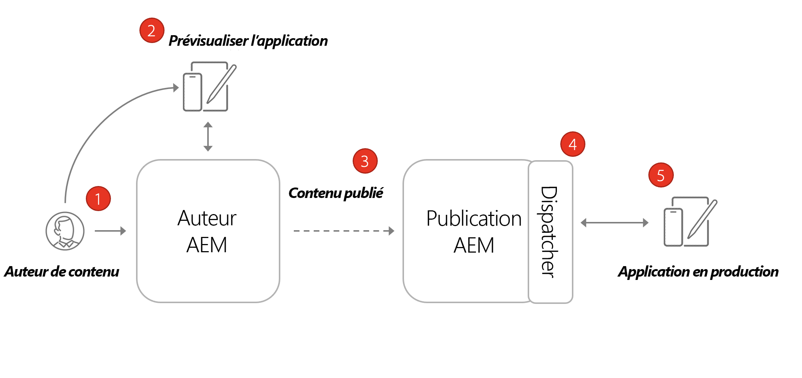
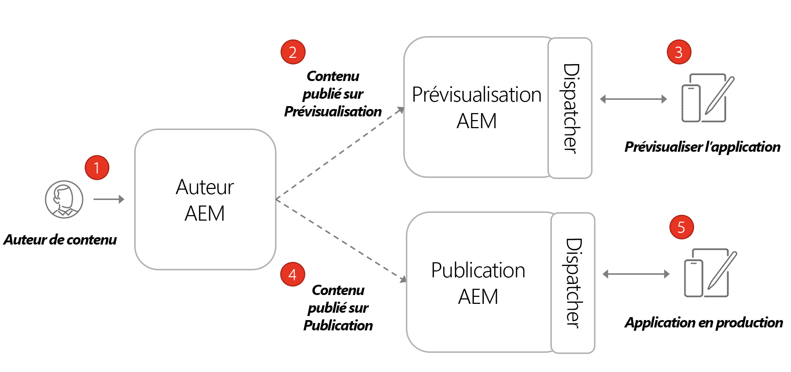

# Architecture AEM découplée

Un environnement d’AEM type est constitué d’un service de création et d’un service de publication, ainsi que d’un service d’aperçu facultatif.

* **Le service Auteur** permet aux utilisateurs internes de créer, gérer et prévisualiser du contenu.

* **Le service de publication** est considéré comme l’environnement « En ligne » et est généralement celui avec lequel les utilisateurs finaux interagissent. Le contenu, après avoir été modifié et approuvé sur le service Auteur, est distribué au service Publication. Le modèle de déploiement le plus courant avec les applications découplées AEM est de connecter la version de production de l’application à un service de publication AEM.

* **Le service d’aperçu** est fonctionnellement identique au **service de publication**. Toutefois, il est uniquement mise à la disposition des utilisateurs internes. Ce système est idéal pour permettre aux approbateurs de passer en revue les modifications de contenu à venir avant la mise en ligne pour les utilisateurs finaux.

* **Le Dispatcher** est un serveur web statique qui est alimenté par le module Dispatcher d’AEM. Il fournit des fonctionnalités de mise en cache et une couche de sécurité supplémentaire. Le **Dispatcher** se trouve en face des services de **Publication** et d’**Aperçu**.

Dans un programme AEM as a Cloud Service, vous pouvez avoir plusieurs environnements, qu’ils soient de développement, d’évaluation ou de production. Chaque environnement possède ses propres services de **Création**, de **Publication** et d’**Aperçu**. Voir [Gestion des environnements](/help/implementing/cloud-manager/manage-environments.md) pour en savoir plus.

## Modèle création/publication

Le modèle de déploiement le plus courant avec les applications découplées AEM est de connecter la version de production de l’application à un service de publication AEM.

Le diagramme ci-dessus illustre ce schéma courant de déploiement.

1. Un **auteur de contenu** utilise le service de création AEM pour créer, modifier et gérer du contenu.
1. L’**auteur de contenu** et d’autres utilisateurs internes peuvent prévisualiser le contenu directement dans le service de création. Une version de prévisualisation de l’application peut être configurée pour qu’elle se connecte au service de création.
1. Une fois le contenu approuvé, il peut être publié sur le service de publication AEM.
1. Le **Dispatcher** est une couche ajoutée au service de **Publication** qui peut mettre en cache certaines requêtes et fournir une couche de sécurité.
1. Les utilisateurs finaux interagissent avec la version de production de l’application. L’application de production se connecte au service de publication via le Dispatcher et utilise les API GraphQL pour demander et utiliser du contenu.

## Déploiement création-prévisualisation-publication

Une autre option pour les déploiements découplés consiste à incorporer un service d’**Aperçu AEM**. Grâce à cette approche, le contenu peut d’abord être publié dans le service de **Prévisualisation** et une version de prévisualisation de l’application découplée peut s’y connecter. L’avantage de cette approche est que le service d’**Aperçu** peut être configuré avec les mêmes exigences et autorisations d’authentification que le service de **Publication**, ce qui facilite la simulation de l’expérience de production.

1. Un **Auteur de contenu** utilise le service de création AEM pour créer, modifier et gérer du contenu.
1. Le contenu est d’abord publié sur le service d’aperçu AEM.
1. Il est possible de configurer une version d’aperçu de l’application qui se connecte au service d’aperçu.
1. Une fois que le contenu a été révisé et approuvé, il peut être publié dans le service de publication AEM.
1. Les utilisateurs finaux interagissent avec la version de production de l’application. L’application de production se connecte au service de publication via le Dispatcher et utilise les API GraphQL pour demander et utiliser du contenu.
