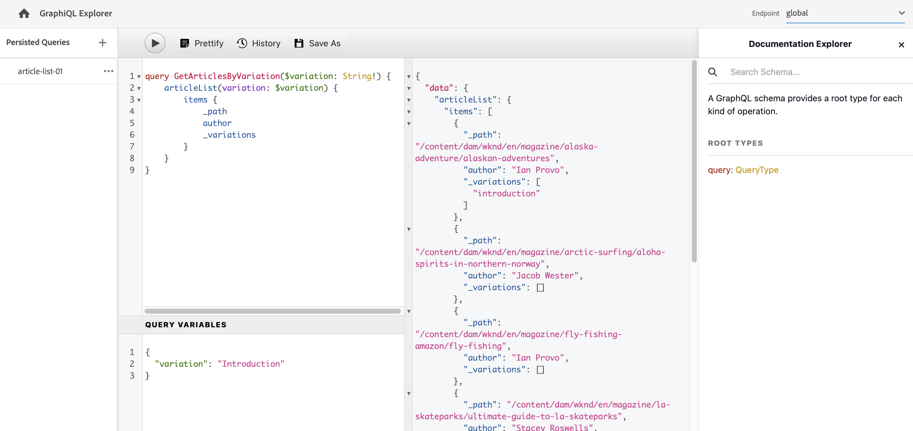

# API AEM GraphQL pour l’utilisation des fragments de contenu {#graphql-api-for-use-with-content-fragments}

>[!IMPORTANT]
>
>Plusieurs fonctionnalités de l’API GraphQL à utiliser avec des fragments de contenu sont disponibles via le programme des utilisateurs et utilisatrices précoces.
>
>Pour consulter le statut et savoir comment appliquer la version si vous êtes intéressé, consultez les [Notes de mise à jour](/help/release-notes/release-notes-cloud/release-notes-current.md).

Découvrez comment utiliser les fragments de contenu dans Adobe Experience Manager (AEM) as a Cloud Service avec l’API AEM GraphQL pour la diffusion de contenu en mode découplé.

L’API GraphQL d’AEM as a Cloud Service utilisée avec des fragments de contenu repose principalement sur l’API open source standard GraphQL.

L’utilisation de l’API GraphQL dans AEM permet la diffusion efficace de fragments de contenu aux clients JavaScript dans les implémentations CMS découplées :

* en évitant les demandes d’API itératives comme avec REST ;
* en veillant à ce que la diffusion soit limitée aux exigences spécifiques ;
* en permettant de diffuser en bloc exactement ce qui est nécessaire pour le rendu en réponse à une seule requête d’API.

>[!NOTE]
>
>GraphQL est actuellement utilisé dans deux scénarios (distincts) dans Adobe Experience Manager (AEM) as a Cloud Service :
>
>* [AEM Commerce utilise les données d’une plateforme commerciale par le biais de GraphQL](/help/commerce-cloud/integrating/magento.md).
>* Les fragments de contenu d’AEM fonctionnent conjointement avec l’API AEM GraphQL (une implémentation personnalisée, basée sur GraphQL standard), pour fournir du contenu structuré à utiliser dans vos applications.

>[!NOTE]
>
>Consultez [API AEM pour la diffusion et la gestion de contenu structuré](/help/headless/apis-headless-and-content-fragments.md) pour un aperçu des différentes API disponibles et une comparaison de certains des concepts impliqués.

>[!NOTE]
>
>Pour obtenir les dernières informations sur les API Experience Manager, consultez également la page [API Adobe Experience Manager as a Cloud Service](https://developer.adobe.com/experience-cloud/experience-manager-apis/).

## L’API GraphQL {#graphql-api}

GraphQL est :

* « *...un langage de requête pour les API et un environnement d’exécution pour répondre à ces requêtes avec vos données existantes. GraphQL fournit une description complète et compréhensible des données de votre API, permet aux clients de demander exactement ce dont ils ont besoin et rien de plus, facilite l’évolution des API au fil du temps et donne accès à de puissants outils de développement.*

  Voir [GraphQL.org](https://graphql.org)

* « *...une spécification ouverte pour une couche d’API flexible. Placez GraphQL sur vos back-ends existants pour créer des produits plus rapidement que jamais...* ».

  Voir [Explore GraphQL](https://www.graphql.com).

* *« ... un langage et une spécification de requête de données développés en interne par Facebook en 2012 avant d’être rendus open source en 2015. C’est une alternative aux architectures basées sur REST destinée à accroître la productivité des développeurs et à réduire les quantités de données transférées. GraphQL est utilisé en production par des centaines d’entreprises de toutes tailles... »*

  Voir [GraphQL Foundation](https://foundation.graphql.org/).

<!--
"*Explore GraphQL is maintained by the Apollo team. Our goal is to give developers and technical leaders around the world the tools they need to understand and adopt GraphQL.*". 
-->

Pour plus d’informations sur l’API GraphQL, voir les sections suivantes (parmi de nombreuses autres ressources) :

* Sur [graphql.org](https://graphql.org) :

   * [Présentation de GraphQL](https://graphql.org/learn)

   * [La spécification GraphQL](https://spec.graphql.org/)

* Sur [graphql.com](https://graphql.com) :

   * [Guides](https://www.graphql.com/guides/)

   * [Tutoriels](https://www.graphql.com/tutorials/)

   * [Études de cas](https://www.graphql.com/case-studies/)

La mise en œuvre GraphQL pour AEM repose sur la bibliothèque Java GraphQL standard. Voir :

* [graphQL.org – Java](https://graphql.org/code/#java)

* [GraphQL Java sur GitHub](https://github.com/graphql-java)

### Terminologie GraphQL {#graphql-terminology}

GraphQL utilise les éléments suivants :

* **[Requêtes](https://graphql.org/learn/queries/)**

* **[Schémas et types](https://graphql.org/learn/schema/)** :

   * Les schémas sont générés par AEM en fonction des modèles de fragment de contenu.
   * Grâce à vos schémas, GraphQL présente les types et les opérations autorisés pour l’implémentation de GraphQL pour AEM.

* **[Champs](https://graphql.org/learn/queries/#fields)**

* **[Point d’entrée GraphQL](graphql-endpoint.md)**
   * Le chemin d’accès dans AEM qui répond aux requêtes GraphQL et permet d’accéder aux schémas GraphQL.

   * Voir [Activation de votre point d’entrée GraphQL](graphql-endpoint.md) pour plus de détails.

Voir la [Présentation de GraphQL (GraphQL.org)](https://graphql.org/learn/) pour des détails complets, y compris les [Bonnes pratiques](https://graphql.org/learn/best-practices/).

### Types de requêtes GraphQL {#graphql-query-types}

GraphQL permet de réaliser des requêtes pour renvoyer, au choix :

* Une **entrée unique**

* Une **[liste d’entrées](https://graphql.org/learn/schema/#lists-and-non-null)**

AEM fournit des fonctionnalités de conversion des requêtes (des deux types) en [Requêtes persistantes, qui peuvent être mises en cache](/help/headless/graphql-api/persisted-queries.md) par Dispatcher et le réseau CDN.

### Bonnes pratiques en matière de requêtes GraphQL (Dispatcher et réseau CDN) {#graphql-query-best-practices}

Il est recommandé d’utiliser les [Requêtes persistantes](/help/headless/graphql-api/persisted-queries.md) sur les instances de publication en raison des avantages suivants :

* Elles sont mises en cache.
* Elles sont gérées de manière centralisée par AEM as a Cloud Service.

>[!NOTE]
>
>En règle générale, les instances de création ne possèdent pas de Dispatcher/réseau CDN. L’utilisation des requêtes persistantes n’offre donc aucun avantage, sauf à des fins de test.

Les requêtes GraphQL utilisant des requêtes POST ne sont pas recommandées, car elles ne sont pas mises en cache. Par conséquent, dans une instance par défaut, Dispatcher est configuré pour bloquer ces requêtes.

Bien que GraphQL prenne également en charge les requêtes GET, celles-ci peuvent atteindre des limites (par exemple, la longueur de l’URL) qui peuvent être évitées grâce aux Requêtes persistantes.

Voir [Activer le cache des requêtes persistantes](/help/headless/deployment/dispatcher-caching.md) pour plus de détails.

>[!NOTE]
>
>Pour autoriser les requêtes directes et/ou POST dans Dispatcher, vous pouvez demander à votre administrateur ou administratrice système de :
>
>* créer une [variable d’environnement Cloud Manager](/help/implementing/cloud-manager/environment-variables.md) appelée `ENABLE_GRAPHQL_ENDPOINT`
>* avec la valeur `true`.

>[!NOTE]
>
>Il se peut que la possibilité d’effectuer des requêtes directes devienne obsolète à un moment donné.

### IDE GraphiQL {#graphiql-ide}

Vous pouvez tester et déboguer des requêtes GraphQL à l’aide de l’[IDE GraphiQL](/help/headless/graphql-api/graphiql-ide.md).

## Cas d’utilisation pour la création, la prévisualisation et la publication {#use-cases-author-preview-publish}

Les cas d’utilisation peuvent dépendre du type d’environnement AEM as a Cloud Service :

* Environnement de publication, utilisé pour :
   * Réaliser des requête de données pour l’application JS (cas d’utilisation standard)

* Environnement de prévisualisation, utilisé pour :
   * Prévisualiser des requêtes avant le déploiement dans l’environnement de publication
      * Réaliser des requête de données pour l’application JS (cas d’utilisation standard)

* Environnement de création, utilisé pour :
   * Réaliser des requêtes de données à des fins de gestion de contenu :
      * GraphQL dans AEM as a Cloud Service est actuellement une API en lecture seule.
      * L’API REST peut être utilisée pour les opérations CR(u)D.

## Autorisations {#permission}

Les autorisations sont celles requises pour accéder aux ressources.

Les requêtes GraphQL sont exécutées avec l’autorisation de l’utilisateur ou utilisatrice AEM de la requête sous-jacente. Si l’utilisateur ou l’utilisatrice ne dispose pas d’un accès en lecture à certains fragments (stockés en tant que ressources), ils ne feront pas partie du jeu de résultats.

En outre, l’utilisateur ou l’utilisatrice doit avoir accès à un point d’entrée GraphQL pour pouvoir exécuter des requêtes GraphQL.

## Génération de schémas {#schema-generation}

GraphQL est une API fortement typée, ce qui signifie que les données doivent être clairement structurées et organisées par type.

La spécification GraphQL fournit une série de directives sur la création d’une API robuste pour interroger les données sur une certaine instance. Pour ce faire, un client doit récupérer le [Schéma](#schema-generation), qui contient tous les types nécessaires à une requête.

Pour les fragments de contenu, les schémas GraphQL (structure et types) reposent sur des [Modèles de fragments de contenu](/help/sites-cloud/administering/content-fragments/content-fragment-models.md) **activés** et leurs types de données

>[!CAUTION]
>
>Tous les schémas GraphQL (dérivés de modèles de fragments de contenu qui ont été **activés**) sont lisibles par le point d’entrée GraphQL.
>
>En d’autres termes, vous devez vous assurer qu’aucune donnée sensible n’est disponible, car elle peut être divulguée de cette façon ; par exemple, cela concerne des informations qui peuvent être présentes sous forme de noms de champ dans la définition de modèle.

Par exemple, si un utilisateur ou une utilisatrice crée un modèle de fragment de contenu appelé `Article`, alors AEM génère un `ArticleModel` de type GraphQL. Les champs de ce type correspondent aux champs et aux types de données définis dans le modèle. AEM crée également des points d’entrée pour les requêtes qui opèrent sur ce type, comme `articleByPath` ou `articleList`.

1. Un modèle de fragment de contenu :

   

1. Le schéma GraphQL correspondant (sortie de la documentation automatique GraphiQL) :
   

   Cela montre que le type généré `ArticleModel` contient plusieurs [champs](#fields).

   * Trois d’entre eux ont été contrôlés par l’utilisateur : `author`, `main` et `referencearticle`.

   * Les autres champs ont été ajoutés automatiquement par AEM et représentent des méthodes utiles pour fournir des informations sur un certain fragment de contenu (dans cet exemple, les [« champs d’aide »](#helper-fields) `_path`, `_metadata` et `_variations`).

1. Après qu’un utilisateur a créé un fragment de contenu reposant sur le modèle d’article, il peut être interrogé via GraphQL. Vous trouverez des exemples à la section [Exemples de Requêtes](/help/headless/graphql-api/sample-queries.md#graphql-sample-queries) (basée sur un [modèle de structure de fragment de contenu à utiliser avec GraphQL](/help/headless/graphql-api/sample-queries.md#content-fragment-structure-graphql)).

Dans GraphQL pour AEM, le schéma est flexible. Cela signifie qu’il est généré automatiquement à chaque fois qu’un modèle de fragment de contenu est créé, mis à jour ou supprimé. Les caches de schémas de données sont également actualisés lorsque vous mettez à jour un modèle de fragment de contenu.

<!-- move the following to a separate "in depth" page -->

Les caches de schémas de données sont également actualisés lorsque vous mettez à jour un modèle de fragment de contenu.

Le service Sites GraphQL écoute (en arrière-plan) toutes les modifications apportées à un modèle de fragment de contenu. Lorsque des mises à jour sont détectées, seule cette partie du schéma est régénérée. Cette optimisation permet de gagner du temps et d’apporter de la stabilité.

Par exemple, si vous :

1. Installez un package contenant `Content-Fragment-Model-1` et `Content-Fragment-Model-2` :

   1. Les types GraphQL pour `Model-1` et `Model-2` sont générés.

1. Puis modifiez `Content-Fragment-Model-2` :

   1. Seul le type `Model-2` GraphQL sera mis à jour.

   1. Alors que `Model-1` restera le même.

>[!NOTE]
>
>Il est important de le noter si vous souhaitez effectuer des mises à jour en bloc sur les modèles de fragments de contenu via l’API REST, ou autrement.

Le schéma est desservi par le même point d’entrée que les requêtes GraphQL, le client gérant le fait que le schéma est appelé avec l’extension `GQLschema`. Par exemple, l’exécution d’une requête `GET` simple sur `/content/cq:graphql/global/endpoint.GQLschema` entraîne la sortie du schéma avec le type de contenu : `text/x-graphql-schema;charset=iso-8859-1`.

<!-- move through to here to a separate "in depth" page -->

### Génération de schémas – Modèles dépubliés {#schema-generation-unpublished-models}

Lorsque des fragments de contenu sont imbriqués, il se peut qu’un modèle de fragment de contenu parent soit publié, mais pas un modèle référencé.

>[!NOTE]
>
>L’interface utilisateur d’AEM empêche cela, mais si la publication est effectuée par programmation ou avec des packages de contenu, elle peut être effectuée.

Dans ce cas, AEM génère un schéma *incomplet* pour le modèle de fragment de contenu parent. Cela signifie que la référence au fragment, qui dépend du modèle dépublié, est supprimée du schéma.

## Champs {#fields}

Le schéma comporte des champs individuels de deux catégories de base :

* Champs que vous générez.

  Une sélection de [types de données](#Data-types) est utilisée pour créer des champs en fonction de la configuration du modèle de fragment de contenu. Les noms des champs proviennent du champ **Nom de la propriété** de l’onglet **Type de données**.

   * Prenez également en compte le paramètre **Rendre en tant que**, car les utilisateurs et utilisatrices peuvent configurer certains types de données. Par exemple, pour configurer un champ de texte monoligne afin de contenir plusieurs textes monolignes, choisissez `multifield` dans la liste déroulante.

* GraphQL pour AEM génère également plusieurs [champs d’assistance](#helper-fields).

### Types de données {#data-types}

GraphQL pour AEM prend en charge une liste de types. Tous les types de données de modèles de fragments de contenu pris en charge et les types GraphQL correspondants sont représentés :

| Modèle de fragment de contenu – Type de données | Type GraphQL | Description |
|--- |--- |--- |
| Une seule ligne de texte | `String`, `[String]` | Utilisé pour les chaînes simples telles que les noms de créateur ou de créatrice, les noms d’emplacement, etc. |
| Plusieurs lignes de texte | `String`, `[String]` | Utilisé pour la sortie de texte, telle que le corps d’un article |
| Nombre | `Float`, `[Float]` | Utilisé pour afficher le nombre à virgule flottante et les nombres réguliers |
| Booléen | `Boolean` | Utilisé pour afficher les cases à cocher → simples instructions vrai/faux |
| Date et heure | `Calendar` | Utilisé pour afficher la date et l’heure au format ISO 8601. Selon le type sélectionné, trois versions sont disponibles dans AEM GraphQL : `onlyDate`, `onlyTime`, `dateTime` |
| Énumération | `String` | Utilisé pour afficher une option à partir d’une liste d’options définies lors de la création du modèle |
| Balises | `[String]` | Utilisé pour afficher une liste de chaînes représentant les balises utilisées dans AEM |
| Référence de contenu | `String`, `[String]` | Utilisé pour afficher le chemin vers une autre ressource dans AEM |
| Référence de contenu (UUID) | `String`, `[String]` | Utilisé pour afficher le chemin, représenté par un UUID vers une autre ressource dans AEM |
| Référence du fragment | *Type de modèle* <br><br>Champ unique : `Model` - Type de modèle, référencé directement <br><br>Multichamp, avec un type référencé : `[Model]` - Tableau de type `Model`, référencé directement depuis le tableau <br><br>Multichamp, avec plusieurs types référencés : `[AllFragmentModels]` - Tableau de tous les types de modèles, référencé depuis un tableau avec type union | Utilisé pour référencer un ou plusieurs fragments de contenu de certains types de modèles, définis lors de la création du modèle |
| Référence de fragment (UUID) | *Type de modèle* <br><br>Champ unique : `Model` - Type de modèle, référencé directement <br><br>Multichamp, avec un type référencé : `[Model]` - Tableau de type `Model`, référencé directement depuis le tableau <br><br>Multichamp, avec plusieurs types référencés : `[AllFragmentModels]` - Tableau de tous les types de modèles, référencé depuis un tableau avec type union | Utilisé pour référencer un ou plusieurs fragments de contenu de certains types de modèles, définis lors de la création du modèle |

{style="table-layout:auto"}

### Champs d’assistant {#helper-fields}

Outre les types de données des champs générés par l’utilisateur, GraphQL pour AEM génère également plusieurs champs *helper* pour faciliter l’identification d’un fragment de contenu ou fournir des informations supplémentaires sur un fragment de contenu.

Ces [champs d’assistance](#helper-fields) sont précédés d’un `_` pour distinguer ce qui a été défini par l’utilisateur ou l’utilisatrice de ce qui a été généré automatiquement.

#### Chemin d’accès {#path}

Le champ de chemin est utilisé comme identificateur dans AEM GraphQL. Il représente le chemin d’accès de la ressource de fragment de contenu dans le référentiel AEM. Nous l’avons choisi comme identificateur d’un fragment de contenu, car il :

* est unique dans AEM ;
* peut facilement être récupéré.

Le code suivant affiche les chemins de tous les fragments de contenu créés à partir du modèle de fragment de contenu `Author`, comme décrit dans le tutoriel WKND.

```graphql
{
  authorList {
    items {
      _path
    }
  }
}
```

Pour récupérer un fragment de contenu unique d’un type spécifique, vous devez commencer par déterminer son chemin d’accès. Par exemple :

```graphql
{
  authorByPath(_path: "/content/dam/wknd-shared/en/contributors/sofia-sj-berg") {
    item {
      _path
      firstName
      lastName
    }
  }
}
```

Voir [Exemple de requête – Un fragment de ville unique et spécifique](/help/headless/graphql-api/sample-queries.md#sample-single-specific-city-fragment).

#### ID (UUID) {#id-uuid}

Le champ d’identifiant est également utilisé comme identifiant dans AEM GraphQL. Il représente le chemin d’accès de la ressource de fragment de contenu dans le référentiel AEM, mais au lieu de contenir le chemin d’accès réel, il contient un UUID représentant la ressource. Nous l’avons choisi comme identificateur d’un fragment de contenu, car il :

* est unique dans AEM ;
* facilement récupérables,
* ne change pas lorsque la ressource est déplacée.

L’UUID d’un fragment de contenu et d’un fragment de contenu ou d’une ressource référencé(e) peut être renvoyé via la `_id` de propriété JSON.

```graphql
{
  articleList {
    items {
        _id
        _path
    }
  }
}
```

#### Métadonnées {#metadata}

Par le biais de GraphQL, AEM expose également les métadonnées d’un fragment de contenu. Les métadonnées sont les informations qui décrivent un fragment de contenu, comme le titre d’un fragment de contenu, le chemin d’accès à la miniature, la description d’un fragment de contenu, la date de création, etc.

Les métadonnées étant générées par l’éditeur de schémas et n’ayant donc pas de structure spécifique, le type `TypedMetaData` GraphQL a été implémenté pour exposer les métadonnées d’un fragment de contenu. `TypedMetaData` expose les informations regroupées selon les types scalaires suivants :

| Champ |
|--- |
| `stringMetadata:[StringMetadata]!` |
| `stringArrayMetadata:[StringArrayMetadata]!` |
| `intMetadata:[IntMetadata]!` |
| `intArrayMetadata:[IntArrayMetadata]!` |
| `floatMetadata:[FloatMetadata]!` |
| `floatArrayMetadata:[FloatArrayMetadata]!` |
| `booleanMetadata:[BooleanMetadata]!` |
| `booleanArrayMetadata:[booleanArrayMetadata]!` |
| `calendarMetadata:[CalendarMetadata]!` |
| `calendarArrayMetadata:[CalendarArrayMetadata]!` |

Chaque type scalaire représente soit une paire nom-valeur unique, soit un tableau de paires nom-valeur, où la valeur d’une paire est du type dans lequel elle a été regroupée.

Par exemple, si vous souhaitez récupérer le titre d’un fragment de contenu, nous savons que cette propriété est une propriété Chaîne et recherchons donc toutes les métadonnées Chaîne :

Pour rechercher des métadonnées :

```graphql
{
  authorByPath(_path: "/content/dam/wknd-shared/en/contributors/sofia-sj-berg") {
    item {
      _metadata {
        stringMetadata {
          name
          value
        }
      }
    }
  }
}
```

Vous pouvez afficher tous les types GraphQL de métadonnées si vous affichez le schéma GraphQL généré. Tous les types de modèle ont le même `TypedMetaData`.

>[!NOTE]
>
>**Différence entre les métadonnées normales et les métadonnées de tableau**
>Gardez à l’esprit que `StringMetadata` et `StringArrayMetadata` se rapportent tous deux à ce qui est stocké dans le référentiel et non à la façon dont vous les récupérez.
>
>Par exemple, en appelant le champ `stringMetadata`, vous recevriez un tableau de toutes les métadonnées stockées dans le référentiel comme `String` et en appelant `stringArrayMetadata`, vous recevriez un tableau de toutes les métadonnées stockées dans le référentiel comme `String[]`.

Voir [Exemple de requête pour les métadonnées – Répertorier les métadonnées des prix intitulés GB](/help/headless/graphql-api/sample-queries.md#sample-metadata-awards-gb).

#### Variations {#variations}

Le champ `_variations` a été implémenté pour simplifier la recherche de variations d’un fragment de contenu. Par exemple :

```graphql
{
  authorByPath(_path: "/content/dam/wknd-shared/en/contributors/ian-provo") {
    item {
      _variations
    }
  }
}
```

>[!NOTE]
>
>Le champ `_variations` ne contient pas de variation `master`, car techniquement les données d’origine (référencées comme *Principal* dans l’interface utilisateur) ne sont pas considérées comme une variation explicite.

Voir [Exemple de requête – Toutes les villes avec une variation nommée](/help/headless/graphql-api/sample-queries.md#sample-cities-named-variation).

>[!NOTE]
>
>Si la variation donnée n’existe pas pour un fragment de contenu, les données d’origine (également appelées variation principale) sont renvoyées comme valeur (de secours) par défaut.

<!--
## Security Considerations {#security-considerations}
-->

## Variables GraphQL {#graphql-variables}

GraphQL permet de placer des variables dans la requête. Pour plus d’informations, voir [Documentation GraphQL pour les variables](https://graphql.org/learn/queries/#variables).

Par exemple, pour obtenir tous les fragments de contenu de type `Author` dans une variation spécifique (si disponible), vous pouvez spécifier l’argument `variation` dans GraphiQL.



**Requête** :

```graphql
query($variation: String!) {
  authorList(variation: $variation) {
    items {
      _variation
      lastName
      firstName
    }
  }
}
```

**Variables de requête** :

```json
{
  "variation": "another"
}
```

Cette requête renverra la liste complète des auteurs. Les auteurs qui n’ont pas la variation `another` reviendront aux données d’origine (`_variation` indiquera `master` dans ce cas).

Appliquez un [filtre](#filtering) si vous souhaitez limiter la liste aux céateurs et créatrices qui fournissent la variation spécifiée (et ignorer les créateurs et créatrices qui reviennent aux données d’origine) :

```graphql
query($variation: String!) {
  authorList(variation: $variation, filter: {
    _variation: {
      _expressions: {
        value: $variation
      }
    }
  }) {
    items {
      _variation
      lastName
      firstName
    }
  }
}
```

## Directives GraphQL {#graphql-directives}

Dans GraphQL, il est possible de modifier la requête en fonction de variables, nommées directives GraphQL.

Par exemple, vous pouvez inclure ici le champ `adventurePrice` dans une requête pour tous les `AdventureModels`, en fonction d’une variable `includePrice`.


**Requête** :

```graphql
query GetAdventureByType($includePrice: Boolean!) {
  adventureList {
    items {
      title
      price @include(if: $includePrice)
    }
  }
}
```

**Variables de requête** :

```json
{
    "includePrice": true
}
```

## Filtrage {#filtering}

Vous pouvez également utiliser le filtrage dans vos requêtes GraphQL pour renvoyer des données spécifiques.

Le filtrage utilise une syntaxe basée sur des expressions et des opérateurs logiques.

La partie la plus atomique est une expression unique qui peut être appliquée au contenu d’un certain champ. Il compare le contenu du champ avec une valeur constante donnée.

Par exemple, l’expression

```graphql
{
  value: "some text"
  _op: EQUALS
}
```

compare le contenu du champ à la valeur `some text` et réussit si le contenu est égal à la valeur. Dans le cas contraire, l’expression échouera.

Les opérateurs suivants peuvent être utilisés pour comparer les champs à une certaine valeur :

| Opérateur | Type(s) | L’expression réussit si… |
|--- |--- |--- |
| `EQUALS` | `String`, `ID`, `Boolean` | ...la valeur est exactement la même que le contenu du champ. |
| `EQUALS_NOT` | `String`, `ID` | …la valeur n’est *pas* identique au contenu du champ. |
| `CONTAINS` | `String` | …le contenu du champ contient la valeur (`{ value: "mas", _op: CONTAINS }` correspondra à `Christmas`, `Xmas`, `master`…). |
| `CONTAINS_NOT` | `String` | …le contenu du champ ne contient *pas* la valeur. |
| `STARTS_WITH` | `ID` | …l’identifiant commence par une certaine valeur (`{ value: "/content/dam/", _op: STARTS_WITH` correspondra à `/content/dam/path/to/fragment`, mais pas à `/namespace/content/dam/something`. |
| `EQUAL` | `Int`, `Float` | ...la valeur est exactement la même que le contenu du champ. |
| `UNEQUAL` | `Int`, `Float` | …la valeur n’est *pas* identique au contenu du champ. |
| `GREATER` | `Int`, `Float` | …le contenu du champ est supérieur à la valeur. |
| `GREATER_EQUAL` | `Int`, `Float` | …le contenu du champ est supérieur ou égal à la valeur. |
| `LOWER` | `Int`, `Float` | …le contenu du champ est inférieur à la valeur. |
| `LOWER_EQUAL` | `Int`, `Float` | …le contenu du champ est inférieur ou égal à la valeur. |
| `AT` | `Calendar`, `Date`, `Time` | …le contenu du champ est exactement le même que la valeur (y compris le réglage du fuseau horaire). |
| `NOT_AT` | `Calendar`, `Date`, `Time` | …le contenu du champ n’est *pas* identique à la valeur. |
| `BEFORE` | `Calendar`, `Date`, `Time` | …le moment indiqué par la valeur est antérieur au moment indiqué par le contenu du champ. |
| `AT_OR_BEFORE` | `Calendar`, `Date`, `Time` | …le moment indiqué par la valeur est antérieur ou égal au moment indiqué par le contenu du champ. |
| `AFTER` | `Calendar`, `Date`, `Time` | …le moment indiqué par la valeur est postérieur au moment indiqué par le contenu du champ. |
| `AT_OR_AFTER` | `Calendar`, `Date`, `Time` | …le moment indiqué par la valeur est postérieur ou égal au moment indiqué par le contenu du champ. |

Certains types vous permettent également de spécifier des options supplémentaires qui modifient la manière dont une expression est évaluée :

| Option | Type(s) | Description |
|--- |--- |--- |
| `_ignoreCase` | `String` | Ignore la casse d’une chaîne ; par exemple, une valeur de `time` correspond à `TIME`, `time`, `tImE`, ... |
| `_sensitiveness` | `Float` | Permet une certaine marge pour que les valeurs `float` soient considérées comme identiques (pour contourner les limitations techniques en raison de la représentation interne des valeurs `float`). Cette option n’est pas recommandée en raison de son impact négatif sur les performances. |

Les expressions peuvent être combinées à un jeu à l’aide d’un opérateur logique (`_logOp`) :

* `OR` : le jeu d’expressions réussit si au moins une expression réussit.
* `AND` : le jeu d’expressions réussit si toutes les expressions réussissent (par défaut).

Chaque champ peut être filtré par son propre jeu d’expressions. Les jeux d’expressions de tous les champs mentionnés dans l’argument de filtre seront finalement combinés par leur propre opérateur logique.

Une définition de filtre (transmise comme l’argument `filter` dans une requête) contient les éléments suivants :

* Une sous-définition pour chaque champ (le champ est accessible via son nom, par exemple, il y a un champ `lastName` dans le filtre pour le champ `lastName` dans le type de données (champ)).
* Chaque sous-définition contient le tableau `_expressions`, qui fournit le jeu d’expressions, ainsi que le champ `_logOp`, qui définit l’opérateur logique avec lequel les expressions doivent être combinées.
* Chaque expression est définie par la valeur (champ `value`) et l’opérateur (champ `_operator`) auxquels le contenu d’un champ doit être comparé.

Vous pouvez omettre l’`_logOp` si vous souhaitez combiner des éléments avec des `AND` et l’`_operator` si vous souhaitez vérifier l’égalité, car il s’agit des valeurs par défaut.

L’exemple suivant illustre une requête complète qui filtre toutes les personnes dont le `lastName` est `Provo` ou contenant `sjö`, quel que soit le cas :

```graphql
{
  authorList(filter: {
    lastname: {
      _logOp: OR
      _expressions: [
        {
          value: "sjö",
          _operator: CONTAINS,
          _ignoreCase: true
        },
        {
          value: "Provo"
        }
      ]
    }
  }) {
    items {
      lastName
      firstName
    }
  }
}
```

Il n’est pas recommandé de filtrer les champs imbriqués (bien que cela soit possible), car cela peut entraîner des problèmes de performances.

Pour accéder à d’autres exemples, voir :

* détails des [extensions GraphQL pour AEM](#graphql-extensions)

* [Modèles de requêtes utilisant ce modèle de contenu et de structure](/help/headless/graphql-api/sample-queries.md#graphql-sample-queries-sample-content-fragment-structure)

   * et [Modèle de contenu et de structure](/help/headless/graphql-api/sample-queries.md#content-fragment-structure-graphql) préparé pour une utilisation dans des modèles de requêtes

* [Modèles de requêtes basées sur le projet WKND](/help/headless/graphql-api/sample-queries.md#sample-queries-using-wknd-project)

## Tri {#sorting}

>[!NOTE]
>
>Pour obtenir de meilleures performances, effectuez la [mise à jour de vos fragments de contenu pour la pagination et le tri dans le filtrage GraphQL](/help/headless/graphql-api/graphql-optimized-filtering-content-update.md).

Cette fonctionnalité vous permet de trier les résultats de la requête en fonction d’un champ spécifié.

Les critères de tri sont les suivants :

* il s’agit d’une liste de valeurs séparées par des virgules représentant le chemin du champ,
   * le premier champ de la liste définit l’ordre de tri principal, le second est utilisé si deux valeurs du critère de tri principal sont égales, le troisième si les deux premiers critères sont égaux, etc.
   * notation en pointillés, c’est-à-dire field1.subfield.subfield et ainsi de suite...
* avec un sens d’ordre optionnel,
   * ASC (croissant) ou DESC (décroissant) ; la valeur par défaut est ASC,
   * le sens d’ordre peut être spécifié par champ : vous pouvez trier un champ par ordre croissant et un autre par ordre décroissant (name, firstName DESC).

Par exemple :

```graphql
query {
  authorList(sort: "lastName, firstName") {
    items {
      firstName
      lastName
    }
  }
}
```

Un autre exemple :

```graphql
{
  authorList(sort: "lastName DESC, firstName DESC") {
    items {
        lastName
        firstName
    }
  }
}
```

Vous pouvez également trier un champ dans un fragment imbriqué au format `nestedFragmentname.fieldname`.

>[!NOTE]
>
>Cette opération peut avoir un impact négatif sur les performances.

Par exemple :

```graphql
query {
  articleList(sort: "authorFragment.lastName")  {
    items {
      title
      authorFragment {
        firstName
        lastName
        birthDay
      }
      slug
    }
  }
}
```

## Pagination {#paging}

>[!NOTE]
>
>Pour obtenir de meilleures performances, effectuez la [mise à jour de vos fragments de contenu pour la pagination et le tri dans le filtrage GraphQL](/help/headless/graphql-api/graphql-optimized-filtering-content-update.md).

Cette fonctionnalité vous permet d’effectuer une pagination sur les types de requête qui renvoient une liste. Deux méthodes sont proposées :

* `offset` et `limit` dans une requête `List`
* `first` et `after` dans une requête `Paginated`

### Requête de liste : « offset » et « limit » {#list-offset-limit}

Dans une requête `...List`, vous pouvez utiliser `offset` et `limit` pour renvoyer un sous-ensemble spécifique de résultats :

* `offset` : spécifie le premier jeu de données à renvoyer.
* `limit` : spécifie le nombre maximal de jeux de données à renvoyer.

Par exemple, pour obtenir la page de résultats contenant jusqu’à cinq articles, en commençant par le cinquième article de la liste *complète* des résultats, effectuez l’opération suivante :

```graphql
query {
   articleList(offset: 5, limit: 5) {
    items {
      authorFragment {
        lastName
        firstName
      }
    }
  }
}
```

<!-- When available link to BP and replace "JCR query level" with a more neutral term. -->

<!-- When available link to BP and replace "JCR query result set" with a more neutral term. -->

>[!NOTE]
>
>* La pagination nécessite un ordre de tri stable pour fonctionner correctement sur plusieurs requêtes demandant différentes pages du même jeu de résultats. Par défaut, il utilise le chemin d’accès au référentiel de chaque élément du jeu de résultats pour s’assurer que l’ordre est toujours le même. Si un ordre de tri différent est utilisé et si ce tri ne peut pas être effectué au niveau de la requête JCR, cela a un impact sur les performances, car le jeu complet de résultats doit être chargé en mémoire avant que les pages puissent être déterminées.
>
>* Plus le décalage est élevé, plus il faudra de temps pour ignorer les éléments du jeu complet de résultats de la requête JCR. Une autre solution pour les jeux de résultats volumineux consiste à utiliser la requête paginée avec la méthode `first` et `after`.

### Requête paginée : « first » et « after » {#paginated-first-after}

Le type de requête `...Paginated` utilise la plupart des fonctionnalités du type de requête `...List` (filtrage et tri), mais au lieu d’utiliser les arguments `offset`/`limit`, il utilise les arguments `first`/`after` tels que définis dans la [Spécification des connexions basées sur le curseur GraphQL](https://relay.dev/graphql/connections.htm). Consultez une introduction moins formelle dans la [Présentation de GraphQL](https://graphql.org/learn/pagination/#pagination-and-edges).

* `first` : les `n` premiers éléments à renvoyer.
La valeur par défaut est `50`.
La valeur maximale est `100`.
* `after` : le curseur qui détermine le début de la page demandée. Notez que l’élément représenté par le curseur n’est pas inclus dans le jeu de résultats. Le curseur d’un élément est déterminé par le champ `cursor` de la structure `edges`.

Par exemple, vous pouvez afficher la page des résultats contenant jusqu’à cinq aventures, à partir de l’élément donné du curseur dans la liste *complète* des résultats :

```graphql
query {
    adventurePaginated(first: 5, after: "ODg1MmMyMmEtZTAzMy00MTNjLThiMzMtZGQyMzY5ZTNjN2M1") {
        edges {
          cursor
          node {
            title
          }
        }
        pageInfo {
          endCursor
          hasNextPage
        }
    }
}
```

<!-- When available link to BP -->
<!-- Due to internal technical constraints, performance will degrade if sorting and filtering is applied on nested fields. Therefore it is recommended to use filter/sort fields stored at root level. For more information, see the [Best Practices document](link). -->

>[!NOTE]
>
>* Par défaut, la pagination utilise l’UUID du nœud du référentiel représentant le fragment afin de s’assurer que l’ordre des résultats est toujours le même. Lorsque `sort` est utilisé, l’UUID est implicitement utilisé pour assurer un tri unique, même pour deux éléments disposant de clés de tri identiques.
>
>* En raison de contraintes techniques internes, les performances se dégradent si le tri et le filtrage sont appliqués aux champs imbriqués. Il est donc recommandé d’utiliser des champs de filtrage/tri stockés au niveau racine. Il s’agit également de la méthode recommandée si vous souhaitez interroger des jeux de résultats paginés volumineux.

## Diffusion d’images optimisées pour le web dans des requêtes GraphQL {#web-optimized-image-delivery-in-graphql-queries}

La diffusion d’images optimisées pour le web vous permet d’utiliser une requête Graphql pour :

* Demander une URL à une image de ressource de gestion des ressources numériques (référencée par une **Référence de contenu**)

* Transmettez des paramètres avec la requête, de sorte qu’un rendu spécifique de l’image soit automatiquement généré et renvoyé.

  >[!NOTE]
  >
  >Le rendu spécifié n’est pas stocké dans AEM Assets. Le rendu est généré et conservé dans le cache pendant une courte période.

* Renvoyer l’URL dans le cadre de la diffusion JSON

Vous pouvez utiliser AEM pour :

* Transmettre la [Diffusion d’images optimisées pour le web](https://experienceleague.adobe.com/docs/experience-manager-core-components/using/developing/web-optimized-image-delivery.html?lang=fr) dans les requêtes GraphQL.

Cela signifie que les commandes sont appliquées lors de l’exécution de la requête, de la même manière que les paramètres d’URL sur les demandes GET pour ces images.

Vous pouvez ainsi créer dynamiquement des rendus d’image pour la diffusion JSON, ce qui évite d’avoir à créer et stocker manuellement ces rendus dans le référentiel.

La solution de GraphQL vous permet :

* Demander une URL : utiliser `_dynamicUrl` sur la référence `ImageRef`

* Transmettre des paramètres : ajoutez des `_assetTransform` à l’en-tête de liste où vos filtres sont définis.

>[!NOTE]
>
>Une **Référence de contenu** peut être utilisée pour les ressources de gestion des ressources numériques et les ressources Dynamic Media. La récupération de l’URL appropriée utilise différents paramètres :
>* `_dynamicUrl` : ressource DAM
>* `_dmS7Url` : ressource Dynamic Media
> 
>Si la ressource référencée est une ressource DAM, la valeur de `_dmS7Url` est `null`. Voir [ Diffusion de ressources Dynamic Media par URL dans les requêtes GraphQL](#dynamic-media-asset-delivery-by-url).

### Structure de la demande de transformation {#structure-transformation-request}

`AssetTransform` (`_assetTransform`) est utilisé pour effectuer les demandes de transformation d’URL.

La structure et la syntaxe sont les suivantes :

* `format` : une énumération avec tous les formats pris en charge par son extension : GIF, PNG, PNG8, JPG, PJPG, BJPG, WEBP, WEBPLL ou WEBPLY ;
* `seoName` : une chaîne qui est utilisée comme nom de fichier au lieu du nom de nœud ;
* `crop` : une sous-structure d’image, si la largeur ou la hauteur est omise alors la hauteur ou la largeur est utilisée comme même valeur ;
   * `xOrigin` : l’origine x de l’image, obligatoire ;
   * `yOrigin` : l’origine y de l’image, obligatoire ;
   * `width` : la largeur de l’image ;
   * `height` : la hauteur de l’image ;
* `size` : une sous-structure de dimension, si la largeur ou la hauteur est omise alors la hauteur ou la largeur est utilisée comme même valeur ;
   * `width` : la largeur de la dimension ;
   * `height` : la hauteur de la dimension ;
* `rotation` : une énumération de toutes les rotations prises en charge : R90, R180, R270 ;
* `flip` : une énumération de HORIZONTAL, VERTICAL, HORIZONTAL_AND_VERTICAL ;
* `quality` : un entier compris entre 1 et 100 indiquant le pourcentage de la qualité de l’image ;
* `width` : un entier qui définit la largeur de l’image de sortie, mais qui est ignoré par le générateur d’images ;
* `preferWebp` : une valeur booléenne qui indique si webp est préférable (la valeur par défaut est false).

La transformation d’URL est disponible pour tous les types de requête : par chemin, liste ou paginé.

### Diffusion d’images optimisées pour le web avec des paramètres complets {#web-optimized-image-delivery-full-parameters}

Voici un exemple de requête avec un ensemble complet de paramètres :

```graphql
{
  articleList(
    _assetTransform: {
      format:GIF
      seoName:"test"
      crop:{
        xOrigin:10
        yOrigin:20
        width:50
        height:45
      }
      size:{
        height:100
        width:200
      }
      rotation:R90
      flip:HORIZONTAL_AND_VERTICAL
      quality:55
      width:123
      preferWebp:true
    }
  ) {
    items {
      _path
      featuredImage {
        ... on ImageRef {
          _dynamicUrl
        }
      }
    }
  }
}
```

### Diffusion d’images optimisées pour le web avec une variable de requête unique {#web-optimized-image-delivery-single-query-variable}

L’exemple suivant illustre l’utilisation d’une variable de requête unique :

```graphql
query ($seoName: String!) {
  articleList(
    _assetTransform: {
      format:GIF
      seoName:$seoName
      crop:{
        xOrigin:10
        yOrigin:20
        width:50
        height:45
      }
      size:{
        height:100
        width:200
      }
      rotation:R90
      flip:HORIZONTAL_AND_VERTICAL
      quality:55
      width:123
      preferWebp:true
    }
  ) {
    items {
      _path
      featuredImage {
        ... on ImageRef {
          _dynamicUrl
        }
      }
    }
  }
}
```

### Diffusion d’images optimisées pour le web avec plusieurs variables de requête {#web-optimized-image-delivery-multiple-query-variables}

L’exemple suivant illustre l’utilisation de plusieurs variables de requête :

```graphql
query ($seoName: String!, $format: AssetTransformFormat!) {
  articleList(
    _assetTransform: {
      format:$format
      seoName:$seoName
      crop:{
        xOrigin:10
        yOrigin:20
        width:50
        height:45
      }
      size:{
        height:100
        width:200
      }
      rotation:R90
      flip:HORIZONTAL_AND_VERTICAL
      quality:55
      width:123
      preferWebp:true
    }
  ) {
    items {
      _path
      featuredImage {
        ... on ImageRef {
          _dynamicUrl
        }
      }
    }
  }
}
```

### Demande de diffusion d’images optimisées pour le web par URL {#web-optimized-image-delivery-request-url}

Si vous enregistrez votre requête en tant que requête persistante (par exemple, avec le nom `dynamic-url-x`) vous pouvez alors [exécuter directement la requête persistante](/help/headless/graphql-api/persisted-queries.md#execute-persisted-query).

Par exemple, pour exécuter directement les exemples précédents (enregistrés en tant que requêtes persistantes), utilisez les URL suivantes :

* [Paramètre unique](#dynamic-image-delivery-single-specified-parameter) ; Requête persistante nommée `dynamic-url-x`

   * `http://localhost:4502/graphql/execute.json/wknd-shared/dynamic-url-x;seoName=xxx`

     La réponse se présente comme suit :

     

* [Paramètres multiples](#dynamic-image-delivery-multiple-specified-parameters) ; Requête persistante nommée `dynamic`

   * `http://localhost:4502/graphql/execute.json/wknd-shared/dynamic;seoName=billiboy;format=GIF;`

     >[!CAUTION]
     >
     >Le chiffre `;`est obligatoire pour terminer correctement la liste des paramètres.

### Limites de la diffusion d’images optimisées pour le web {#web-optimized-image-delivery-limitations}

Les restrictions suivantes s’appliquent :

* Modificateurs appliqués à toutes les images faisant partie de la requête (paramètres globaux)

* Mise en cache des en-têtes

   * Aucune mise en cache sur l’instance de création
   * Mise en cache lors de la publication : 10 minutes max. (non modifiable par les clients).

## Diffusion de ressources Dynamic Media par URL dans les requêtes GraphQL{#dynamic-media-asset-delivery-by-url}

GraphQL pour les fragments de contenu AEM vous permet de demander une URL à une ressource AEM Dynamic Media (Scene7) (référencée par une **Référence de contenu**).

La solution de GraphQL vous permet :

* d’utiliser `_dmS7Url` sur la référence `ImageRef` ;
   * voir [Exemple de requête pour la diffusion de ressources Dynamic Media par URL - Référence d’image](#sample-query-dynamic-media-asset-delivery-by-url-imageref)
* utiliser des `_dmS7Url` sur plusieurs références ; `ImageRef`, `MultimediaRef` et `DocumentRef`
   * voir [Exemple de requête pour la diffusion de ressources Dynamic Media par URL - Références multiples](#sample-query-dynamic-media-asset-delivery-by-url-multiple-refs)

* Utilisation de `_dmS7Url` avec la fonctionnalité de recadrage intelligent

   * La propriété `_smartCrops` expose les configurations de recadrage intelligent disponibles pour une ressource spécifique

   * voir [ Exemple de requête pour la diffusion de ressources Dynamic Media par URL avec recadrage intelligent ](#sample-query-dynamic-media-asset-delivery-by-url-smart-crop)

>[!NOTE]
>
>Pour cela, vous devez disposer d’une [configuration cloud Dynamic Media](/help/assets/dynamic-media/config-dm.md).
>
>Les attributs `dam:scene7File` et `dam:scene7Domain` sont alors ajoutés aux métadonnées de la ressource lors de sa création.

>[!NOTE]
>
>Une **Référence de contenu** peut être utilisée pour les ressources de gestion des ressources numériques et les ressources Dynamic Media. La récupération de l’URL appropriée utilise différents paramètres :
>
>* `_dmS7Url` : ressource Dynamic Media
>* `_dynamicUrl` : ressource DAM
> 
>Si la ressource référencée est une ressource Dynamic Media, la valeur de `_dynamicURL` est `null`. Voir [ Diffusion d’images optimisées pour le web dans les requêtes GraphQL](#web-optimized-image-delivery-in-graphql-queries).

### Exemple de requête pour la diffusion de ressources Dynamic Media par URL - Référence d’image{#sample-query-dynamic-media-asset-delivery-by-url-imageref}

Voici un exemple de requête :
* pour plusieurs fragments de contenu de type `team` et `person`, renvoi d’un `ImageRef`

```graphql
query allTeams {
  teamList {
    items {
      _path
      title
      teamMembers {
        fullName
        profilePicture {
          __typename
          ... on ImageRef{
            _dmS7Url
            height
            width
          }
        }
      }
    }
  }
} 
```

### Exemple de requête pour la diffusion de ressources Dynamic Media par URL - Références multiples{#sample-query-dynamic-media-asset-delivery-by-url-multiple-refs}

Voici un exemple de requête :
* pour plusieurs fragments de contenu de type `team` et `person`, renvoi d’un `ImageRef`, d’un `MultimediaRef` et d’un `DocumentRef` :

```graphql
query allTeams {
  teamList {
    items {
      _path
      title
      teamMembers {
        fullName
        profilePicture {
          __typename
          ... on ImageRef{
            _dmS7Url
            height
            width
          }
        }
       featureVideo {
          __typename
          ... on MultimediaRef{
            _dmS7Url
            size
          }
        }
      about-me {
          __typename
          ... on DocumentRef{
            _dmS7Url
            _path
          }
        }
      }
    }
  }
}
```

### Exemple de requête pour la diffusion de ressources Dynamic Media par URL avec recadrage intelligent {#sample-query-dynamic-media-asset-delivery-by-url-smart-crop}

Voici un exemple de requête :

* pour afficher les configurations de recadrage intelligent disponibles pour les ressources demandées :

```graphql
query allTeams {
  teamList {
    items {
      title
      teamMembers {
        profilePicture {
          ... on ImageRef {
            height
            width
            _dmS7Url
            _smartCrops {
              width
              height
              name
            }
          }
        }
      }
    }
  }
} 
```

## Prise en charge des ressources Dynamic Media pour OpenAPI (Assets à distance) {#dynamic-media-for-openapi-asset-support}

L’intégration [Ressources distantes](/help/sites-cloud/administering/content-fragments/authoring.md#reference-remote-assets) vous permet de référencer des Assets qui ne sont pas locales à l’instance AEM active à partir de l’éditeur de fragment de contenu. Elle est implémentée par Dynamic Media pour la prise en charge des ressources OpenAPI dans l’éditeur de fragment de contenu et le GraphQL JSON.

### Exemple de requête pour Dynamic Media pour la prise en charge des ressources OpenAPI (Assets à distance) {#sample-query-dynamic-media-for-openapi-asset-support}

Voici un exemple de requête :

* pour illustrer le concept de référencement de ressources distantes :

  ```graphql
  {
    testModelList {
      items {
        remoteasset {
          ... on RemoteRef {
              repositoryId
                  assetId
          }
        }
        multiplecontent {
          ... on ImageRef {
            _path
            _authorUrl
            _publishUrl
          }
          ... on RemoteRef {
              repositoryId
              assetId
          }
        }
      }
      _references {
        ... on ImageRef {
            _path
            _authorUrl
            _publishUrl
          }
          ... on RemoteRef {
              repositoryId
              assetId
          }
      }
    }
  }
  ```

* la réponse

  ```graphql
  {
    "data": {
      "testModelList": {
        "items": [
          {
            "remoteasset": {
              "repositoryId": "delivery-p123456-e123456.adobeaemcloud.com",
              "assetId": "urn:aaid:aem:1fb05fe4-c12b-4f85-b1ca-aa92cdbd6a62"
            },
            "multiplecontent": [
              {
                "repositoryId": "delivery-p123456-e123456.adobeaemcloud.com",
                "assetId": "urn:aaid:aem:1fb05fe4-c12b-4f85-b1ca-aa92cdbd6a62"
              },
              {
                "_path": "/content/dam/test-folder/test.jpg",
                "_authorUrl": "http://localhost:4502/content/dam/test-folder/test.jpg",
                "_publishUrl": "http://localhost:4503/content/dam/test-folder/test.jpg"
              }
            ]
          }
        ],
        "_references": [
          {
            "repositoryId": "delivery-p123456-e123456.adobeaemcloud.com",
            "assetId": "urn:aaid:aem:1fb05fe4-c12b-4f85-b1ca-aa92cdbd6a62"
          },
          {
            "_path": "/content/dam/test-folder/test.jpg",
            "_authorUrl": "http://localhost:4502/content/dam/test-folder/test.jpg",
            "_publishUrl": "http://localhost:4503/content/dam/test-folder/test.jpg"
          }
        ]
      }
    }
  }  
  ```

**Limites**

Les limitations actuelles sont les suivantes :

* La diffusion GraphQL prend uniquement en charge `repositoryId` et `assetId` (les autres métadonnées de ressource ne sont pas renvoyées)

  >[!NOTE]
  >
  >L’URL complète doit ensuite être construite côté client, en fonction de l’[API de diffusion de ressources](https://adobe-aem-assets-delivery.redoc.ly/#operation/getAssetSeoFormat).

* Seules les ressources *approuvées* pourront être référencées à partir des référentiels distants
* Si une ressource référencée est supprimée du référentiel distant, la référence à une ressource de fragment de contenu sera rompue.
* Tous les référentiels de ressources de diffusion auxquels l’utilisateur a accès seront disponibles pour sélection. La liste disponible ne peut pas être limitée.
* L’instance AEM et les instances du référentiel de ressources distant doivent être de la même version.
* Aucune métadonnée de ressource n’est exposée via l’[API Management](https://developer.adobe.com/experience-cloud/experience-manager-apis/api/stable/sites/) et l’[API Delivery](https://developer.adobe.com/experience-cloud/experience-manager-apis/api/experimental/sites/delivery/). Vous devez utiliser l’API de métadonnées de ressource pour récupérer les détails des métadonnées de la ressource.

## GraphQL pour AEM – Résumé des extensions {#graphql-extensions}

Le fonctionnement de base des requêtes avec GraphQL pour AEM est conforme à la spécification GraphQL standard. Pour les requêtes GraphQL avec AEM, il existe quelques extensions :

* Si vous avez besoin d’un seul résultat :
   * utiliser le nom du modèle ; par exemple, city

* Si vous prévoyez une liste de résultats :
   * Ajoutez `List` au nom du modèle ; par exemple, `cityList`
   * Voir [Exemple de requête – Toutes les informations sur toutes les villes](/help/headless/graphql-api/sample-queries.md#sample-all-information-all-cities)

  Vous pouvez ensuite :

   * [Trier les résultats](#sorting)

      * `ASC` : croissant
      * `DESC` : décroissant

   * Renvoyer une page de résultats à l’aide de l’une des méthodes suivantes :

      * [Une requête de liste utilisant offset et limit](#list-offset-limit)
      * [Une requête paginée utilisant first and after.](#paginated-first-after)

   * Voir [Exemple de requête – Toutes les informations sur toutes les villes](/help/headless/graphql-api/sample-queries.md#sample-all-information-all-cities).

* Le filtre `includeVariations` est inclus dans les types de requête `List` et `Paginated`.  Pour récupérer les variations du fragment de contenu dans les résultats de la requête, vous devez définir le filtre `includeVariations` sur `true`.

   * Voir [Exemple de requête pour plusieurs fragments de contenu et leurs variations dans un modèle donné](/help/headless/graphql-api/sample-queries.md#sample-wknd-multiple-fragment-variations-given-model)

  >[!CAUTION]
  >Le filtre `includeVariations` et le champ généré par le système `_variation` ne peuvent pas être utilisés ensemble dans la même définition de requête.

* Si vous souhaitez utiliser un OU logique :
   * Utilisez ` _logOp: OR`
   * Voir [Exemple de requête – Toutes les personnes qui portent le nom « Jobs » ou « Smith »](/help/headless/graphql-api/sample-queries.md#sample-all-persons-jobs-smith)

* L’opérateur logique ET existe également, mais est (souvent) implicite

* Vous pouvez appliquer des requêtes aux noms de champ qui correspondent aux champs du modèle de fragment de contenu.
   * Voir [Exemple de requête – Détails complets relatifs au PDG et aux employés d’une entreprise](/help/headless/graphql-api/sample-queries.md#sample-full-details-company-ceos-employees)

* Outre les champs de votre modèle, il existe certains champs générés par le système (précédés d’un trait de soulignement) :

   * Pour le contenu :

      * `_locale` : pour afficher la langue ; basé sur Language Manager
         * Voir [Exemple de requête pour plusieurs fragments de contenu d’un paramètre régional donné](/help/headless/graphql-api/sample-queries.md#sample-wknd-multiple-fragments-given-locale)

      * `_metadata` : pour afficher les métadonnées de votre fragment
         * Voir [Modèle de recherche de métadonnées – Répertorier les métadonnées des prix intitulés GB](/help/headless/graphql-api/sample-queries.md#sample-metadata-awards-gb)

      * `_model` : autoriser l’interrogation d’un modèle de fragment de contenu (chemin et titre)
         * Voir [Exemple de requête pour un modèle de fragment de contenu à partir d’un modèle](/help/headless/graphql-api/sample-queries.md#sample-wknd-content-fragment-model-from-model)

      * `_path` : chemin d’accès au fragment de contenu dans le référentiel.
         * Voir [Exemple de requête – Un fragment de ville unique et spécifique](/help/headless/graphql-api/sample-queries.md#sample-single-specific-city-fragment)

      * `_id` : UUID du fragment de contenu dans le référentiel

         * Voir [ Exemple de requête pour un fragment de contenu d’un modèle spécifique avec des références UUID](/help/headless/graphql-api/sample-queries.md#sample-wknd-fragment-specific-model-uuid-references)
         * [Voir Exemple de requête pour les fragments de contenu par référence UUID](/help/headless/graphql-api/sample-queries.md#sample-wknd-fragment-specific-model-uuid-reference)

      * `_reference` : pour afficher les références ; y compris les références intégrées dans l’éditeur de texte enrichi
         * Voir [Exemple de requête pour plusieurs fragments de contenu avec des références préalablement récupérées](/help/headless/graphql-api/sample-queries.md#sample-wknd-multiple-fragments-prefetched-references)

      * `_variation` : pour afficher des variantes spécifiques dans votre fragment de contenu

        >[!NOTE]
        >
        >Si la variation donnée n’existe pas pour un fragment de contenu, la variation principale est renvoyée comme valeur (de secours) par défaut.

        >[!CAUTION]
        >
        >Vous ne pouvez pas utiliser le champ généré par le système `_variation` avec le filtre `includeVariations`.

         * Voir [Exemple de requête – Toutes les villes avec une variante nommée](/help/headless/graphql-api/sample-queries.md#sample-cities-named-variation)

   * Pour la diffusion d’images :

      * `_authorURL` : URL complète de la ressource image sur l’auteur AEM
      * `_publishURL` : URL complète de la ressource image sur l’instance de publication AEM

      * Pour la [diffusion d’images optimisées pour le web](#web-optimized-image-delivery-in-graphql-queries) (des ressources de gestion des ressources numériques) :

         * `_dynamicUrl` : URL complète de la ressource DAM optimisée pour le web sur la référence `ImageRef`

           >[!NOTE]
           >
           >`_dynamicUrl` est l’URL préférée à utiliser pour les ressources de gestion des ressources numériques optimisées pour le web. Elle doit remplacer l’utilisation de `_path`, `_authorUrl` et `_publishUrl` chaque fois que cela est possible.

         * `_assetTransform` : pour transmettre des paramètres dans l’en-tête de liste où vos filtres sont définis

         * Voir :

            * [Exemple de requête pour la diffusion d’images optimisées pour le web avec des paramètres complets](#web-optimized-image-delivery-full-parameters)

            * [Exemple de requête pour la diffusion d’images optimisées pour le web avec un seul paramètre spécifié](#web-optimized-image-delivery-single-query-variable)

      * `_dmS7Url` : sur la référence `ImageRef` pour la diffusion de l’URL vers une [ ressource Dynamic Media](#dynamic-media-asset-delivery-by-url)

         * Voir [Exemple de requête pour la diffusion de ressources Dynamic Media par URL - ImageRef](#sample-query-dynamic-media-asset-delivery-by-url-imageref)

         * Voir [Exemple de requête pour la diffusion de ressources Dynamic Media par URL - Références multiples](#sample-query-dynamic-media-asset-delivery-by-url-multiple-refs)

   * `_tags` : pour afficher les identifiants des fragments de contenu ou des variations contenant des balises ; il s’agit d’un tableau d’identifiants `cq:tags`.

      * Reportez-vous à [Exemple de requête : noms de toutes les villes balisées en tant qu’Escapades en ville](/help/headless/graphql-api/sample-queries.md#sample-names-all-cities-tagged-city-breaks).
      * Reportez-vous à [Exemple de requête pour les variations de fragments de contenu d’un modèle donné auxquelles est associée une balise spécifique](/help/headless/graphql-api/sample-queries.md#sample-wknd-fragment-variations-given-model-specific-tag).
      * Voir [Exemple de requête avec filtrage par identifiant de balises et excluant des variations](/help/headless/graphql-api/sample-queries.md#sample-filtering-tag-not-variations)
      * Voir [Exemple de requête avec filtrage par identifiant de balises et incluant des variations](/help/headless/graphql-api/sample-queries.md#sample-filtering-tag-with-variations)

     >[!NOTE]
     >
     >Vous pouvez également interroger les balises en répertoriant les métadonnées d’un fragment de contenu.

   * Et les opérations :

      * `_operator` : pour appliquer des opérateurs spécifiques ; `EQUALS`, `EQUALS_NOT`, `GREATER_EQUAL`, `LOWER`, `CONTAINS`, `STARTS_WITH`
         * Voir [Exemple de requête – Toutes les personnes qui ne portent pas le nom « Jobs »](/help/headless/graphql-api/sample-queries.md#sample-all-persons-not-jobs)
         * Voir [Exemple de requête – Toutes les aventures où `_path` commence par un préfixe spécifique](/help/headless/graphql-api/sample-queries.md#sample-wknd-all-adventures-cycling-path-filter)

      * `_apply` : pour appliquer des conditions spécifiques ; par exemple `AT_LEAST_ONCE`
         * Voir [Exemple de requête : effectuer un filtrage sur un tableau avec un élément qui doit se produire au moins une fois](/help/headless/graphql-api/sample-queries.md#sample-array-item-occur-at-least-once)

      * `_ignoreCase` : pour ignorer la casse lors de l’application de la requête
         * Voir [Exemple de requête : toutes les villes dont le nom contient SAN, indépendamment de la casse](/help/headless/graphql-api/sample-queries.md#sample-all-cities-san-ignore-case)

* Les types d’union GraphQL sont pris en charge :

   * Utilisez `... on`
      * Voir [Exemple de requête pour un fragment de contenu d’un modèle spécifique avec une référence de contenu](/help/headless/graphql-api/sample-queries.md#sample-wknd-fragment-specific-model-content-reference)

* Secours lors de l’interrogation de fragments imbriqués :

   * Si une variation donnée n’existe pas dans un fragment imbriqué, la variation **Principal** est renvoyée.

## Requête du point d’entrée GraphQL à partir d’un site web externe {#query-graphql-endpoint-from-external-website}

Pour accéder au point d’entrée GraphQL à partir d’un site web externe, vous devez configurer les éléments suivants :

* [Filtre CORS](/help/headless/deployment/cross-origin-resource-sharing.md)
* [Filtre Référent](/help/headless/deployment/referrer-filter.md)

## Authentification {#authentication}

Voir [Authentification pour les requêtes distantes AEM GraphQL sur les fragments de contenu](/help/headless/security/authentication.md).

## Test automatisé {#automated-testing}

Lors de l’exécution d’un pipeline de déploiement dans AEM Cloud Manager, des tests automatisés sont exécutés lors de l’exécution du pipeline.

Pour obtenir des résultats précis, votre environnement AEM as a Cloud Service **Stage** doit refléter votre environnement **Production** aussi fidèlement que possible. Ceci est particulièrement important pour le contenu.

Pour ce faire, vous pouvez utiliser l’outil de copie de contenu d’AEM as a Cloud Service [Content Copy Tool](/help/implementing/developing/tools/content-copy.md) pour copier votre contenu de production dans l’environnement d’évaluation.

## Limites {#limitations}

 Pour vous protéger contre les problèmes potentiels, vos requêtes sont soumises à des limitations par défaut :

* La requête ne peut pas contenir plus de 1 million (1 024x1 024) de caractères.
* La requête ne peut pas contenir plus de 15 000 jetons.
* La requête ne peut pas contenir plus de 200 000 jetons d’espace blanc.

À savoir également :

* Une erreur de conflit de champ est renvoyée lorsque votre requête GraphQL contient des champs portant le même nom dans deux modèles (ou plus) et que les conditions suivantes sont remplies :

   * Dans les cas où :

      * Deux (ou plusieurs modèles) sont utilisés comme références possibles, lorsqu’ils sont définis comme un **Type de modèle** autorisé dans la référence Fragment de contenu.

     et :

      * Ces deux modèles ont des champs ayant un nom commun. Cela signifie que le même nom apparaît dans les deux modèles.

     et

      * Ces champs sont de différents types de données.

   * Par exemple :

      * Lorsque deux fragments (ou plus) avec des modèles différents (par exemple, `M1`, `M2`) sont utilisées comme références possibles (référence de contenu ou référence de fragment) à partir d’un autre fragment. Par exemple, `Fragment1` `MultiField/List`.
      * Et ces deux fragments avec des modèles différents (`M1`, `M2`) comportent des champs portant le même nom, mais avec des types différents.
Illustration :
         * `M1.Title` en tant que `Text`
         * `M2.Title` en tant que `Text/MultiField`
      * Une erreur de conflit de champ se produira si la requête GraphQL contient le champ `Title`.

## FAQ {#faqs}

Questions soulevées :

1. **Q** : « *En quoi l’API GraphQL pour AEM est-elle différente de l’API Query Builder ?* »

   * **R** : « *L’API AEM GraphQL offre un contrôle total sur la sortie JSON et est une norme du secteur pour les requêtes de contenu.
AEM prévoit d’investir dans l’API AEM GraphQL.* »

## Tutoriel – Prise en main d’AEM découplé et de GraphQL {#tutorial}

Vous cherchez un tutoriel pratique ? Consultez le tutoriel complet [Prise en main d’AEM Headless et de GraphQL](https://experienceleague.adobe.com/docs/experience-manager-learn/getting-started-with-aem-headless/graphql/overview.html?lang=fr) illustrant comment créer et exposer du contenu à l’aide des API GraphQL d’AEM et consommé par une application externe, dans un scénario CMS découplé.
