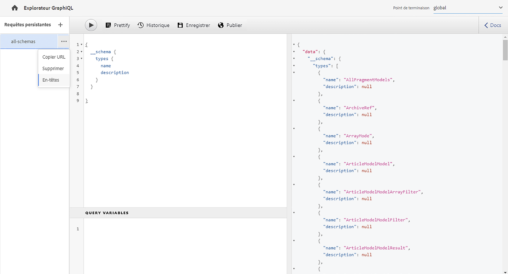
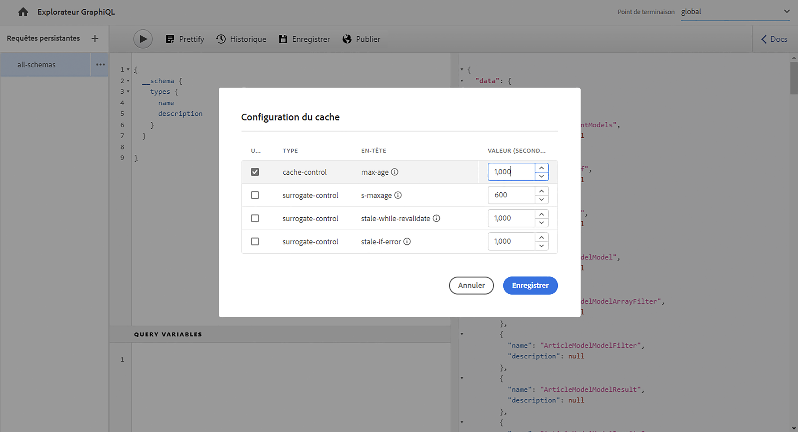
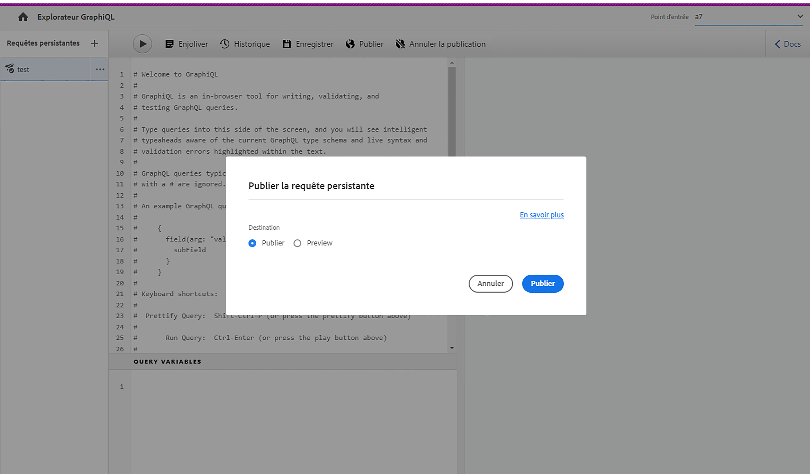
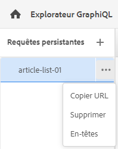

# Utilisation de l’IDE GraphiQL {#graphiql-ide}

Une mise en œuvre de l’IDE [GraphQL](https://graphql.org/learn/serving-over-http/#graphiql) standard est disponible pour une utilisation avec l’API GraphQL d’Adobe Experience Manager (AEM) as a Cloud Service.

>[!NOTE]
>
>GraphiQL est inclus dans tous les environnements d’AEM (mais est accessible/visible uniquement lorsque vous configurez vos points d’entrée).
>
>Dans les versions précédentes, un package était nécessaire pour installer l’IDE GraphiQL. Si vous l’avez installé, il peut désormais être supprimé.

>[!NOTE]
>Vous devez avoir [configuré vos points d’entrée](/help/headless/graphql-api/graphql-endpoint.md) dans l’[explorateur de configuration](/help/sites-cloud/administering/content-fragments/setup.md#enable-content-fragment-functionality-configuration-browser) avant d’utiliser l’IDE GraphiQL.

L’outil **GraphiQL** permet de tester et de déboguer vos requêtes GraphQL en vous permettant de :

* sélectionner le **Point d’entrée** approprié pour la configuration Sites que vous souhaitez utiliser pour vos requêtes ;
* saisir directement de nouvelles requêtes ;
* créer et accéder aux **[Requêtes persistantes](/help/headless/graphql-api/persisted-queries.md)** ;
* exécuter vos requêtes pour afficher immédiatement les résultats ;
* gérer les **Variables de requête** ;
* enregistrer et gérer les **Requêtes persistantes** ;
* publier ou dépublier, **Requêtes persistantes**, sur votre service de **Publication** ou de **Prévisualisation** ; par exemple, vers/depuis `dev-publish` ;
* afficher l’**Historique** de vos requêtes précédentes ;
* utiliser l’**Explorateur de documentation** pour accéder à la documentation pour vous aider à apprendre et à comprendre les méthodes disponibles.

Vous pouvez accéder au requêteur à partir de :

* **Outils** > **Général** > **Requêteur GraphQL**
* directement ; par exemple, `http://localhost:4502/aem/graphiql.html`

Vous pouvez utiliser GraphiQL sur votre système afin que les requêtes puissent être appelées par votre application cliente à l’aide de requêtes GET et pour des requêtes de publication. À des fins de production, vous pouvez ensuite [déplacer vos requêtes vers votre environnement de production](/help/headless/graphql-api/persisted-queries.md#transfer-persisted-query-production). Commencez par créer l’auteur de production pour valider le contenu nouvellement créé avec les requêtes, puis publiez la production pour la consommation en direct.

## Sélection de votre point d’entrée {#selecting-endpoint}

Pour commencer, vous devez sélectionner le **[Point d’entrée](/help/headless/graphql-api/graphql-endpoint.md)** que vous souhaitez utiliser pour les requêtes. Ce point d’entrée est adapté pour la configuration Sites que vous souhaitez utiliser pour vos requêtes.

Il est disponible dans la liste déroulante en haut à droite.

## Création et persistance d’une nouvelle requête {#creating-new-query}

Vous pouvez saisir votre nouvelle requête dans l’éditeur qui se trouve dans le panneau du milieu à gauche, directement sous le logo GraphiQL.

>[!NOTE]
>
>Si une requête persistante est déjà sélectionnée et s’affiche dans le panneau de l’éditeur, sélectionnez `+` (en face de **Requêtes persistantes**) pour vider l’éditeur prêt pour votre nouvelle requête.

Commencez simplement à taper, et l’éditeur :

* offre une fonctionnalité de survol de la souris pour afficher des informations supplémentaires sur les éléments ;
* offre des fonctionnalités telles que la mise en surbrillance de la syntaxe, la saisie automatique et la suggestion automatique.

>[!NOTE]
>
>Les requêtes GraphQL commencent généralement par un caractère `{`.
>
>Les lignes qui commencent par un `#` sont ignorées.

Utilisez **Enregistrer sous** pour conserver votre nouvelle requête.

## Mise à jour de la requête persistante {#updating-persisted-query}

Sélectionnez la requête à mettre à jour dans la liste du panneau des **Requêtes persistantes** (à l’extrême gauche).

La requête s’affiche dans le panneau de l’éditeur. Apportez les modifications nécessaires, puis utilisez **Enregistrer** pour valider vos mises à jour dans la requête persistante.

## Exécution de requêtes {#running-queries}

Vous pouvez exécuter une nouvelle requête immédiatement ou charger et exécuter une requête persistante. Pour charger une requête persistante, sélectionnez-la dans la liste. Elle s’affiche dans le panneau de l’éditeur.

Dans les deux cas, la requête affichée dans le panneau de l’éditeur est la requête qui sera exécutée lorsque vous :

* sélectionnez sur l’icône **Exécuter la requête**
* utilisez la combinaison de clavier `Control-Enter`.

## Variables de requête {#query-variables}

L’IDE GraphiQL vous permet également de gérer vos [variables de requête](/help/headless/graphql-api/content-fragments.md#graphql-variables).

Par exemple :

## Gérer le cache pour vos requêtes persistantes {#managing-cache}

Les [requêtes persistantes](/help/headless/graphql-api/persisted-queries.md) sont recommandées, car elles peuvent être mises en cache au niveau des couches Dispatcher et réseau CDN, ce qui améliore les performances de l’application cliente effectuant les requêtes. Par défaut, AEM invalidera le cache du réseau de diffusion de contenu (CDN) en fonction d’une durée de vie par défaut (TTL).

>[!NOTE]
>
>Voir [&#x200B; Mise en cache de vos requêtes persistantes](/help/headless/graphql-api/persisted-queries.md#caching-persisted-queries).

>[!NOTE]
>
>Les règles de réécriture personnalisées sur le Dispatcher peuvent remplacer les valeurs par défaut de la publication AEM.
>
>Si vous envoyez des en-têtes de contrôle du cache TTL à partir du Dispatcher, en fonction d’un modèle de correspondance d’emplacement, vous pouvez alors, si nécessaire, exclure `/graphql/execute.json/*` des correspondances.

Avec GraphQL, vous pouvez configurer les en-têtes de cache HTTP pour contrôler ces paramètres pour votre propre requête persistante.

1. L’option **En-têtes** est accessible à partir des trois points verticaux situés à droite du nom de la requête persistante (panneau tout à gauche) :

   

1. La sélection de cette option ouvre la boîte de dialogue **Configuration du cache** :

   

1. Sélectionnez le paramètre approprié, puis ajustez la valeur selon les besoins :

   * **cache-control** - **max-age**
Les caches peuvent stocker ce contenu pendant un nombre de secondes spécifié. Il s’agit généralement de la durée de vie (TTL) du navigateur.
   * **surrogate-control** - **s-maxage**
Identique à max-age, mais s’applique spécifiquement aux caches de proxy.
   * **surrogate-control** - **stale-while-revalidate**
Les caches peuvent continuer à servir une réponse mise en cache après qu’elle est devenue obsolète, jusqu’au nombre de secondes spécifié.
   * **surrogate-control** - **stale-if-error**
Les caches peuvent continuer à servir une réponse mise en cache en cas d’erreur d’origine, jusqu’au nombre de secondes spécifié.

1. Sélectionnez **Enregistrer** pour conserver les modifications.

## Publier et prévisualiser des requêtes persistantes {#publishing-previewing-persisted-queries}

Une fois que vous avez sélectionné votre requête persistante dans la liste (panneau de gauche), vous pouvez utiliser l’action **Publier**.

La requête sera alors activée dans l&#39;environnement que vous sélectionnez. Vous pouvez choisir entre votre environnement de **publication** (par exemple, `dev-publish`) ou votre environnement de **prévisualisation** pour un accès facile à vos applications lors des tests.

>[!NOTE]
>
>La définition du `Time To Live` de cache de la requête persistante {« cache-control »:« parameter »:value} a une valeur par défaut de 2 heures (7 200 secondes).

## Dépublier des requêtes persistantes {#unpublishing-persisted-queries}

Comme lors de la publication, une fois que vous avez sélectionné votre requête persistante dans la liste (panneau de gauche), vous pouvez utiliser l’action **Dépublier**.

La requête sera alors désactivée à partir de l’environnement que vous sélectionnez : soit votre environnement de **publication**, soit votre environnement de **prévisualisation**.

>[!NOTE]
>
>Vous devez également vous assurer que vous avez apporté les modifications nécessaires à votre application cliente, afin d’éviter tout problème potentiel.

## Copie de l’URL pour accéder directement à la requête {#copy-url}

L’option **Copier l’URL** vous permet de simuler une requête en copiant l’URL utilisée pour accéder directement à la requête persistante et consulter les résultats. Elle peut ensuite être utilisée à des fins de test ; par exemple, en y accédant par le biais d’un navigateur :

<!--
  >[!NOTE]
  >
  >The URL needs [encoding before using programmatically](/help/headless/graphql-api/persisted-queries.md#encoding-query-url).
  >
  >The target environment might need adjusting, depending on your requirements.
-->

Par exemple :

`http://localhost:4502/graphql/execute.json/global/article-list-01`

En utilisant cette URL dans un navigateur, vous pouvez confirmer les résultats :

L’option **Copier l’URL** est accessible à partir des trois points verticaux situés à droite du nom de la requête persistante (panneau tout à gauche) :

## Suppression de requêtes persistantes {#deleting-persisted-queries}

L’option **Supprimer** est également accessible à partir des trois points verticaux situés à droite du nom de la requête persistante (panneau tout à gauche).

<!-- what happens if you try to delete something that is still published? -->

## Installation de la requête persistante en production {#installing-persisted-query-production}

Après avoir développé et testé votre requête persistante avec GraphiQL, l’objectif final est de [la transférer vers votre environnement de production](/help/headless/graphql-api/persisted-queries.md#transfer-persisted-query-production) pour qu’elle soit utilisée par vos applications.

## Raccourcis clavier {#keyboard-shortcuts}

Plusieurs raccourcis clavier permettent d’accéder directement aux icônes d’action dans l’IDE :

* Embellir la requête : `Shift-Control-P`
* Fusionner la requête : `Shift-Control-M`
* Exécuter la requête : `Control-Enter`
* Remplissage automatique : `Control-Space`

>[!NOTE]
>
>Sur certains claviers, la clé `Control` est étiquetée comme `Ctrl`.
