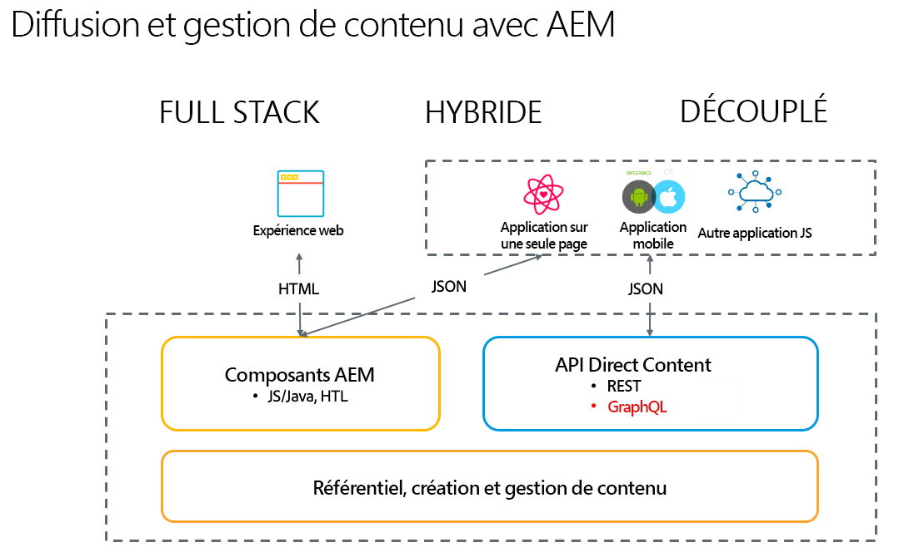

# Présentation d’Adobe Experience Manager en tant que CMS découplé {#introduction-aem-headless}

Découvrez comment utiliser Adobe Experience Manager (AEM) en tant que CMS découplé (Système de Gestion de Contenu), avec des fonctionnalités telles que les modèles de fragment de contenu, les fragments de contenu et une API GraphQL qui optimisent les expériences découplées à grande échelle.

Vous pouvez lire la documentation détaillée des différentes fonctionnalités impliquées et suivre certains des [Parcours découplés pour obtenir un aperçu des premières étapes](#first-steps).

>[!NOTE]
>
>Voir aussi [Que désigne l’expression « Headless » ?](/help/headless/what-is-headless.md) pour une présentation des concepts et de la terminologie Headless.

## Présentation {#overview}

AEM découplé est une solution CMS d’Experience Manager qui permet l’utilisation de contenu structuré (fragments de contenu) dans AEM par n’importe quelle application via HTTP à l’aide de GraphQL. Les implémentations découplées permettent la diffusion d’expériences sur les plateformes et les canaux en fonction des besoins.

L’implémentation découplée annule la gestion des pages et des composants, comme c’est le cas traditionnellement dans les solutions de pile pleines et hybrides. Elle est plutôt basée sur la création de fragments de contenu réutilisables et neutres par rapport aux canaux, ainsi que leur diffusion cross-canal. Il s’agit d’un modèle de développement moderne et dynamique pour l’implémentation d’expériences Web.

## Fonctions {#aem-headless-features}

AEM as a Cloud Service est un outil souple pour le modèle d’implémentation découplée avec trois fonctionnalités puissantes :

1. **Modèles de fragment de contenu**
   * Les modèles de fragment de contenu sont une représentation structurée du contenu.
   * Les modèles de fragment de contenu sont définis par des architectes des informations dans l’éditeur de modèles de fragment de contenu AEM.
   * Les modèles de fragment de contenu servent de base aux fragments de contenu.
1. **Fragments de contenu**
   * Un fragment de contenu est créé à partir d’un modèle de fragment de contenu.
   * Il est créé par les créateurs et créatrices de contenu à l’aide de l’éditeur de fragments de contenu AEM.
   * Les fragments de contenu sont stockés en tant qu’AEM Assets, mais peuvent être gérés via la console Ressources ou la [Console fragments de contenu](/help/sites-cloud/administering/content-fragments/overview.md#content-fragments-console).
1. **API de contenu pour la diffusion**
   * Consultez [API AEM pour la diffusion et la gestion de contenu structuré](/help/headless/apis-headless-and-content-fragments.md) pour un aperçu des différentes API disponibles et une comparaison de certains des concepts impliqués.

   * La diffusion de contenu direct est également possible avec l’[Exportateur JSON du composant principal du fragment de contenu](https://experienceleague.adobe.com/docs/experience-manager-core-components/using/components/content-fragment-component.html?lang=fr).

## Premiers pas {#first-steps}

Plusieurs ressources sont disponibles pour commencer à utiliser les fonctionnalités AEM découplé. Chaque guide est adapté à différents cas d’utilisation et différentes audiences.

| Ressource | Description | Type | Audience | Temps estimé |
|---|---|---|---|---|
| [Parcours de développement découplé](/help/journey-headless/developer/overview.md) | **En tant que développeurs peu familiers avec AEM et avec les technologies découplées**, faites vos premiers pas avec cette présentation complète d’AEM et de ses fonctionnalités découplées, des bases du découplage à la mise en ligne de votre premier projet découplé. | Guide | Développeurs **débutants avec AEM et le découplage** | 1 heure |
| [Configuration découplée](/help/headless/setup/introduction.md) | **Si vous avez une bonne connaissance d’AEM** et souhaitez un aperçu rapide des principales fonctionnalités d’AEM découplé, consultez cet aperçu de démarrage rapide. | Configuration des références | Développeurs, Administrateurs **avec une expérience d’AEM** | 20 minutes |
| [Tutoriel pratique sur le découplage](https://experienceleague.adobe.com/docs/experience-manager-learn/getting-started-with-aem-headless/graphql/multi-step/overview.html?lang=fr) | **Si vous préférez une approche pratique et êtes déjà familier avec AEM**, ce tutoriel aborde directement la mise en œuvre d’un application simple en mode découplé. | Tutoriel | Développeurs | 2 heures |
| [Parcours d’architecture découplée](/help/journey-headless/architect/overview.md) | **En tant qu’architectes peu familiers avec AEM et avec les technologies découplées**, faites vos premiers pas avec cette introduction sur les fonctionnalités puissantes, flexibles et découplées d’Adobe Experience Manager as a Cloud Service et comment modéliser le contenu de votre projet. | Guide | Architectes | 1 heure |
| [Parcours de création découplée](/help/journey-headless/author/overview.md) | **En tant qu’entreprises peu familières avec AEM et avec les technologies découplées**, faites vos premiers pas avec cette introduction sur les fonctionnalités puissantes, flexibles et découplées d’Adobe Experience Manager as a Cloud Service et comment modéliser le contenu de votre projet. | Guide | Créateurs de contenu | 1 heure |
| [Parcours de traduction découplée](/help/journey-headless/translation/overview.md) | Pour les personnes **intéressées par l’approche d’AEM de la traduction découplée**. Découvrez les technologies découplées et comment créer et mettre à jour des projets de traduction dans AEM de A à Z. | Guide | Spécialistes de la traduction | 1 heure |

## Comparaison entre couplage et découplage {#headful-headless}

Ce guide se concentre sur le modèle de mise en œuvre entièrement découplée d’AEM. Pour autant, le choix entre couplage et découplage n’est pas nécessairement binaire dans AEM. Vous pouvez utiliser des fonctionnalités découplées afin de gérer et diffuser du contenu vers plusieurs points de contact tout en permettant aux auteurs de contenu de modifier des applications sur une seule page. Le tout dans AEM.

>[!TIP]
>
>Voir le document [Couplage et découplage dans AEM](/help/implementing/developing/headful-headless.md) pour plus d’informations.
