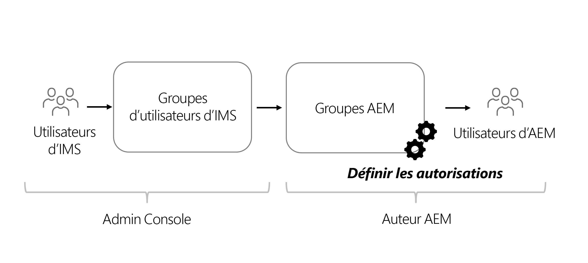

# Considérations relatives aux autorisations pour le contenu découplé

Avec une mise en œuvre sans interface, plusieurs domaines de sécurité et d’autorisations doivent être pris en compte. Les autorisations et les personnages peuvent être considérés de la même manière pour l’environnement AEM de **Création** ou de **Publication**. Chaque environnement contient des personnages différents et a des besoins différents.

## Considérations relatives au service de création

Le service de création permet aux utilisateurs internes de créer, gérer et publier du contenu. Les autorisations sont axées sur les différentes personnes qui gèrent le contenu.

### Gestion des autorisations au niveau du groupe

Il est recommandé de définir les autorisations en fonction des groupes dans AEM. Également appelés groupes locaux, ces groupes peuvent être gérés dans l’environnement de création AEM.

Le moyen le plus simple de gérer l’appartenance à un groupe consiste à utiliser les groupes Adobe Identity Management System (IMS) et à attribuer des [Groupes IMS aux groupes AEM locaux](https://experienceleague.adobe.com/docs/experience-manager-cloud-service/content/security/ims-support.html?lang=fr#managing-permissions-in-aem).

Au niveau général, le processus est le suivant :

1. Ajoutez des utilisateurs IMS à un groupe d’utilisateurs IMS nouveau ou existant à l’aide de l’[Admin Console](https://adminconsole.adobe.com/).
1. Les groupes IMS sont synchronisés avec AEM lorsque les utilisateurs se connectent.
1. Affectez des groupes IMS à des groupes AEM.
1. Définissez des autorisations pour les groupes AEM.
1. Lorsque les utilisateurs se connectent à AEM et sont authentifiés via IMS, ils héritent des autorisations du groupe AEM.

>[!TIP]
>
>Pour une présentation vidéo détaillée de la gestion des utilisateurs et des groupes IMS et d’AEM, voir [Configuration de l’accès à AEM as a Cloud Service](https://experienceleague.adobe.com/docs/experience-manager-learn/cloud-service/accessing/overview.html?lang=fr).

Pour gérer les **groupes** dans AEM, accédez à **Outils** > **Sécurité** > **Groupes**.

Pour gérer les autorisations des groupes dans AEM, accédez à **Outils** > **Sécurité** > **Autorisations**.

### Utilisateurs du DAM

Le « DAM », dans ce contexte, correspond à la gestion des actifs numériques. Les **Utilisateurs du DAM** constituent un groupe prêt à l’emploi disponible dans AEM qui peut être utilisé pour les utilisateurs « quotidiens » qui gèrent les ressources numériques et les fragments de contenu. Ce groupe fournit des autorisations pour **visualiser**, **ajouter**, **mettre à jour**, **supprimer**, et **publier** des fragments de contenu et tous les autres fichiers dans AEM Assets.

Si vous utilisez l’IMS pour définir l’appartenance à un groupe, ajoutez les groupes IMS appropriés en tant que membres du groupe **Utilisateurs du DAM**. Les membres du groupe IMS héritent des autorisations du groupe Utilisateurs du DAM lors de leur connexion à l’environnement AEM.

#### Personnalisation du groupe Utilisateurs du DAM

Il est préférable de ne pas modifier directement les autorisations d’un groupe prêt à l’emploi. Vous pouvez plutôt créer votre ou vos propres groupes d’après le modèle de d’autorisations du groupe **Utilisateurs du DAM** et restreindre ensuite l’accès à différents **dossiers** dans AEM Assets.

Pour définir des autorisations plus granulaires, utilisez la console **Autorisations** dans AEM et mettez à jour le chemin `/content/dam` en définissant un chemin plus spécifique, à savoir, `/content/dam/mycontentfragments`.

Il peut être souhaitable de donner à ce groupe d’utilisateurs les autorisations permettant de créer et de modifier des fragments de contenu, mais pas de les supprimer. Pour vérifier et attribuer des autorisations de modification sans autorisation de suppression, consultez les [Considérations relatives à la suppression des fragments de contenu](/help/sites-cloud/administering/content-fragments/delete-considerations.md).

### Éditeurs de modèle

La possibilité de modifier les **modèles de fragment de contenu** doit être réservée aux administrateurs ou à un **petit groupe** d’utilisateurs disposant d’un niveau élevé d’autorisations. La modification d’un modèle de fragment de contenu a de nombreux effets en aval.

>[!CAUTION]
>
>Les modifications apportées aux modèles de fragment de contenu modifient l’API GraphQL sous-jacente sur laquelle s’appuient les applications découplées.

Si vous souhaitez créer un groupe qui gère les modèles de fragment de contenu sans accès administrateur complet, vous pouvez créer un groupe avec les entrées de contrôle d’accès suivantes :

| Chemin  | Autorisation | Autorisations |
|-----| -------------| ---------|
| `/conf` | **autoriser** | `jcr:read` |
| `/conf/<config-name>/settings/dam/cfm` | **autoriser** | `rep:write`, `crx:replicate` |

## Autorisations du service de publication

Le service de publication est considéré comme l’environnement « En ligne » et est généralement celui avec lequel les consommateurs des API GraphQL interagissent. Le contenu, après avoir été modifié et approuvé sur le service Auteur, est publié vers le service Publication. L’application découplée utilise ensuite le contenu approuvé du service de publication via les API GraphQL.

Par défaut, le contenu exposé via les points d’entrée GraphQL du service de publication AEM est accessible à tous, y compris aux utilisateurs non authentifiés.

### Autorisations de contenu

Le contenu exposé via les API GraphQL d’AEM peut être limité en utilisant les [Groupes d’utilisateurs fermés (CUG)](https://experienceleague.adobe.com/docs/experience-manager-learn/assets/advanced/closed-user-groups.html?lang=fr) dans les dossiers de ressources, ce qui spécifie quels groupes d’utilisateurs AEM (et quels membres) peuvent accéder au contenu des dossiers de ressources.

Les CUG de ressources fonctionnent comme suit :

* Tout d’abord, refus de l’accès au dossier et aux sous-dossiers
* Ensuite, autorisation de l’accès en lecture au dossier et aux sous-dossiers pour tous les groupes d’utilisateurs AEM répertoriés dans la liste des CUG

Les CUG peuvent être configurés pour des dossiers de ressources contenant du contenu exposé par le biais des API GraphQL. L’accès aux dossiers de ressources dans le service de publication AEM doit être contrôlé par l’intermédiaire de groupes d’utilisateurs plutôt que directement par utilisateur. Créez (ou réutilisez) un groupe d’utilisateurs AEM qui accorde l’accès aux dossiers de ressources contenant du contenu exposé par les API GraphQL.

#### Sélection du schéma d’authentification{#publish-permissions-users}

Le [SDK AEM découplé](https://github.com/adobe/aem-headless-client-js#create-aemheadless-client) prend en charge deux types d’authentification :

* [Authentification basée sur les jetons](/help/implementing/developing/introduction/generating-access-tokens-for-server-side-apis.md) à l’aide des informations d’identification du service liées à un seul compte technique.
* Authentification de base en fonction des utilisateurs AEM.

### Accès à l’API GraphQL

Les requêtes HTTP fournissant les [informations d’authentification appropriées](https://github.com/adobe/aem-headless-client-js#create-aemheadless-client) aux points d’entrée de l’API GraphQL du service de publication AEM incluent du contenu que seuls les utilisateurs dotés des informations d’identification appropriées sont autorisés à lire et du contenu accessible de manière anonyme. Les autres clients de l’API GraphQL ne peuvent pas lire le contenu dans les dossiers protégés par CUG.
