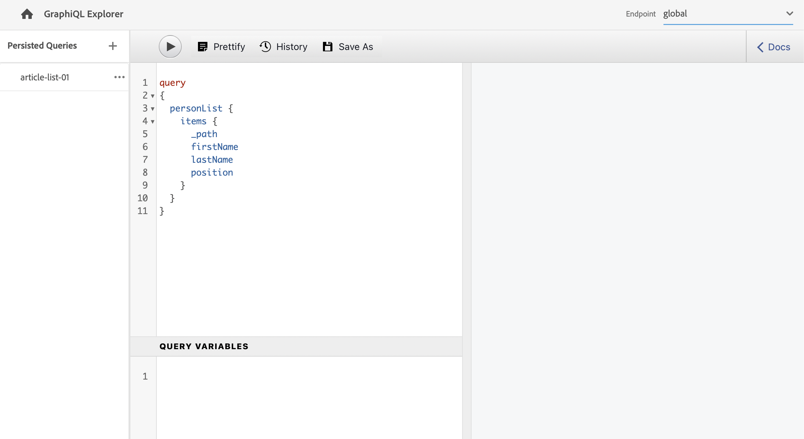

# Création d’une requête API - Configuration découplée {#accessing-delivering-content-fragments}

Découvrez comment utiliser l’API GraphQL pour une diffusion découplée du contenu du fragment de contenu et l’API REST AEM Assets pour gérer les fragments de contenu.

## En quoi consistent les API REST GraphQL et Assets ? {#what-are-the-apis}

[Maintenant que vous avez créé des fragments de contenu](create-content-fragment.md), vous pouvez utiliser les API d’AEM pour une diffusion découplée.

* [L’API GraphQL](/help/headless/graphql-api/content-fragments.md) permet de créer des requêtes d’accès et de diffusion de fragments de contenu. Cette API offre l’ensemble de fonctionnalités le plus robuste pour interroger et utiliser du contenu de fragment de contenu.
   * Pour utiliser l’API, [définissez et activez des points d’entrée dans AEM](/help/headless/graphql-api/graphql-endpoint.md), et si nécessaire, l’[interface GraphiQL installée](/help/headless/graphql-api/graphiql-ide.md).
* [L’API REST Assets](/help/assets/content-fragments/assets-api-content-fragments.md) permet de créer et de modifier des fragments de contenu (et d’autres ressources).

>[!NOTE]
>
>Les [OpenAPI de modèle de fragment de contenu et de fragment de contenu](/help/headless/content-fragment-openapis.md) sont également disponibles.

Le reste de ce guide porte sur l’accès à GraphQL et la diffusion de fragments de contenu.

## Activation du point d’entrée GraphQL {#enable-graphql-endpoint}

Avant de pouvoir utiliser les API GraphQL, un point d’entrée GraphQL doit être créé.

1. Accédez à **Outils**, **Général**, puis sélectionnez **GraphQL**.
1. Sélectionnez **Créer**.
1. La boîte de dialogue **Créer un point d’entrée GraphQL** s’ouvre. Vous pouvez spécifier ici les éléments suivants :
   * **Nom** : nom du point d’entrée ; vous pouvez saisir du texte.
   * **Utiliser le schéma GraphQL fourni par** : utilisez la liste déroulante pour sélectionner la configuration requise.
1. Confirmez en sélectionnant **Créer**.
1. Dans la console, un **Chemin d’accès** s’affiche désormais en fonction de la configuration créée précédemment. Ce chemin d’accès est utilisé pour exécuter des requêtes GraphQL.

   ```
   /content/cq:graphql/<configuration-name>/endpoint
   ```

Pour plus d’informations sur l’activation des points de fin GraphQL, voir [Gestion des points de fin GraphQL dans AEM](/help/headless/graphql-api/graphql-endpoint.md).

## Requête de contenu à l’aide de GraphQL avec GraphiQL

Les architectes d’informations créent des requêtes pour leurs points d’entrée de canal afin de diffuser du contenu. Considérez ces requêtes une seule fois par point d’entrée et par modèle. Pour les besoins de ce guide de prise en main, il suffit d’en créer une.

GraphiQL est un IDE inclus dans votre environnement AEM ; il est accessible/visible après la [configuration des points d’entrée](#enable-graphql-endpoint).

1. Connectez-vous à AEM as a Cloud Service et accédez à l’interface GraphiQL :

   Vous pouvez accéder à l’éditeur de requêtes à partir de :

   * **Outils** -> **Général** -> **Éditeur de requêtes GraphQL**
   * directement ; par exemple, `http://localhost:4502/aem/graphiql.html`

1. L’IDE GraphiQL est un éditeur de requêtes intégré au navigateur pour GraphQL. Vous pouvez l’utiliser pour créer des requêtes permettant de récupérer des fragments de contenu afin de les diffuser de manière découplée en mode JSON.
   * La liste déroulante en haut à droite vous permet de sélectionner le point de terminaison.
   * Un panneau de gauche répertorie les requêtes persistantes (le cas échéant).
   * Le panneau du milieu à gauche vous permet de créer votre requête.
   * Le volet au milieu à droite affiche les résultats.
   * L’éditeur de requêtes comprend la saisie du code et des touches d’accès rapide pour exécuter facilement la requête.

   

1. En supposant que le modèle que vous avez créé s’appelle `person`, avec les champs `firstName`, `lastName` et `position`, vous pouvez créer une requête simple pour récupérer le contenu du fragment de contenu.

   ```text
   query 
   {
     personList {
       items {
         _path
         firstName
         lastName
         position
       }
     }
   }
   ```

1. Entrez la requête dans le volet de gauche.
   

1. Cliquez sur le bouton **Exécuter la requête** ou utilisez le raccourci `Ctrl-Enter` pour faire apparaître les résultats sous la forme JSON dans le volet de droite.
   

1. Dans le coin supérieur droit de la page, cliquez sur le lien **Documents** pour afficher la documentation contextuelle afin que vous puissiez créer des requêtes qui s’adaptent à vos propres modèles.
   

GraphQL permet d’utiliser des requêtes structurées qui peuvent cibler non seulement des jeux de données spécifiques ou des objets de données particuliers, mais peuvent également fournir des éléments spécifiques d’objets, des résultats imbriqués, prendre en charge des variables de requête, etc.

GraphQL permet d’éviter les requêtes d’API itératives ainsi que la surdiffusion, et permet au contraire la diffusion en masse de ce qui est nécessaire au rendu en réponse à une requête d’API unique. Le fichier JSON produit peut être utilisé pour diffuser des données vers d’autres sites ou applications.

## Étapes suivantes {#next-steps}

C’est terminé ! Vous possédez maintenant une compréhension de base de la gestion de contenu découplée dans AEM. Bien entendu, il existe beaucoup d’autres ressources que vous pouvez approfondir pour une compréhension complète des fonctionnalités disponibles.

* **[Fragments de contenu](/help/sites-cloud/administering/content-fragments/managing.md)** – Pour plus d’informations sur la création et la gestion de fragments de contenu
* **[Prise en charge des fragments de contenu dans l’API HTTP AEM Assets](/help/assets/content-fragments/assets-api-content-fragments.md)** – Pour plus d’informations sur l’accès direct au contenu AEM via l’API HTTP, via des opérations CRUD (création, lecture, mise à jour, suppression)
* **[API GraphQL](/help/headless/graphql-api/content-fragments.md)** – Pour plus d’informations sur la diffusion découplée de fragments de contenu

>[!NOTE]
>
>Les [OpenAPI de modèle de fragment de contenu et de fragment de contenu](/help/headless/content-fragment-openapis.md) sont également disponibles.
