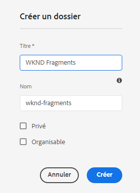
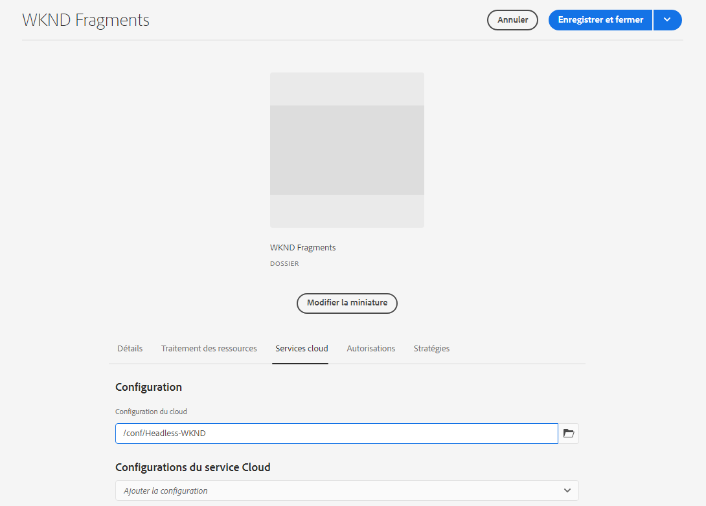
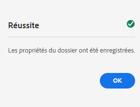

# Création d’un dossier de ressources - Configuration découplée {#creating-an-assets-folder}

Utilisez des modèles de fragment de contenu AEM pour définir la structure des fragments de contenu, à la base de votre contenu découplé. Ces fragments sont ensuite stockés dans des dossiers de ressources.

## Qu’est-ce qu’un dossier de ressources ?  {#what-is-an-assets-folder}

[Maintenant que vous avez créé des modèles de fragments de contenu](create-content-model.md) qui définissent la structure souhaitée pour vos futurs fragments de contenu, vous êtes probablement enthousiaste à l’idée d’en créer.

Cependant, vous devez d’abord créer un dossier de ressources pour les stocker.

Les dossiers de ressources sont utilisés pour [organiser des ressources de contenu traditionnelles](/help/assets/manage-digital-assets.md) tels que des images et des vidéos, ainsi que des fragments de contenu.

## Comment créer un dossier de ressources {#how-to-create-an-assets-folder}

Un administrateur n’a besoin de créer des dossiers qu’occasionnellement pour organiser le contenu au fur et à mesure de sa création. Pour les besoins de ce guide de prise en main, il suffit de créer un dossier.

1. Connectez-vous à AEM as a Cloud Service et dans le menu principal, sélectionnez **Navigation > Assets > Fichiers**.
1. Sélectionnez **Créer > Dossier**.
1. Indiquez un **titre** et un **nom** pour votre dossier.
   * Le **titre** doit être descriptif.
   * Le **nom** deviendra celui du nœud dans le référentiel.
      * Il sera généré automatiquement en fonction du titre et ajusté selon les [conventions de dénomination AEM](/help/implementing/developing/introduction/naming-conventions.md).
      * Il peut être adapté si nécessaire.

   
1. Sélectionnez le dossier que vous avez créé en survolant et en appuyant sur la coche. Puis sélectionnez **Propriétés** dans la barre d’outils (ou utilisez le [raccourci clavier](/help/sites-cloud/authoring/sites-console/keyboard-shortcuts.md) `p`).
1. Dans la fenêtre **Propriétés**, sélectionnez l’onglet **Services cloud**.
1. Pour la **Configuration du cloud** sélectionnez la [configuration que vous avez créée précédemment](create-configuration.md).
   
1. Sélectionnez **Enregistrer et fermer**.
1. Sélectionnez **OK** dans la fenêtre de confirmation.

   

Vous pouvez créer des sous-dossiers supplémentaires dans le dossier que vous venez de créer. Les sous-dossiers hériteront de la **configuration du cloud** du dossier parent. Vous pouvez toutefois le remplacer si vous souhaitez utiliser des modèles d’une autre configuration.

Si vous utilisez une structure de site localisée, vous pouvez [créer une racine de langue](/help/assets/translate-assets.md) sous votre nouveau dossier.

## Étapes suivantes {#next-steps}

Maintenant que vous avez créé un dossier pour vos fragments de contenu, vous pouvez passer à la quatrième partie du guide de prise en main et [créer des fragments de contenu](create-content-fragment.md).

>[!TIP]
>
>Pour plus d’informations sur la gestion des fragments de contenu, voir la [documentation sur les fragments de contenu](/help/sites-cloud/administering/content-fragments/overview.md).
