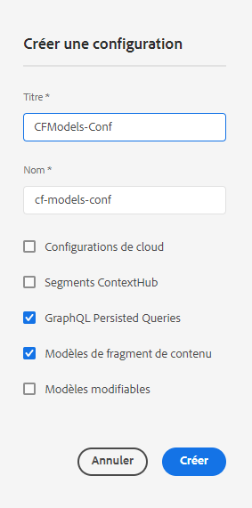

# Création d’une configuration - Configuration découplée {#creating-configuration}

Pour commencer à utiliser le découplage dans AEM as a Cloud Service, vous devez créer une configuration.

## Qu’est-ce qu’une configuration ?  {#what-is-a-configuration}

L’explorateur de configurations fournit une API de configuration générique, une structure de contenu et un mécanisme de résolution pour les configurations dans AEM.

Dans le contexte d’une gestion de contenu découplée dans AEM, considérez une configuration comme un espace de travail dans AEM où vous pouvez créer vos modèles de contenu, qui définissent la structure de votre futur contenu et des fragments de contenu. Vous pouvez avoir plusieurs configurations pour séparer ces modèles.

Si vous connaissez les modèles de page [dans une implémentation AEM complète,](/help/sites-cloud/authoring/page-editor/templates.md) l’utilisation des configurations pour la gestion des modèles de contenu est similaire.

## Création d’une configuration {#how-to-create-a-configuration}

Un administrateur n’a besoin de créer une configuration qu’une seule fois, ou très rarement lorsqu’un nouvel espace de travail est nécessaire pour organiser vos modèles de contenu. Pour les besoins de ce guide de prise en main, il suffit de créer une configuration.

1. Connectez-vous à AEM as a Cloud Service et, dans le menu principal, sélectionnez **Outils > Général > Navigateur de configuration**.
1. Indiquez un **Titre** et un **Nom** pour votre configuration.
   * Le **Titre** doit être descriptif.
   * Le **nom** deviendra celui du nœud dans le référentiel.
      * Il sera généré automatiquement en fonction du titre et ajusté selon les [conventions de dénomination AEM](/help/implementing/developing/introduction/naming-conventions.md).
      * Il peut être adapté si nécessaire.
1. Vérifiez les options suivantes :
   * **Modèles de fragment de contenu**
   * **Requêtes persistantes GraphQL**

   

1. Sélectionnez **Créer**

Vous pouvez créer plusieurs configurations si nécessaire. Les configurations peuvent également être imbriquées.

>[!NOTE]
>
>Des options de configuration en plus des **Modèles de fragments de contenu** et des **Requêtes persistantes GraphQL** peuvent être nécessaires en fonction de vos exigences d’implémentation.

## Étapes suivantes {#next-steps}

Cette configuration vous permet maintenant de passer à la deuxième partie du guide de prise en main et de [créer des modèles de fragments de contenu.](create-content-model.md)

>[!TIP]
>
>Pour obtenir des détails complets sur l’explorateur de configurations, [consultez la documentation de l’explorateur de configurations](/help/implementing/developing/introduction/configurations.md).
