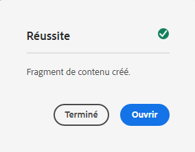

# Création de fragments de contenu - Configuration découplée {#creating-content-fragments}

Découvrez comment utiliser les fragments de contenu AEM pour concevoir, créer, organiser et utiliser du contenu indépendant des pages pour une diffusion découplée.

## Que sont les fragments de contenu ?  {#what-are-content-fragments}

[Maintenant que vous avez créé un dossier de ressources](create-assets-folder.md) dans lequel vous pouvez stocker vos fragments de contenu, vous pouvez créer les fragments.

Les fragments de contenu permettent de concevoir, créer, organiser et publier du contenu indépendant des pages. Ils permettent de préparer le contenu prêt à être utilisé dans des emplacements multiples et sur plusieurs canaux.

Les fragments de contenu contiennent du contenu structuré et peuvent être diffusés au format JSON.

## Création d’un fragment de contenu {#how-to-create-a-content-fragment}

Les auteurs de contenu créeront tout nombre de fragments de contenu pour représenter le contenu qu’ils créent. Ce sera leur principale tâche dans AEM. Pour les besoins de ce guide de prise en main, nous n’aurons besoin d’en créer qu’un.

1. Connectez-vous à AEM as a Cloud Service et dans le menu principal, sélectionnez **Navigation > Ressources**.
1. Appuyez ou cliquez sur le [dossier que vous avez créé précédemment.](create-assets-folder.md)
1. Appuyez ou cliquez sur **Créer > Fragment de contenu**.
1. La création d’un fragment de contenu est présentée sous la forme d’un assistant en deux étapes. Commencez par sélectionner le modèle à utiliser pour créer votre fragment de contenu et appuyez ou cliquez sur **Suivant**.
   * Les modèles disponibles dépendent de la [**configuration du cloud** que vous avez définie pour le dossier de ressources](create-assets-folder.md) dans lequel vous créez le fragment de contenu.
   * Si vous recevez le message `We could not find any models`, vérifiez la configuration de votre dossier de ressources.

   
1. Définissez un **titre**, une **description** et des **balises** si nécessaire, puis appuyez ou cliquez sur **Créer**.

   
1. Appuyez ou cliquez sur **Ouvrir** dans la fenêtre de confirmation.

   
1. Fournissez les détails du fragment de contenu dans l’éditeur de fragment de contenu.

   
1. Appuyez ou cliquez sur **Enregistrer** ou **Enregistrer et fermer**.

Les fragments de contenu peuvent faire référence à d’autres fragments de contenu, ce qui permet d’obtenir une structure de contenu imbriquée si nécessaire.

Les fragments de contenu peuvent également faire référence à d’autres ressources dans AEM. [Ces ressources doivent être stockées dans AEM](/help/assets/manage-digital-assets.md) avant de créer un fragment de contenu de référence.

## Étapes suivantes {#next-steps}

Maintenant que vous avez créé un fragment de contenu, vous pouvez passer à la dernière partie du guide de prise en main et [créer des requêtes d’API pour accéder aux fragments de contenu et les diffuser.](create-api-request.md)

>[!TIP]
>
>Pour plus d’informations sur la gestion des fragments de contenu, voir la [documentation sur les fragments de contenu](/help/assets/content-fragments/content-fragments.md).
