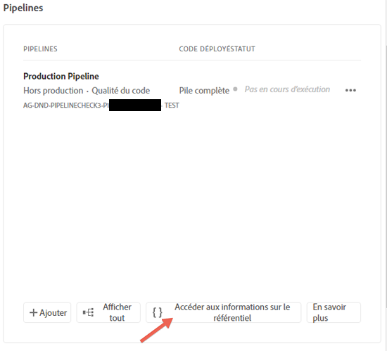

# Accès aux référentiels {#accessing-repos}

Vous pouvez accéder à votre référentiel Git et le gérer à l’aide de la gestion de compte Git en libre-service à partir de l’interface utilisateur de Cloud Manager.

## Utilisation de la gestion de compte de référentiels en libre-service {#self-service-repos}

Utilisez le bouton **Accéder aux informations sur le référentiel** disponible dans l’interface utilisateur de Cloud Manager, notamment sur la carte du pipeline.

1. Accédez à la carte **Pipelines** à partir de votre page **Aperçu du programme**.

1. Vous verrez l’option **Accéder à Repo Info** pour accéder à votre référentiel Git et le gérer.

   

   De plus, si vous sélectionnez l’onglet de pipeline **Non-production**, vous y verrez également l’option **Accéder à Repo Info**.

   

   >[!NOTE]
   >L’option **Accéder à Repo Info** est visible par les utilisateurs avec le rôle Développeur ou Gestionnaire de déploiement . Lorsque l’utilisateur clique sur ce bouton, il accède à une boîte de dialogue qui lui permet de trouver l’URL de son référentiel Git Cloud Manager, ainsi que son nom d’utilisateur et son mot de passe.

   

   Les points importants à prendre en compte pour gérer votre Git dans Cloud Manager sont les suivants :

   * **URL** : URL du référentiel
   * **Nom d’utilisateur** : nom d’utilisateur
   * **Mot de passe** : valeur affichée lorsque vous cliquez sur le bouton **Générer un mot de passe**.

      >[!NOTE]
      >Un utilisateur peut extraire une copie de son code et effectuer des modifications dans le référentiel de code local. Une fois prêt, l’utilisateur peut valider les modifications de code dans le référentiel de code distant dans Cloud Manager.
