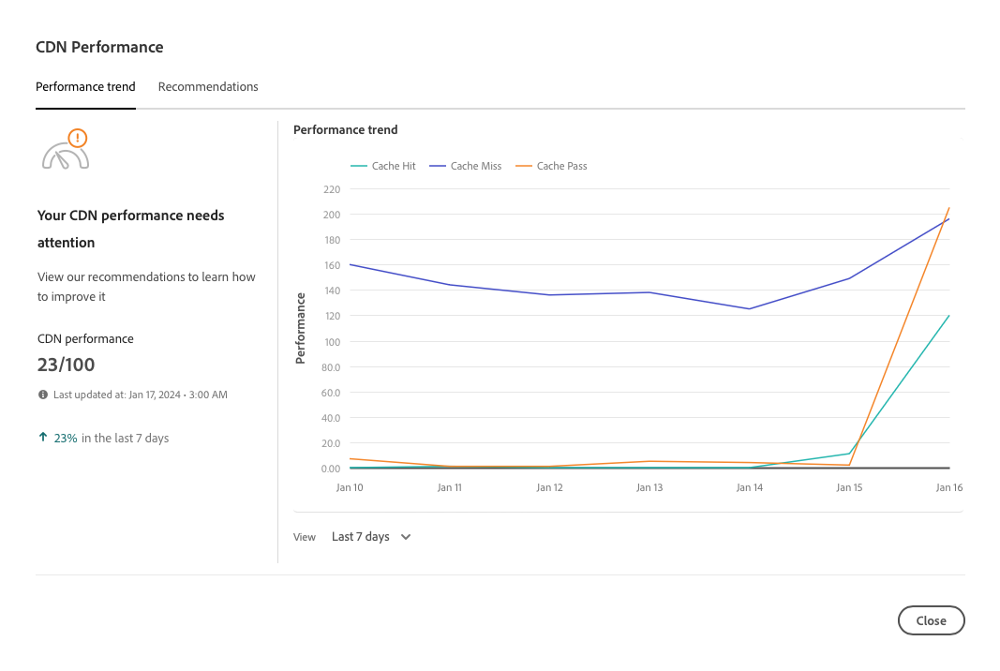

# Tableau de bord des performances du réseau CDN {#cdn-performance}

Découvrez comment Cloud Manager évalue les performances du réseau de diffusion de contenu (CDN) et ce que vous pouvez apprendre à partir du tableau de bord.

## Vue d’ensemble {#overview}

Chaque programme Cloud Manager comporte un tableau de bord des performances du réseau CDN. Ce tableau de bord présente le score global des performances du réseau CDN, ainsi que les tendances, les alertes et des suggestions d’amélioration, si nécessaire.


## Accès au tableau de bord {#accessing}

Le tableau de bord du réseau CDN est disponible sur la page d’aperçu de chaque programme.

1. Connectez-vous à Cloud Manager à l’adresse [my.cloudmanager.adobe.com](https://my.cloudmanager.adobe.com/) et sélectionnez l’organisation appropriée.

1. Sur la console **[Mes programmes](/help/implementing/cloud-manager/navigation.md#my-programs)**, cliquez sur le programme dont vous souhaitez afficher le tableau de bord CDN.

   

1. Sur la page **Aperçu du programme** de votre programme, faites défiler la page vers le bas en dessous des cartes **Environnements** et **Pipelines** pour afficher la carte **Performances**.

   

## Utiliser le tableau de bord {#using}

Le tableau de bord présente un score global des performances du réseau CDN, ainsi que des tendances, des alertes et des suggestions d’amélioration, si nécessaire.


Pour plus d’informations sur les performances de votre réseau CDN et pour obtenir des suggestions sur la manière de les améliorer, cliquez sur **Afficher la tendance**.



Cliquez sur **Afficher** sous le graphique pour modifier la période du graphique.

Pour obtenir des suggestions sur la manière d’améliorer les performances de votre réseau CDN, sélectionnez l’onglet **Recommendations**.


Cliquez sur le chevron en regard d’une recommandation de la liste pour afficher les détails sur les mesures à prendre pour améliorer et la cause du problème.

## Définition de l’accès au cache {#cache-hit}

Le taux d’accès au cache est une mesure du nombre de requêtes de contenu qu’un cache peut remplir avec succès, par rapport au nombre de requêtes qu’il reçoit. Plus le ratio cache-accès est élevé, plus les performances d’un réseau CDN sont bonnes.

>[!TIP]
>
>Adobe recommande aux utilisateurs d’atteindre un taux d’accès au cache de 99 %.

```text
Cache Hit Ratio = Cache Hits / (Hits + Misses + Passes + Other)
```

* **Accès** - Les données sont demandées à partir du cache et sont trouvées.
* **Mlle** - Les données sont demandées à partir du cache et sont introuvables.
* **Pass** - Les données sont demandées à partir du cache, et il est défini pour ne pas mettre ces données en cache dans tous les cas.
* **Autre** - Toutes les demandes de données du cache qui ne correspondent à aucune autre casse.

Les mesures de cache sont mises à jour toutes les 24 heures.

>[!TIP]
>
>Pour plus d’informations sur la façon dont Cloud Manager et le réseau CDN interagissent avec le Dispatcher, consultez [&#x200B; Mise en cache dans AEM as a Cloud Service](/help/implementing/dispatcher/caching.md).
