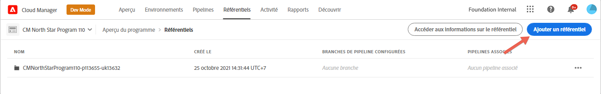
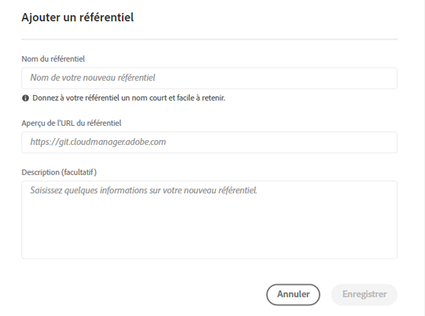
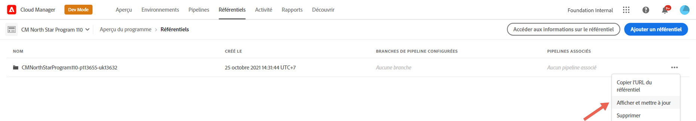

# Référentiels Cloud Manager {#cloud-manager-repos}

Les référentiels créés et disponibles dans Cloud Manager peuvent être affichés et gérés à partir de la page Référentiels .

>[!NOTE]
>Il existe une limite de 300 référentiels pour tous les programmes d’une société donnée ou du [système Identity Management ](https://experienceleague.adobe.com/docs/experience-manager-cloud-service/onboarding/onboarding-concepts/ims.html) de l’Adobe.

## Ajout et gestion des référentiels {#add-manage-repos}

Suivez les étapes ci-dessous pour afficher et gérer les référentiels dans Cloud Manager :

1. Sur la page **Aperçu du programme**, cliquez sur l’onglet **Référentiels** et accédez à la page **Référentiels**.

1. Cliquez sur **Ajouter un référentiel** pour lancer l’assistant.

   >[!NOTE]
   >Un utilisateur possédant le rôle Deployment Manager ou Propriétaire de l’entreprise doit être connecté pour pouvoir ajouter un référentiel.

   


1. Saisissez le nom et la description demandés, puis cliquez sur **Enregistrer**.

   

1. Sélectionnez **Enregistrer**. Le référentiel que vous venez de créer s’affiche dans le tableau, comme illustré ci-dessous.

   >[!NOTE]
   >Il existe un référentiel *Principal* unique ou une branche pour un pipeline donné. Avec la [prise en charge du sous-module Git](#git-submodule-support), de nombreuses branches secondaires peuvent être incluses au moment de la création.

   

   >[!NOTE]
   >Les référentiels créés dans Cloud Manager peuvent également être sélectionnés au cours des étapes d’ajout ou de modification du pipeline. Pour en savoir plus, consultez la section [Configuration de votre pipeline CI-CD](https://experienceleague.adobe.com/docs/experience-manager-cloud-service/implementing/using-cloud-manager/configure-pipeline.html?lang=en).

1. Vous pouvez sélectionner le référentiel et cliquer sur les options de menu à l’extrémité droite de la table dans **Copier l’URL du référentiel**, **Afficher et mettre à jour** ou **Supprimer** votre référentiel, comme illustré dans la figure ci-dessous.

   


## Prise En Charge Des Sous-Modules Git {#git-submodule-support}

Les sous-modules Git peuvent être utilisés pour fusionner le contenu de plusieurs branches dans des référentiels Git au moment de la création. Lorsque le processus de création de Cloud Manager s’exécute, une fois le référentiel configuré pour le pipeline cloné et la branche configurée extraite, si la branche contient un fichier `.gitmodules` dans le répertoire racine, la commande est exécutée.

```
$ git submodule update --init
```

Cela extrait chaque sous-module dans le répertoire approprié. Cette technique constitue une alternative potentielle à https://experienceleague.adobe.com/docs/experience-manager-cloud-service/implementing/managing-code/working-with-multiple-source-git-repositories.html pour les organisations qui maîtrisent l’utilisation des sous-modules git et qui ne souhaitent pas gérer de processus de fusion externe.

Par exemple, supposons qu’il existe trois référentiels, chacun contenant une seule branche nommée main . Dans le référentiel &quot;Principal&quot;, c’est-à-dire celui configuré dans les pipelines, la branche principale dispose d’un fichier pom.xml déclarant les projets contenus dans les deux autres référentiels :

```xml
<?xml version="1.0" encoding="UTF-8"?>
<project xmlns="http://maven.apache.org/POM/4.0.0" xmlns:xsi="http://www.w3.org/2001/XMLSchema-instance"
    xsi:schemaLocation="http://maven.apache.org/POM/4.0.0 http://maven.apache.org/maven-v4_0_0.xsd">
    <modelVersion>4.0.0</modelVersion>
   
    <groupId>customer.group.id</groupId>
    <artifactId>customer-reactor</artifactId>
    <version>0.0.1-SNAPSHOT</version>
    <packaging>pom</packaging>
   
    <modules>
        <module>project-a</module>
        <module>project-b</module>
    </modules>
   
</project>
```

Vous pouvez ensuite ajouter des sous-modules pour les deux autres référentiels :

```
$ git submodule add -b main https://git.cloudmanager.adobe.com/ProgramName/projectA/ project-a
$ git submodule add -b main https://git.cloudmanager.adobe.com/ProgramName/projectB/ project-b
```

Cela donne un fichier `.gitmodules` qui ressemble à ceci :

```
[submodule "project-a"]
    path = project-a
    url = https://git.cloudmanager.adobe.com/ProgramName/projectA/
    branch = main
[submodule "project-b"]
    path = project-b
    url = https://git.cloudmanager.adobe.com/ProgramName/projectB/
    branch = main
```

Vous trouverez plus d’informations sur les sous-modules git dans le [manuel de référence Git](https://git-scm.com/book/en/v2/Git-Tools-Submodules).

Lors de l’utilisation de sous-modules git, tenez compte des points suivants :

* L’URL Git doit se trouver exactement dans la syntaxe décrite ci-dessus. Pour des raisons de sécurité, n’incorporez pas les informations d’identification dans ces URL.
* Seuls les sous-modules situés à la racine de la branche sont pris en charge.
* Les références des sous-modules Git sont stockées vers des validations git spécifiques. Par conséquent, lorsque des modifications sont apportées au référentiel de sous-module, la validation référencée doit être mise à jour, par exemple à l’aide de `git submodule update --remote` .

