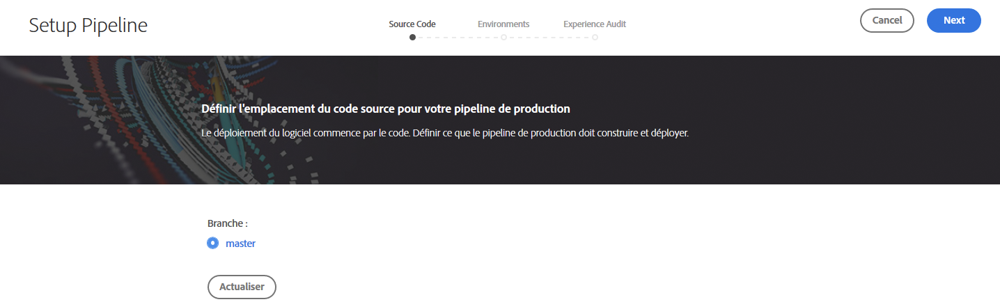
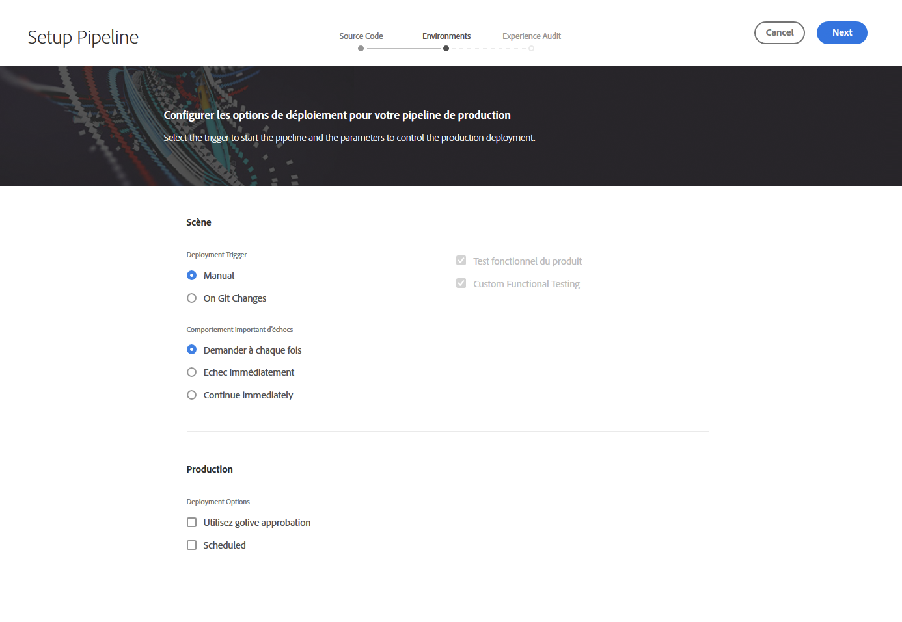
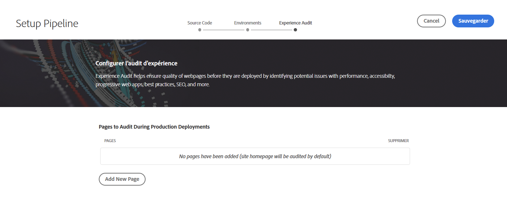

# Configuration du pipeline CI-CD {#configure-ci-cd-pipeline}

Dans Cloud Manager, il existe deux types de pipeline :

* **Gazoduc** de production :

   Un pipeline de production ne peut être ajouté qu&#39;une fois qu&#39;un ensemble d&#39;environnements de production et d&#39;étape est créé.

   Refer to [Setting up Production Pipeline](configure-pipeline.md#setting-up-the-pipeline) for more details.

* **Pipeline** hors production :

   Vous pouvez ajouter un pipeline hors production à partir de la page **Aperçu** de l’interface utilisateur de Cloud Manager.

   Pour plus d&#39;informations, consultez la section Tuyaux [pour la qualité du code et](configure-pipeline.md#non-production-pipelines) non-production.

>[!NOTE]
>Pour configurer votre pipeline, vous devez :
> * définir le déclencheur qui le démarrera ;
> * définir les paramètres qui contrôlent le déploiement en production ;
> * configurer les paramètres de test de performance.

## Setting up Production Pipeline {#setting-up-production-pipeline}

Deployment Manager est responsable de la configuration du pipeline de production.

>[!NOTE]
>Un pipeline de production ne peut pas être configuré tant qu&#39;une création de programme n&#39;est pas terminée, que le référentiel Git ne comporte pas au moins une branche et qu&#39;un jeu d&#39;environnements de production et d&#39;étape n&#39;est pas créé.

Avant de commencer le déploiement du code, vous devez configurer les paramètres de votre pipeline à partir de [!UICONTROL Cloud Manager].

>[!NOTE]
>
>Vous pouvez modifier les paramètres du pipeline après la configuration initiale.

## Configuration des paramètres du pipeline à partir de [!UICONTROL Cloud Manager] {#configuring-the-pipeline-settings-from-cloud-manager}

Une fois que vous avez configuré votre programme et que vous disposez au moins d’un environnement basé sur l’interface utilisateur de [!UICONTROL Cloud Manager], vous êtes prêt à configurer votre pipeline de déploiement.

Pour configurer le comportement et les préférences de votre pipeline, procédez comme suit :

1. Cliquez sur **Configurer le pipeline** pour configurer votre pipeline.

   

1. L’écran **Configurer un pipeline** s’affiche. Sélectionnez la branche, puis cliquez sur **Suivant**.

   

1. Configurez vos options de déploiement.

   

   Vous pouvez définir le déclencheur pour démarrer le pipeline :

   * **Manuel** : l’utilisation de l’interface lance le pipeline manuellement.
   * **Lors des modifications Git** : démarre le pipeline CI/CD chaque fois que des validations sont ajoutées à la branche git configurée. Même si vous sélectionnez cette option, vous pouvez toujours démarrer le pipeline manuellement.

   Lors de la configuration ou de la modification du pipeline, le responsable de déploiement peut définir le comportement du pipeline en cas d’échec important à l’un des points de contrôle qualité.

   Cela s’avère utile pour les clients qui souhaitent davantage de processus automatisés. Les options disponibles sont les suivantes :

   * **Demander à chaque fois** : il s’agit du paramètre par défaut, qui nécessite une intervention manuelle lors de n’importe quel échec important.
   * **Annuler immédiatement en cas d’échec** : si cette option est sélectionnée, le pipeline sera annulé chaque fois qu’un échec important se produira. Cette option émule essentiellement un utilisateur rejetant manuellement chaque échec.
   * **Continuer immédiatement** : si cette option est sélectionnée, le pipeline se poursuit automatiquement chaque fois qu’un échec important se produit. Cette option émule essentiellement la validation manuelle de l’utilisateur à chaque échec.

1. Les paramètres du pipeline de production comprennent un troisième onglet intitulé **Audit** d’expérience. Cette option fournit un tableau pour les chemins d’URL qui doivent toujours être inclus dans l’audit d’expérience.

   >[!NOTE]
   >Vous devez cliquer sur **Ajouter une nouvelle page** pour définir votre propre lien personnalisé.

   

   Cliquez sur **Ajouter une nouvelle page** pour fournir un chemin d’URL à inclure dans l’audit d’expérience.

   Par exemple, si vous souhaitez inclure `https://wknd.site/us/en/about-us.html` dans l’audit d’expérience, entrez le chemin `us/en/about-us.html` dans ce champ et cliquez sur **Enregistrer**.

   

   L’URL qui apparaît dans le tableau sera :

   `https://publish-p14253-e43686.adobeaemcloud.com/us/en/about-us.html`

   

   25 lignes au maximum peuvent être incluses. S’il n’y a aucune page envoyée par l’utilisateur dans cette section, la page d’accueil du site sera incluse par défaut dans l’audit d’expérience.

   Pour plus d’informations, voir [Comprendre les résultats](/help/implementing/cloud-manager/experience-audit-testing.md) de l’audit d’expérience.

   >[!NOTE]
   > Les pages configurées seront envoyées au service et évaluées en fonction des performances, de l&#39;accessibilité, de l&#39;optimisation du référencement (optimisation pour les moteurs de recherche), des bonnes pratiques et des tests de PWA (application Web progressive).

1. Cliquez sur **Enregistrer** dans l’écran **Modifier le tuyau** . La page **Aperçu** affiche désormais la carte **Déployer votre programme**. Cliquez sur le bouton **Déployer** pour déployer votre programme.

   

## Pipelines de qualité de code et hors production uniquement {#non-production-pipelines}

En plus du pipeline principal qui se déploie vers les environnements intermédiaire et de production, les clients peuvent configurer des pipelines supplémentaires, appelés **Pipelines hors production**. Ces pipelines exécutent toujours les étapes de génération et de qualité de code. Si besoin est, elles peuvent aussi déployer vers l’environnement Adobe Managed Services.

Sur l’écran d’accueil, ces pipelines sont répertoriés dans une nouvelle carte :

1. Accédez à la vignette **Pipelines hors production** depuis l’écran d’accueil de Cloud Manager.

   

1. Cliquez sur le bouton **Ajouter** pour spécifier le nom du pipeline, le type de pipeline et la branche Git.

   Vous pouvez également configurer le déclencheur de déploiement et le comportement en cas d’échec important dans les options du pipeline.

   

1. Cliquez sur **Enregistrer** pour afficher le pipeline sur la carte de l’écran d’accueil avec trois actions, comme illustré ci-dessous :

   

   * **Modifier** : permet de modifier les paramètres du pipeline.
   * **Génération** : permet d’accéder à la page d’exécution, à partir de laquelle le pipeline peut être exécuté.
   * **Gérer Git** : permet à l’utilisateur d’obtenir les informations nécessaires pour accéder au référentiel Git de Cloud Manager.

## Étapes suivantes {#the-next-steps}

Une fois que vous avez configuré le pipeline, vous devez déployer votre code.

Pour plus d’informations, consultez [Déploiement de votre code](deploy-code.md).
