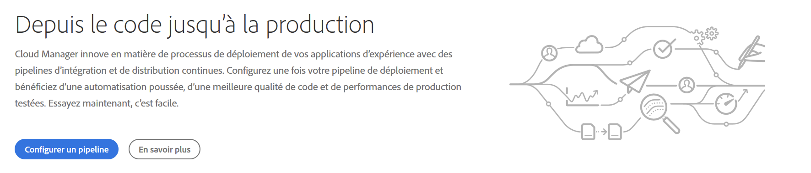
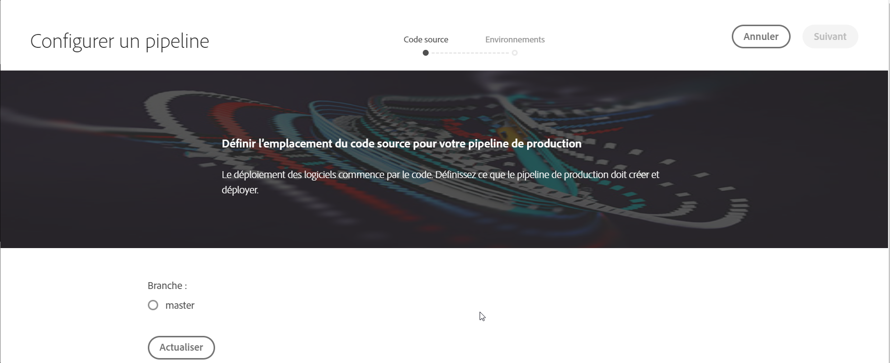
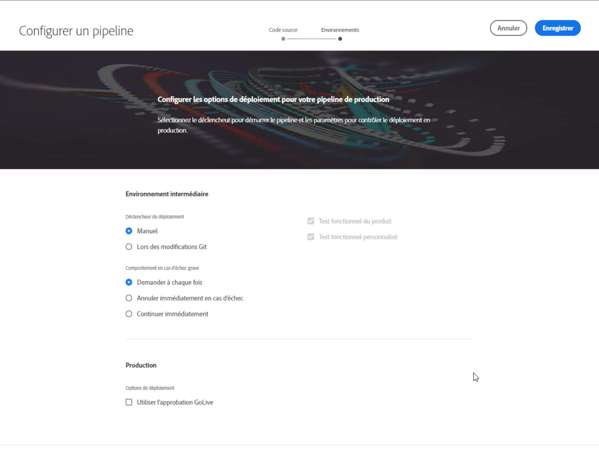
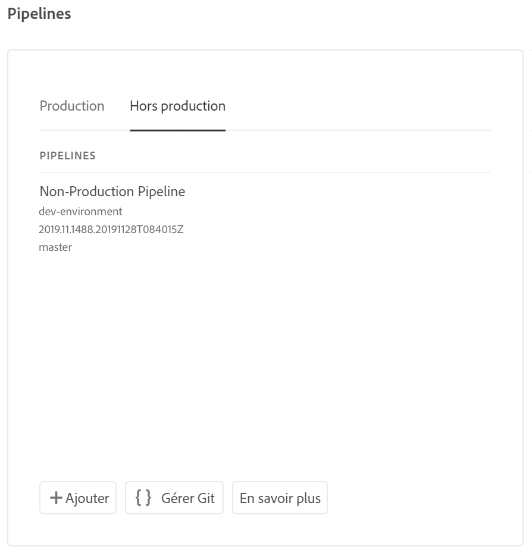
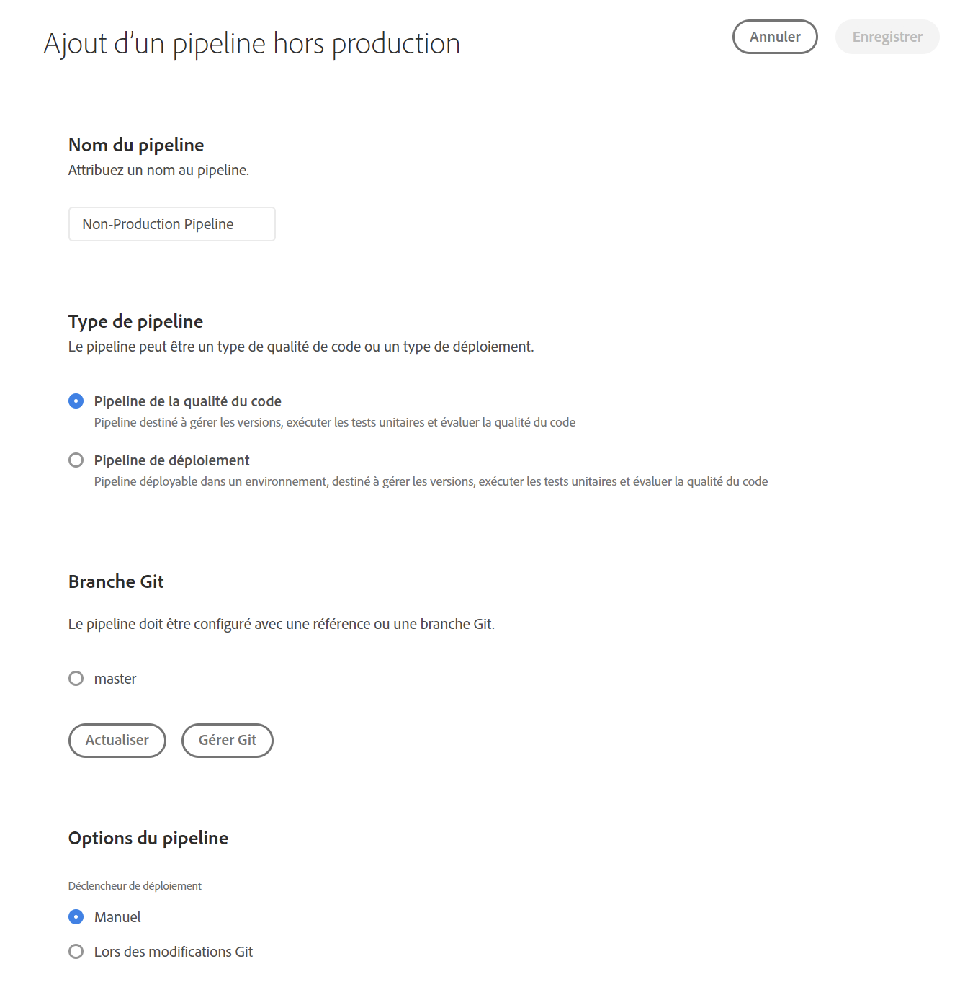
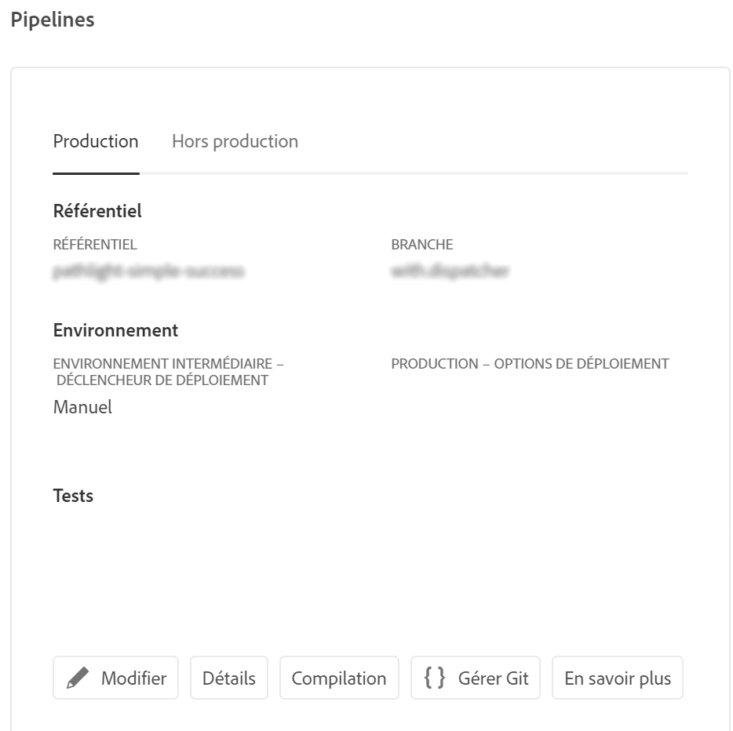

# Configuration du pipeline CI-CD {#configure-ci-cd-pipeline}

## Présentation du flux {#understanding-the-flow}

Vous pouvez configurer votre pipeline à partir de la vignette **Paramètres du pipeline** dans l’interface utilisateur de [!UICONTROL Cloud Manager].

Le responsable de déploiement est chargé de la configuration du pipeline. Pour ce faire, vous devez d’abord sélectionner une branche dans le **référentiel git**.

Pour configurer votre pipeline, l’utilisateur doit :

* définissez le déclencheur qui démarrera le pipeline.
* définissez les paramètres contrôlant le déploiement de production.
* configurez les paramètres du test de performances.

## Configuration du pipeline {#setting-up-the-pipeline}

>[!CAUTION]
>
>Le pipeline ne peut pas être configuré tant que la création d&#39;un programme n&#39;est pas terminée et que le référentiel Git ne comporte pas au moins une branche.

Avant de commencer le déploiement du code, vous devez configurer les paramètres de votre pipeline à partir de [!UICONTROL Cloud Manager].

>[!NOTE]
>
>Vous pouvez modifier les paramètres du pipeline après la configuration initiale.

## Configuration des paramètres du pipeline à partir de [!UICONTROL Cloud Manager] {#configuring-the-pipeline-settings-from-cloud-manager}

Une fois que vous avez configuré votre programme et que vous avez au moins un environnement à l’aide de l’interface utilisateur de [!UICONTROL Cloud Manager] , vous êtes prêt à configurer votre pipeline de déploiement.

Pour configurer le comportement et les préférences de votre pipeline, procédez comme suit :

1. Cliquez sur **Configurer le pipeline** pour configurer votre pipeline.

   

1. L’écran **Configurer un pipeline** s’affiche. Select the branch and click **Next**.

   

1. Configurez les options de déploiement.

   

   Vous pouvez définir le déclencheur pour démarrer le pipeline :

   * **Manuel** : l’utilisation de l’interface lance le pipeline manuellement.
   * **Lors des modifications Git** : démarre le pipeline CI/CD chaque fois que des validations sont ajoutées à la branche git configurée. Même si vous sélectionnez cette option, vous pouvez toujours démarrer le pipeline manuellement.
   Lors de la configuration ou de la modification du pipeline, Deployment Manager peut définir le comportement du pipeline lorsqu’une défaillance importante est rencontrée dans l’une des portes de qualité.

   Cela s’avère utile pour les clients qui souhaitent davantage de processus automatisés. Les options disponibles sont les suivantes :

   * **Demander à chaque fois** : il s’agit du paramètre par défaut, qui nécessite une intervention manuelle lors de n’importe quel échec important.
   * **Annuler immédiatement en cas d’échec** : si cette option est sélectionnée, le pipeline sera annulé chaque fois qu’un échec important se produira. Cette option émule essentiellement un utilisateur rejetant manuellement chaque échec.
   * **Continuer immédiatement** : si cette option est sélectionnée, le pipeline se poursuit automatiquement chaque fois qu’un échec important se produit. Cette option émule essentiellement la validation manuelle de l’utilisateur à chaque échec.

1. Click **Next** to access the **Testing** tab to define your testing criteria for your program.

   

1. Cliquez sur **Enregistrer**. La page *Aperçu* affiche désormais la carte **Déployer votre programme** . Cliquez sur le bouton **Déployer** pour déployer votre programme.

   

## Pipelines de qualité de code et hors production uniquement

En plus du pipeline principal qui se déploie vers les environnements intermédiaire et de production, les clients peuvent configurer des pipelines supplémentaires, appelés **Pipelines hors production**. Ces pipelines exécutent toujours les étapes de génération et de qualité de code. Si besoin est, elles peuvent aussi déployer vers l’environnement Adobe Managed Services.

Sur l’écran d’accueil, ces pipelines sont répertoriés dans une nouvelle carte :

1. Accédez à la vignette **Pipelines hors production** depuis l’écran d’accueil de Cloud Manager.

   

1. Clicking on the **Add** button, to specify the Pipeline Name, Pipeline Type, and the Git Branch.

   Vous pouvez également configurer le déclencheur de déploiement et le comportement en cas d’échec important dans les options du pipeline.

   

1. Click **Save** and the pipeline is shown on the card on the home screen with three actions, as shown below:

   

   * **Modifier** : permet de modifier les paramètres du pipeline.
   * **Génération** : permet d’accéder à la page d’exécution, à partir de laquelle le pipeline peut être exécuté.
   * **Gérer Git** : permet à l’utilisateur d’obtenir les informations nécessaires pour accéder au référentiel Git Cloud Manager.

## Étapes suivantes {#the-next-steps}

Une fois que vous avez configuré le pipeline, vous devez déployer votre code.

Pour plus d’informations, consultez [Déploiement de votre code](deploy-code.md).
