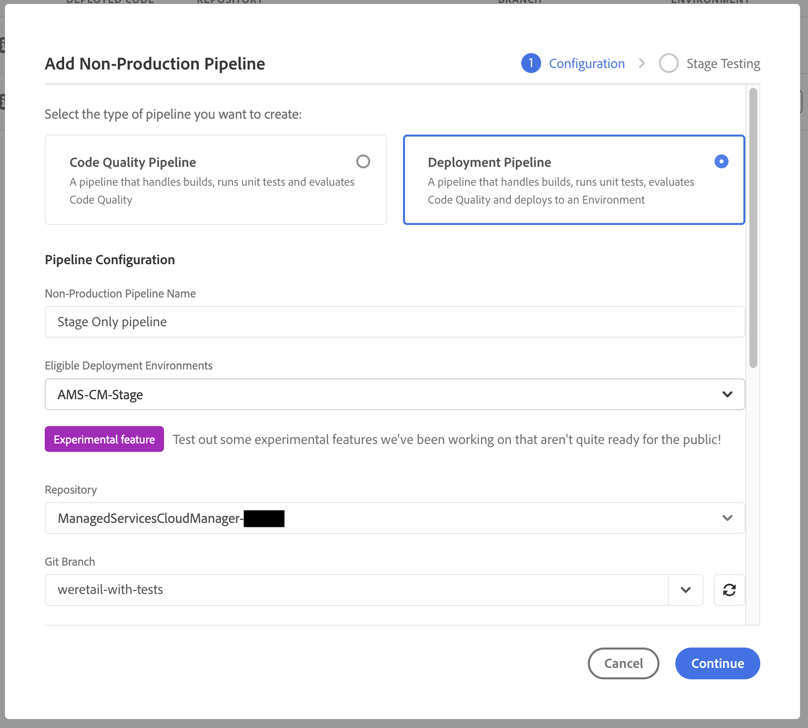

# Pipelines dédiés à l’évaluation uniquement et à la production uniquement {#stage-prod-only}

Découvrez comment séparer les déploiements d’évaluation et de production à l’aide de pipelines dédiés.

>[!NOTE]
>
>Cette fonctionnalité n’est disponible que pour le [programme d’adoption précoce.](/help/implementing/cloud-manager/release-notes/current.md#early-adoption)

## Vue d’ensemble {#overview}

Les environnements d’évaluation et de production sont étroitement liés. Par défaut, les déploiements qui leur sont associés sont liés à un pipeline unique. Il s’agit d’un pipeline de déploiement qui effectue le déploiement pour les environnements d’évaluation et de production de ce programme. Bien que cette liaison soit habituellement adaptée, certains cas pratiques présentent des inconvénients :

* Si vous souhaitez effectuer un déploiement vers l’environnement d’évaluation uniquement, vous ne pouvez le faire qu’en rejetant l’étape **Promouvoir en production** dans le pipeline. Cependant, l’exécution sera marquée comme annulée.
* Si vous souhaitez déployer le code le plus récent d’un environnement d’évaluation vers la production, vous devez redéployer l’ensemble du pipeline, y compris le déploiement de l’évaluation, même si il n’y a eu aucune modification du code dans ce dernier.
* Étant donné que les environnements ne peuvent pas être mis à jour pendant les déploiements, si vous souhaitez mettre en pause et effectuer des tests sur plusieurs jours dans l’environnement d’évaluation avant de procéder à la promotion en production, l’environnement de production ne peut pas être mis à jour. Cela rend les tâches non dépendantes, telles que la mise à jour des [variables d’environnement](/help/implementing/cloud-manager/getting-access-to-aem-in-cloud/build-environment-details.md#environment-variables), impossibles à effectuer.

Les pipelines dédiés à l’évaluation uniquement et à la production uniquement offrent des solutions à ces cas d’utilisation en fournissant des options de déploiement dédiées.

* Les **pipelines de déploiement en environnement d’évaluation uniquement** déploient uniquement vers un environnement d’évaluation, l’exécution se terminant une fois le déploiement et les tests terminés.
   * Un pipeline dédié à l’évaluation uniquement se comporte de la même manière que le pipeline de pile complète de production couplé standard, mais sans les étapes de déploiement de production (approbation, planification, déploiement).
* Les **pipelines de déploiement en production uniquement** déploient uniquement vers un environnement de production avec la possibilité de sélectionner une exécution terminée et validée avec succès pour l’évaluation et de déployer les artefacts de celle-ci en production.
   * Les pipelines dédiés à la production uniquement réutilisent les artefacts des déploiements en évaluation, ignorant ainsi la phase de création.

Ni les pipelines dédiés uniquement à l’évaluation, ni ceux dédiés uniquement à la production ne sont exécutés pendant l’exécution d’un pipeline de production de pile complète, et vice versa. Si le pipeline dédié uniquement à l’évaluation et à la production de pile complète dispose du déclencheur **Lors des modifications Git** configuré et pointent vers la même branche et le même référentiel, seul le pipeline dédié uniquement à l’évaluation est lancé automatiquement. Les pipelines dédiés uniquement à la production ne sont pas lancé **Lors des modifications Git**, car ils ne sont pas directement liés à un référentiel.

Ces pipelines dédiés offrent plus de flexibilité, mais tenez compte des informations ci-après concernant leur fonctionnement et les recommandations associées.

## Limites {#limitations}

Les pipelines dédiés à la production uniquement utiliseront toujours les artefacts du pipeline dédié à l’évaluation uniquement, indépendamment de ce qui a pu être déployé en évaluation via le pipeline de production couplé standard entre-temps.

* Cela peut entraîner des réécritures de code indésirables.
* Adobe vous recommande d’arrêter d’utiliser le pipeline de production couplé standard une fois que vous commencez à utiliser les pipelines dédiés à la production uniquement et à l’évaluation uniquement.
* Si vous décidez malgré tout d’exécuter les pipelines couplés standard et les pipelines dédiés à l’évaluation/la production uniquement, tenez compte de la réutilisation des artefacts pour éviter les réécritures de code.

## Problèmes connus {#known-issues}

Notez également les problèmes connus suivants avant de commencer à tester cette fonctionnalité.

* Une fois que vous utilisez des pipelines de production seule, vous ne pouvez pas bénéficier des mises à jour AEM les plus récentes.
   * Dans certains cas, le processus de mise à jour des AEM peut rétablir le code qui a été déployé pour la dernière fois via le pipeline de pile complet.
* Vous ne pourrez pas demander une [restauration d’environnement](/help/operations/restore.md#offsite-backup) si vous utilisez des pipelines de production seule ou d’évaluation seule.

## Création de pipeline {#pipeline-creation}

Les pipelines dédiés à la production uniquement et à l’évaluation uniquement sont créés de la même manière que les [pipelines de production](/help/implementing/cloud-manager/configuring-pipelines/configuring-production-pipelines.md) et [pipelines hors production couplés standard.](/help/implementing/cloud-manager/configuring-pipelines/configuring-non-production-pipelines.md) Consultez ces documents pour plus de détails.

1. Dans la fenêtre **Pipelines**, appuyez ou cliquez sur **Ajouter un pipeline**.

   * Sélectionnez **Ajouter un pipeline hors production** pour créer un pipeline dédié à l’évaluation uniquement.
   * Sélectionnez **Ajouter un pipeline de production uniquement** pour créer un pipeline dédié uniquement à la production.

   

>[!NOTE]
>
>Certaines options peuvent être grisées si les pipelines correspondants existent déjà.
>
>* L’option **Ajouter un pipeline de production uniquement** n’est pas disponible si un pipeline dédié uniquement à l’évaluation n’existe pas encore.
>* L’option **Ajouter un pipeline de production** n’est pas disponible si un pipeline couplé standard existe déjà.
>* Un seul pipeline dédié uniquement à la production et un seul pipeline dédié uniquement à l’évaluation sont autorisés par programme.

### Pipelines dédiés uniquement à l’évaluation {#stage-only}

1. Une fois que vous avez sélectionné l’option **Ajouter un pipeline hors production**, la boîte de dialogue **Ajouter un pipeline hors production** s’ouvre.
1. Pour créer un pipeline dédié uniquement à l’évaluation, sélectionnez l’environnement d’évaluation dans le champ **Environnements de déploiement éligibles** pour votre pipeline. Renseignez les champs restants et appuyez ou cliquez sur **Continuer**.

   

1. Dans l’onglet **Tests de l’environnement d’évaluation** vous pouvez définir les tests qui doivent être effectués dans l’environnement d’évaluation. Appuyez ou cliquez sur **Enregistrer** pour enregistrer votre nouveau pipeline.

### Pipelines dédiés uniquement à la production {#prod-only}

1. Une fois que vous avez sélectionné l’option **Ajouter un pipeline de production uniquement**, la boîte de dialogue **Ajouter un pipeline de production uniquement** s’ouvre.
1. Saisissez un **Nom de pipeline**. Les options et les fonctionnalités restantes de la boîte de dialogue fonctionnent de la même manière que celles de la boîte de dialogue de création d’un pipeline couplé standard. Appuyez ou cliquez sur **Enregistrer** pour enregistrer le pipeline.

## Exécuter des pipelines dédiés à la production uniquement et à l’évaluation uniquement {#running}

Les pipelines dédiés à la production uniquement et à l’évaluation uniquement sont exécutés de la même manière que [tous les autres pipelines.](/help/implementing/cloud-manager/configuring-pipelines/managing-pipelines.md#running-pipelines) Consultez cette documentation pour plus de détails.

En outre, une exécution de pipeline dédié uniquement à la production peut être déclenchée directement à partir des détails d’exécution d’un pipeline dédié uniquement à l’évaluation.

### Pipelines dédiés uniquement à l’évaluation {#stage-only-run}

Un pipeline dédié uniquement à l’évaluation s’exécute presque de la même manière que les pipelines couplés standard. Toutefois, à la fin de l’exécution, après les étapes de test, un bouton **Promouvoir la version** vous permet de démarrer une exécution de pipeline dédié uniquement à la production qui utilise les artefacts déployés en évaluation par l’exécution et les déploie dans l’environnement de production.

Le bouton **Promouvoir la version** n’apparaît que si vous vous trouvez dans la dernière exécution réussie d’un pipeline dédié uniquement à l’évaluation. Lorsque vous appuyez ou que vous cliquez dessus, vous devez confirmer l’exécution du pipeline dédié uniquement à la production ou créer un pipeline dédié uniquement à la production si celui-ci n’existe pas encore.

### Pipelines dédiés uniquement à la production {#prod-only-run}

Pour les pipelines dédiés uniquement à la production, il est important d’identifier les artefacts source qui doivent être déployés en production. Ces informations se trouvent dans l’étape **Préparation des artefacts**. Vous pouvez accéder à ces exécutions pour plus de détails et pour accéder aux journaux.

