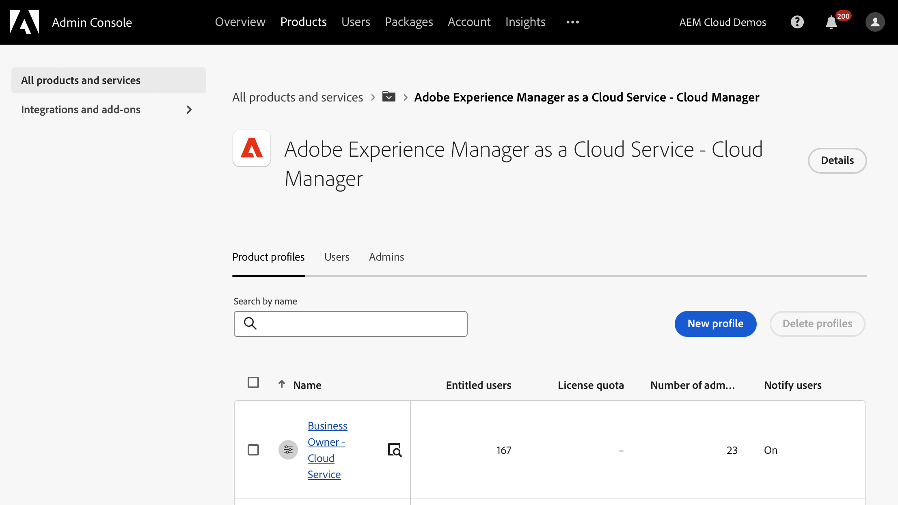

# Autorisations personnalisées {#custom-permissions}

Découvrez comment utiliser des autorisations personnalisées pour créer des profils d’autorisation personnalisés avec des autorisations configurables afin de restreindre l’accès aux programmes, aux pipelines et aux environnements pour les utilisateurs et utilisatrices de Cloud Manager.

## Présentation {#introduction}

Cloud Manager dispose d’un ensemble de rôles prédéfinis qui régissent l’accès à diverses fonctionnalités de Cloud Manager :

* Propriétaire de l’entreprise
* Responsable de programme
* Responsable de déploiement
* Développeur ou développeuse

Les autorisations personnalisées permettent aux utilisateurs de créer des profils d’autorisation personnalisés avec des autorisations configurables pour restreindre l’accès des utilisateurs de Cloud Manager aux programmes, pipelines et environnements.

>[!TIP]
>
>Pour plus d’informations sur les rôles prédéfinis, voir [Profils d’équipe et de produit AEM as a Cloud Service](/help/onboarding/aem-cs-team-product-profiles.md).

## Utiliser les autorisations personnalisées {#using}

Pour créer et utiliser vos propres autorisations personnalisées, trois étapes sont nécessaires :

1. [Créer un profil de produit](#create).
1. [Attribuez des autorisations personnalisées au profil de produit](#assign-permissions).
1. [Affecter des utilisateurs au profil de produit](#assign-users).

Cette section décrit ces étapes en détails. Il peut se révéler utile de consulter les sections [Termes](#terms) et [Autorisations configurables](#configurable-permissions) lors de la création de vos propres autorisations personnalisées.

>[!NOTE]
>
>Vous devez disposer des droits d’administrateur de produit dans Admin Console pour Adobe Experience Manager as a Cloud Service afin de créer des profils et de gérer les autorisations pour Cloud Manager.

### Créer un profil de produit {#create}

Créez d’abord un profil de produit avant de pouvoir attribuer des autorisations personnalisées.

1. Connectez-vous à Cloud Manager sur [my.cloudmanager.adobe.com](https://my.cloudmanager.adobe.com/).

1. Sur la page de destination de Cloud Manager, cliquez sur le bouton **Gérer l’accès**.

1. Une redirection vers l’onglet **Produits** d’Admin Console se produit, dans lequel vous pouvez gérer les utilisateurs et utilisatrices et les autorisations de Cloud Manager. Dans Admin Console, cliquez sur le bouton **Nouveau profil**.

1. Fournissez les détails généraux du profil.

   * **Nom du profil de produit** : un nom descriptif du profil.
   * **Nom d’affichage** - Nom abrégé affiché dans l’interface utilisateur (options)
   * **Description** : une description informative du profil expliquant son objectif (facultatif).
   * **Notifier les utilisateurs par e-mail** - Les utilisateurs reçoivent une notification par e-mail lorsqu’ils sont ajoutés ou supprimés de ce profil.

1. Sélectionnez **Enregistrer** lorsque vous avez terminé.

Le nouveau profil de produit est enregistré et visible dans la liste des profils de produits dans l’Admin Console.

### Attribuer des autorisations personnalisées au profil {#assign-permissions}

Maintenant que vous disposez d’un nouveau profil de produit, vous pouvez lui attribuer des autorisations personnalisées.

1. Dans Admin Console, sélectionnez le nom du [nouveau profil de produit que vous avez créé](#create).

1. Dans la fenêtre qui s’ouvre, sélectionnez l’onglet **Autorisations** pour afficher la liste des autorisations modifiables.

   

1. Sélectionnez le lien **Modifier** d’une autorisation pour pouvoir la modifier.

1. La fenêtre **Modifier l’autorisation** s’ouvre.
   * L’autorisation que vous avez sélectionnée à l’étape précédente est sélectionnée dans la colonne de gauche.
   * Les éléments d’autorisation disponibles pour l’affectation de l’autorisation se trouvent dans la colonne du milieu intitulée **Autorisations disponibles**.
   * Les éléments d’autorisation attribués se trouvent dans la colonne de droite intitulée **Éléments d’autorisation inclus**.

   

1. Sélectionnez l’icône plus (`+`) en regard de l’élément d’autorisation afin de l’ajouter à la colonne **Éléments d’autorisation inclus**.

   * Sélectionnez l’icône `i` en regard d’un élément d’autorisation si vous souhaitez en savoir plus à ce sujet.

1. Sélectionnez le bouton **Ajouter tout** en haut de la colonne **Autorisations disponibles** afin de pouvoir ajouter toutes les autorisations.

1. Sélectionnez **Enregistrer** lorsque vous avez terminé de définir les éléments d’autorisation pour votre nouveau profil de produit.

Votre nouveau profil de produit est maintenant enregistré avec ses autorisations personnalisées.

### Affecter des personnes aux autorisations personnalisées {#assign-users}

Vous pouvez désormais affecter des personnes au nouveau profil de produit que vous avez créé avec des autorisations personnalisées.

1. Dans Admin Console, sélectionnez le nom du [nouveau profil de produit auquel vous avez attribué des autorisations personnalisées](#assign-permissions).

1. Dans la fenêtre qui s’ouvre, sélectionnez l’onglet **Utilisateurs et utilisatrices**.

1. Sélectionnez le bouton **Ajouter des utilisateurs** et affectez des utilisateurs à votre nouveau profil de produit avec des autorisations personnalisées.

Consultez la section **Ajouter des utilisateurs et des groupes d’utilisateurs à un profil de produit** du document [Gérer les profils de produit pour les utilisateurs d’entreprise](https://helpx.adobe.com/fr/enterprise/using/manage-product-profiles.html) pour plus d’informations sur l’utilisation d’Admin Console.

## Autorisations configurables {#configurable-permissions}

Les autorisations suivantes sont disponibles pour créer des profils personnalisés.

| Autorisation | Description |
| --- | --- |
| Création de programme | Autoriser les utilisateurs à créer un programme. |
| Accès au programme | Autoriser les utilisateurs à accéder aux programmes. |
| Modification du programme | Autoriser les utilisateurs à modifier les programmes. |
| Création d’environnement | Permet aux utilisateurs de créer un environnement. |
| Modification d’environnement | Autoriser les utilisateurs à mettre à jour et à modifier les environnements. |
| Journaux d’environnement lus | Autoriser les utilisateurs à lire les journaux d’environnement. |
| Gestion des variables d’environnement | Autoriser les utilisateurs à créer/modifier/supprimer des configurations d’environnement. |
| Création de la restauration de l’environnement | Permet aux utilisateurs de créer un environnement de restauration. |
| Réinitialisation de l’environnement de développement rapide | Autorisez les utilisateurs à réinitialiser l’environnement de développement rapide (RDE). |
| Gestion de la copie de contenu | Laisser les utilisateurs gérer les opérations de copie de contenu. |
| Création d’un pipeline | Autoriser les utilisateurs à créer des pipelines. |
| Suppression de pipeline | Autoriser les utilisateurs à supprimer des pipelines. |
| Modification du pipeline | Autoriser les utilisateurs à modifier les pipelines. |
| Approbation et rejet des déploiements de production | Autoriser les utilisateurs à approuver ou rejeter une étape de déploiement en production. |
| Annulation des exécutions de pipeline | Autoriser les utilisateurs à annuler les exécutions de pipeline. |
| Démarrage des exécutions de pipeline | Autoriser les utilisateurs à démarrer une nouvelle exécution de pipeline. |
| Remplacement et rejet d’échecs de mesures importantes | Autoriser les utilisateurs à remplacer/rejeter les échecs de mesures importants |
| Planification des déploiements en production | Permet aux utilisateurs de planifier une étape de déploiement en production. |
| Accès aux informations sur le référentiel | Permet aux utilisateurs d’accéder aux informations du référentiel et génère un mot de passe d’accès. |
| Création de référentiel | Autoriser les utilisateurs à créer des référentiels Git. |
| Suppression de référentiel | Autoriser les utilisateurs à supprimer des référentiels Git. |
| Modification de référentiel | Autoriser les utilisateurs à modifier les référentiels Git. |
| Génération de code de référentiel | Permet aux utilisateurs de générer un projet à partir de l’archétype. |
| Gestion des noms de domaine | Autoriser les utilisateurs à créer/modifier/supprimer des noms de domaine. |
| Gestion de la Liste autorisée IP | Autoriser les utilisateurs à créer/modifier/supprimer des adresses IP et à placer sur la liste autorisée placer sur la liste autorisée des liaisons IP. |
| Gestion de l’infrastructure réseau | Autoriser les utilisateurs à créer/modifier/supprimer l’infrastructure réseau. |
| Gestionnaire de certificats SSL | Autoriser les utilisateurs à créer/modifier/supprimer un certificat SSL. |
| Gestion des utilisateurs du sous-compte New Relic | Autoriser les utilisateurs à lire/modifier les utilisateurs du sous-compte New Relic. |

### Autorisations au niveau de l’organisation {#organization-level}

Les autorisations au niveau de l’organisation font référence aux autorisations qui sont toujours accordées à tous les programmes d’une organisation.

Les autorisations suivantes sont des autorisations au niveau de l’organisation :

* **Création de programme** - Cette autorisation permet aux utilisateurs de créer un programme dans l’organisation.
* **Accès aux informations du référentiel** Cette autorisation au niveau du client/de l’organisation permet aux utilisateurs de générer un nom d’utilisateur, un mot de passe et une URL de référentiel pour l’accès et la contribution à un projet client.
   * Le nom d’utilisateur et le mot de passe pour l’accès au référentiel sont communs à tous les référentiels de l’organisation. Toutefois, l’URL du référentiel est propre à chaque programme.
   * Voir [Accès aux référentiels](/help/implementing/cloud-manager/managing-code/accessing-repos.md) pour plus d’informations.

## Termes {#terms}

Les termes suivants sont utilisés pour créer et gérer des autorisations personnalisées et des rôles prédéfinis.

| Terme | Description |
| --- | --- |
| Autorisations prédéfinies | Rôles prédéfinis tels que **Propriétaire de l’entreprise** et **Responsable de déploiement** pour gérer les différentes fonctionnalités de Cloud Manager. Pour plus d’informations sur les rôles prédéfinis, voir [Profils d’équipe et de produit AEM as a Cloud Service](/help/onboarding/aem-cs-team-product-profiles.md). |
| Autorisations personnalisées | Les fonctionnalités de Cloud Manager permettent aux utilisateurs de créer des profils d’autorisation pour définir des rôles afin de gérer les fonctionnalités prises en charge de Cloud Manager. |
| Profil de produit | Créé dans Admin Console pour gérer les autorisations configurables qui s’appliquent aux utilisateurs qui font partie du profil d’autorisation. |
| Autorisation configurable | autorisations Cloud Manager que vous pouvez configurer dans le profil d’autorisations. |
| Élément d’autorisation | Programme, environnement ou ressource de pipeline sur lequel une autorisation peut être appliquée. |

Les éléments d’autorisation font référence à la portée dans laquelle l’autorisation est appliquée. En règle générale, il s’agit de l’un des éléments suivants.

| Type d’élément d’autorisation | Exemple | Description |
| --- | --- | --- |
| Organisation | Organisation:entrepriseA | Toutes les ressources applicables d’une organisation. Une ressource peut être un programme, un environnement ou un pipeline. Si l’utilisateur ou l’utilisatrice ajoute une organisation pour n’importe quelle autorisation, toutes les nouvelles ressources de cette organisation auront également cette autorisation. |
| Programme | Programme A | Toutes les ressources applicables d’un programme. |
| Environnement | Programme A : environnement | Applicable à un environnement spécifique. |
| Pipeline | Programme A : pipeline | Applicable à un pipeline spécifique. |

## Remarques sur l’utilisation {#usage-notes}

* Un profil d’autorisations personnalisé répertorie également les programmes, environnements et pipelines AMS lors de la configuration des autorisations.
* Les ressources telles que le programme, l’environnement et le pipeline qui ont été créées dans Cloud Manager peuvent prendre deux minutes pour s’afficher dans Admin Console pour la configuration des autorisations.
* Dans de rares cas où le service d’autorisations personnalisées ne répond pas, les profils prédéfinis sont toujours disponibles et les utilisateurs et utilisatrices des profils prédéfinis disposent toujours d’un accès approprié.

## Questions fréquentes {#faq}

### Quels profils d’autorisation sont des profils d’autorisation prédéfinis ?

* Propriétaire de l’entreprise
* Responsable de programme
* Responsable de déploiement
* Développeur ou développeuse

Pour plus d’informations sur les rôles prédéfinis, voir [Profils d’équipe et de produit AEM as a Cloud Service](/help/onboarding/aem-cs-team-product-profiles.md).

### Qu’advient-il des profils d’autorisation prédéfinis lors de l’introduction de profils personnalisés ?

Les profils de produits et les rôles de Cloud Manager par défaut continuent de fonctionner comme auparavant.

### Puis-je modifier des profils d’autorisation prédéfinis ?

Non, les profils par défaut ne sont pas modifiables. Vous ne pouvez pas ajouter d’autorisations au profil d’autorisation par défaut, ni les supprimer de celui-ci. Vous pouvez uniquement ajouter ou supprimer des utilisateurs et utilisatrices aux/des profils prédéfinis.

### Dois-je supprimer les profils d’autorisation prédéfinis puisque les profils personnalisés sont désormais disponibles ?

Ne supprimez pas les profils d’autorisation prédéfinis d’Admin Console.

### Puis-je ajouter des utilisateurs et utilisatrices à plusieurs profils d’autorisation ?

Oui, un utilisateur ou une utilisatrice peut faire partie de plusieurs profils, y compris des profils d’autorisation prédéfinis et personnalisés. Lorsqu’une personne est affectée à plusieurs profils, les autorisations combinées de tous les profils d’autorisation affectés lui seront disponibles.

### Que se passe-t-il si une personne est autorisée à modifier un environnement/pipeline mais n’a pas accès à un programme contenant l’environnement/le pipeline ?

Dans ce cas, l’utilisateur ne peut pas accéder à l’environnement ou au pipeline s’il ne dispose pas des autorisations **accès au programme** contenant l’environnement ou le pipeline.
