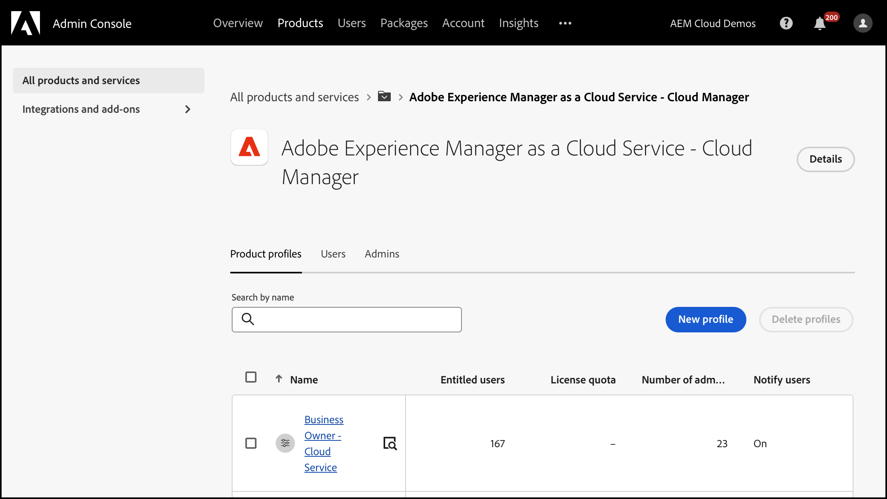

# Autorisations personnalisées {#custom-permissions}

Découvrez comment configurer des profils d’autorisation personnalisés dans Cloud Manager. Vous pouvez configurer des contrôles d’accès spécifiques pour les programmes, les pipelines et les environnements, ce qui vous donne un contrôle granulaire sur ce que chaque utilisateur peut faire.

## Présentation {#introduction}

Cloud Manager dispose d’un ensemble de rôles prédéfinis qui régissent l’accès aux différentes fonctionnalités de Cloud Manager :

* Propriétaire de l’entreprise
* Responsable de programme
* Responsable de déploiement
* Développeur ou développeuse

Les autorisations personnalisées permettent aux utilisateurs de créer des profils d’autorisation personnalisés avec des autorisations configurables pour restreindre l’accès des utilisateurs de Cloud Manager aux programmes, pipelines et environnements.

>[!TIP]
>Pour plus d’informations sur les rôles prédéfinis, voir [Profils d’équipe et de produit &#x200B;](/help/onboarding/aem-cs-team-product-profiles.md).

## Utiliser les autorisations personnalisées {#using}

La création et l’utilisation de vos autorisations personnalisées nécessitent les trois étapes suivantes :

1. [Créer un profil de produit](#create).
1. [Attribuez des autorisations personnalisées au profil de produit](#assign-permissions).
1. [Affecter des utilisateurs au profil de produit](#assign-users).

>[!TIP]
>Consultez les sections [Conditions](#terms) et [Autorisations configurables](#configurable-permissions) lorsque vous créez vos propres autorisations personnalisées.

>[!IMPORTANT]
>Pour créer des profils de produit et gérer les autorisations pour Cloud Manager, vous devez disposer des droits d’administrateur de produit dans Admin Console pour Adobe Experience Manager as a Cloud Service.

### Création d’un profil de produit {#create}

{{sign-in-to-cloud-manager}}

1. Sur la page de destination de Cloud Manager, cliquez sur **Gérer l’accès**.

   

1. Dans Admin Console, cliquez sur **Nouveau profil**.

   

1. Fournissez les détails généraux du profil.

   * **Nom du profil de produit** : un nom descriptif du profil.
   * **Nom d’affichage** - Nom abrégé affiché dans l’interface utilisateur (options)
   * **Description** : une description informative du profil expliquant son objectif (facultatif).
   * **Notifier les utilisateurs par e-mail** - Les utilisateurs reçoivent une notification par e-mail lorsqu’ils sont ajoutés ou supprimés de ce profil.

1. Cliquez sur **Enregistrer**.

Le nouveau profil de produit est enregistré et visible dans la liste des profils de produits dans l’Admin Console.

### Attribuer des autorisations personnalisées au profil de produit {#assign-permissions}

1. Dans Admin Console, cliquez sur le nom du [nouveau profil de produit que vous avez créé](#create).

1. Sur la page **Profil personnalisé**, cliquez sur l’onglet **Autorisations**.

   

1. Dans la ligne d’un nom d’autorisation, cliquez sur **Modifier**.

1. Dans la boîte de dialogue **Modifier les autorisations pour le profil personnalisé**, effectuez l’une des opérations suivantes :

   * En haut de la colonne **Éléments d’autorisations disponibles**, cliquez sur  **Ajouter tout** pour inclure toutes les autorisations.
   * Pour ajouter une seule autorisation à la colonne **Éléments d’autorisation inclus**, cliquez sur son icône associée .

     

1. Cliquez sur **Enregistrer**.

### Affectation d’utilisateurs au profil de produit {#assign-users}

1. Dans Admin Console, cliquez sur le nom du [nouveau profil de produit auquel vous avez attribué des autorisations personnalisées](#assign-permissions).

1. Dans la fenêtre qui s’ouvre, cliquez sur l’onglet **Utilisateurs**.

1. Cliquez sur **Ajouter des utilisateurs** et affectez des utilisateurs au profil de produit avec des autorisations personnalisées.

Dans [Gérer les profils de produit pour les utilisateurs d’entreprise](https://helpx.adobe.com/fr/enterprise/using/manage-product-profiles.html), voir **Ajouter des utilisateurs et des groupes d’utilisateurs à un profil de produit** pour plus d’informations sur l’utilisation d’Admin Console.

## Autorisations configurables {#configurable-permissions}

Les autorisations suivantes sont disponibles lorsque vous créez un profil de produit personnalisé.

| Autorisation | Description |
| --- | --- |
| `Program Create` | Autoriser les utilisateurs à créer un programme. |
| `Program Access` | Autoriser les utilisateurs à accéder aux programmes. |
| `Program Edit` | Autoriser les utilisateurs à modifier les programmes. |
| `Environment Create` | Permet aux utilisateurs de créer un environnement. |
| `Environment Edit` | Autoriser les utilisateurs à mettre à jour et à modifier les environnements. |
| `Environment Logs Read` | Autoriser les utilisateurs à lire les journaux d’environnement. |
| `Environment Variables Manage` | Autoriser les utilisateurs à créer/modifier/supprimer des configurations d’environnement. |
| `Environment Restore Create` | Permet aux utilisateurs de créer un environnement de restauration. |
| `Rapid Development Environment Reset` | Autorisez les utilisateurs à réinitialiser l’environnement de développement rapide (RDE). |
| `Content Copy Manage` | Laisser les utilisateurs gérer les opérations de copie de contenu. |
| `Pipeline Create` | Autoriser les utilisateurs à créer des pipelines. |
| `Pipeline Delete` | Autoriser les utilisateurs à supprimer des pipelines. |
| `Pipeline Edit` | Autoriser les utilisateurs à modifier les pipelines. |
| `Production Deployments Approve/Reject` | Autoriser les utilisateurs à approuver ou rejeter une étape de déploiement en production. |
| `Pipeline Executions Cancel` | Autoriser les utilisateurs à annuler les exécutions de pipeline. |
| `Pipeline Executions Start` | Autoriser les utilisateurs à démarrer un nouveau pipeline d’exécution. |
| `Override/Reject Important Metric Failures` | Autoriser les utilisateurs à remplacer/rejeter les échecs de mesures importants |
| `Production Deployments Schedule` | Permet aux utilisateurs de planifier une étape de déploiement en production. |
| `Repository Info Access` | Permet aux utilisateurs d’accéder aux informations du référentiel et génère un mot de passe d’accès. |
| `Repository Create` | Autoriser les utilisateurs à créer des référentiels Git. |
| `Repository Delete` | Autoriser les utilisateurs à supprimer des référentiels Git. |
| `Repository Edit` | Autoriser les utilisateurs à modifier les référentiels Git. |
| `Repository Code Generate` | Permet aux utilisateurs de générer un projet à partir de l’archétype. |
| `Domain Name Manage` | Autoriser les utilisateurs à créer/modifier/supprimer des noms de domaine. |
| `IP Allowlist Manage` | Autoriser les utilisateurs à créer/modifier/supprimer des adresses IP et à placer sur la liste autorisée des liaisons IP. |
| `Network Infrastructure Manage` | Autoriser les utilisateurs à créer/supprimer/modifier/tester l’infrastructure réseau. |
| `SSL Certificate Manage` | Autoriser les utilisateurs à créer/modifier/supprimer un certificat SSL. |
| `New Relic Sub Account User Manage` | Autoriser les utilisateurs à lire/modifier les utilisateurs du sous-compte New Relic. |

### Autorisations au niveau de l’organisation {#organization-level}

Les autorisations au niveau de l’organisation font référence aux autorisations qui sont toujours accordées à tous les programmes d’une organisation.

Les autorisations suivantes sont des autorisations au niveau de l’organisation :

* **`Program Create`** - Cette autorisation permet aux utilisateurs de créer un programme dans l’organisation.
* **Accès aux informations du référentiel** - Cette autorisation au niveau du client/de l’organisation permet aux utilisateurs de générer un nom d’utilisateur, un mot de passe et une URL de référentiel pour accéder à un projet client et y contribuer.
   * Le nom d’utilisateur et le mot de passe pour l’accès au référentiel sont communs à tous les référentiels de l’organisation. Toutefois, l’URL du référentiel est propre à chaque programme.
   * Voir [Accès aux référentiels](/help/implementing/cloud-manager/managing-code/accessing-repos.md) pour plus d’informations.

## Termes {#terms}

Les termes suivants sont utilisés pour créer et gérer des autorisations personnalisées et des rôles prédéfinis.

| Terme | Description |
| --- | --- |
| Autorisations prédéfinies | Rôles prédéfinis tels que **Propriétaire de l’entreprise** et **Responsable de déploiement** pour gérer les différentes fonctionnalités de Cloud Manager. Pour plus d’informations sur les rôles prédéfinis, voir [Profils d’équipe et de produit &#x200B;](/help/onboarding/aem-cs-team-product-profiles.md). |
| Autorisations personnalisées | Les fonctionnalités de Cloud Manager permettent aux utilisateurs de créer des profils d’autorisation pour définir des rôles afin de gérer les fonctionnalités prises en charge de Cloud Manager. |
| Profil de produit | Créé dans Admin Console pour gérer les autorisations configurables qui s’appliquent aux utilisateurs qui font partie du profil d’autorisation. |
| Autorisation configurable | autorisations Cloud Manager que vous pouvez configurer dans le profil d’autorisations. |
| Élément d’autorisation | Programme, environnement ou ressource de pipeline sur lequel une autorisation peut être appliquée. |

Les éléments d’autorisation se rapportent à la portée dans laquelle les autorisations seront appliquées. En règle générale, il s’agit de l’un des éléments suivants.

| Type d’élément d’autorisation | Exemple | Description |
| --- | --- | --- |
| Organisation | organisation :companyA | Toutes les ressources applicables d’une organisation. Une ressource peut être un programme, un environnement ou un pipeline. Si l’utilisateur ou l’utilisatrice ajoute une organisation pour n’importe quelle autorisation, toutes les nouvelles ressources de cette organisation auront également cette autorisation. |
| Programme | Programme A | Toutes les ressources applicables d’un programme. |
| Environnement | Programme A : environnement | Applicable à un environnement spécifique. |
| Pipeline | Programme A : pipeline | Applicable à un pipeline spécifique. |

## Remarques sur l’utilisation {#usage-notes}

* Un profil d’autorisations personnalisé répertorie également les programmes, environnements et pipelines AMS lors de la configuration des autorisations.
* Les ressources telles que les programmes, les environnements et les pipelines qui ont été créées dans Cloud Manager nécessitent plusieurs minutes pour s’afficher dans Admin Console pour la configuration des autorisations.
* Dans les cas où un service d’autorisations personnalisées ne répond pas, les profils prédéfinis sont toujours disponibles et les utilisateurs disposant de profils prédéfinis disposent toujours d’un accès approprié.

## Questions fréquentes {#faq}

### Quels profils d’autorisation sont prédéfinis ?

* Propriétaire de l’entreprise
* Responsable de programme
* Responsable de déploiement
* Développeur ou développeuse

Pour plus d’informations sur les rôles prédéfinis, voir [Profils d’équipe et de produit &#x200B;](/help/onboarding/aem-cs-team-product-profiles.md).

### Qu’advient-il des profils d’autorisation prédéfinis avec l’introduction des profils personnalisés ?

Les profils de produit par défaut et les rôles Cloud Manager continuent de fonctionner comme précédemment.

### Puis-je modifier des profils d’autorisation prédéfinis ?

Non. Les profils par défaut ne sont pas modifiables. Vous ne pouvez pas ajouter ni supprimer des autorisations du profil d’autorisations par défaut. Vous pouvez uniquement ajouter ou supprimer des utilisateurs et utilisatrices aux/des profils prédéfinis.

### Dois-je supprimer les profils d’autorisation prédéfinis puisque les profils personnalisés sont désormais disponibles ?

Ne supprimez pas les profils d’autorisation prédéfinis d’Admin Console.

### Puis-je ajouter des utilisateurs et utilisatrices à plusieurs profils d’autorisation ?

Oui. Un utilisateur peut être affecté à plusieurs profils, y compris des profils d’autorisation prédéfinis et personnalisés. Lorsqu’une personne est affectée à plusieurs profils, les autorisations combinées de tous les profils d’autorisation affectés lui seront disponibles.

### Que se passe-t-il si un utilisateur est autorisé à modifier un environnement/pipeline mais n’a pas accès à un programme contenant l’environnement/le pipeline ?

L’utilisateur ne peut pas accéder à l’environnement ou au pipeline s’il ne dispose pas des autorisations **accès au programme** associées à l’environnement ou au pipeline.
