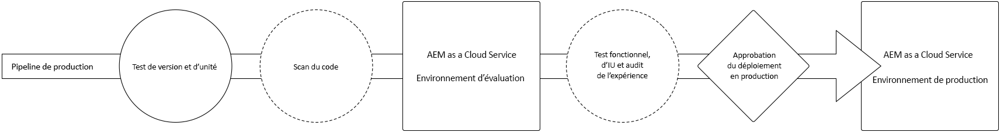
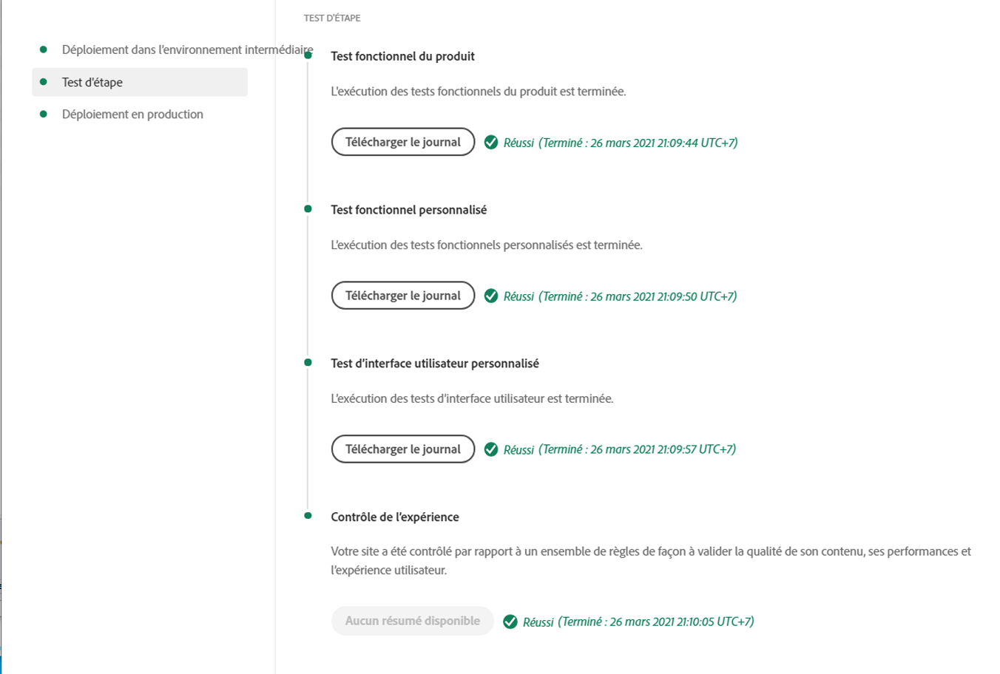

# Déployer votre code {#deploy-your-code}

Découvrez comment déployer votre code vers la Production à l’aide des pipelines Cloud Manager dans AEM as a Cloud Service.



Le déploiement transparent du code vers les environnements d’évaluation, puis de production s’effectue via un pipeline de production. L’exécution du pipeline de production est divisée en deux phases logiques :

1. **Déploiement dans l’environnement d’évaluation** - Le code est créé et déployé dans l’environnement d’évaluation pour les tests fonctionnels automatisés, les tests de l’interface utilisateur, le contrôle de l’expérience et les tests d’acceptation utilisateur (UAT).
1. **Déploiement dans l’environnement de production** - Une fois la version validée à l’étape d’évaluation et approuvée pour le passage en production, le même artefact de build est déployé dans l’environnement de production.

_Seul le type de pipeline Code full stack prend en charge l’analyse de code, les tests de fonction, les tests d’interface d’utilisation et l’audit d’expérience._

## Processus de déploiement {#deployment-process}

Tous les déploiements de Cloud Service suivent un processus continu pour garantir un temps d’arrêt nul. Pour en savoir plus, voir [Fonctionnement des déploiements en continu](/help/implementing/deploying/overview.md#how-rolling-deployments-work).

>[!NOTE]
>
>Le cache du Dispatcher est effacé à chaque déploiement. Il est ensuite « préchauffé » avant que les nouveaux nœuds de publication n’acceptent le trafic.

## Déploiement de votre code avec Cloud Manager dans AEM as a Cloud Service {#deploying-code-with-cloud-manager}

Une fois que vous avez [configuré votre pipeline de production](/help/implementing/cloud-manager/configuring-pipelines/configuring-production-pipelines.md), y compris le référentiel, l’environnement et l’environnement de test, vous êtes prêt à déployer votre code.

1. Connectez-vous à Cloud Manager à l’adresse [my.cloudmanager.adobe.com](https://my.cloudmanager.adobe.com/) et sélectionnez l’organisation appropriée.

1. Sur la console **[Mes programmes](/help/implementing/cloud-manager/navigation.md#my-programs)**, cliquez sur le programme pour lequel vous souhaitez déployer du code.

1. Sur la page **Aperçu**, dans la zone call-to-action, cliquez sur **Déployer**.

   

1. Sur la page **Déployer en production**, cliquez sur **Créer**.

   

Le processus de création déploie votre code par le biais des trois phases ordonnées suivantes :

1. [Phase de déploiement dans l’environnement intermédiaire](#stage-deployment)
1. [Phase de test d’évaluation](#stage-testing)
1. [Phase de déploiement en production](#production-deployment)

>[!TIP]
>
>En outre, vous pouvez examiner les étapes de divers processus de déploiement en affichant les journaux, ou en examinant les résultats, pour les critères de test.

### Phase de déploiement dans l’environnement intermédiaire {#stage-deployment}

La phase **Déploiement dans l’environnement intermédiaire** comprend les étapes suivantes :

| Étape de déploiement dans l’environnement d’évaluation | Description |
| --- | --- |
| Validation | Vérifie que le pipeline est configuré pour utiliser les ressources actuellement disponibles. par exemple, en s’assurant de l’existence de la branche configurée et de la disponibilité des environnements. |
| Test unitaire et de création | Exécute un processus de création en conteneur.<br>Voir [Détails de l’environnement de création](/help/implementing/cloud-manager/getting-access-to-aem-in-cloud/build-environment-details.md) pour plus d’informations sur l’environnement de création. |
| Analyse du code | Évalue la qualité du code de votre application.<br>Voir [Test de qualité du code](/help/implementing/cloud-manager/code-quality-testing.md) pour plus d’informations sur le processus de test. |
| Créer des images | Ce processus convertit le contenu et les packages Dispatcher de l’étape Créer en images Docker. Il génère également des configurations Kubernetes basées sur ces packages. |
| Déployer dans l’environnement intermédiaire | L’image est déployée dans l’environnement d’évaluation en vue de la [phase de test d’évaluation](#stage-testing). |


### Phase de test d’évaluation {#stage-testing}

La phase de **test d’évaluation** comprend les étapes suivantes :

| Étape du test dans l’environnement d’évaluation | Description |
| --- | --- |
| Tests fonctionnels du produit | Le pipeline Cloud Manager exécute des tests qui s’exécutent sur l’environnement d’évaluation.<br>Voir aussi [Tests fonctionnels du produit](/help/implementing/cloud-manager/functional-testing.md#product-functional-testing). |
| Tests fonctionnels personnalisés | Cette étape du pipeline est toujours exécutée et ne peut pas être ignorée. Si le build ne génère pas de fichier JAR de test, le test réussit automatiquement.<br>Voir aussi [Tests fonctionnels personnalisés](/help/implementing/cloud-manager/functional-testing.md#custom-functional-testing). |
| Test d’interface utilisateur personnalisé | Une fonctionnalité facultative qui exécute automatiquement les tests de l’interface utilisateur créés pour des applications personnalisées.Les tests de l’interface utilisateur <br> sont basés sur Selenium et conditionnés dans une image Docker afin d’offrir une flexibilité au niveau du langage et des structures. Cette approche vous permet d’utiliser Java et Maven, Node et WebDriver.io, ou tout framework ou technologie basé sur Selenium.<br>Voir aussi [Test d’interface utilisateur personnalisé](/help/implementing/cloud-manager/functional-testing.md#custom-ui-testing). |
| Audit d’expérience | Cette étape du pipeline est toujours exécutée et ne peut pas être ignorée. Lorsqu’un pipeline de production est exécuté, une étape de contrôle de l’expérience est incluse après les tests fonctionnels personnalisés qui exécutent les contrôles.<ul><li>Les pages configurées sont envoyées au service et évaluées.</li><li>Les résultats sont informatifs et affichent les scores et le changement entre les scores actuels et précédents.</li><li>Ces informations sont utiles pour déterminer si une régression est introduite avec le déploiement actuel.</li></ul>Voir [Comprendre les résultats du contrôle de l’expérience](/help/implementing/cloud-manager/reports/report-experience-audit.md).</li></ul> |



### Phase de déploiement en production {#production-deployment}

Le processus de déploiement des topologies de production diffère légèrement afin de minimiser l’impact sur les visiteurs d’un site AEM.

Les déploiements en production suivent généralement les mêmes étapes décrites précédemment, mais par roulements. Ces étapes sont les suivantes :

1. Déploiement des packages AEM sur l’instance de création.
1. Désolidarisez le `dispatcher1` de l’équilibreur de charge.
1. Déployez les packages AEM sur `publish1` et le package Dispatcher sur `dispatcher1`, videz le cache de Dispatcher.
1. Replacez-`dispatcher1` dans l’équilibreur de charge.
1. Lorsque `dispatcher1` est de nouveau en service, désolidarisez le `dispatcher2` de la répartition de charge.
1. Déployez les packages AEM sur `publish2` et le package Dispatcher sur `dispatcher2`, videz le cache de Dispatcher.
1. Replacez-`dispatcher2` dans l’équilibreur de charge.

Ce processus se poursuit jusqu’à ce que le déploiement ait atteint tous les éditeurs et Dispatchers dans la topologie.


## Délais d’expiration lors d’un déploiement {#timeouts}

Les étapes suivantes expirent s’ils sont en attente de commentaires de l’utilisateur lors d’un déploiement :

| Étape | Délai dépassé |
|--- |--- |
| Test de qualité du code | 14 jours |
| Test de sécurité | 14 jours |
| Test de performance | 14 jours |
| Application à approuver | 14 jours |
| Planning du déploiement en production | 14 jours |
| Assistance de l’ingénieur du service client | 14 jours |

## Réexécution d’un déploiement en production {#reexecute-deployment}

Dans de rares cas, les étapes de déploiement en production peuvent échouer pour des raisons transitoires. Dans ce cas, la réexécution de l’étape de déploiement en production est prise en charge tant que l’étape de déploiement en production est terminée, quel que soit le type d’achèvement (par exemple, annulée ou infructueuse). La réexécution crée une nouvelle exécution à l’aide du même pipeline, composée des trois étapes suivantes :

1. **Validation** - La même validation qui se produit lors de l’exécution normale d’un pipeline.
1. **Version** - Dans le contexte d’une réexécution, l’étape de création consiste à copier des artefacts, sans réellement exécuter un nouveau processus de création.
1. **Déploiement en production** - Utilise la même configuration et les mêmes options que l’étape de déploiement en production dans une exécution normale de pipeline.

Dans de telles circonstances, si une réexécution est possible, la page de statut du pipeline de production fournit l’option **Réexécuter** en regard de l’option habituelle **Télécharger le journal de création**.


>[!NOTE]
>
>Lors d’une nouvelle exécution, l’étape de création est étiquetée dans l’interface utilisateur afin d’indiquer qu’elle copie (et non qu’elle recrée) des artefacts.

### Remarques sur l’utilisation {#usage-notes}

* La réexécution de l’étape de déploiement en production n’est disponible que lors de la dernière exécution.
* La réexécution n’est pas disponible pour les exécutions de mise à jour des notifications push. Si la dernière exécution est une exécution de mise à jour push, la réexécution n’est pas possible.
* Si la dernière exécution a échoué à un moment donné avant l’étape de déploiement en production, une nouvelle exécution n’est pas possible.

### Exécuter à nouveau l’API {#reexecute-API}

En plus d’être disponible dans l’IU, l’[API Cloud Manager](https://developer.adobe.com/experience-cloud/cloud-manager/reference/api/?lang=fr#tag/Pipeline-Execution) peut servir à déclencher de nouvelles exécutions et à identifier les exécutions déclenchées comme nouvelles exécutions.

#### Déclencher une nouvelle exécution {#reexecute-deployment-api}

Pour déclencher une réexécution, envoyez une requête PUT au `https://ns.adobe.com/adobecloud/rel/pipeline/reExecute` HAL Link à l’état d’étape de déploiement en production.

* Si ce lien est présent, l’exécution peut être redémarrée à partir de cette étape.
* En cas d’absence, l’exécution ne peut pas être redémarrée à partir de cette étape.

Ce lien est disponible uniquement pour l’étape de déploiement en production.

```JavaScript
 {
  "_links": {
    "https://ns.adobe.com/adobecloud/rel/pipeline/logs": {
      "href": "/api/program/4/pipeline/1/execution/953671/phase/1575676/step/2983530/logs",
      "templated": false
    },
    "https://ns.adobe.com/adobecloud/rel/pipeline/reExecute": {
      "href": "/api/program/4/pipeline/1/execution?stepId=2983530",
      "templated": false
    },
    "https://ns.adobe.com/adobecloud/rel/pipeline/metrics": {
      "href": "/api/program/4/pipeline/1/execution/953671/phase/1575676/step/2983530/metrics",
      "templated": false
    },
    "self": {
      "href": "/api/program/4/pipeline/1/execution/953671/phase/1575676/step/2983530",
      "templated": false
    }
  },
  "id": "6187842",
  "stepId": "2983530",
  "phaseId": "1575676",
  "action": "deploy",
  "environment": "weretail-global-b75-prod",
  "environmentType": "prod",
  "environmentId": "59254",
  "startedAt": "2022-01-20T14:47:41.247+0000",
  "finishedAt": "2022-01-20T15:06:19.885+0000",
  "updatedAt": "2022-01-20T15:06:20.803+0000",
  "details": {
  },
  "status": "FINISHED"
```

La syntaxe de la valeur href du lien HAL n’est qu’un exemple. La valeur réelle doit toujours être lue à partir du lien HAL et non générée.

L’envoi d’une requête PUT vers ce point d’entrée entraîne la génération d’une réponse 201 en cas de réussite, le corps de la réponse étant la représentation de la nouvelle exécution. Ce workflow est similaire au démarrage d’une exécution régulière via l’API.

#### Identifier une exécution de réexécution {#identify-reexecution}

Le système identifie les réexécutions en définissant le champ `trigger` sur la valeur `RE_EXECUTE`.
