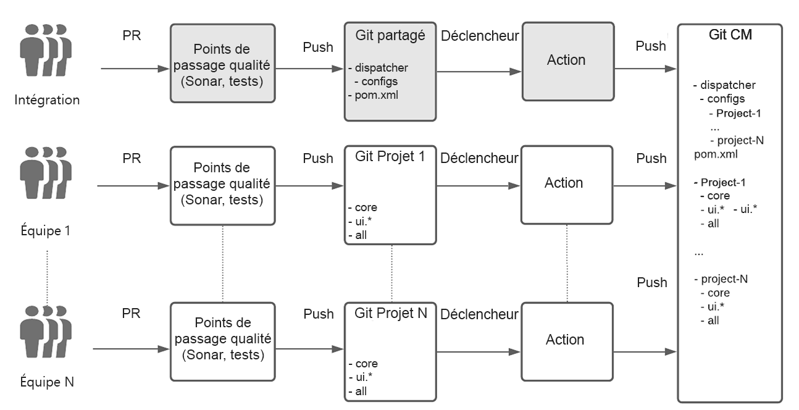
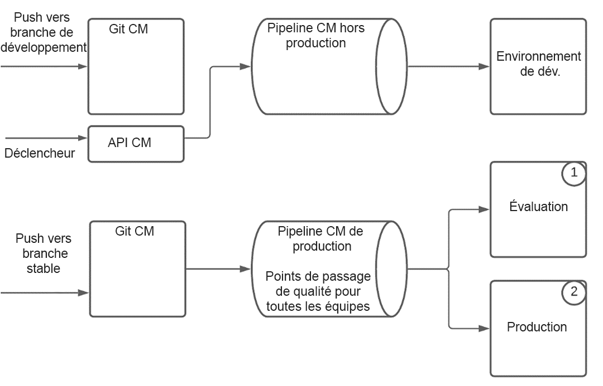
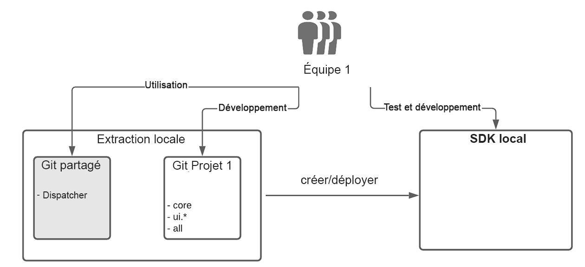

# Configuration du développement d&#39;équipe d&#39;entreprise pour AEM en tant que Cloud Service {#enterprise-setup}

## Présentation {#introduction}

AEM en tant que Cloud Service, une offre native de cloud computing qui offre des AEM en tant que service est conçue pour bénéficier de plus de 10 ans de fourniture de logiciels d’entreprise à des équipes d’entreprise avec leurs besoins spécifiques. Bien qu&#39;il catapulte AEM dans le monde natif du cloud, avec de nouvelles valeurs comme toujours présentes, toujours actuelles, toujours sécurisées et toujours à l&#39;échelle, il conserve la proposition de valeur principale que AEM fournit comme plate-forme personnalisable à nos clients et permet aux équipes de niveau entreprise d&#39;intégrer dans leurs procédures de développement et de diffusion.

Afin de soutenir nos clients dans les configurations de développement d&#39;entreprise, AEM en tant que Cloud Service s&#39;intègre pleinement à Cloud Manager et à ses pipelines de CI/CD articulés sur des points précis, qui sont dotés de bonnes pratiques et des enseignements tirés de plusieurs années d&#39;expérience en matière de développement et de déploiements de niveau entreprise - garantissant des tests minutieux et une qualité de code optimale pour fournir des expériences exceptionnelles.

## Prise en charge de Cloud Manager dans la configuration du développement d’équipe d’entreprise {#cloud-manager}

Pour une intégration rapide des clients, Cloud Manager fournit tout ce dont vous avez besoin pour commencer à développer des expériences immédiatement, y compris un référentiel git pour stocker les personnalisations qui sont ensuite créées, vérifiées et déployées par Cloud Manager.
Grâce à Cloud Manager, les équipes de développement peuvent travailler à la validation fréquente des modifications sans dépendre du personnel d’Adobe.

Trois types d’environnement sont disponibles dans Cloud Manager :

* Développement
* Évaluation
* Production

Le code peut être déployé sur des environnements de développement à l’aide d’un pipeline hors production. Pour Stage and Production, qui se combinent toujours et assurent ainsi la validation avant le déploiement de la production comme meilleure pratique, un pipeline de production utilise des passerelles de qualité pour valider le code de l&#39;application et les modifications de configuration.

Le pipeline de production déploie d’abord le code et la configuration sur l’environnement d’évaluation, teste l’application et se déploie finalement en production.
Un SDK Cloud Service qui est toujours mis à jour avec les dernières améliorations du Cloud Service permet le développement local en utilisant directement le matériel local du développeur. Cela permet un développement rapide avec des délais de réponse très courts. Ainsi, les développeurs peuvent rester dans leur environnement local familier et choisir parmi une grande variété d&#39;outils de développement, et pousser vers des environnements de développement ou de production quand ils le jugent bon.

Cloud Manager prend en charge des configurations multiéquipes flexibles qui peuvent être ajustées en fonction des besoins d’une entreprise. Cela s&#39;applique aussi bien au Cloud Service qu&#39;à AMS. Pour assurer des déploiements stables avec plusieurs équipes et éviter qu’une seule équipe n’impacte la production pour toutes les équipes, les responsables de Cloud estiment que le pipeline valide et teste toujours le code de toutes les équipes ensemble.

## Exemple du monde réel {#real-world-example}

Chaque entreprise a des exigences différentes, notamment la configuration d’une équipe, les processus et les workflows de développement. La configuration décrite ci-dessous est utilisée par Adobe pour plusieurs projets qui offrent des expériences en plus de l’AEM en tant que Cloud Service.

Par exemple, les applications Adobe Creative Cloud, telles que Adobe Photoshop ou Adobe Illustrator, incluent des ressources de contenu telles que des didacticiels, des exemples et des guides à la disposition des utilisateurs finaux. Ce contenu est consommé par les applications clientes en utilisant AEM comme Cloud Service d’une manière *sans tête*, en appelant l’API au niveau de publication AEM Cloud pour récupérer le contenu structuré en tant que flux JSON et en exploitant le réseau de diffusion de contenu Cloud Service de l’ pour diffuser du contenu structuré et non structuré avec des performances optimales.

Les équipes participant à ce projet suivent le processus décrit ci-après.

>[!NOTE]
>Consultez [Utilisation de plusieurs référentiels Git de source](https://experienceleague.adobe.com/docs/experience-manager-cloud-manager/using/managing-code/working-with-multiple-source-git-repos.html#managing-code) pour en savoir plus sur la configuration.

Chaque équipe utilise son propre processus de développement et dispose d’un référentiel de gits distinct. Un référentiel git partagé supplémentaire est utilisé pour l&#39;intégration de projets. Ce référentiel git contient la structure racine du référentiel git de Cloud Manager, y compris la configuration du répartiteur partagé. L&#39;intégration d&#39;un nouveau projet nécessite d&#39;être répertorié dans le fichier de projet de réacteur Maven à la racine du référentiel de git partagé. Pour la configuration du répartiteur, un nouveau fichier de configuration est créé dans le projet du répartiteur. Ce fichier est ensuite inclus par la configuration du répartiteur principal. Chaque équipe est responsable de son propre fichier de configuration de répartiteur. Les modifications apportées au référentiel git partagé sont rares et ne sont généralement requises que lorsqu&#39;un nouveau projet est intégré. Le travail principal est effectué par chaque équipe de projet dans leur propre référentiel de gits.

Le référentiel git pour chaque équipe a été configuré à l&#39;aide de l&#39;archétype AEM Maven et suit donc les meilleures pratiques pour la configuration de projets AEM. La seule exception concerne la gestion de la configuration du répartiteur effectuée dans le référentiel git partagé, comme indiqué ci-dessus.
Chaque équipe utilise un flux de travail git simplifié avec deux branches + N, suivant le modèle de flux Git :

* Une branche de version stable contient le code de production

* Une branche de développement contient le dernier développement

* Pour chaque fonction, une nouvelle branche est créée.

Le développement est effectué dans une branche de fonctionnalités, lorsque la fonction est mûrie, elle est fusionnée dans la branche de développement. Les fonctionnalités terminées et validées sont sélectionnées dans la branche de développement et fusionnées dans la branche stable. Toutes les modifications sont effectuées par le biais de requêtes d&#39;extraction (PR). Chaque RP est automatiquement validé par des portes de qualité. Sonar est utilisé pour vérifier la qualité du code et un ensemble de suites de tests est exécuté pour s’assurer que le nouveau code n’introduit aucune régression.

La configuration dans le référentiel Git de Cloud Manager comporte deux branches :

* Une branche *stable de la version*, contenant le code de production de toutes les équipes
* Une branche de développement ** contenant le code de développement de toutes les équipes

Chaque poussée vers le référentiel git d’une équipe, que ce soit dans le développement ou dans la branche stable, déclenche une action [github](https://experienceleague.adobe.com/docs/experience-manager-cloud-manager/using/managing-code/working-with-multiple-source-git-repos.html?lang=en#managing-code). Tous les projets suivent la même configuration pour la branche stable. Une poussée sur la branche stable d’un projet est automatiquement poussée vers la branche stable dans le référentiel Git Cloud Manager. Le pipeline de production dans Cloud Manager est configuré pour être déclenché par une poussée vers la branche stable. Le pipeline de production est donc exécuté par chaque poussée d&#39;une équipe dans une branche stable et le déploiement de production est mis à jour si toutes les portes de qualité passent.

Les pressions vers la branche de développement sont gérées différemment. Bien qu’une poussée vers une branche de développement dans le référentiel git d’une équipe déclenche également une action github et que le code soit automatiquement envoyé vers la branche de développement dans le référentiel git de Cloud Manager, le pipeline de non-production n’est pas automatiquement déclenché par la transmission de code. Il est déclenché par un appel à l’api de Cloud Manager.
L&#39;exécution du pipeline de production comprend la vérification du code de toutes les équipes par le biais des portes de qualité fournies. Une fois que le code est déployé sur l’étape, les tests et les audits sont exécutés pour s’assurer que tout fonctionne comme prévu. Une fois toutes les portes franchies, les modifications sont mises en production sans interruption ni temps d&#39;arrêt.
Pour le développement local, le SDK pour Cloud Service est utilisé. Le SDK permet de configurer un auteur, une publication et un répartiteur local. Cela permet le développement hors ligne et des délais de réponse rapides. Parfois, seul l’auteur est utilisé pour le développement, mais la configuration rapide du répartiteur et de la publication permet de tout tester localement avant de le placer dans le référentiel git. Les membres de chaque équipe récupèrent généralement le code du git partagé ainsi que leur propre code de projet. Il n&#39;est pas nécessaire de passer en revue d&#39;autres projets car les projets sont indépendants.

Cette configuration du monde réel peut être utilisée comme un plan directeur et ensuite personnalisée en fonction des besoins d&#39;une entreprise. Le concept flexible d’embranchement et de fusion de git permet des variations des workflows ci-dessus, personnalisées en fonction des besoins de chaque équipe. AEM en tant que Cloud Service prend en charge toutes ces variations sans sacrifier la valeur de base du pipeline d’opinion Cloud Manager.

### Considérations relatives à la configuration de plusieurs équipes {#considerations}

>[!NOTE]
>Pour toute configuration multi-équipe, il est essentiel de définir un modèle de gouvernance et un ensemble de normes que toutes les équipes doivent respecter. Le plan d&#39;installation de plusieurs équipes décrit ci-dessus permet de mettre à l&#39;échelle un plus grand nombre d&#39;équipes et vous pouvez utiliser ce plan comme point de départ.

Avec le référentiel de git de Cloud Manager et le pipeline de production, le code de production complet est toujours exécuté par toutes les portes de qualité, le traitant comme une unité de déploiement. Ainsi, le système de production est conservé *toujours sur* sans interruption ni temps d&#39;arrêt.
En revanche, en l&#39;absence d&#39;un tel système, chaque équipe pouvant se déployer séparément, il est possible qu&#39;une mise à jour d&#39;une équipe unique puisse entraîner des problèmes de stabilité de la production. En outre, il nécessite une coordination et des temps d’arrêt planifiés pour déployer les mises à jour. Avec un nombre croissant d&#39;équipes, l&#39;effort de coordination deviendra beaucoup plus complexe et rapidement ingérable.

Si un problème est détecté dans les barrières de qualité, la production n&#39;est pas affectée, et le problème peut être détecté et corrigé sans que le personnel de l&#39;Adobe ne soit requis pour intervenir. Sans Cloud Service et sans toujours tester l’ensemble du déploiement, des déploiements partiels peuvent provoquer des pannes nécessitant une demande d’annulation ou même une restauration complète à partir d’une sauvegarde. Les essais partiels pourraient aussi entraîner d&#39;autres problèmes qui devront être résolus après le fait qu&#39;ils nécessitent à nouveau la coordination et le soutien du personnel de l&#39;Adobe.