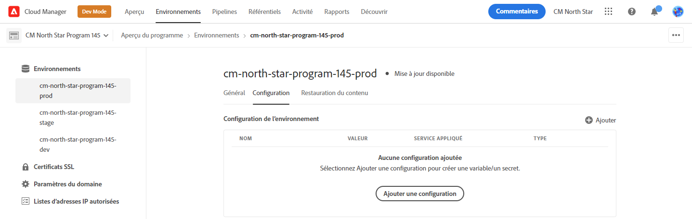
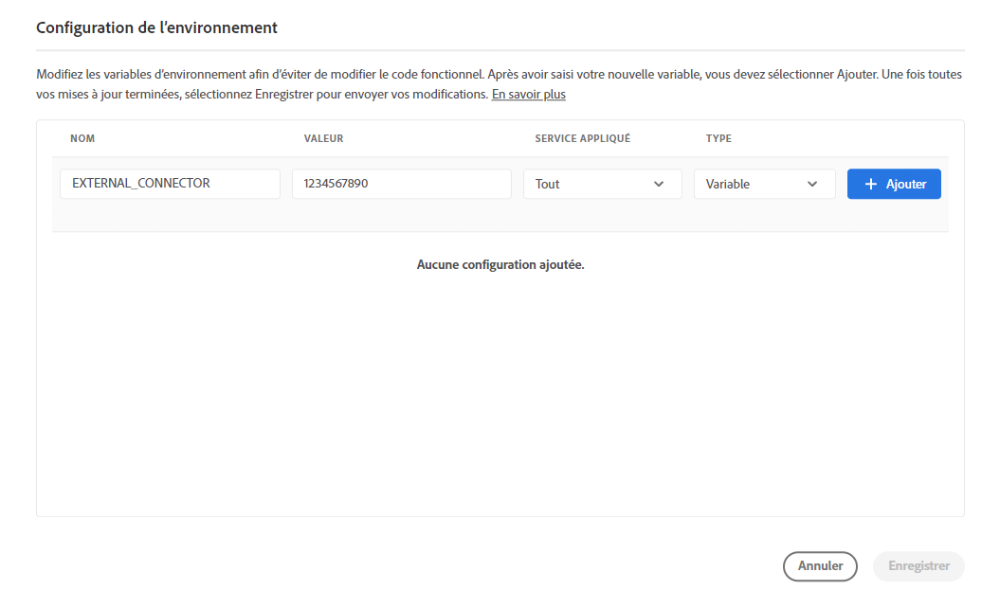
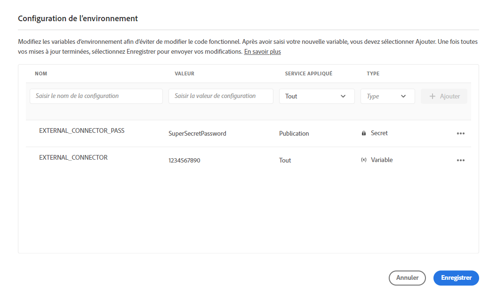
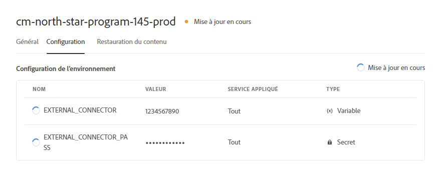
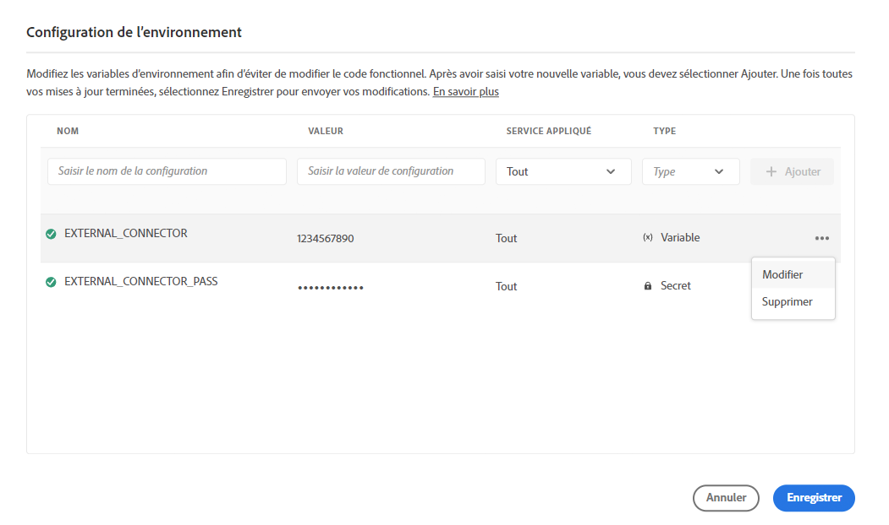
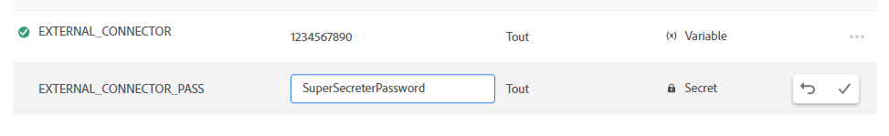

# Variables d’environnement Cloud Manager {#environment-variables}

Les variables d’environnement standard peuvent être configurées et gérées via Cloud Manager. Elles sont fournies à l’environnement d’exécution et peuvent être utilisés dans des configurations OSGi. Les variables d’environnement peuvent être des valeurs spécifiques à un environnement ou des secrets d’environnement, en fonction de ce qui est modifié.

## Vue d’ensemble {#overview}

Les variables d’environnement offrent de nombreux avantages aux utilisateurs d’AEM as a Cloud Service :

* Elles permettent au comportement de votre code et de votre application de varier en fonction du contexte et de l’environnement. Par exemple, elles peuvent être utilisées pour activer différentes configurations dans l’environnement de développement par rapport aux environnements de production ou d’évaluation, ceci afin d’éviter des erreurs coûteuses.
* Elles ne doivent être configurées et paramétrées qu’une seule fois, et peuvent être mises à jour et supprimées si nécessaire.
* Leurs valeurs peuvent être mises à jour à tout moment et prennent effet immédiatement sans qu’il faille apporter de modifications au code ni procéder à des déploiements.
* Elles peuvent séparer le code de la configuration et supprimer la nécessité d’inclure des informations sensibles dans le contrôle de version.
* Elles améliorent la sécurité de l’application AEM as a Cloud Service puisqu’elles se trouvent en dehors du code.

Les cas d’utilisation les plus courants des variables d’environnement incluent :

* La connexion de votre application AEM avec différents points d’entrée externes.
* L’utilisation d’une référence lors du stockage des mots de passe au lieu de le faire directement dans la base de code.
* Lorsque plusieurs environnements de développement existent dans un programme et que certaines configurations diffèrent d’un environnement à l’autre.

## Ajouter des variables d’environnement {#add-variables}

>[!NOTE]
>
>Vous devez être membre du rôle [**Responsable de déploiement** ](/help/onboarding/cloud-manager-introduction.md#role-based-premissions) pour ajouter ou de modifier des variables d’environnement.

1. Connectez-vous à Adobe Cloud Manager à l’adresse [my.cloudmanager.adobe.com](https://my.cloudmanager.adobe.com/).
1. Dans la console **[Mes programmes](/help/implementing/cloud-manager/navigation.md#my-programs)**, sélectionnez celui que vous souhaitez gérer.
1. Dans la barre de navigation latérale, sélectionnez la fenêtre **Environnements** pour le programme sélectionné, puis sélectionnez l’environnement pour lequel vous souhaitez créer une variable d’environnement.
1. Dans le détail de l’environnement, sélectionnez l’onglet **Configuration**, puis sélectionnez **Ajouter** pour ouvrir la boîte de dialogue **Configuration de l’environnement**.
   * Si vous ajoutez une variable d’environnement pour la première fois, vous pouvez voir un bouton **Ajouter la configuration** au centre de la page. Vous pouvez utiliser ce bouton ou **Ajouter** pour ouvrir la boîte de dialogue **Configuration de l’environnement**.

   

1. Saisissez les détails de la variable.
   * **Nom**.
   * **Valeur**.
   * **Service appliqué** - Définit pour quel service (auteur/Publish/aperçu) la variable s’applique ou si elle s’applique à tous les services.
   * **Type** : définit si la variable est une variable normale ou un secret.

   

1. Après avoir saisi la nouvelle variable, vous devez sélectionner **Ajouter** dans la dernière colonne de la ligne contenant la nouvelle variable.
   * Vous pouvez saisir plusieurs variables à la fois en saisissant une nouvelle ligne et en sélectionnant **Ajouter**.

   

1. Sélectionnez **Enregistrer** pour conserver vos variables.

Un indicateur avec le statut **Mise à jour en cours** s’affiche en haut du tableau et en regard de la variable nouvellement ajoutée pour indiquer que l’environnement est en cours de mise à jour avec la configuration. Une fois cette opération terminée, la nouvelle variable d’environnement est visible dans le tableau.

>[!TIP]
>
>Si vous souhaitez ajouter plusieurs variables, il est recommandé d’ajouter la première variable, puis d’utiliser le bouton **Ajouter** dans la boîte de dialogue **Configuration de l’environnement** pour ajouter les variables supplémentaires. De cette façon, vous pouvez les ajouter en une seule mise à jour de lʼenvironnement.

## Mettre à jour les variables d’environnement {#update-variables}

Une fois les variables d’environnement créées, vous pouvez les mettre à jour à l’aide du bouton **Ajouter/mettre à jour** pour lancer la boîte de dialogue **Configuration de l’environnement**.

1. Connectez-vous à Adobe Cloud Manager à l’adresse [my.cloudmanager.adobe.com](https://my.cloudmanager.adobe.com/).
1. Cloud Manager répertorie les différents programmes disponibles. Sélectionnez celle que vous souhaitez gérer.
1. Dans le panneau de navigation, sélectionnez la fenêtre **Environnements** pour le programme sélectionné, puis sélectionnez l’environnement pour lequel vous souhaitez modifier une variable d’environnement.
1. Dans le détail de l’environnement, sélectionnez l’onglet **Configuration**, puis sélectionnez **Ajouter/mettre à jour** dans le coin supérieur droit pour ouvrir la boîte de dialogue **Configuration de l’environnement**.
1. À l’aide du bouton représentant des points de suspension dans la dernière colonne de la ligne de la variable que vous souhaitez modifier, sélectionnez **Modifier** ou **Supprimer**.

   

1. Modifiez la variable d’environnement selon vos besoins.
   * Lors de la modification, le bouton représentant des points de suspension est remplacé par des options permettant de revenir à la valeur initiale ou de confirmer votre modification.
   * Lors de la modification des secrets, les valeurs peuvent seulement être mises à jour, mais pas visualisées.

   

1. Après avoir apporté les modifications de configuration requises, sélectionnez **Enregistrer**.

[Comme lors de l’ajout de variables](#add-variables), un indicateur avec le statut **Mise à jour** sʼaffiche en haut du tableau et en regard de la ou des variables nouvellement mises à jour pour indiquer que l’environnement est mis à jour avec la configuration. Une fois l’opération terminée, les variables d’environnement mises à jour sont visibles dans le tableau.

>[!TIP]
>
>Si vous souhaitez mettre à jour plusieurs variables, il est recommandé d’utiliser la boîte de dialogue **Configuration de l’environnement** pour mettre à jour toutes les variables nécessaires à la fois avant d’appuyer ou de cliquer sur **Enregistrer**. De cette façon, vous pouvez les ajouter en une seule mise à jour de lʼenvironnement.

## Utilisation de variables d’environnement {#using}

Les variables d’environnement peuvent rendre vos configurations `pom.xml` plus sécurisées et flexibles. Par exemple, les mots de passe n’ont pas besoin d’être codés en dur et votre configuration peut s’adapter en fonction des valeurs des variables d’environnement.

Vous pouvez accéder via XML aux variables et secrets d’environnement comme suit.

* `${env.VARIABLE_NAME}`

Consultez le document [Configuration d’un projet](/help/implementing/cloud-manager/getting-access-to-aem-in-cloud/setting-up-project.md#password-protected-maven-repository-support-password-protected-maven-repositories) pour un exemple d’utilisation des deux types de variables dans un fichier `pom.xml`.

Consultez la [documentation officielle de Maven](https://maven.apache.org/settings.html#quick-overview) pour plus d’informations.

## Disponibilité des variables d’environnement {#availability}

Les variables d’environnement peuvent être utilisées à plusieurs endroits.

### Créer, prévisualiser et publier {#author-preview-publish}

Les variables d’environnement standard et les secrets peuvent être utilisés dans les environnements de création, de prévisualisation et de publication.

### Dispatcher {#dispatcher}

Seules les variables d’environnement standard peuvent être utilisées avec les secrets [du dispatcher](https://experienceleague.adobe.com/docs/experience-manager-dispatcher/using/dispatcher.html?lang=fr) ne peuvent pas l’être.

Cependant, les variables d&#39;environnement ne peuvent pas être utilisées dans les directives `IfDefine`.

>[!TIP]
>
>Vous devez valider l’utilisation des variables d’environnement avec le [dispatcher localement](https://experienceleague.adobe.com/docs/experience-manager-learn/cloud-service/local-development-environment-set-up/dispatcher-tools.html?lang=fr) avant le déploiement.

### Configurations OSGi {#osgi}

Les variables d’environnement normales et les secrets peuvent être utilisés dans les [configurations OSGi](/help/implementing/deploying/configuring-osgi.md).

### Variables de pipeline {#pipeline}

Outre les variables d’environnement, il existe également des variables de pipeline, qui sont exposées pendant la phase de création. Pour en savoir plus sur les variables de pipeline sous [Environnement de génération](/help/implementing/cloud-manager/getting-access-to-aem-in-cloud/build-environment-details.md#pipeline-variables).
