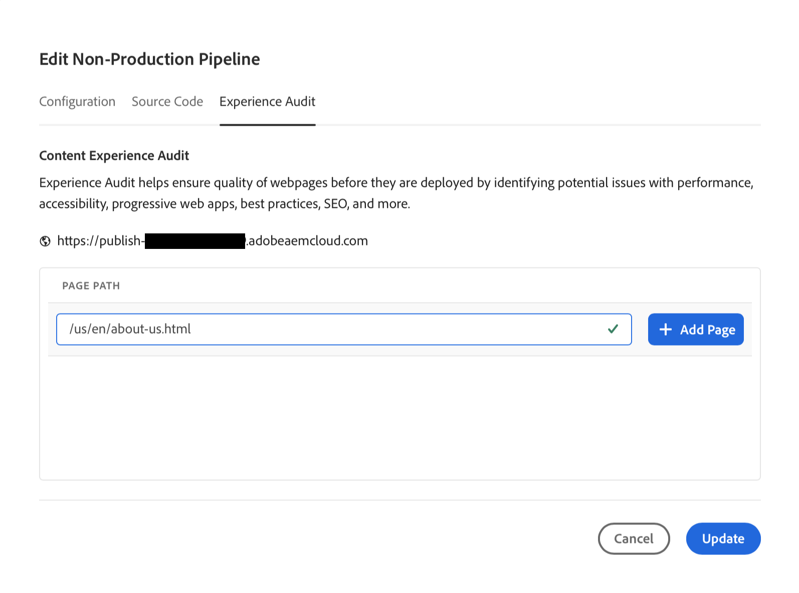
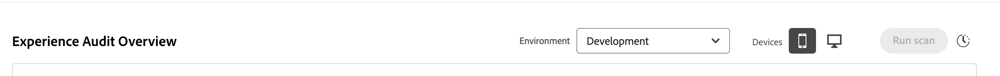
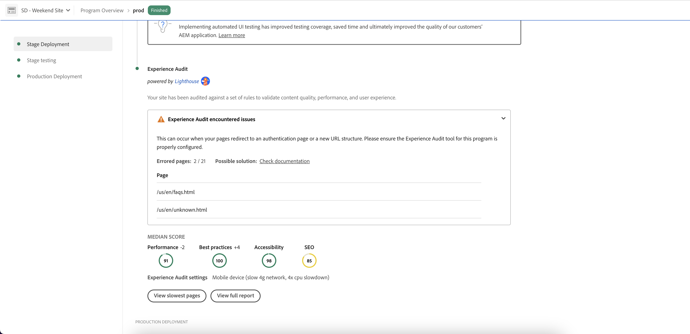

# Tableau de bord du contrôle de l’expérience {#experience-audit-dashboard}

Découvrez comment le contrôle de l’expérience valide votre processus de déploiement, en vous assurant que les modifications respectent les normes de base en matière de performances, d’accessibilité, de bonnes pratiques et d’optimisation pour les moteurs de recherche. Il fournit une interface de tableau de bord claire et informative pour le suivi de ces mesures.

## Vue d’ensemble {#overview}

Le contrôle de l’expérience valide le processus de déploiement et permet de s’assurer que les modifications sont déployées :

1. Respectez les normes de base en matière de performances, d’accessibilité, de bonnes pratiques et d’optimisation du référencement (SEO).

1. N’introduisent pas de régressions.

Le contrôle de l’expérience dans Cloud Manager garantit que l’expérience de l’utilisateur sur le site est de la plus haute qualité.

Les résultats sont informatifs et permettent au responsable de déploiement de voir les scores et les différences existant entre les scores précédents et actuels. Ces informations sont utiles pour déterminer si une régression a été introduite avec le déploiement actuel.

Le contrôle de l’expérience est optimisé par [Google Lighthouse](https://developer.chrome.com/docs/lighthouse/overview/), un outil open source de Google, et est activé dans tous les pipelines de production Cloud Manager.

## Disponibilité {#availability}

Le contrôle de l’expérience est disponible pour Cloud Manager :

* Pipelines de production de sites (par défaut)
* (Facultatif) Développement de pipelines à pile complète
* (Facultatif) Développement de pipelines front-end

Pour plus d’informations sur la configuration de l’audit pour les environnements facultatifs, reportez-vous à la [section Configuration](#configuration) .

Les audits sont exécutés dans le cadre du pipeline. Les audits peuvent également être [exécutés à la demande](#on-demand) en dehors des pipelines.

## Configuration {#configuration}

Le contrôle de l’expérience est disponible par défaut pour les pipelines de production. Elle peut être activée en option pour le développement de pipelines front-end et en pile complète. Dans tous les cas, vous devez définir les chemins de contenu évalués lors de l’exécution du pipeline.

1. Selon le type de pipeline que vous souhaitez configurer, effectuez l’une des opérations suivantes :

   * Ajoutez un nouveau [pipeline de production](/help/implementing/cloud-manager/configuring-pipelines/configuring-production-pipelines.md) pour définir les chemins que l’audit doit évaluer.
   * Ajoutez un nouveau [pipeline hors production](/help/implementing/cloud-manager/configuring-pipelines/configuring-non-production-pipelines.md) si vous souhaitez activer l’audit sur un pipeline front-end ou de développement à pile complète.
   * Vous pouvez également [modifier un pipeline existant](/help/implementing/cloud-manager/configuring-pipelines/managing-pipelines.md) et mettre à jour les options existantes.

1. Pour utiliser le contrôle de l’expérience lors de l’ajout ou de la modification d’un pipeline hors production, cochez la case **contrôle de l’expérience** . Vous pouvez trouver cette option dans l’onglet **Code Source** .

   

   * Uniquement nécessaire pour les pipelines hors production.
   * L’onglet **Audit de l’expérience** s’affiche lorsque la case est cochée.

1. Pour les pipelines de production et hors production, vous définissez les chemins qui doivent être inclus dans le contrôle de l’expérience sur l’onglet **Audit de l’expérience** .

   * Les chemins de page doivent commencer par `/` et sont relatifs à votre site.
   * Par exemple, si votre site est `wknd.site` et que vous souhaitez inclure `https://wknd.site/us/en/about-us.html` dans le contrôle de l’expérience, saisissez le chemin `/us/en/about-us.html`.

   

1. Cliquez sur **Ajouter une page** et le chemin est renseigné automatiquement avec l’adresse de votre environnement, puis ajouté à la table des chemins.

   

1. Continuez à ajouter des chemins selon vos besoins en répétant les deux étapes précédentes.

   * Vous pouvez ajouter 25 chemins au maximum.
   * Si vous ne définissez aucun chemin, la page d’accueil du site sera incluse par défaut dans l’audit de l’expérience.

1. Cliquez sur **Enregistrer**.

## Résultats du contrôle de l’expérience {#results}

Les résultats du contrôle de l’expérience sont présentés dans la phase **Test d’évaluation** du pipeline de production via la [ page d’exécution du pipeline de production](/help/implementing/cloud-manager/deploy-code.md).

Le contrôle de l’expérience fournit les scores Google Lighthouse médians pour les [pages configurées](#configuration) et la différence de score par rapport à l’analyse précédente.

Dans cette vue récapitulative de la phase **Test d’évaluation** du pipeline, vous disposez de deux options :

* **[Afficher les pages les plus lentes](#view-slowest-pages)**
* **[Afficher le rapport complet](#view-full-report)**

Vous pouvez accéder aux résultats complets de l’audit en cliquant sur l’onglet **Rapports** dans le tableau de bord Cloud Manager. Outre le résumé affiché dans les détails de l’exécution du pipeline, vous pouvez afficher [le rapport complet](#view-full-report) directement.

>[!TIP]
>
>Les sections suivantes décrivent comment afficher les résultats du contrôle de l’expérience.
>
>* Pour plus d’informations sur le fonctionnement de l’audit, voir [Détails de l’évaluation du contrôle de l’expérience](#details).
>* Pour savoir comment exécuter un audit d’expérience à la demande, voir [Rapports d’audit à la demande](#on-demand).
>* Si vous rencontrez des problèmes avec l’audit, reportez-vous à la section [Problèmes de rencontre de l’audit d’expérience](#issues).
>* Pour obtenir des conseils généraux sur les performances, voir [Conseils généraux sur les performances](#performance-tips).

### Affichage des pages les plus lentes {#view-slowest-pages}

Cliquez sur **Afficher les pages les plus lentes** pour ouvrir la boîte de dialogue **5 pages les plus lentes** . Les cinq pages les moins performantes que vous [ avez configurées pour effectuer un audit](#configuration) s’affichent.

Cloud Manager répartit les scores par **Performance**, **Accessibilité**, **Bonnes pratiques** et **SEO**, indiquant l’écart entre chaque mesure et l’audit précédent.

Par défaut, la boîte de dialogue s’ouvre avec les scores des appareils mobiles. Vous pouvez afficher les scores de bureau à l’aide du bouton d’activation/désactivation **Périphériques** situé dans la partie supérieure de la boîte de dialogue.

La boîte de dialogue vous donne un aperçu rapide. Pour plus de détails, cliquez sur **Afficher le rapport complet**.

### Afficher le rapport complet {#view-full-report}

Vous pouvez afficher le rapport d’audit d’expérience complet en procédant comme suit :

* Cliquez sur **`View full report`** dans la boîte de dialogue **[5 pages les plus lentes](#view-slowest-pages)**.
* Cliquez sur **`View full report`** lors de l’affichage de l’ [exécution d’un pipeline](#results).
* Cliquez sur l’onglet **Rapports** dans Cloud Manager.

L’onglet **Rapports** de Cloud Manager s’ouvre, affichant le **contrôle de l’expérience**.

Le rapport est divisé en deux zones :

* **[Scores de page — tendance](#trend)**
* **[Résultats de l’analyse de l’expérience](#results)**

#### Scores de page — tendance {#trend}

Par défaut, la vue sélectionnée pour **Scores de page — tendance** est **Scores médians** pour l’ **année dernière**.

Vous pouvez choisir d’afficher les tendances pour des catégories Lighthouse spécifiques en cliquant sur le nom de la catégorie dans la légende.

Utilisez la liste déroulante **Sélectionner** en haut du graphique pour sélectionner les détails spécifiques à la page, et les menus déroulants **Affichage** et **Déclencheur** en bas pour sélectionner respectivement différentes périodes et le type de déclencheur.

La liste déroulante **Affichage** offre la possibilité de sélectionner une période prédéfinie ou un intervalle personnalisé pour une vue plus spécifique.

Lorsque vous placez le pointeur de la souris sur le graphique, une info-bulle affiche les valeurs des catégories Google Lighthouse à des moments spécifiques.

Si vous cliquez sur le graphique à un moment donné, une fenêtre contextuelle s’ouvre avec le détail de cette analyse. Cliquez sur l’ **analyse d’audit d’expérience ouverte** pour charger ces résultats d’analyse dans la section **[résultats d’analyse d’audit d’expérience](#scan-results)** .

#### Résultats de l’analyse de l’audit d’expérience {#scan-results}

La section **Résultats de l’analyse de l’audit d’expérience** fournit des recommandations sur la manière d’améliorer votre score et les détails de toutes les pages analysées. Il est divisé en deux sections :

* **[Recommandations](#recommendations)**
* **[Pages numérisées](#scanned-pages)**

##### Recommandations {#recommendations}

La section **Recommendations** présente un ensemble agrégé d’informations. Par défaut, les recommandations pour **performance** s’affichent. Utilisez la liste déroulante en regard de l’en-tête **Recommendations** pour passer à une autre catégorie.

Cliquez sur une recommandation pour en afficher des détails.

Lorsqu’elles sont disponibles, les détails de la recommandation étendue contiennent également le pourcentage de l’impact des recommandations, afin de vous aider à vous concentrer sur les modifications ayant le plus d’impact. En outre, les recommandations étendues peuvent inclure des liens vers AEM documentation pertinents et des conseils qui peuvent vous guider tout au long de la mise en oeuvre des correctifs suggérés.

Cliquez sur le lien **voir pages** dans la vue Détails pour afficher les pages auxquelles la recommandation s’applique.

##### Pages analysées {#scanned-pages}

La section **Pages analysées** donne des détails sur les scores de toutes les pages analysées. Utilisez les boutons **Préc** et **Suivant** pour parcourir les résultats et choisir le nombre de pagination de l’affichage.

Cliquez sur le lien d’une page spécifique pour mettre à jour le filtre **Sélectionner** de la section [**Scores de page — tendance**](#trend) et afficher l’onglet **Scores et recommandations** pour la page sélectionnée.

L’onglet **Rapports bruts** donne des scores pour chaque audit de la page. Cliquez sur la date du rapport dans la colonne **Rapport Lighthouse** pour récupérer un fichier JSON des données brutes.

Un nouvel onglet s’ouvre dans votre navigateur, vous dirigeant vers `https://googlechrome.github.io/lighthouse/viewer/`. Il charge automatiquement une URL signée contenant le rapport JSON brut Lighthouse pour la page sélectionnée, ce qui permet une inspection détaillée.

## Rapports d’audit d’analyse à la demande {#on-demand}

En plus d’être exécutés pendant l’exécution du pipeline, les rapports d’audit d’expérience peuvent également être générés à la demande. Cette option est une bonne solution pour analyser rapidement vos pages sans avoir à exécuter un pipeline.

Pour exécuter une analyse à la demande, accédez à l’onglet **Rapports** pour afficher le rapport d’audit complet, puis cliquez sur le bouton **Exécuter l’analyse** .

Le bouton **Exécuter l’analyse** n’est plus disponible et est signalé par une icône d’horloge lorsqu’une analyse à la demande est déjà en cours d’exécution.

Les analyses à la demande déclenchent un audit de l’expérience pour les 25 [dernières pages configurées](#configuration) et se terminent généralement en quelques minutes.

Une fois l’opération terminée, le graphique des scores est automatiquement mis à jour. Vous pouvez consulter les résultats exactement comme pour une analyse de l’exécution du pipeline.

Vous pouvez filtrer le graphique des scores en fonction du type de déclencheur à l’aide du sélecteur **Déclencheur** .

>[!NOTE]
>
>Une analyse à la demande ne peut être lancée que si l’environnement n’est pas supprimé et qu’il n’y a pas d’autres analyses en attente sur le même environnement.

## Le contrôle de l’expérience rencontre des problèmes {#issues}

Si les [pages que vous avez configurées](#configuration) à contrôler n’étaient pas disponibles ou qu’il y avait d’autres erreurs dans l’audit, le contrôle de l’expérience reflète ce fait.

Le pipeline affiche une section d’erreur extensible pour afficher les chemins d’URL relatifs auxquels il n’a pas pu accéder.

Si vous affichez le rapport complet, les détails sont affichés dans la section **[Résultats de l’analyse du contrôle de l’expérience](#results)**, qui peut également être développée.

Voici quelques raisons pour lesquelles les pages peuvent ne pas être disponibles :

* La configuration bloque l’accès.
* La page n’existe pas.
* La page redirige qui nécessite une authentification autre que de base.
* Un problème interne s’est produit.

>[!TIP]
>
>[L’accès aux rapports bruts](#scanned-pages) pour une page peut fournir des détails sur les raisons pour lesquelles la page n’a pas pu être contrôlée.

## Conseils généraux sur les performances {#performance-tips}

Deux des problèmes d’impact les plus courants qui sont faciles à résoudre concernent les changements de mise en page cumulés (CLS) et la plus grande peinture de contenu (LCP).

Vous pouvez améliorer ces zones en procédant comme suit :

* Pas de chargement différé des images au-dessus du pli : le contenu visible dans le navigateur sans avoir à faire défiler vers le bas.
* Définir correctement la priorité du chargement des ressources (par exemple, en chargeant de manière asynchrone les images sous le pli une fois le document chargé).
* Prérécupération des fichiers JavaScript et CSS utilisés pour effectuer le rendu du contenu au-dessus du pli (si nécessaire).
* Réservez l’espace vertical en attribuant un format aux conteneurs qui se chargent lentement ou dont le rendu est effectué ultérieurement.
* Conversion des images au format WebP pour réduire leur taille.
* Utilisation de `<picture>` et d’image `srcset` avec des tailles d’image variées pour différentes tailles de fenêtre d’affichage (et pour s’assurer que le redimensionnement fonctionne).

## Détails de l’évaluation du contrôle de l’expérience {#details}

Les détails suivants fournissent des informations supplémentaires sur la manière dont le contrôle de l’expérience évalue votre site. Elles ne sont pas nécessaires à l’utilisation générale de la fonctionnalité et sont fournies ici pour être complètes.

* L’audit analyse le domaine d’origine (`.com`) à partir des [ chemins de page d’audit d’expérience configurés](#configuration) de l’éditeur afin de simuler des expériences utilisateur réelles, ce qui vous permet de prendre de meilleures décisions sur la gestion et l’optimisation de vos sites web.
* Dans les pipelines de production à pile complète, l’environnement d’évaluation est analysé. Pour vous assurer que l’audit fournit des détails pertinents lors du contrôle, le contenu de l’environnement d’évaluation doit être aussi proche que possible de l’environnement de production.
* Les pages affichées dans la liste déroulante **Sélectionner** de la section [**Scores de page — tendance**](#trend) sont toutes des pages connues analysées par le passé par le contrôle de l’expérience.
* [Une recommandation](#recommendations) peut présenter un gain potentiel et une différence par rapport à l’analyse précédente.
* Le contrôle de l’expérience estime les améliorations potentielles en traitant le rapport brut pour chaque page. Il met en corrélation les octets perdus ou les millisecondes avec les informations, en attribuant un impact pondéré sur le score de performances. L’audit fournit ces informations, ainsi que les pages concernées, pour vous aider à déterminer la recommandation à suivre.
Pour plus d’informations, consultez la [section Conseils généraux sur les performances](#performance-tips) .
* Un pipeline front-end peut être déployé dans un environnement existant et plusieurs pipelines front-end peuvent cibler le même environnement. Les résultats de l’analyse étant agrégés au niveau de l’environnement, les scores, les tendances et les recommandations sont cohérents. Ces résultats s’affichent dans l’environnement sélectionné, quel que soit le pipeline qui a déclenché l’analyse.
