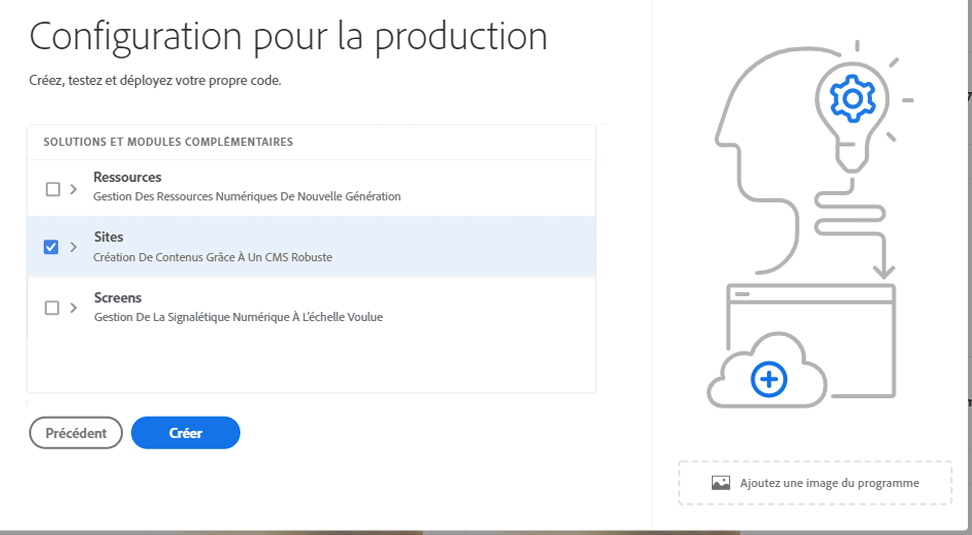

# Création de programmes de production {#create-production-program}

Un programme de production est destiné à un utilisateur qui connaît AEM et Cloud Manager et qui est prêt à se lancer dans l’écriture, la compilation et le test de code en vue de le déployer pour héberger du trafic en direct.

Découvrez-en plus sur les types de programme dans le document [Présentation des programmes et des types de programme.](program-types.md)

## Création d’un programme de production {#create}

Pour créer un programme de production, procédez comme suit.

1. Connectez-vous à Cloud Manager à l’adresse [my.cloudmanager.adobe.com](https://my.cloudmanager.adobe.com/) et sélectionnez l’organisation appropriée.

1. Cliquez sur **Ajouter un programme** dans le coin supérieur droit de l’écran.

   

1. Sélectionner **Configuration pour la production** dans l’assistant Créer un programme pour créer un programme de production et attribuer un nom au programme.

   

1. Vous pouvez éventuellement ajouter une image au programme en la faisant glisser et en la déposant sur le **Ajout d’une image de programme** cibler ou cliquer dessus pour sélectionner une image dans l’explorateur de fichiers. Cliquez ou appuyez sur **Continuer**.

1. Si vous disposez de droits de sécurité renforcée, accédez à l’onglet **Sécurité renforcée** pour **Activer la sécurité renforcée** pour votre programme de production. Cochez ensuite la case pour activer la sécurité renforcée, puis appuyez ou cliquez sur **Continuer**.

   * La sécurité renforcée ne peut pas être activée ni désactivée après la création du programme.
   * [En savoir plus](https://www.adobe.com/go/hipaa-ready) sur la mise en œuvre de la solution conforme à la norme HIPAA d’Adobe.

   

1. Dans l’onglet **Solutions et modules complémentaires**, sélectionnez les solutions à inclure dans le programme.

   * Si vous ne savez pas si vous avez besoin d’un ou de plusieurs programmes pour les différentes solutions disponibles, sélectionnez celle qui vous intéresse le plus. Vous pouvez activer des solutions supplémentaires en [modification du programme](/help/implementing/cloud-manager/getting-access-to-aem-in-cloud/editing-programs.md) plus tard. Voir [Présentation du document Programmes de production](/help/implementing/cloud-manager/getting-access-to-aem-in-cloud/introduction-production-programs.md) pour plus de recommandations sur la configuration du programme.
   * Si vous avez coché la case **Activer la sécurité renforcée** à l’étape précédente, vous ne pourrez sélectionner que les solutions conformes à la norme HIPAA.

   

1. Cliquez sur le chevron situé avant les noms des solutions pour afficher les modules complémentaires facultatifs, tels que la sélection de l’option de module complémentaire **Commerce** sous **Sites**.

   

1. Lorsque vos solutions et modules complémentaires sont sélectionnés, cliquez sur **Continuer**.

1. Dans l’onglet **Date de mise en production**, saisissez la date de mise en production de votre programme.

   

   * Cette date peut être modifiée à tout moment.
   * Cette date est uniquement à usage informatif et déclenche le widget de mise en production sur la page de présentation du programme dans le but de fournir des liens internes au produit vers la documentation sur les bonnes pratiques d’AEM as a Cloud Service en temps opportun, afin de vous aligner sur votre parcours, offrant ainsi une expérience de mise en production réussie et fluide.

1. Cliquez sur **Créer**.

Votre programme est créé par Cloud Manager, s’affiche et peut être sélectionné dans la page de destination.

## Accès à votre programme {#acessing}

1. Une fois que la carte du programme s’affiche sur la page de destination, sélectionnez le bouton représentant des points de suspension pour afficher les options de menu disponibles.

   

1. Sélectionnez **Cloud Manager** pour accéder à la page **Aperçu** de Cloud Manager.

1. La carte principale d’appel à l’action de la page d’aperçu vous guide tout au long de la création d’un environnement, d’un pipeline hors production et, enfin, d’un pipeline de production.

   

Si, à tout moment, vous devez passer à un autre programme ou revenir à la page d’aperçu pour créer un autre programme, cliquez sur le nom de votre programme dans le coin supérieur gauche de l’écran pour afficher l’option **Accéder à**.

>[!NOTE]
>
>Contrairement à un [programme Sandbox,](introduction-sandbox-programs.md#auto-creation) un programme de production nécessite que l’utilisateur possédant le rôle Cloud Manager approprié crée le projet et ajoute un environnement via l’interface utilisateur en libre-service.
