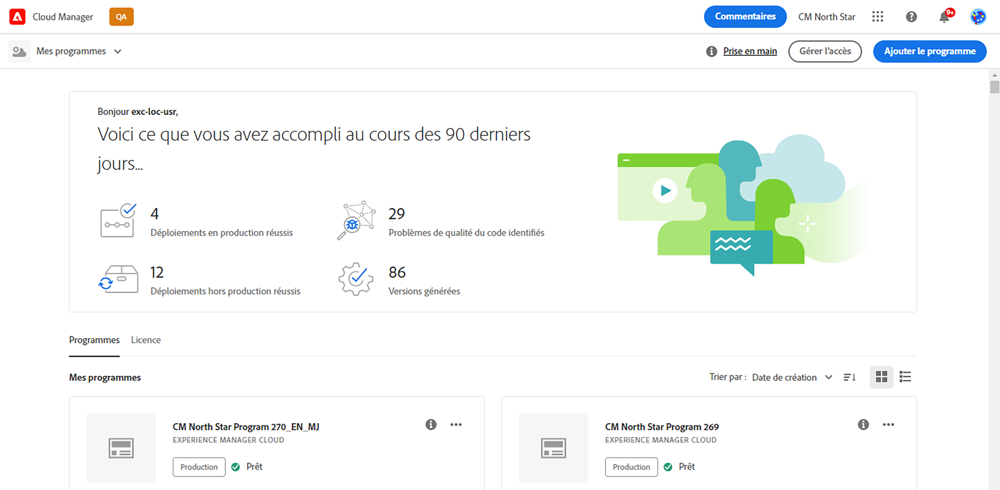
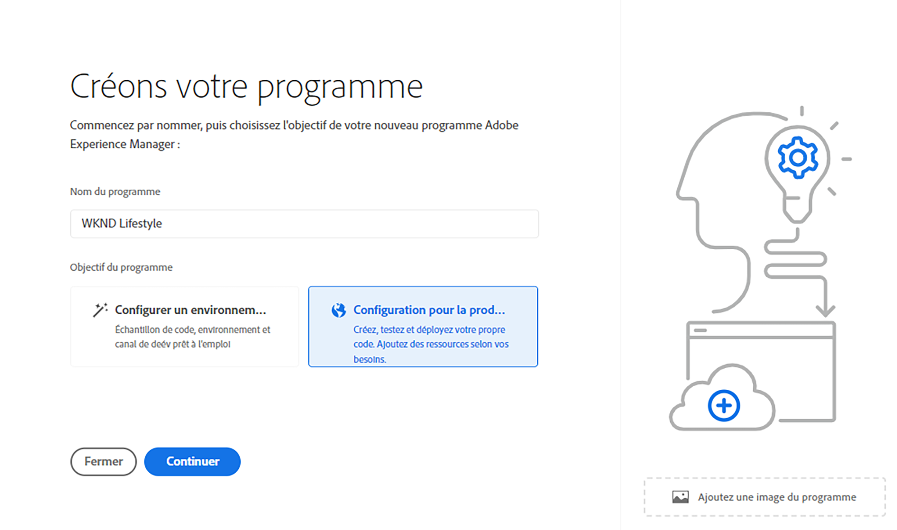
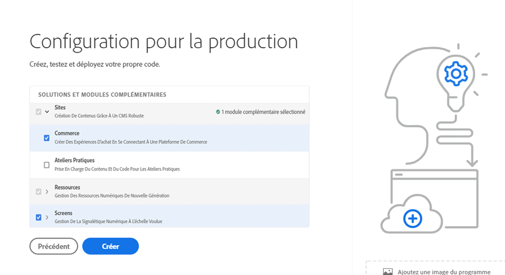
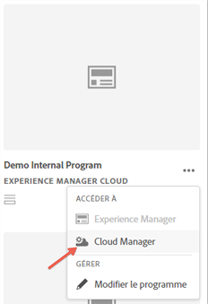
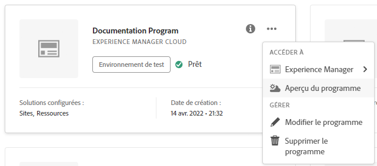
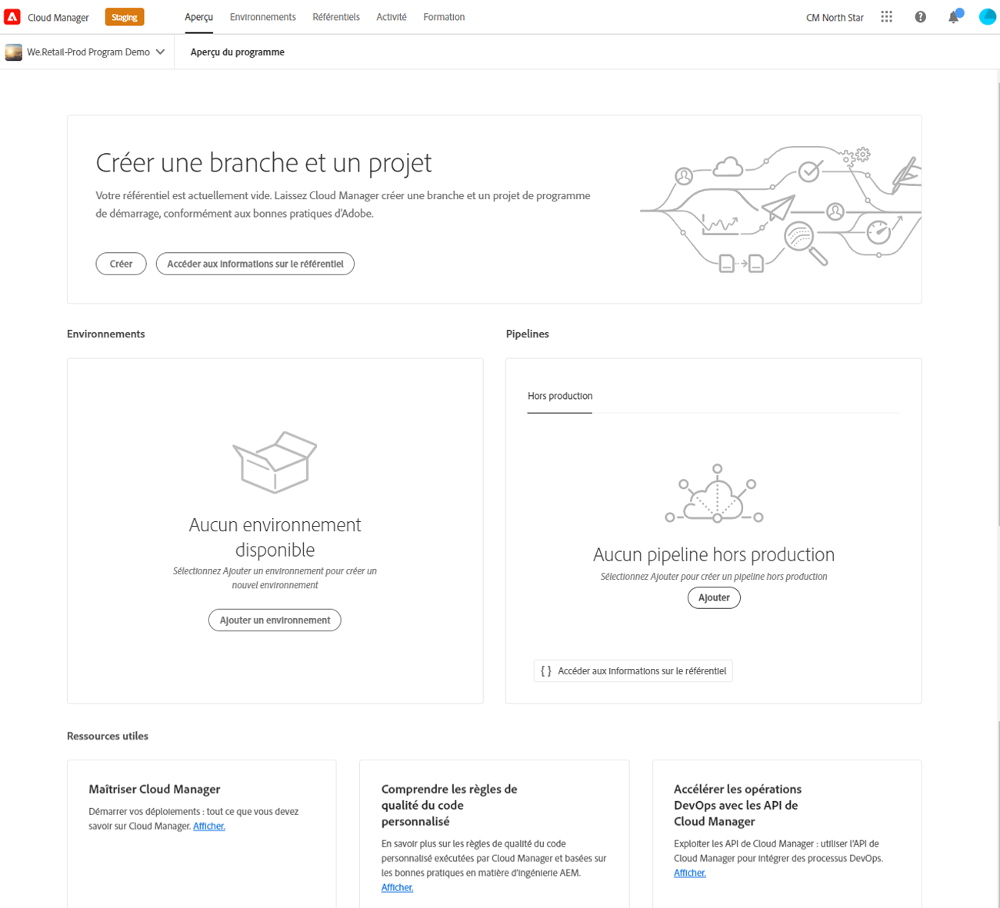

# Création de programmes de production {#create-production-program}

Un programme de production est destiné aux utilisateurs qui connaissent bien AEM et Cloud Manager et qui sont prêts à écrire, créer et tester du code, dans le but de le déployer pour gérer le trafic en direct.

Pour en savoir plus sur les types de programme, consultez le document [Présentation des programmes et des types de programme](program-types.md).

## Création d’un programme de production {#create}

Selon les droits de votre entreprise, des [options supplémentaires](#options) peuvent s’afficher lors de l’ajout de votre programme.

**Pour créer un programme de production, procédez comme suit**

1. Connectez-vous à Cloud Manager à l’adresse [my.cloudmanager.adobe.com](https://my.cloudmanager.adobe.com/) et sélectionnez l’organisation appropriée.

1. Dans la console **[Mes programmes](/help/implementing/cloud-manager/navigation.md#my-programs)**, près du coin supérieur droit, cliquez sur **Ajouter un programme**.

   

1. Dans l’assistant *Créons votre programme*, dans le champ de texte **Nom du programme**, saisissez le nom que vous souhaitez donner au programme.

1. Sous **Objectif du programme**, sélectionnez **Configurer pour la production**.

   

1. (Facultatif) Dans le coin inférieur droit de la boîte de dialogue de l’assistant, effectuez l’une des opérations suivantes :

   * Faites glisser et déposez un fichier image sur la cible  **Ajouter une image de programme**.
   * Cliquez sur  **Ajouter une image de programme**, puis sélectionnez une image dans l’explorateur de fichiers.
   * Cliquez sur  pour supprimer une image que vous avez ajoutée.

1. Cliquez sur **Continuer**.

1. Dans la zone de liste **Solutions et modules complémentaires**, sélectionnez une ou plusieurs solutions à inclure dans le programme.

   * Si vous ne savez pas si vous avez besoin d’un ou de plusieurs programmes pour les différentes solutions disponibles, sélectionnez celle qui vous intéresse le plus. Vous pouvez activer des solutions supplémentaires en [modifiant le programme](/help/implementing/cloud-manager/getting-access-to-aem-in-cloud/editing-programs.md) plus tard. Consultez le [document Présentation des programmes de production](/help/implementing/cloud-manager/getting-access-to-aem-in-cloud/introduction-production-programs.md) pour plus de recommandations sur la configuration des programmes.
   * Au moins une solution est requise pour la création du programme.
   * Sélectionnez **Edge Delivery Services** pour obtenir une solution CDN entièrement gérée qui optimise les expériences digitales. Voir [ À propos de l’utilisation de Edge Delivery Services pour diffuser votre projet Cloud Manager](#edge-overview)
   * Si vous avez sélectionné l’option **[Activer la sécurité renforcée](#security)**, vous ne pouvez sélectionner que les solutions conformes à la norme HIPAA.

     

   * Cliquez sur  à gauche du nom d’une solution pour afficher les modules complémentaires facultatifs, tels que l’option de module complémentaire **Commerce** sous **Sites**.

   

1. Une fois la sélection de vos solutions et modules complémentaires terminée, cliquez sur **Continuer**.

1. Dans l’onglet **Date de mise en production**, saisissez la date de mise en production prévue de votre programme.

   

   * Vous pouvez modifier cette date à tout moment.
   * La date est fournie à titre d’information et déclenche le widget de mise en production sur la page [**Aperçu du programme**](/help/implementing/cloud-manager/getting-access-to-aem-in-cloud/editing-programs.md#program-overview). Cette fonctionnalité fournit des liens internes au produit opportuns vers les bonnes pratiques d’AEM as a Cloud Service afin de prendre en charge une expérience de mise en production fluide.

1. Cliquez sur **Créer**. Cloud Manager crée votre programme et l’affiche sur la page de destination pour la sélection.

   

## Autres options de programme de production {#options}

Selon les droits disponibles pour votre organisation, vous pouvez disposer d’options supplémentaires lors de la création d’un programme de production.

### Sécurité {#security}

Si vous disposez des droits nécessaires, l’onglet **Sécurité** s’affiche comme le premier onglet de la boîte de dialogue **`Set up for production`**.

L’onglet **Sécurité** fournit les options d’activation de la **HIPAA** ou de la **protection WAF-DDOS**, ou les deux, pour votre programme de production.

Adobe conforme à la norme HIPAA et WAF-DDOS (Web Application Firewall - Distributed Denial of Service) : assure la sécurité du cloud grâce à une approche sur plusieurs couches de la protection contre les vulnérabilités.

* **HIPAA** - Cette option permet la mise en œuvre de la solution conforme à la norme HIPAA d’Adobe.
   * [En savoir plus](https://www.adobe.com/trust/compliance/hipaa-ready.html) sur la mise en œuvre de la solution conforme à la norme HIPAA d’Adobe.
   * HIPAA ne peut pas être activé ou désactivé après la création du programme.
* **Protection WAF-DDOS** - Cette option active le pare-feu d&#39;application web au moyen de règles pour protéger votre application.
   * Une fois activée, la protection WAF-DDOS peut être configurée en configurant un [pipeline hors production](/help/implementing/cloud-manager/configuring-pipelines/configuring-non-production-pipelines.md).
   * Consultez la section [Règles de filtrage du trafic, y compris les règles WAF](/help/security/traffic-filter-rules-including-waf.md) pour savoir comment gérer les règles de filtrage du trafic dans votre référentiel afin qu’elles soient correctement déployées.

### SLA {#sla}

Si vous disposez des droits nécessaires, l&#39;onglet **SLA** s&#39;affiche en tant que deuxième ou troisième onglet dans la boîte de dialogue **`Set up for production`**.

AEM Sites et Forms offrent un service level agreement standard à 99,9 % (SLA). L’option **99,99 % Service level agreement** permet un pourcentage de disponibilité minimal de 99,99 % pour vos environnements de production pour Sites et/ou Forms.

SLA à 99,99 % offre des avantages, notamment une disponibilité plus élevée et une latence plus faible, et nécessite l’application d’une [région de publication supplémentaire](/help/implementing/cloud-manager/manage-environments.md#multiple-regions) à l’environnement de production dans le programme.

Lorsque les [conditions requises](#sla-requirements) pour activer le SLA à 99,99 % sont remplies, vous devez exécuter un [pipeline de pile pleine](/help/implementing/cloud-manager/configuring-pipelines/configuring-production-pipelines.md) pour l’activer.

#### Configuration requise pour SLA à 99,99 % {#sla-requirements}

Au-delà des droits requis, 99,99 % de SLA requiert une utilisation supplémentaire.

* L’organisation doit disposer de 99,99 % de SLA et de droits de région de publication supplémentaires disponibles lors de l’application de 99,99 % de SLA au programme.
* Cloud Manager vérifie qu’un droit inutilisé [région de publication supplémentaire](/help/implementing/cloud-manager/manage-environments.md#multiple-regions) est disponible avant d’appliquer 99,99 % de SLA au programme.
* Lors de la modification d’un programme, s’il contient déjà un environnement de production avec au moins une région de publication supplémentaire, Cloud Manager vérifie uniquement la disponibilité d’un droit SLA de 99,99 %.
* Pour l’activation de SLA à 99,99 % et la création de rapports, l’[ environnement de production/d’évaluation ](/help/implementing/cloud-manager/manage-environments.md#adding-environments) doit avoir été créé et au moins une région de publication supplémentaire doit avoir été appliquée à l’environnement de production/d’évaluation.
   * Si vous utilisez la [mise en réseau avancée](/help/security/configuring-advanced-networking.md), veillez à consulter le document [Ajout de plusieurs régions Publish à un nouvel environnement](/help/implementing/cloud-manager/manage-environments.md#adding-regions) pour obtenir des recommandations afin que la connectivité soit maintenue en cas d’échec régional.
* Au moins une région de publication supplémentaire doit rester dans votre programme SLA à 99,99 %. Les utilisateurs ne sont pas autorisés à supprimer la dernière région de publication supplémentaire de votre programme SLA à 99,99 %.
* SLA à 99,99 % est pris en charge pour les programmes de production pour lesquels la solution Sites ou Forms est activée.
* Exécutez un [pipeline de pile pleine](/help/implementing/cloud-manager/configuring-pipelines/configuring-production-pipelines.md) pour activer ou désactiver le SLA à 99,99 % lors de la modification d’un programme.

## Accéder à votre programme {#accessing}

1. Lorsque la carte du programme s’affiche sur la page de destination, cliquez sur https://spectrum.adobe.com/static/icons/workflow_18/Smock_More_18_N.svg pour afficher les options de menu disponibles.

   

1. Sélectionnez **Cloud Manager** pour accéder à la page **Aperçu** de Cloud Manager.

1. La carte d’appel à l’action principale de la page d’aperçu vous guide tout au long de la création d’un environnement, d’un pipeline hors production et, enfin, d’un pipeline de production.

   

>[!TIP]
>
>Consultez [Navigation dans l’interface utilisateur de Cloud Manager](/help/implementing/cloud-manager/navigation.md) pour plus d’informations sur la navigation dans Cloud Manager et sur la console **Mes programmes**.

>[!NOTE]
>
>Contrairement à un [programme Sandbox](introduction-sandbox-programs.md#auto-creation), un programme de production nécessite que l’utilisateur possédant le rôle Cloud Manager approprié crée le projet et ajoute un environnement via l’interface utilisateur en libre-service.

