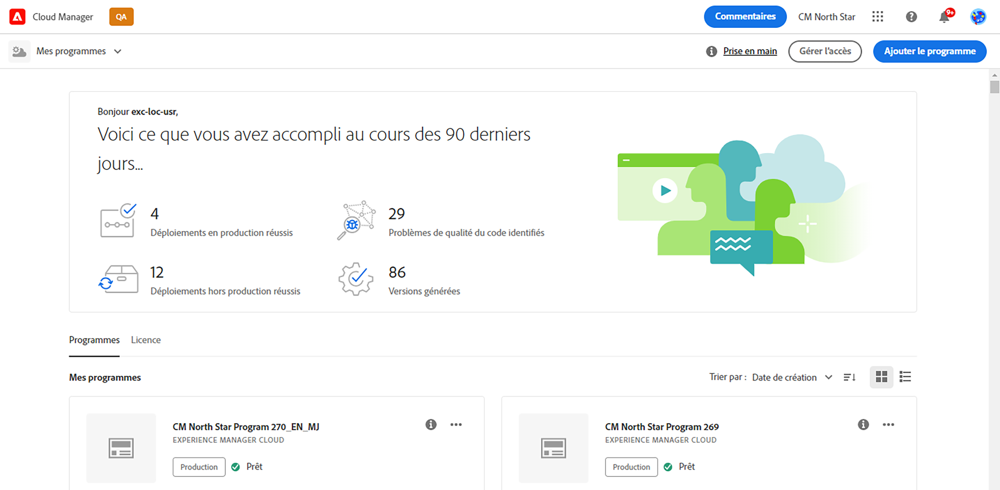
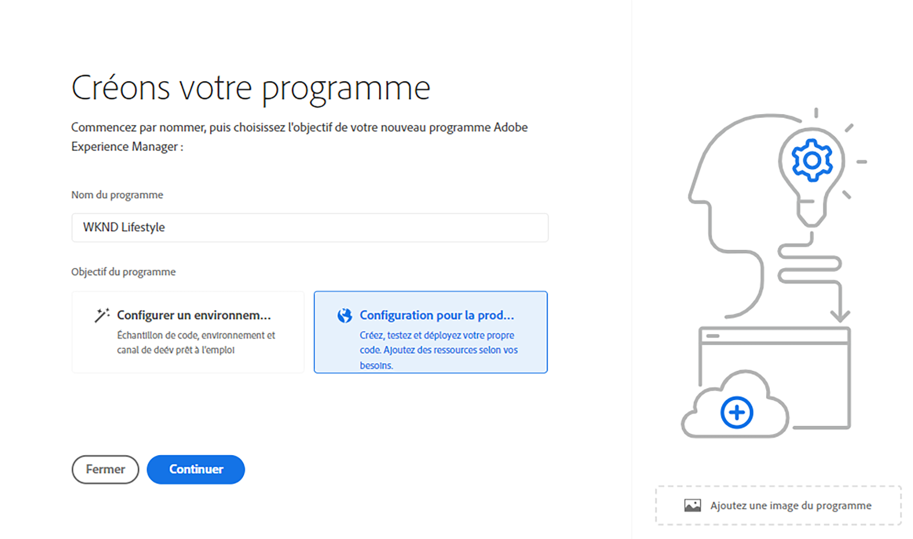
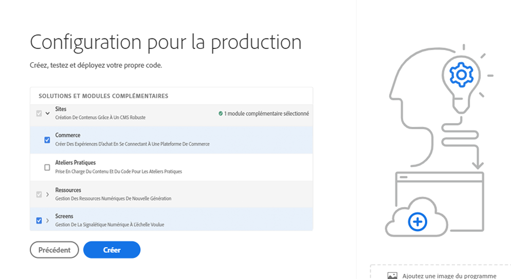
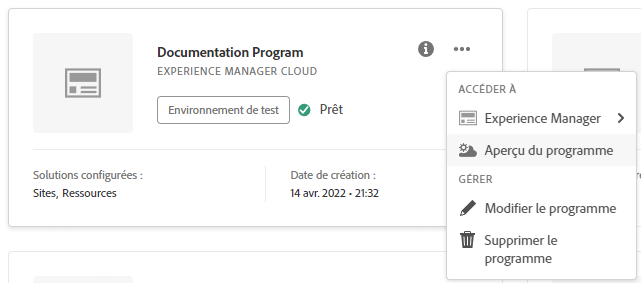
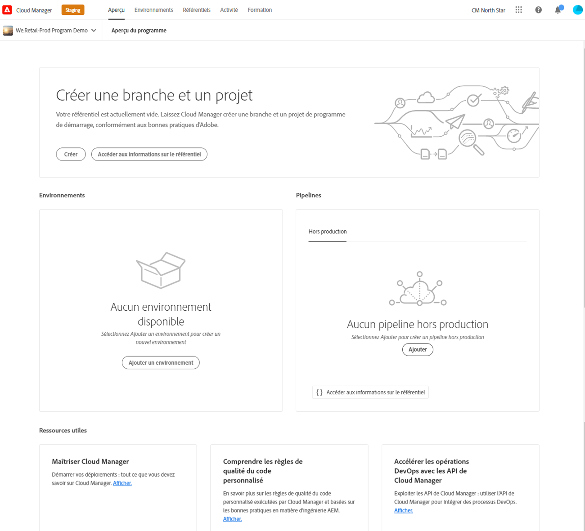

# Création de programmes de production {#create-production-program}

Un programme de production est destiné aux utilisateurs qui connaissent bien Adobe Experience Manager (AEM) et Cloud Manager, et est prêt à écrire, créer et tester du code, dans le but de le déployer pour gérer le trafic en direct.

Pour en savoir plus sur les types de programme, consultez le document [Présentation des programmes et des types de programme](program-types.md).

## Création d’un programme de production {#create}

Les droits de votre entreprise déterminent les options de programme de production supplémentaires disponibles lors de l’ajout de votre programme.
Voir [Options de programme de production supplémentaires](#options).

**Pour créer un programme de production, procédez comme suit**

1. Connectez-vous à Cloud Manager à l’adresse [my.cloudmanager.adobe.com](https://my.cloudmanager.adobe.com/) et sélectionnez l’organisation appropriée.

1. Dans la console **[Mes programmes](/help/implementing/cloud-manager/navigation.md#my-programs)**, près du coin supérieur droit, cliquez sur **Ajouter un programme**.

   

1. Dans l’assistant *Créons votre programme*, dans le champ de texte **Nom du programme**, saisissez le nom que vous souhaitez donner au programme.

1. Sous **Objectif du programme**, sélectionnez **Configurer pour la production**.

   

1. (Facultatif) Dans le coin inférieur droit de la boîte de dialogue de l’assistant, effectuez l’une des opérations suivantes :

   * Faites glisser et déposez un fichier image sur la cible  **Ajouter une image de programme**.
   * Cliquez sur  **Ajouter une image de programme**, puis sélectionnez une image dans l’explorateur de fichiers.
   * Cliquez sur  pour supprimer une image que vous avez ajoutée.

1. Cliquez sur **Continuer**.

1. Dans l’onglet **Sécurité**, sélectionnez les options de sécurité à utiliser. Voir [Sécurité](#security).

   

1. Cliquez sur **Continuer**.

1. Dans la zone de liste **Solutions et modules complémentaires**, sélectionnez une ou plusieurs solutions à inclure dans le programme.

   * Si vous ne savez pas si vous avez besoin d&#39;un ou de plusieurs programmes pour les différentes solutions disponibles, sélectionnez celle qui vous intéresse le plus. Vous pouvez activer des solutions supplémentaires en [modifiant le programme](/help/implementing/cloud-manager/getting-access-to-aem-in-cloud/editing-programs.md) plus tard. Consultez le [document Présentation des programmes de production](/help/implementing/cloud-manager/getting-access-to-aem-in-cloud/introduction-production-programs.md) pour plus de recommandations sur la configuration des programmes.
   * Vous devez sélectionner au moins une solution pour la création du programme. Par exemple, vous pouvez choisir de sélectionner **&#x200B;**&#x200B;pour une solution de réseau CDN entièrement gérée qui optimise les expériences digitales. Voir [&#x200B; À propos de l’utilisation de Edge Delivery Services pour diffuser votre projet Cloud Manager](/help/implementing/cloud-manager/edge-delivery/introduction-to-edge-delivery-services.md).

   * Cliquez sur  à gauche du nom d’une solution pour afficher les modules complémentaires facultatifs. <!-- such as the **Commerce** add-on option under **Sites**. -->

<!--    -->

    >[ !REMARQUE]
    >
    >Si votre programme utilise Edge Delivery Services pour la diffusion, un niveau de publication peut ne pas être requis. Grâce à la fonction de publication flexible (Beta), vous pouvez configurer s’il faut configurer un niveau de publication sur l’onglet Solutions et modules complémentaires . Voir [Niveau de publication flexible (Beta)](/help/implementing/cloud-manager/getting-access-to-aem-in-cloud/creating-production-programs.md#flexible-publish-tier).
    
    

1. Cliquez sur **Continuer**.

1. Dans l’onglet **Type de diffusion** , notez qu’il est prérempli en fonction des solutions et modules complémentaires choisis à l’étape précédente. Si vous sélectionnez **Publication**, vous pouvez ensuite l’approvisionner à la demande.

   

   <!-- * If you selected the **[Enable Enhanced Security](#security)** option, you can select only as many solutions for which HIPAA entitlements are available. -->

1. Cliquez sur **Continuer**.

1. Si vous disposez des droits nécessaires, l&#39;onglet **&#x200B;**&#x200B;s&#39;affiche en tant que deuxième ou troisième onglet dans la boîte de dialogue **`Set up for production`**. Voir [&#128279;](#sla).

   

   Sites et Forms offrent un service level agreement standard à 99,9 % (SLA).

1. Cliquez sur **Continuer**.

1. Dans l’onglet **Date de mise en production**, saisissez la date de mise en production prévue de votre programme.

   

   * Vous pouvez modifier cette date à tout moment.
   * La date est fournie à titre d’information et déclenche le widget de mise en production sur la page [**Aperçu du programme**](/help/implementing/cloud-manager/getting-access-to-aem-in-cloud/editing-programs.md#program-overview). Cette fonctionnalité fournit des liens internes au produit opportuns vers les bonnes pratiques d’AEM as a Cloud Service afin de prendre en charge une expérience de mise en production fluide.

1. Cliquez sur **Créer**. Cloud Manager crée votre programme et l’affiche sur la page de destination pour la sélection.

   

## Autres options de programme de production {#options}

Selon les droits disponibles pour votre organisation, les options supplémentaires suivantes sont disponibles lorsque vous créez un programme de production.

### Sécurité {#security}

Si vous disposez des droits nécessaires, l’onglet **Sécurité** s’affiche comme le premier onglet de la boîte de dialogue **`Set up for production`**.

L’onglet **Sécurité** fournit les options permettant d’activer la **protection HIPAA** ou **WAF-DDOS**, ou les deux, pour votre programme de production, ainsi que la **Clés gérées par le client**.

Compatible avec la norme HIPAA d’Adobe et WAF-DDOS (Web Application Firewall - Distributed Denial of Service), il offre une sécurité cloud intégrée à une approche sur plusieurs couches de la protection contre les vulnérabilités.

* **HIPAA** - Cette option permet à Adobe de mettre en œuvre une solution conforme à la norme HIPAA.
   * En savoir plus sur la [Préparation du HIPAA pour Adobe Experience Manager as a Cloud Service](/help/compliance/hipaa/hipaa-readiness.md) et sur la [mise en œuvre de la solution prête pour Adobe](https://www.adobe.com/trust/compliance/hipaa-hds/hipaa-ready.html).
   * HIPAA ne peut pas être activé ou désactivé après la création du programme.
* **Protection WAF-DDOS** - Cette option active le pare-feu d&#39;application web à travers des règles pour protéger votre application.
   * Une fois activée, la protection WAF-DDOS peut être configurée en configurant un [pipeline hors production](/help/implementing/cloud-manager/configuring-pipelines/configuring-non-production-pipelines.md).

     >[!NOTE]
     >
     >Cochez l&#39;option **Protection WAF-DDOS** pour activer la fonctionnalité, mais au-delà de la protection CVE (Common Vulnerabilities and Expositions) automatique, vous devez déployer les règles WAF via Cloud Manager pour une protection complète. Consultez la section [Règles de filtrage du trafic, y compris les règles WAF](/help/security/traffic-filter-rules-including-waf.md) pour en savoir plus sur la gestion des règles de filtrage du trafic dans votre référentiel afin qu’elles soient correctement déployées.
     >
     >Pour confirmer que la fonctionnalité est active, examinez les [journaux du réseau CDN](//help/security/traffic-filter-rules-including-waf.md#cdn-logs) une fois que le trafic atteint le site. Recherchez les entrées de journal qui incluent une propriété `rules` contenant un attribut `waf`. Par exemple :
     >
     >`"rules": "waf=SQLI"`
     >
     >Cet attribut s’affiche lorsque WAF est actif, avant même le déploiement des règles WAF.

* **Clés gérées par le client** - Cette option active la fonction CMK (Clés gérées par le client) pour le programme, ce qui vous permet de fournir vos propres clés de chiffrement pour les données inactives dans le stockage Blob Azure et MongoDB. Si vous le souhaitez, vous pouvez activer la fonction CMK ultérieurement en [modifiant un programme](/help/implementing/cloud-manager/getting-access-to-aem-in-cloud/editing-programs.md#editing).

   * La fonction CMK est disponible uniquement pour les programmes Cloud Service. Elle ne peut pas être activée sur les programmes Sandbox.
   * Dans un programme, la fonction CMK couvre uniquement les environnements d’évaluation et de production.
   * La fonction CMK ne peut pas être désactivée une fois qu’elle est activée sur un programme.
   * Après avoir activé la fonction CMK, configurez vos clés de chiffrement dans Experience Hub.
Voir [&#x200B; Configuration des clés gérées par le client pour AEM as a Cloud Service](/help/security/customer-managed-keys.md).
   * Si la fonction CMK est activée, la page de présentation du programme affiche une icône de verrou pour indiquer que la fonction CMK est active sur le programme. L’icône ne reflète pas le statut d’activation de la fonction CMK pour les environnements individuels au sein du programme.
     
La consommation de la licence CMK est visible dans le tableau de bord des licences. Pour afficher le nombre de crédits CMK achetés par votre entreprise et le nombre de programmes qui les consomment, consultez [Tableau de bord des licences](/help/implementing/cloud-manager/license-dashboard.md).
     

### Niveau de publication flexible (Beta) {#flexible-publish-tier}

>[!NOTE]
>
>Le niveau de publication flexible décrit ici se trouve dans Beta. Pour rejoindre Beta, envoyez un e-mail à l’adresse [grp-beta_xwalk-publish_config@adobe.com](mailto:grp-beta_xwalk-publish_config@adobe.com) avec votre ID d’organisation et votre ID de programme Adobe.

Si la fonctionnalité de niveau de publication flexible est activée pour votre organisation, vous pouvez configurer si un niveau de publication est requis pour les environnements de votre programme. Cette option apparaît dans l&#39;onglet **Type de diffusion** de la boîte de dialogue **Configurer pour la production** (lors de la [création du programme](/help/implementing/cloud-manager/getting-access-to-aem-in-cloud/creating-production-programs.md)).

Elle apparaît également dans la boîte de dialogue **Modifier le programme** (lorsque vous [modifiez un programme](/help/implementing/cloud-manager/getting-access-to-aem-in-cloud/editing-programs.md)).

Toutes les architectures ne nécessitent pas de niveau de publication. Le tableau suivant indique les architectures qui nécessitent un niveau de publication et celles qui n’en nécessitent pas :

| Architecture | Niveau de publication |
| --- | --- |
| AEM Sites traditionnel | Requis |
| Découplé / API-first | Requis |
| Edge Delivery Services | Non requis |

En activant le niveau de publication uniquement lorsque cela est nécessaire, les équipes peuvent effectuer les opérations suivantes :

* Provisionnement plus rapide des environnements.
* Simplifiez l’infrastructure.
* Réduisez les composants inutiles.

**Fonctionnement**
Lorsque la fonctionnalité de niveau de publication flexible est activée pour votre organisation :

* Par défaut, Cloud Manager met en service tous les nouveaux environnements du programme avec le niveau **Auteur uniquement**. Un message d’information affiché dans l’interface utilisateur confirme ce comportement.
* Si l’utilisateur sélectionne **Publication** lors de la création d’un programme, le niveau de publication est activé et configuré avec *nouveaux environnements*.
* Le niveau de publication peut également être activé ultérieurement en modifiant le programme. Voir [Modification de programmes](/help/implementing/cloud-manager/getting-access-to-aem-in-cloud/editing-programs.md).

>[!NOTE]
>
>Si votre programme utilise Edge Delivery Services pour la diffusion de contenu et AEM Author pour la création de contenu, aucun niveau de publication n’est requis. Le contenu est diffusé via Edge Delivery et ne passe pas par le niveau de publication AEM. Voir À propos de Edge Delivery Services avec la création AEM (Beta).

### SLA {#sla}

Si vous disposez des droits nécessaires, l&#39;onglet **&#x200B;**&#x200B;s&#39;affiche en tant que deuxième ou troisième onglet dans la boîte de dialogue **`Set up for production`**.

Sites et Forms offrent un service level agreement standard à 99,9 % (SLA). L’option **99,99 % Service level agreement** garantit une disponibilité minimale de 99,99 % pour vos environnements de production, que ce soit pour Sites, Forms, Edge Delivery Services ou les trois.

SLA à 99,99 % offre des avantages, notamment une disponibilité plus élevée et une latence plus faible.

Pour les programmes Sites et Forms, le SLA à 99,99 % nécessite l’application d’une [région de publication supplémentaire](/help/implementing/cloud-manager/manage-environments.md#multiple-regions) à l’environnement de production dans le programme. Pour activer le SLA à 99,99 % lorsque les [conditions requises](#sla-requirements) sont remplies, exécutez un [pipeline de pile pleine](/help/implementing/cloud-manager/configuring-pipelines/configuring-production-pipelines.md).

Pour Edge Delivery Services, il n’existe *aucune* exigence autre que la configuration de la licence SLA à 99,99 % sur le programme.

#### Configuration requise pour SLA à 99,99 % {#sla-requirements}

Outre les droits requis, l’utilisation de la version 99,99 % de SLA pour les programmes Sites ou Forms s’accompagne des exigences supplémentaires suivantes :

* L’organisation doit disposer de 99,99 % de SLA et de droits de région de publication supplémentaires disponibles lors de l’application de 99,99 % de SLA au programme.
* Cloud Manager vérifie qu’un droit inutilisé [région de publication supplémentaire](/help/implementing/cloud-manager/manage-environments.md#multiple-regions) est disponible avant d’appliquer 99,99 % de SLA au programme.
* Lors de la modification d’un programme, s’il contient déjà un environnement de production avec au moins une région de publication supplémentaire, Cloud Manager vérifie uniquement la disponibilité d’un droit SLA de 99,99 %.
* Pour l’activation de SLA à 99,99 % et la création de rapports, l’[&#x200B; environnement de production/d’évaluation &#x200B;](/help/implementing/cloud-manager/manage-environments.md#adding-environments) doit avoir été créé et au moins une région de publication supplémentaire doit avoir été appliquée à l’environnement de production/d’évaluation.
   * Si vous utilisez la [mise en réseau avancée](/help/security/configuring-advanced-networking.md), veillez à consulter le document [Ajout de plusieurs régions de publication à un nouvel environnement](/help/implementing/cloud-manager/manage-environments.md#adding-regions) pour obtenir des recommandations afin que la connectivité soit maintenue en cas d’échec régional.
* Votre programme SLA à 99,99 % doit toujours inclure au moins une région de publication supplémentaire. Les utilisateurs ne sont pas autorisés à supprimer la dernière région de publication supplémentaire restante du programme.
* Votre SLA à 99,99 % est pris en charge pour les programmes de production pour lesquels la solution Sites ou Forms est activée.
* Exécutez un [pipeline de pile pleine](/help/implementing/cloud-manager/configuring-pipelines/configuring-production-pipelines.md) pour activer ou désactiver le SLA à 99,99 % lors de la modification d’un programme.

## Accéder à votre programme {#accessing}

1. Lorsque la carte du programme s’affiche sur la page de destination, cliquez sur  pour afficher les options de menu disponibles.

   

1. Sélectionnez **Cloud Manager** pour accéder à la page **Aperçu** de Cloud Manager.

1. La carte call-to-action principale de la page d’aperçu vous guide tout au long de la création d’un environnement, d’un pipeline hors production et, enfin, d’un pipeline de production.

   

>[!TIP]
>
>Voir [Navigation dans l’interface utilisateur de Cloud Manager](/help/implementing/cloud-manager/navigation.md) pour plus d’informations sur la navigation dans Cloud Manager et sur la console **Mes programmes**.

>[!NOTE]
>
>Contrairement à un [programme Sandbox](introduction-sandbox-programs.md#auto-creation), un programme de production nécessite que l’utilisateur possédant le rôle Cloud Manager approprié crée le projet et ajoute un environnement via l’interface utilisateur en libre-service.

