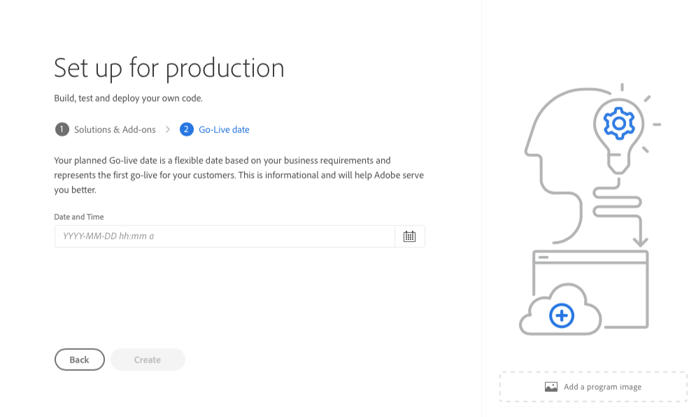

# Création de programmes de production {#create-production-program}

Un programme de production est destiné aux utilisateurs familiarisés avec AEM et Cloud Manager, prêts à écrire, créer et tester du code, dans le but de le déployer pour gérer le trafic en direct.

Pour en savoir plus sur les types de programme, consultez le document [Présentation des types de programme et de programme](program-types.md).

## Création d’un programme de production {#create}

Selon les droits de votre organisation, vous pouvez voir [autres options](#options) lors de l’ajout de votre programme.

**Pour créer un programme de production :**

1. Connectez-vous à Cloud Manager à l’adresse [my.cloudmanager.adobe.com](https://my.cloudmanager.adobe.com/) et sélectionnez l’organisation appropriée.

1. Dans la console **[Mes programmes](/help/implementing/cloud-manager/navigation.md#my-programs)**, près du coin supérieur droit, cliquez sur **Ajouter un programme**.

   

1. Dans l&#39;assistant *Créons votre programme*, dans le champ de texte **Nom du programme**, saisissez le nom souhaité pour le programme.

1. Sous **Objectif de programme**, sélectionnez **`Set up for production`**.

   

1. (Facultatif) Dans le coin inférieur droit de la boîte de dialogue de l’assistant, effectuez l’une des opérations suivantes :

   * Faites glisser et déposez un fichier image sur la cible **Ajouter une image de programme** .
   * Cliquez sur **Ajouter une image de programme**, puis sélectionnez une image dans un navigateur de fichiers.
   * Cliquez sur l’icône représentant une corbeille pour supprimer une image que vous avez ajoutée.

1. Cliquez sur **Continuer**.

1. Dans la zone de liste **Solutions &amp; Add-ons**, sélectionnez une ou plusieurs solutions à inclure dans le programme.

   * Si vous ne savez pas si vous avez besoin d’un ou de plusieurs programmes pour les différentes solutions disponibles, sélectionnez celle qui vous intéresse le plus. Vous pouvez activer des solutions supplémentaires en [modifiant le programme](/help/implementing/cloud-manager/getting-access-to-aem-in-cloud/editing-programs.md) plus tard. Consultez le [document Présentation des programmes de production](/help/implementing/cloud-manager/getting-access-to-aem-in-cloud/introduction-production-programs.md) pour plus de recommandations sur la configuration des programmes.
   * Au moins une solution est nécessaire pour la création du programme.
   * Sélectionnez **Edge Deliver Services** pour une solution CDN entièrement gérée qui optimise les expériences numériques. Voir [À propos de l’utilisation de Edge Delivery Services pour diffuser votre projet Cloud Manager](#edge-overview)
   * Si vous avez sélectionné l’option **[Activer la sécurité améliorée](#security)**, vous ne pouvez sélectionner que les solutions pour lesquelles des droits HIPAA sont disponibles.

   

1. Cliquez sur le chevron à gauche du nom d’une solution pour afficher les modules complémentaires facultatifs, tels que l’option de module complémentaire **Commerce** sous **Sites**.

   

1. Lorsque vos solutions et modules complémentaires sont sélectionnés, cliquez sur **Continuer**.

1. Dans l’onglet **Date d’activation**, saisissez la date prévue pour l’activation de votre programme de production.

   

   * Vous pouvez modifier cette date à tout moment.
   * La date fournit des informations et déclenche le widget GoLive sur la [**page Aperçu du programme**](/help/implementing/cloud-manager/getting-access-to-aem-in-cloud/editing-programs.md#program-overview). Cette fonctionnalité fournit des liens internes au produit opportuns vers les bonnes pratiques d’AEM as a Cloud Service afin de prendre en charge une expérience d’activation fluide.

1. Cliquez sur **Créer**. Cloud Manager crée votre programme et l’affiche sur la landing page pour sélection.

## Options de programme de production supplémentaires {#options}

En fonction des droits dont dispose votre organisation, vous disposez peut-être d’autres options lorsque vous créez un programme de production.

### Sécurité {#security}

Si vous disposez des droits nécessaires, l’onglet **Sécurité** s’affiche comme premier onglet de la boîte de dialogue **`Set up for production`**.

L’onglet **Sécurité** fournit des options pour activer **HIPAA**, ou la **protection WAF-DDOS**, ou les deux, pour votre programme de production.

Adobe conforme à la HIPAA et WAF-DOS (Web Application Firewall - Distributed Denial of Service) facilite la sécurité dans le cloud dans le cadre d’une approche à plusieurs niveaux de protection contre les vulnérabilités.

* **HIPAA** - Cette option permet la mise en oeuvre de solutions prêtes pour l’HIPPA par l’Adobe.
   * [En savoir plus](https://www.adobe.com/trust/compliance/hipaa-ready.html) sur la mise en œuvre de la solution conforme à la norme HIPAA d’Adobe.
   * HIPAA ne peut pas être activé ni désactivé après la création du programme.
* **Protection WAF-DDOS** - Cette option active le pare-feu d’application web au moyen de règles pour protéger votre application.
   * Une fois activée, la protection WAF-DDOS peut être configurée en configurant un [pipeline hors production](/help/implementing/cloud-manager/configuring-pipelines/configuring-non-production-pipelines.md).
   * Voir [Règles de filtrage du trafic y compris les règles WAF](/help/security/traffic-filter-rules-including-waf.md) pour savoir comment gérer les règles de filtrage du trafic dans votre référentiel afin qu’elles soient déployées correctement.

### SLA {#sla}

Si vous disposez des droits nécessaires, l’onglet **SLA** s’affiche sous la forme du deuxième ou du troisième onglet de la boîte de dialogue **`Set up for production`**.

AEM Sites et Forms offrent un contrat de niveau de service standard de 99,9 % (SLA). L’option **99.99% Service Level Agreement** active un pourcentage de temps de disponibilité minimal de 99,99% pour vos environnements de production pour Sites et/ou Forms.

99,99 % de SLA offre des avantages, notamment une disponibilité plus élevée et une latence plus faible, et nécessite une [région de publication supplémentaire](/help/implementing/cloud-manager/manage-environments.md#multiple-regions) à appliquer à l’environnement de production dans le programme.

Lorsque les [conditions requises](#sla-requirements) pour activer SLA 99,99 % sont remplies, vous devez exécuter un [pipeline de pile complet](/help/implementing/cloud-manager/configuring-pipelines/configuring-production-pipelines.md) pour l’activer.

#### Conditions requises pour SLA 99,99 % {#sla-requirements}

Au-delà des droits requis, 99,99 % de SLA ont des exigences supplémentaires à utiliser.

* L’organisation doit disposer de 99,99 % de droits SLA et d’autres droits de région de publication disponibles lors de l’application de 99,99 % de SLA au programme.
* Cloud Manager vérifie qu’un droit [région de publication supplémentaire](/help/implementing/cloud-manager/manage-environments.md#multiple-regions) inutilisé est disponible avant d’appliquer 99,99 % de SLA au programme.
* Lors de la modification d’un programme, s’il contient déjà un environnement de production avec au moins une région de publication supplémentaire, Cloud Manager vérifie uniquement la disponibilité d’un droit SLA de 99,99 %.
* Pour l’activation de SLA et de la création de rapports à 99,99 %, l’ [environnement de production/d’évaluation](/help/implementing/cloud-manager/manage-environments.md#adding-environments) doit avoir été créé et au moins une région de publication supplémentaire doit avoir été appliquée à l’environnement de production/d’évaluation.
   * Si vous utilisez la [mise en réseau avancée](/help/security/configuring-advanced-networking.md), veillez à consulter le document [Ajout de plusieurs régions Publish à un nouvel environnement](/help/implementing/cloud-manager/manage-environments.md#adding-regions) pour obtenir des recommandations afin de maintenir la connectivité en cas d’échec régional.
* Au moins une région de publication supplémentaire doit rester dans votre programme SLA 99,99 %. Les utilisateurs ne sont pas autorisés à supprimer la dernière région de publication supplémentaire de votre programme SLA 99,99 %.
* 99,99 % de SLA est pris en charge pour les programmes de production pour lesquels la solution Sites ou Forms est activée.
* Exécutez un [pipeline de pile complet](/help/implementing/cloud-manager/configuring-pipelines/configuring-production-pipelines.md) pour activer ou — lors de la modification d’un programme — désactiver le SLA 99,99 %.

## Accéder à votre programme {#accessing}

1. Lorsque la carte du programme s’affiche sur la landing page, cliquez sur le bouton représentant des points de suspension pour afficher les options de menu disponibles.

   

1. Sélectionnez **Cloud Manager** pour accéder à la page **Aperçu** de Cloud Manager.

1. La carte d’appel à l’action principale de la page d’aperçu vous guide tout au long de la création d’un environnement, d’un pipeline hors production et, enfin, d’un pipeline de production.

   

>[!TIP]
>
>Voir [Navigation dans l’interface utilisateur de Cloud Manager](/help/implementing/cloud-manager/navigation.md) pour plus d’informations sur la navigation dans Cloud Manager et la compréhension de la console **Mes programmes**.

>[!NOTE]
>
>Contrairement à un [programme sandbox](introduction-sandbox-programs.md#auto-creation), un programme de production nécessite que l’utilisateur possédant le rôle Cloud Manager approprié crée le projet et ajoute un environnement via l’interface utilisateur en libre-service.

