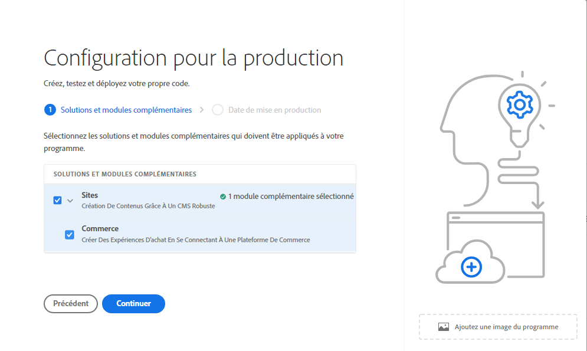
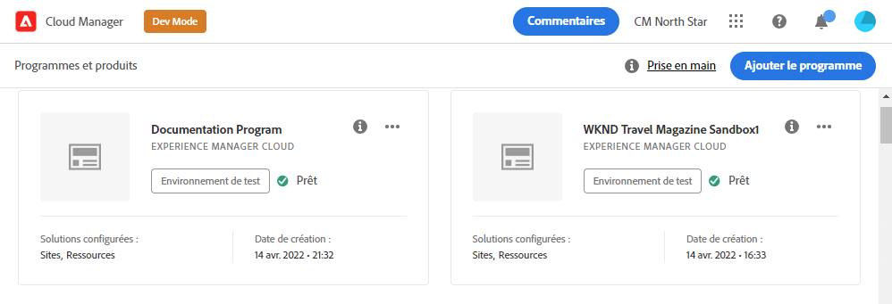

# Création de programmes de production {#create-production-program}

Un programme de production est destiné à un utilisateur qui connaît AEM et Cloud Manager et qui est prêt à se lancer dans l’écriture, la compilation et le test de code en vue de le déployer pour héberger du trafic en direct.

Découvrez-en plus sur les types de programme dans le document [Présentation des programmes et des types de programme.](program-types.md)

## Tutoriels vidéo {#video-tutorials}

Vous pouvez regarder ces deux tutoriels vidéo pour apprendre à créer un programme dans Cloud Manager ou [suivre nos instructions documentées.](#create)

>[!VIDEO](https://video.tv.adobe.com/v/334953)

>[!VIDEO](https://video.tv.adobe.com/v/334954)

## Création d’un programme de production {#create}

Pour créer un programme de production, procédez comme suit.

1. Connectez-vous à Cloud Manager à l’adresse [my.cloudmanager.adobe.com](https://my.cloudmanager.adobe.com/) et sélectionnez l’organisation appropriée.

1. Cliquez sur **Ajouter un programme** dans le coin supérieur droit de l’écran.

   

1. Sélectionnez **Configuration pour la production** dans l’assistant de création de programme pour créer un programme de production. Vous pouvez accepter le nom du programme par défaut ou le modifier avant de cliquer sur **Continuer**.

   

1. Sur le **Solutions et modules complémentaires** sélectionnez les solutions à inclure dans le programme.

   

1. Cliquez sur le chevron situé avant les noms des solutions pour afficher les modules complémentaires facultatifs, tels que la sélection de l’option de module complémentaire **Commerce** sous **Sites**.

   

1. Lorsque vos solutions et modules complémentaires sont sélectionnés, cliquez sur **Continuer**.

1. Sur le **Date d’activation** saisissez la date d’activation de votre programme de production.

   

   * Cette date peut être modifiée à tout moment.
   * Cette date est destinée à un usage informatif uniquement et déclenche le widget GoLive sur la page d’aperçu du programme afin de fournir des liens internes au produit vers AEM documentation des bonnes pratiques as a Cloud Service en temps opportun, afin de vous aligner sur votre parcours et d’offrir ainsi une expérience GoLive réussie et fluide.

1. Cliquez sur **Créer**.

Votre programme est créé par Cloud Manager, s’affiche et peut être sélectionné dans la page de destination.

## Accès à votre programme {#acessing}

1. Une fois que la carte du programme s’affiche sur la page de destination, sélectionnez le bouton représentant des points de suspension pour afficher les options de menu disponibles.

   

1. Sélectionnez **Cloud Manager** pour accéder à la page **Aperçu** de Cloud Manager.

1. La carte principale d’appel à l’action de la page d’aperçu vous guide tout au long de la création d’un environnement, d’un pipeline hors production et, enfin, d’un pipeline de production.

   

Si, à tout moment, vous devez passer à un autre programme ou revenir à la page d’aperçu pour créer un autre programme, cliquez sur le nom de votre programme dans le coin supérieur gauche de l’écran pour afficher l’option **Accéder à**.

>[!NOTE]
>
>Contrairement à un [programme Sandbox,](introduction-sandbox-programs.md#auto-creation) un programme de production nécessite que l’utilisateur possédant le rôle Cloud Manager approprié crée le projet et ajoute un environnement via l’interface utilisateur en libre-service.
