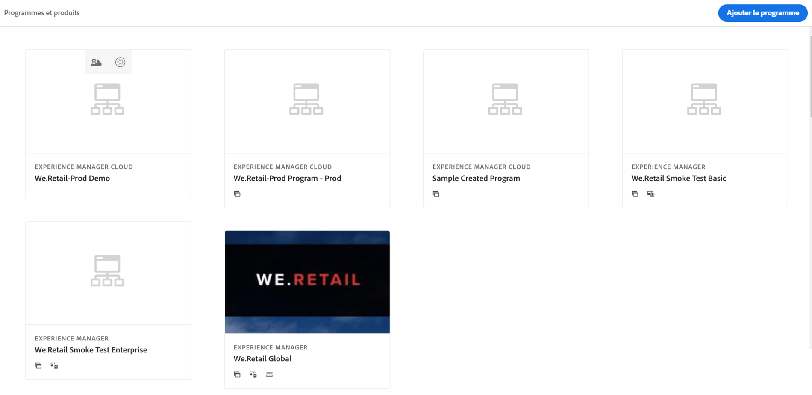

# Création d’un programme Sandbox {#create-sandbox-program}

Pour créer un programme Sandbox, procédez comme suit :

1. Lancez la page d’entrée de Cloud Manager et cliquez sur **Ajouter le programme** dans le coin supérieur droit de l’écran.

   

1. Dans l’assistant de création de programme, sélectionnez **Configurer un environnement de test**. L’utilisateur envoie le nom du programme avant de sélectionner **Créer**.

   

1. L’utilisateur voit la nouvelle carte de programme Sandbox dans la page d’entrée et peut la survoler pour sélectionner l’icône Cloud Manager afin d’accéder à la page d’aperçu de Cloud Manager. La carte informe l’utilisateur de l’état de la configuration automatique du programme Sandbox nouvellement créé. L’utilisateur verra la progression.

   

1. Une fois le programme configuré et l’étape de création du projet terminée, l’utilisateur peut accéder au lien **Gérer Git**, comme indiqué dans la figure ci-dessous :

   

   >[!NOTE]
   >
   >Pour en savoir plus sur l’accès et la gestion de votre référentiel Git depuis l’interface utilisateur de Cloud Manager à l’aide de la gestion de compte Git en libre-service, voir [Accès à Git](/help/implementing/cloud-manager/managing-code/accessing-repos.md).

1. Une fois l’environnement de développement créé, l’utilisateur peut accéder au lien **AEM**, comme indiqué dans la figure ci-dessous :

   

1. Une fois terminé le déploiement du canal hors-production vers le développement, l’assistant aide l’utilisateur à accéder à AEM (pour le développement) ou à déployer du code vers l’environnement de développement :

   

   >[!NOTE]
   >Vous pouvez également modifier, changer ou ajouter un programme à partir de la page d’aperçu de Cloud Manager, comme illustré ci-dessous :

   
