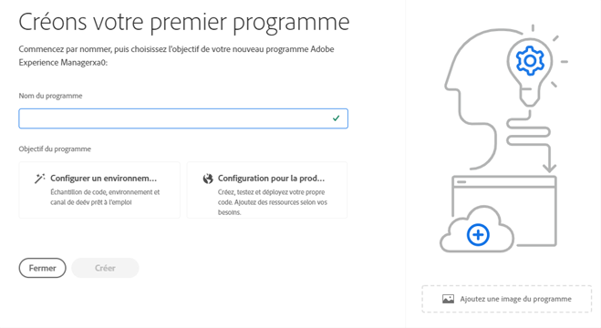
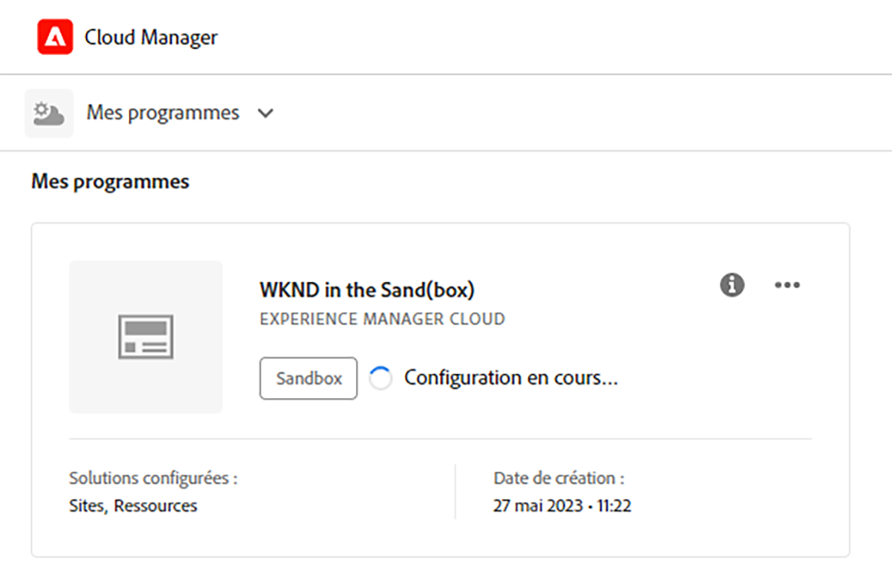
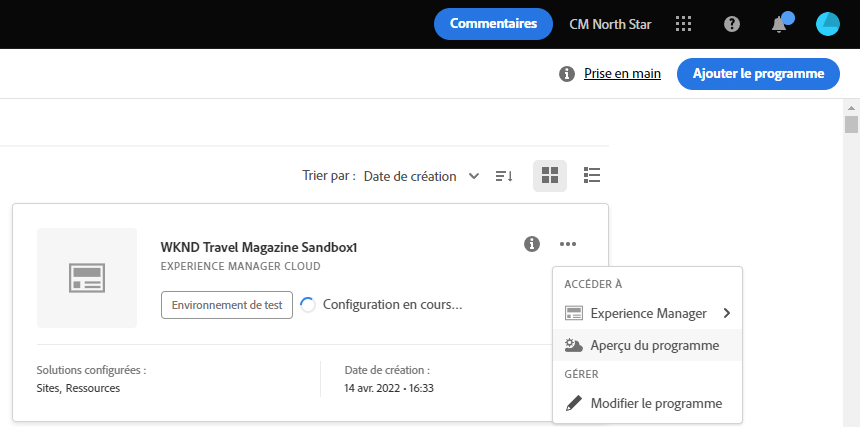
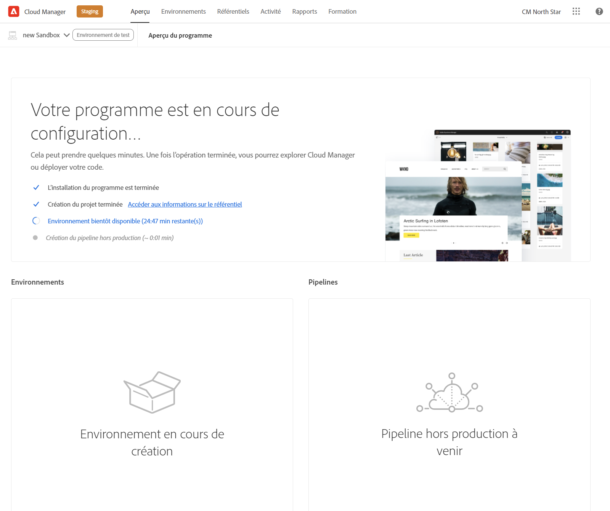
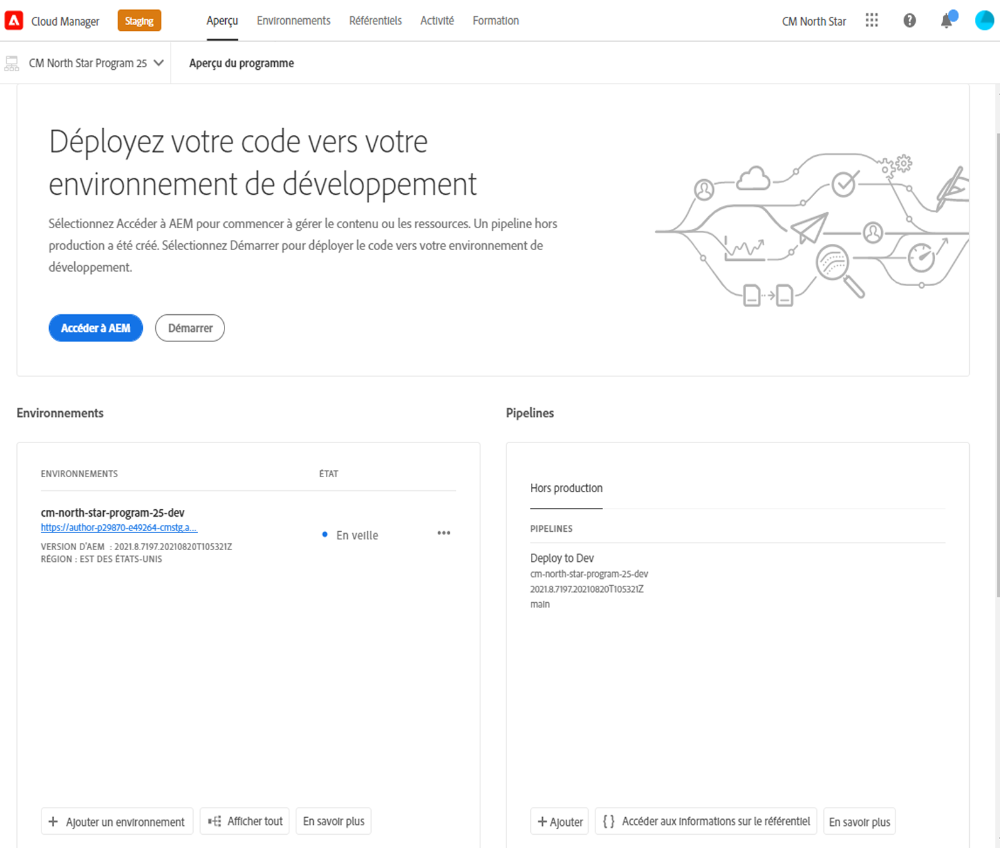

# Création de programmes Sandbox {#create-sandbox-program}

Un programme d’environnement de test est généralement créé à des fins de formation, d’exécution de démonstrations, d’activation, de points ciblés ou de documentation, et n’est pas destiné à transporter du trafic en direct. Voir [Présentation des programmes Sandbox](/help/implementing/cloud-manager/getting-access-to-aem-in-cloud/introduction-sandbox-programs.md).

Pour en savoir plus sur les types de programme, consultez le document [Présentation des types de programme et de programme](program-types.md).

## Création d’un programme d’environnement de test {#create}

1. Connectez-vous à Cloud Manager à l’adresse [my.cloudmanager.adobe.com](https://my.cloudmanager.adobe.com/) et sélectionnez l’organisation appropriée.

1. Dans la console **[Mes programmes](/help/implementing/cloud-manager/navigation.md#my-programs)**, près du coin supérieur droit, cliquez sur **Ajouter un programme**.

   

1. Dans l&#39;assistant *Créons votre programme*, dans le champ de texte **Nom du programme**, saisissez le nom souhaité pour le programme.

1. Sous **Objectif de programme**, sélectionnez **`Set up a sandbox`**.

   

1. (Facultatif) Dans le coin inférieur droit de la boîte de dialogue de l’assistant, effectuez l’une des opérations suivantes :

   * Faites glisser et déposez un fichier image sur la cible **Ajouter une image de programme** .
   * Cliquez sur **Ajouter une image de programme**, puis sélectionnez une image dans un navigateur de fichiers.
   * Cliquez sur l’icône représentant une corbeille pour supprimer une image que vous avez ajoutée.

1. Cliquez sur **Continuer**.

1. Dans la zone de liste **Solutions &amp; Add-ons**, sélectionnez une ou plusieurs solutions à inclure dans le programme.

   * Cliquez sur le chevron à gauche du nom d’une solution pour afficher tous les modules complémentaires facultatifs disponibles que vous souhaitez inclure à une solution sélectionnée.
   * Les solutions **Sites**, **Assets** et **Edge Deliver Services** sont toujours sélectionnées par défaut lorsque vous créez un programme Sandbox. Vous ne pouvez pas les désélectionner.

   

1. Cliquez sur **Créer**. Cloud Manager crée votre programme d’environnement de test et l’affiche sur la page d’entrée pour sélection.

## Accès aux environnements de test {#access}

Une fois qu’un nouveau programme d’environnement de test est en cours de création, vous pouvez afficher le détail de votre configuration d’environnement de test et accéder à l’environnement en affichant la page d’aperçu du programme.

1. Sur la page d’entrée Cloud Manager, cliquez sur le bouton représentant des points de suspension du programme d’environnement de test créé.

   

1. Une fois l’étape de création du projet terminée, vous pouvez cliquer sur le lien **Accéder aux informations du référentiel** pour pouvoir utiliser votre référentiel git.

   

   >[!TIP]
   >
   >Pour en savoir plus sur l’accès à votre référentiel Git et sa gestion, voir [Accès à Git](/help/implementing/cloud-manager/managing-code/accessing-repos.md).

1. Une fois l’environnement de développement créé, vous pouvez cliquer sur **Accéder à AEM** et vous connecter à AEM.

   

1. Une fois le pipeline hors production se déployant vers le développement terminé, l’assistant de l’ appel à l’action vous guide à accéder à l’environnement de développement AEM ou à déployer du code vers l’environnement de développement.

   

>[!TIP]
>
>Voir [Navigation dans l’interface utilisateur de Cloud Manager](/help/implementing/cloud-manager/navigation.md) pour plus d’informations sur la navigation dans Cloud Manager et la compréhension de la console **Mes programmes**.
