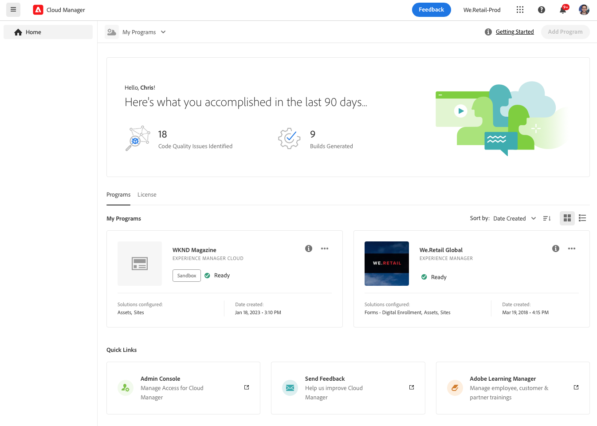
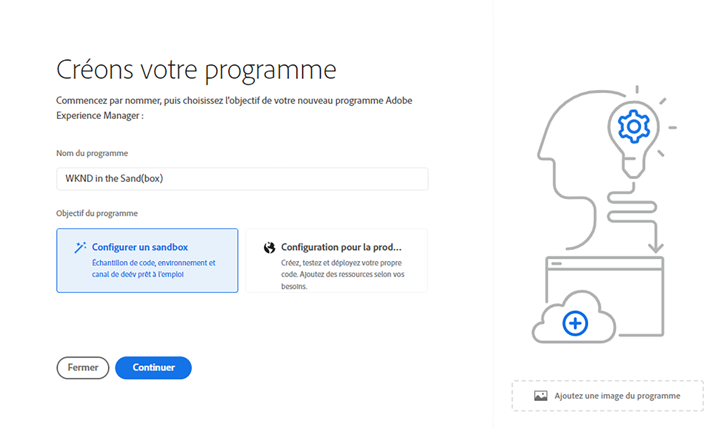
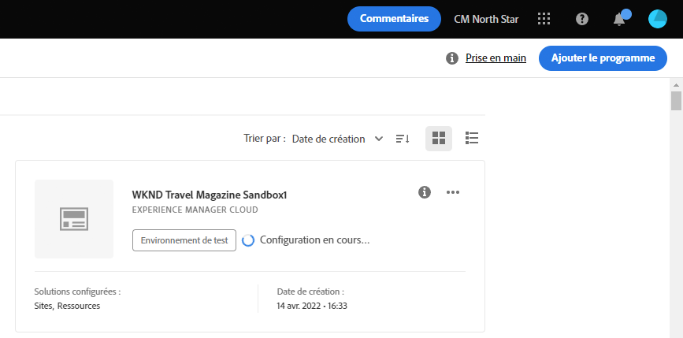

# Création de programmes Sandbox {#create-sandbox-program}

Un programme Sandbox est généralement créé à des fins de formation, pour l’exécution de démonstrations, d’activation, de points de vente ou de documentation, et n’est pas destiné à transporter du trafic en direct.

Découvrez-en plus sur les types de programme dans le document [Présentation des programmes et des types de programme.](program-types.md)

## Création d’un programme Sandbox {#create}

Pour créer un programme Sandbox, procédez comme suit.

1. Connectez-vous à Cloud Manager à l’adresse [my.cloudmanager.adobe.com](https://my.cloudmanager.adobe.com/) et sélectionnez l’organisation appropriée.

1. Dans la page de destination de Cloud Manager, cliquez sur **Ajouter un programme** dans le coin supérieur droit de l’écran.

   

1. Dans l’assistant de création de programme, sélectionnez **Configurer un environnement de test**, indiquez un nom de programme, puis cliquez sur **Créer**.

   

Une nouvelle carte de programme sandbox s’affiche sur la page d’entrée avec un indicateur de statut au fur et à mesure que le processus de configuration progresse.

## Accès à votre Sandbox {#access}

Vous pouvez afficher les détails de la configuration de votre sandbox et accéder à l’environnement (une fois disponible) en consultant la page d’aperçu du programme.

1. Dans la page de destination de Cloud Manager, cliquez sur le bouton représentant des points de suspension du programme que vous venez de créer.

   

1. Une fois l’étape de création du projet terminée, vous pouvez accéder au lien **Accès aux informations sur le référentiel** pour pouvoir utiliser votre référentiel git.

   

   >[!TIP]
   >
   >Pour en savoir plus sur l’accès à votre référentiel git et sa gestion, reportez-vous au document [Accès à Git.](/help/implementing/cloud-manager/managing-code/accessing-repos.md)

1. Une fois l’environnement de développement créé, vous pouvez utiliser le lien **Accès à AEM** pour vous connecter à AEM.

   

1. Une fois terminé le déploiement du canal hors production vers le développement, l’assistant vous aide à accéder à l’environnement de développement AEM ou à déployer du code vers l’environnement de développement.

   

Si, à tout moment, vous devez passer à un autre programme ou revenir à la page d’aperçu pour créer un autre programme, cliquez sur le nom de votre programme dans le coin supérieur gauche de l’écran pour afficher l’option **Accéder à**.

.
