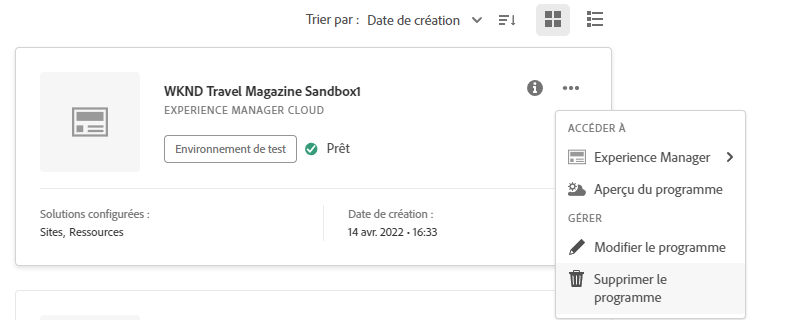

# Suppression d’un programme Sandbox {#delete-sandbox-program}

Un utilisateur de programme Sandbox possédant le rôle *Propriétaire d’entreprise* ou *Responsable de déploiement* dans Cloud Manager peut désormais supprimer ses jeux d’environnements de production et d’évaluation par le biais de l’interface utilisateur de Cloud Manager.

>[!NOTE]
>La sélection de l’option de suppression dans l’environnement de production ou d’évaluation supprime également l’autre dans le jeu d’environnements.

L’option de suppression est disponible à partir de la page d’entrée, comme illustré ci-dessous :

Ou,

Sélectionnez **Supprimer le programme** dans la page **Aperçu du programme** pour supprimer votre programme Sandbox.

