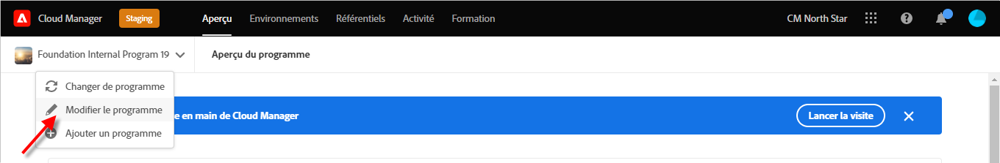
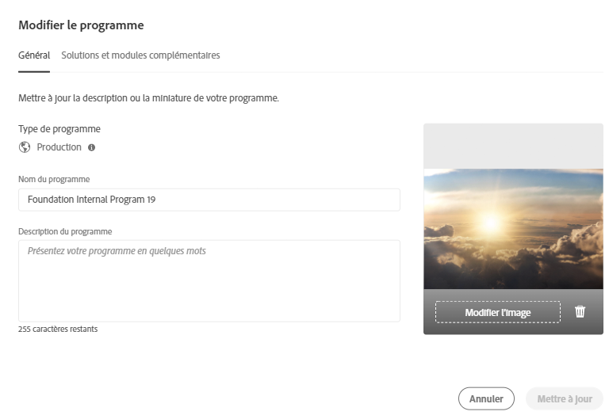
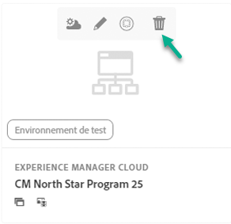
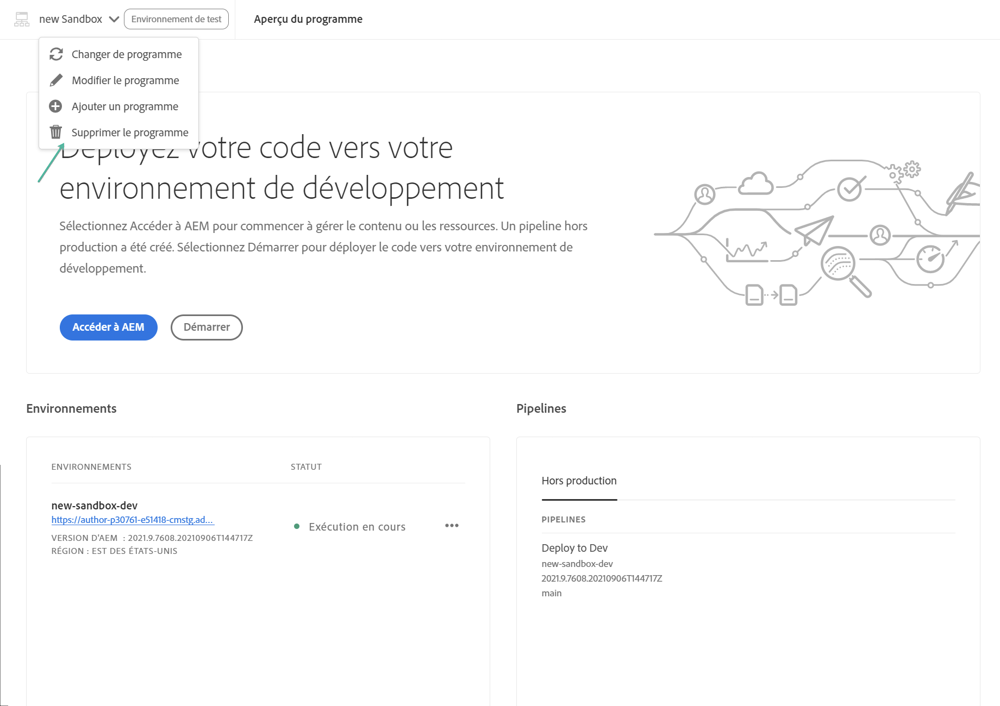

# Modifier les programmes {#editing-programs}

Pour gérer et modifier des programmes, démarrez à la [**console Mes programmes**](/help/implementing/cloud-manager/navigation.md). La page **Mes programmes** donne un aperçu de tous les programmes auxquels vous avez accès. Lors de la sélection d’un programme individuel, la page **Aperçu du programme** fournit les détails du programme en un coup d’oeil.

À partir de la **présentation du programme**, les utilisateurs disposant des autorisations requises peuvent modifier les [programmes de production créés dans votre organisation](creating-production-programs.md) et les [programmes Sandbox créés dans votre organisation](creating-sandbox-programs.md). En éditant un programme, vous pouvez :

* Ajoutez la solution Sites à un programme existant avec Assets et inversement.
* Supprimer Sites ou Assets d’un programme existant contenant à la fois Sites et Assets.
* Ajoutez un second droit de solution inutilisé à un programme existant ou en tant que nouveau programme.
* Supprimer les programmes Sandbox.

## Autorisations {#permissions}

Vous devez être membre du rôle **Propriétaire de l’entreprise** pour modifier des programmes ou supprimer des programmes Sandbox et accéder au tableau de bord de licence.

## Modifier un programme {#editing}

Chaque fois qu’un programme est modifié, y compris l’ajout ou la suppression d’une solution ou d’un module complémentaire, ces modifications prennent effet après le prochain déploiement.

**Pour modifier un programme :**

1. Connectez-vous à Cloud Manager à l’adresse [my.cloudmanager.adobe.com](https://my.cloudmanager.adobe.com/) et sélectionnez l’organisation appropriée.

1. Sur la page **[Mes programmes](#my-programs)**, cliquez sur le programme que vous souhaitez modifier pour en afficher les détails.

1. Cliquez sur le nom de votre programme dans le coin supérieur gauche de la page et sélectionnez **Modifier le programme**.

   

1. La page **Modifier le programme** s’ouvre sur l’onglet **Général**.

   

1. Les options disponibles pour la modification du programme sont les mêmes que lors de la création du programme.
   * Pour plus d’informations sur les options individuelles, voir [Création de programmes de production](/help/implementing/cloud-manager/getting-access-to-aem-in-cloud/creating-production-programs.md) et [Création de programmes Sandbox](/help/implementing/cloud-manager/getting-access-to-aem-in-cloud/creating-sandbox-programs.md) .
   * [D’autres options](/help/implementing/cloud-manager/getting-access-to-aem-in-cloud/creating-production-programs.md#options) peuvent être disponibles pour votre programme de production en fonction des droits de votre organisation.

1. Cliquez sur **Mettre à jour** pour enregistrer vos modifications dans le programme.

## Suppression d’un programme d’environnement de test {#delete-sandbox-program}

La suppression d’un programme d’environnement de test supprime tous les environnements et pipelines qui y sont associés.

>[!TIP]
>
>Les utilisateurs avec des rôles de **Propriétaire de l’entreprise** ou **Responsable du déploiement** peuvent également supprimer leurs environnements de production et d’évaluation plutôt que l’ensemble du programme Sandbox.

**Pour supprimer un programme Sandbox :**

1. Connectez-vous à Cloud Manager à l’adresse [my.cloudmanager.adobe.com](https://my.cloudmanager.adobe.com/) et sélectionnez l’organisation appropriée.

1. Sur la page **[Mes programmes](#my-programs)**, cliquez sur le programme que vous souhaitez modifier pour en afficher les détails.

1. Cliquez sur le nom de votre programme dans le coin supérieur gauche de la page et sélectionnez **Supprimer le programme**.

   

Vous pouvez également cliquer sur https://spectrum.adobe.com/static/icons/workflow_18/Smock_More_18_N.svg sur la carte de votre programme dans la page d’aperçu de Cloud Manager et sélectionner **Supprimer le programme**.

>[!NOTE]
>
>Seuls les programmes Sandbox peuvent être supprimés. Les programmes de production ne peuvent pas être supprimés.
