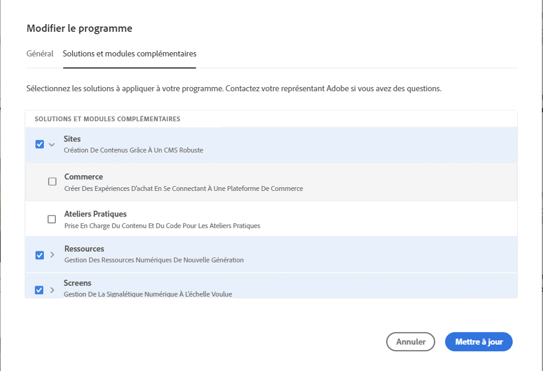
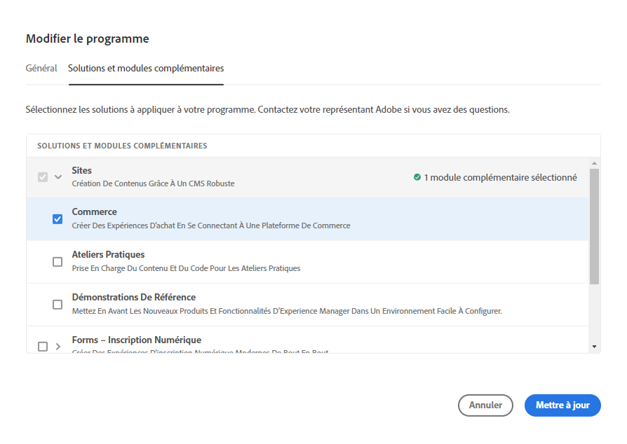
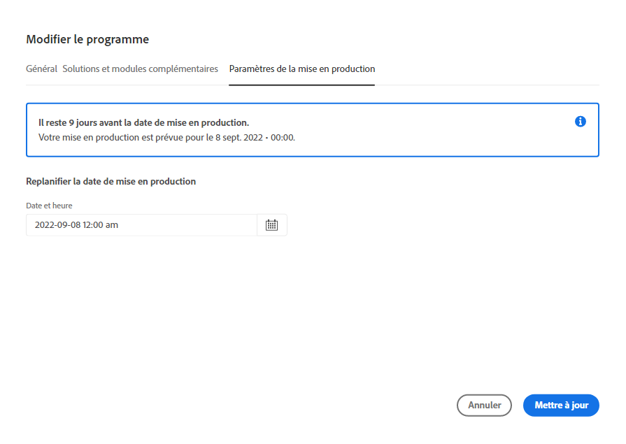
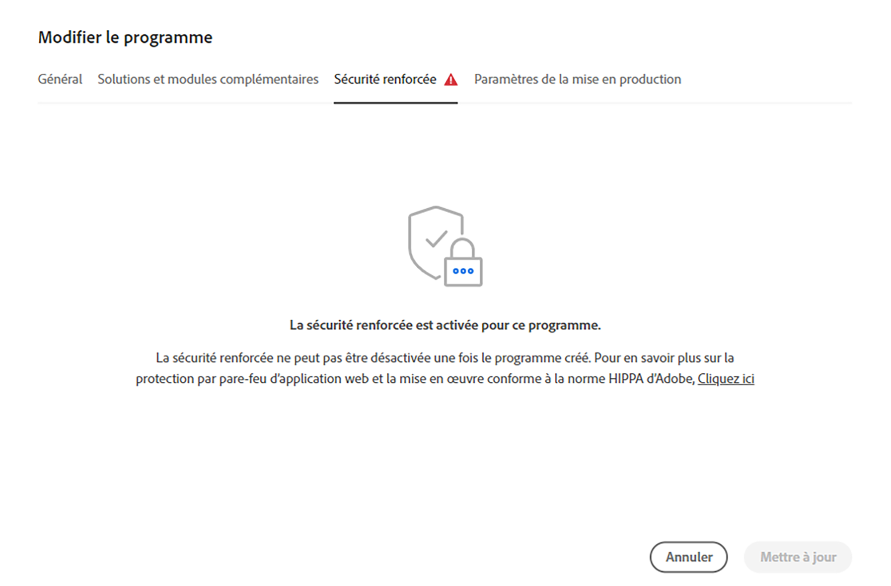

# Modification de programmes {#editing-programs}

Les utilisateurs disposant des autorisations requises peuvent modifier les [programmes de production créés dans votre organisation](creating-production-programs.md) ainsi que les [programmes Sandbox créés dans votre organisation.](creating-sandbox-programs.md) En modifiant un programme, vous pouvez :

* Ajouter la solution Sites à un programme existant avec Assets et inversement.
* Supprimer Sites ou Assets d’un programme existant contenant à la fois Sites et Assets.
* Ajouter un deuxième droit non utilisé sur une solution à un programme existant ou à titre de nouveau programme.
* Supprimer les programmes Sandbox.

## Autorisations {#permissions}

Vous devez être membre du rôle **Propriétaire de l’entreprise** pour modifier des programmes ou supprimer des programmes dans la sandbox.

## Modifier un programme {#editing}

Pour modifier un programme, procédez comme suit.

1. Connectez-vous à Cloud Manager à l’adresse [my.cloudmanager.adobe.com](https://my.cloudmanager.adobe.com/) et sélectionnez l’organisation appropriée.

1. Cliquez sur le programme que vous souhaitez modifier pour en afficher les détails.

1. Cliquez sur le nom de votre programme dans le coin supérieur gauche de la page, puis sélectionnez **Modifier le programme**.

   

1. La page **Modifier le programme** s’affiche. Dans l’onglet **Général**, modifiez le nom et la description du programme.

   * Au moins une solution doit être sélectionnée pour un programme.

   

1. Dans l’onglet **Solutions et modules complémentaires**, modifiez les solutions du programme.

   

1. Cliquez sur le chevron situé avant les noms des solutions pour afficher les modules complémentaires facultatifs, tels que la sélection de l’option de module complémentaire **Commerce** sous **Sites**.

   

1. Dans l’onglet **Paramètres de la mise en production**, modifiez la date de mise en production prévue du programme.

   

   * Cette date est destinée à un usage informatif uniquement et déclenche le widget de mise en production sur la page d’aperçu du programme pour fournir des liens internes au produit vers la documentation des bonnes pratiques d’AEM as a Cloud Service en temps opportun, afin de vous aligner avec votre parcours et d’offrir ainsi une expérience de mise en production réussie et fluide.
   * Cet onglet n’est pas disponible pour les programmes Sandbox.

1. Cliquez sur **Mettre à jour** pour enregistrer vos modifications dans le programme.

Chaque fois qu’un programme est modifié, y compris par l’ajout ou la suppression d’une solution ou d’un module complémentaire, ces modifications prennent effet après le prochain déploiement.

Si la sécurité de votre programme de production a été améliorée, une **Sécurité renforcée** est disponible dans l’onglet **Modifier le programme** pour confirmer que la fonctionnalité est principale pour le programme.

Ce paramètre ne peut pas être modifié une fois le programme créé. Pour plus d’informations sur l’option de sécurité renforcée, reportez-vous au document [Création de programmes de production](creating-production-programs.md).

## Suppression de programmes Sandbox {#delete-sandbox-program}

La suppression d’un programme Sandbox supprimera tous les environnements et les pipelines qui y sont associés.

>[!TIP]
>
>Les utilisateurs avec des rôles de **Propriétaire de l’entreprise** ou **Responsable du déploiement** peuvent également supprimer leurs environnements de production et d’évaluation plutôt que l’ensemble du programme Sandbox.

Pour supprimer un programme Sandbox, procédez comme suit.

1. Connectez-vous à Cloud Manager à l’adresse [my.cloudmanager.adobe.com](https://my.cloudmanager.adobe.com/) et sélectionnez l’organisation appropriée.

1. Cliquez sur le programme que vous souhaitez modifier pour en afficher les détails.

1. Cliquez sur le nom de votre programme dans le coin supérieur gauche de la page et sélectionnez **Supprimer le programme**.

   

Vous pouvez également cliquer sur le bouton représentant des points de suspension sur la vignette de votre programme dans la page de présentation de Cloud Manager et sélectionner **Supprimer le programme**.

>[!NOTE]
>
>Seuls les programmes Sandbox peuvent être supprimés. Les programmes de production ne peuvent pas être supprimés.
