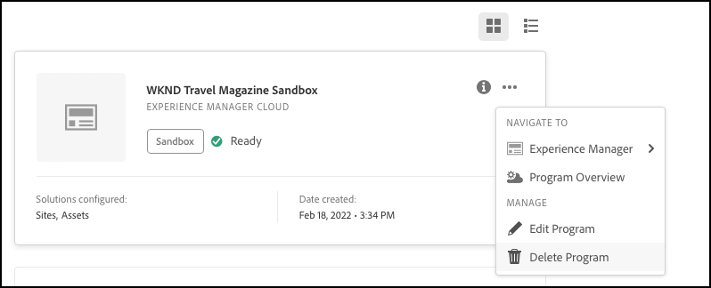

# Modifier des programmes {#editing-programs}

Pour gérer et modifier des programmes, commencez par la console [**Mes programmes**](/help/implementing/cloud-manager/navigation.md). La page **Mes programmes** donne un aperçu de tous les programmes auxquels vous avez accès. Lors de la sélection d’un programme individuel, la page **Aperçu du programme** donne un aperçu des détails du programme.

Dans l’**Aperçu du programme**, les utilisateurs disposant des autorisations requises peuvent modifier les [programmes de production créés dans votre organisation](creating-production-programs.md) et les [programmes Sandbox créés dans votre organisation](creating-sandbox-programs.md). En modifiant un programme, vous pouvez effectuer les opérations suivantes :

* Activez ou désactivez la protection **WAF-DDOS** dans l&#39;onglet **Sécurité**.
* Ajoutez la solution Sites à un programme existant avec Assets et ajoutez Assets à un programme existant avec Sites.
* Supprimez Sites ou Assets d’un programme existant qui comporte à la fois Sites et Assets.
* Ajoutez un droit de solution inutilisé à un programme existant ou créez un programme.
* Marquez les programmes de production pour suppression.
* Supprimer les programmes Sandbox.

## Autorisations {#permissions}

Vous devez disposer du rôle **Propriétaire de l’entreprise** pour modifier des programmes, supprimer des programmes Sandbox, marquer des programmes de production pour suppression et accéder au tableau de bord des licences.

## Modifier un programme {#editing}

Chaque fois qu’un programme est modifié, y compris par l’ajout ou la suppression d’une solution ou d’un module complémentaire, ces modifications prennent effet après le prochain déploiement.

**Pour modifier un programme, procédez comme suit**

1. Connectez-vous à Cloud Manager sur [experience.adobe.com](https://experience.adobe.com).
1. Dans la section **Accès rapide**, cliquez sur **Experience Manager**.
1. Dans le panneau de gauche, cliquez sur **Cloud Manager**.
1. Sélectionnez l’organisation appropriée.
1. Sur la page **Mes programmes**, cliquez sur le programme que vous souhaitez modifier.
1. Dans le coin supérieur gauche de la page, cliquez sur le nom du programme, puis sélectionnez **Modifier le programme**.

   

1. Dans la boîte de dialogue **Modifier le programme**, utilisez les onglets pour définir les différentes options souhaitées.

   

   Les options disponibles pour la modification du programme sont les mêmes que pour la création du programme.

   * Dans l’onglet **Sécurité**, vous pouvez activer **Clés gérées par le client** pour un programme existant.

     >[!NOTE]
     >
     >Pour activer ou désactiver le pare-feu d&#39;application web (WAF) à tout moment, dans le même onglet Sécurité, activez ou désactivez la case à cocher **Protection WAF-DDOS**. Si les règles WAF sont sous licence mais que cette case n&#39;est pas cochée, la fonction n&#39;est pas active et ses protections ne s&#39;appliquent pas. Pour plus d’informations, voir [Règles de filtrage du trafic, y compris les règles WAF](/help/security/traffic-filter-rules-including-waf.md).
     >
     >Pour confirmer que la fonctionnalité est active, examinez les [journaux du réseau CDN](//help/security/traffic-filter-rules-including-waf.md#cdn-logs) une fois que le trafic atteint le site. Recherchez les entrées de journal qui incluent une propriété `rules` contenant un attribut `waf`. Par exemple :
     >
     >`"rules": "waf=SQLI"`
     >
     >Cet attribut apparaît une fois que WAF est actif, avant même le déploiement des règles WAF.

   * Vous pouvez configurer si un niveau de publication est configuré pour de nouveaux environnements (Beta). Voir [Niveau de publication flexible (Beta)](/help/implementing/cloud-manager/getting-access-to-aem-in-cloud/creating-production-programs.md#flexible-publish-tier).
   * Voir [Créer des programmes de production](/help/implementing/cloud-manager/getting-access-to-aem-in-cloud/creating-production-programs.md) et [Créer des programmes Sandbox](/help/implementing/cloud-manager/getting-access-to-aem-in-cloud/creating-sandbox-programs.md) pour plus d’informations sur les différentes options.
   * [D’autres options](/help/implementing/cloud-manager/getting-access-to-aem-in-cloud/creating-production-programs.md#options) sont disponibles pour votre programme de production en fonction des droits de votre entreprise.

   

   La fonction CMK ne peut pas être désactivée après l’activation. Après avoir activé la fonction CMK, configurez vos clés de chiffrement dans Experience Hub. Voir [Configuration de la fonction CMK dans Experience Hub](#configure-cmk-experience-hub).

1. Cliquez sur **Mettre à jour** pour enregistrer vos modifications.

## Configuration de la fonction CMK dans Experience Hub {#configure-cmk-experience-hub}

Une fois que la fonction CMK est activée pour un programme, Cloud Manager fournit un lien direct vers la page de configuration de la fonction CMK dans Experience Hub afin que vous puissiez configurer votre
clés de chiffrement sans quitter votre programme.

Une fois la fonction CMK configurée pour un environnement, la page Détails de l’environnement affiche un badge d’état **configuration de la fonction CMK**. Si la fonction CMK est activée pour le programme, mais n’a pas encore été configurée pour un environnement spécifique, le badge n’apparaît pas sur la page des détails de cet environnement.

**Pour configurer la fonction CMK dans Experience Hub :**

1. Sur la page **Mes programmes**, recherchez la carte de programme avec la fonction CMK activée.
2. Cliquez sur , puis sur **Configurer CMK**.

   

   Experience Hub ouvre la page de configuration du CMK dans laquelle vous pouvez fournir les détails du coffre de clés Azure et les informations sur la clé de chiffrement.

   Pour connaître les étapes de configuration complètes, voir [Configuration des clés gérées par le client pour AEM as a Cloud Service](/help/security/customer-managed-keys.md).

## Marquer un programme de production pour suppression {#delete-production-program}

La suppression d’un programme de production est un processus en deux phases. Un propriétaire d’entreprise marque le programme pour suppression, ce qui déclenche une période de validation et de suppression. Le programme est alors définitivement supprimé après la période de retrait.

Lorsqu’un programme de production est marqué pour suppression, voici ce qui se passe :

* Le crédit associé au programme de production est retourné au client.
* Tous les environnements appartenant au programme de production sont supprimés.

Avant que la notation pour suppression ne soit lancée, le système valide si le programme de production est éligible à la suppression. Si le marquage échoue, le programme de production passe à un état `Failed to mark for deletion` à la place.

>[!NOTE]
>
>Les programmes Sandbox ne sont pas affectés par ce processus. Pour supprimer un programme Sandbox, voir [Supprimer un programme Sandbox](#delete-sandbox-program).

**Pour marquer un programme de production pour suppression, procédez comme suit**

1. Connectez-vous à Cloud Manager sur [experience.adobe.com](https://experience.adobe.com).
1. Dans la section **Accès rapide**, cliquez sur **Experience Manager**.
1. Dans le panneau de gauche, cliquez sur **Cloud Manager**.
1. Sélectionnez l’organisation appropriée.
1. Sur la page **Mes programmes**, pour le programme de production que vous souhaitez marquer comme devant être supprimé, cliquez sur , puis sur **Supprimer le programme**.

   *L’exemple de programme de production ci-dessus est fourni à titre d’illustration uniquement.*

1. Dans la boîte de dialogue **Marquer le programme de production pour suppression**, passez en revue l’avertissement qui répertorie les ressources connectées à votre programme, y compris les environnements de production, d’évaluation et de développement.

   

   >[!NOTE]
   >
   >Si le programme de production dispose de ressources bloquantes, telles que les environnements en cours de mise à jour, le bouton **Marquer pour suppression** est désactivé. Patientez jusqu’à ce que toutes les ressources du programme soient déverrouillées avant de pouvoir marquer le programme pour suppression.
   >
   >

1. Pour confirmer, saisissez le nom du programme tel qu’affiché dans la boîte de dialogue, puis cliquez sur **Marquer pour suppression**.

   Après confirmation, le programme de production affiche un statut **Marquage pour suppression** pendant l’exécution du processus.

   

   Une fois l’opération terminée, la carte du programme de production est mise à jour sur **Marquée pour suppression** avec un badge d’alerte associé.

   

1. Cliquez sur le badge Alerte de la carte du programme de production pour afficher la date de suppression définitive planifiée.

   

   Une fois la période de suppression terminée, le programme est définitivement supprimé et ne peut pas être restauré.

### Annuler le marquage d’un programme de production pour suppression {#unmark-from-deletion}

Vous pouvez restaurer un programme de production qui a été *marqué* pour suppression tant que la suppression définitive n’a pas encore eu lieu.

>[!IMPORTANT]
>
>La restauration d’un programme de production marqué pour suppression nécessite que le client dispose de crédits disponibles.

**Pour annuler la suppression du marquage d’un programme de production, procédez comme suit**

1. Sur la page **Mes programmes**, recherchez la carte du programme de production qui affiche **Marqué pour suppression**.

1. Sur la carte du programme de production, cliquez sur , puis sur **Ne pas marquer pour suppression**.

   

   Le programme de production n’est pas marqué pour suppression.

## Suppression d’un programme Sandbox {#delete-sandbox-program}

La suppression d’un programme Sandbox supprime tous les environnements et les pipelines qui y sont associés.

>[!TIP]
>
>Les utilisateurs avec des rôles de **Propriétaire de l’entreprise** ou **Responsable du déploiement** peuvent également supprimer leurs environnements de production et d’évaluation plutôt que l’ensemble du programme Sandbox.

**Pour supprimer un programme Sandbox, procédez comme suit**

1. Connectez-vous à Cloud Manager sur [experience.adobe.com](https://experience.adobe.com).
1. Dans la section **Accès rapide**, cliquez sur **Experience Manager**.
1. Dans le panneau de gauche, cliquez sur **Cloud Manager**.
1. Sélectionnez l’organisation appropriée.

1. Sur la page **[Mes programmes](#my-programs)**, cliquez sur le programme Sandbox que vous souhaitez modifier pour en afficher les détails.

1. Cliquez sur le nom de votre programme Sandbox dans le coin supérieur gauche de la page, puis sélectionnez **Supprimer le programme**.

   

Vous pouvez également cliquer sur  sur la vignette de votre programme Sandbox à partir de la page d’aperçu de Cloud Manager et sélectionner **Supprimer le programme**.

