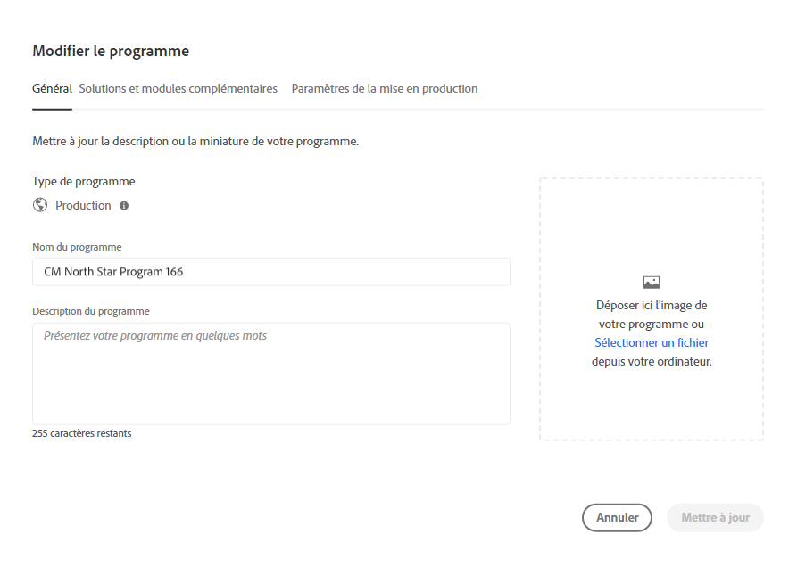

# Modification de programmes {#editing-programs}

Les utilisateurs disposant des autorisations requises peuvent modifier [programmes de production créés dans votre organisation](creating-production-programs.md) et [programmes sandbox créés dans votre entreprise.](creating-sandbox-programs.md) En éditant un programme, vous pouvez :

* Ajoutez la solution Sites à un programme existant avec Assets et inversement.
* Supprimer Sites ou Assets d’un programme existant contenant à la fois Sites et Assets.
* Ajoutez un second droit de solution inutilisé à un programme existant ou en tant que nouveau programme.
* Supprimer les programmes Sandbox.

## Autorisations {#permissions}

Vous devez être membre du rôle **Propriétaire de l’entreprise** pour modifier des programmes ou supprimer des programmes dans la sandbox.

## Modifier un programme {#editing}

1. Connectez-vous à Cloud Manager à l’adresse [my.cloudmanager.adobe.com](https://my.cloudmanager.adobe.com/) et sélectionnez l’organisation appropriée.

1. Cliquez sur le programme à modifier pour en afficher les détails.

1. Cliquez sur le nom de votre programme dans le coin supérieur gauche de la page, puis sélectionnez **Modifier le programme**.

   

1. La page **Modifier le programme** s’affiche. Dans l’onglet **Général**, modifiez le nom et la description du programme.

   * Au moins une solution doit être sélectionnée pour un programme.

   

1. Dans l’onglet **Solutions et modules complémentaires**, modifiez les solutions du programme.

   

1. Cliquez sur le chevron situé avant le nom de la solution pour afficher les modules complémentaires facultatifs, tels que la sélection de la variable **Commerce** option de module complémentaire sous **Sites**.

   

1. Dans l’onglet **Paramètres de la mise en production**, modifiez la date de mise en production prévue du programme.

   

   * Cette date est fournie à titre d’information uniquement. Il déclenche le widget GoLive sur la page d’aperçu du programme. De son côté, il fournit des liens internes au produit vers la documentation des bonnes pratiques as a Cloud Service de Adobe Experience Manager (AEM) pour s’aligner sur votre parcours, ce qui a abouti à une expérience GoLive réussie.
   * Cet onglet n’est pas disponible pour les programmes Sandbox.

1. Cliquez sur **Mettre à jour** pour enregistrer vos modifications dans le programme.

Chaque fois qu’un programme est modifié, y compris l’ajout ou la suppression d’une solution ou d’un module complémentaire, ces modifications prennent effet après le prochain déploiement.

Si la sécurité de votre programme de production a été améliorée, une **Sécurité renforcée** est disponible dans la **Modifier le programme** pour confirmer que la fonctionnalité est active pour le programme.

Vous ne pouvez pas modifier ce paramètre une fois le programme créé. Pour plus d’informations sur l’option de sécurité améliorée, voir [Création de programmes de production](creating-production-programs.md).

## Suppression de programmes Sandbox {#delete-sandbox-program}

La suppression d’un programme d’environnement de test supprime tous les environnements et pipelines qui y sont associés.

>[!TIP]
>
>Les utilisateurs avec des rôles de **Propriétaire de l’entreprise** ou **Responsable du déploiement** peuvent également supprimer leurs environnements de production et d’évaluation plutôt que l’ensemble du programme Sandbox.

Pour supprimer un programme sandbox, procédez comme suit.

1. Connectez-vous à Cloud Manager à l’adresse [my.cloudmanager.adobe.com](https://my.cloudmanager.adobe.com/) et sélectionnez l’organisation appropriée.

1. Cliquez sur le programme à modifier pour en afficher les détails.

1. Cliquez sur le nom de votre programme en haut à gauche de la page, puis sélectionnez **Supprimer le programme**.

   

Vous pouvez également cliquer sur le bouton représentant des points de suspension sur la vignette de votre programme dans la page de présentation de Cloud Manager et sélectionner **Supprimer le programme**.

>[!NOTE]
>
>Seuls les programmes Sandbox peuvent être supprimés. Les programmes de production ne peuvent pas être supprimés.
