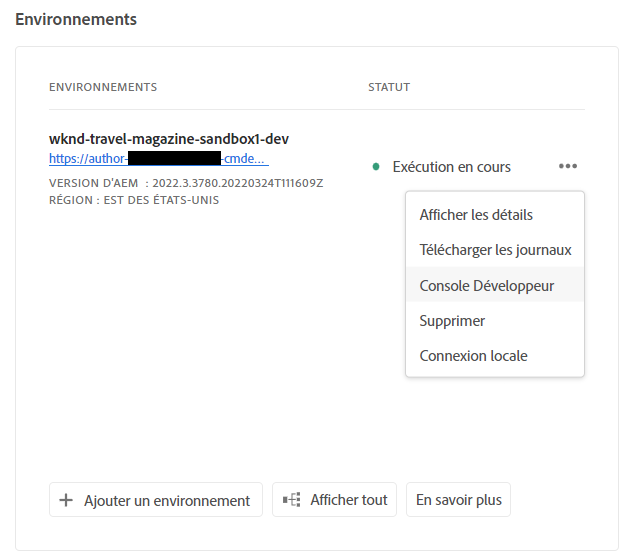

# Mise en veille et réactivation d’environnements Sandbox {#hibernating-introduction}

Les environnements d’un programme Sandbox passent en mode veille si aucune activité n’est détectée pendant huit heures. La veille est propre aux environnements de programme Sandbox. Les environnements de programme de production ne connaissent pas de veille.

## Mise en veille {#hibernation-introduction}

La mise en veille peut se produire automatiquement ou manuellement.

* **Automatique** - Les environnements de programme Sandbox sont automatiquement mis en veille après huit heures d’inactivité. L’inactivité est définie comme le fait que ni le service de création, ni les services de prévisualisation ou de publication ne reçoivent de requêtes.
* **Manuelle** - En tant qu’utilisateur, vous pouvez mettre en veille manuellement un environnement de programme Sandbox. Il n’est pas nécessaire de le faire, car la veille se produit automatiquement de la manière décrite précédemment.

Les environnements de programme Sandbox peuvent prendre quelques minutes pour passer en mode veille. Les données sont conservées pendant la veille.

### Utilisation de la veille manuelle {#using-manual-hibernation}

Vous pouvez mettre en veille manuellement votre programme Sandbox à partir de la Developer Console. Un utilisateur de Cloud Manager peut accéder à la Developer Console pour un programme Sandbox.

Suivez ces étapes pour mettre vos environnements de programme Sandbox en veille manuellement.

1. Connectez-vous à Cloud Manager à l’adresse [my.cloudmanager.adobe.com](https://my.cloudmanager.adobe.com/) et sélectionnez l’organisation appropriée.

1. Dans la console **[Mes programmes](/help/implementing/cloud-manager/navigation.md#my-programs)**, appuyez ou cliquez sur le programme que vous souhaitez mettre en veille pour afficher ses détails.

1. Sur la carte **Environnements**, cliquez sur le bouton représentant des points de suspension et sélectionnez la **Developer Console**.

   * Consultez [Accès à Developer Console](/help/implementing/cloud-manager/manage-environments.md#accessing-developer-console) pour plus d’informations sur Developer Console.

   

1. Dans la Developer Console, cliquez sur **Hibernate** (Mise en veille).

    (Mise en veille)

1. Cliquez sur **Hibernate** (Mise en veille) pour confirmer l’étape.

   

Une fois la veille terminée, vous voyez la notification de fin du processus de veille pour votre environnement dans l’écran **Developer Console**.

Dans Developer Console, vous pouvez également cliquer sur le lien **Environments** dans le chemin de navigation situé au-dessus de la liste déroulante **Pod** pour obtenir une liste des environnements à mettre en veille.

## Réactivation {#de-hibernation-introduction}

Vous pouvez mettre en veille manuellement votre programme Sandbox à partir de la Developer Console.

>[!IMPORTANT]
>
>Un utilisateur disposant d’une de rôle de **développeur** peut réactiver un environnement de programme Sandbox.

1. Connectez-vous à Cloud Manager à l’adresse [my.cloudmanager.adobe.com](https://my.cloudmanager.adobe.com/) et sélectionnez l’organisation appropriée.

1. Dans la console **[Mes programmes](/help/implementing/cloud-manager/navigation.md#my-programs)**, appuyez ou cliquez sur le programme que vous souhaitez réactiver pour afficher ses détails.

1. Sur la carte **Environnements**, cliquez sur le bouton représentant des points de suspension et sélectionnez la **Developer Console**.

   * Consultez [Accès à Developer Console](/help/implementing/cloud-manager/manage-environments.md#accessing-developer-console) pour plus d’informations sur Developer Console.

1. Cliquez sur **De-hibernate** (Réactiver).

    (Réactiver)

1. Cliquez sur **De-Hibernate** (Réactiver) pour confirmer l’étape.

   

1. Vous recevez une notification vous informant que le processus de réactivation a commencé et vous recevez des informations sur la progression.

   

1. Une fois le processus terminé, l’environnement de programme Sandbox redevient actif.

   

Dans Developer Console, vous pouvez également cliquer sur le lien **Environments** dans le chemin de navigation situé au-dessus de la liste déroulante **Pod** pour obtenir une liste des environnements à réactiver.

### Autorisations de réactivation {#permissions-de-hibernate}

Tout utilisateur disposant d’un profil de produit qui lui donne accès à AEM as a Cloud Service doit pouvoir accéder à la **Developer Console**, qui lui permet de réactiver l’environnement.

## Accès à un environnement mis en veille {#accessing-hibernated-environment}

Lors de l’exécution de requêtes de navigateur par rapport au service de création, de prévisualisation ou de publication d’un environnement mis en veille, l’utilisateur rencontre une page de destination décrivant le statut de mise en veille de l’environnement, ainsi qu’un lien vers la Developer Console où le service peut être réactivé.

## Déploiements et mises à jour AEM {#deployments-updates}

Les environnements mis en veille permettent toujours les déploiements et les mises à niveau manuelles d’AEM.

* Un utilisateur peut utiliser un pipeline pour déployer du code personnalisé sur des environnements mis en veille. L’environnement demeure en veille et le nouveau code apparaît dans l’environnement une fois ce dernier réactivé.

* Les mises à niveau d’AEM peuvent être appliquées aux environnements mis en veille et peuvent être déclenchées manuellement à partir de Cloud Manager. L’environnement demeure en veille et la nouvelle version apparaît dans l’environnement une fois ce dernier réactivé.

## Mise en veille et suppression {#hibernation-deletion}

* Les environnements d’un programme Sandbox sont automatiquement mis en veille après huit heures d’inactivité.
   * L’inactivité est définie comme le fait que ni le service de création, ni les services de prévisualisation ou de publication ne reçoivent de requêtes.
   * Une fois mis en veille, ils peuvent être [réactivés manuellement].(#de-hibernation-introduction)
* Les programmes Sandbox sont supprimés après 6 mois de mise en veille continue, après quoi ils peuvent être recréés.

>[!NOTE]
>
>Seuls les environnements Sandbox sont automatiquement supprimés après six mois de mise en veille continue. Le programme Sandbox avec son référentiel et son code est conservé.
