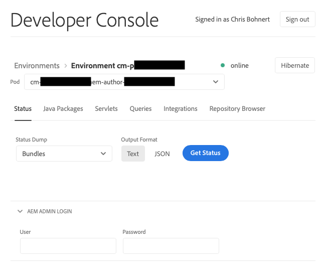
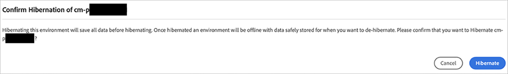
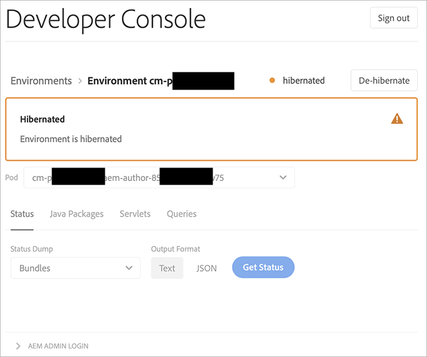
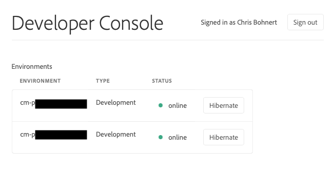
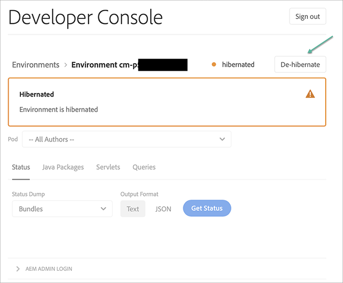
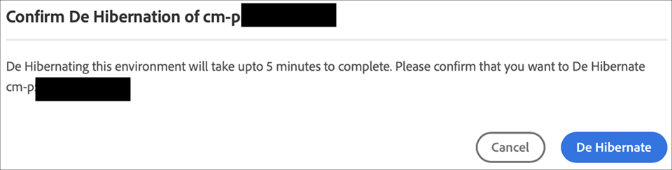
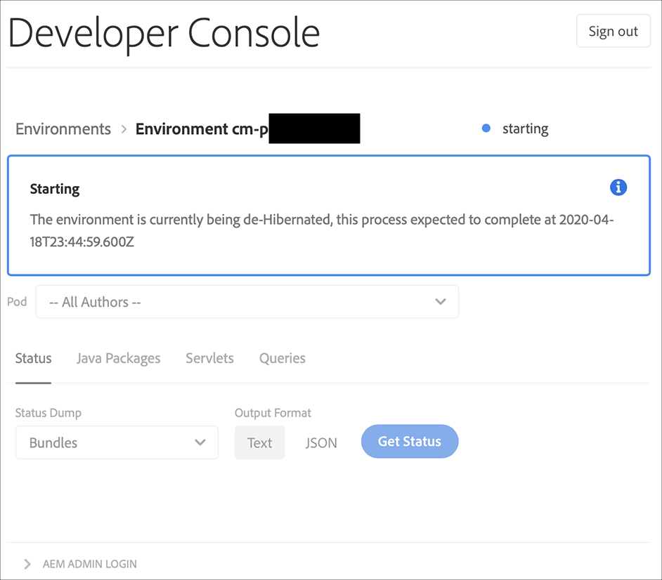
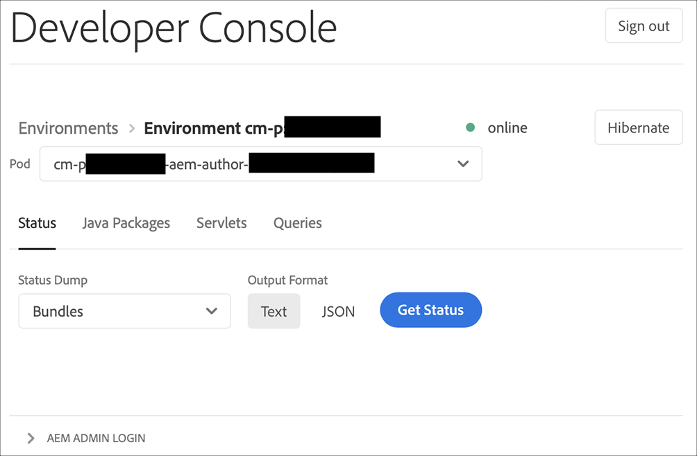
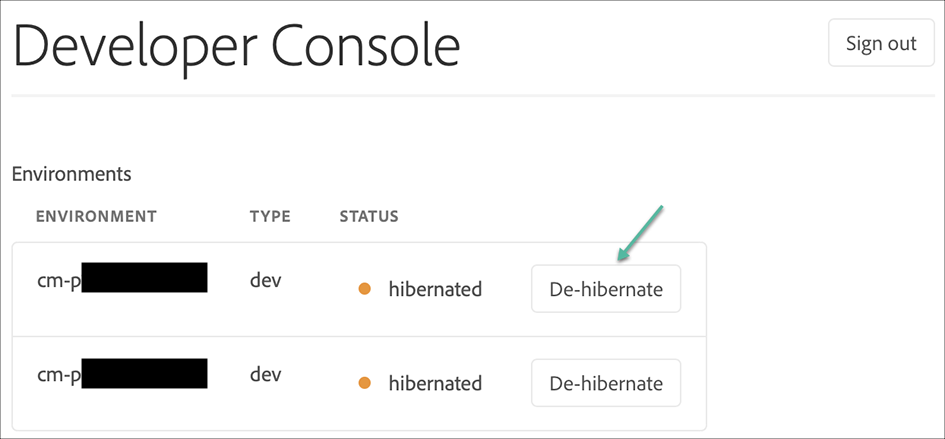
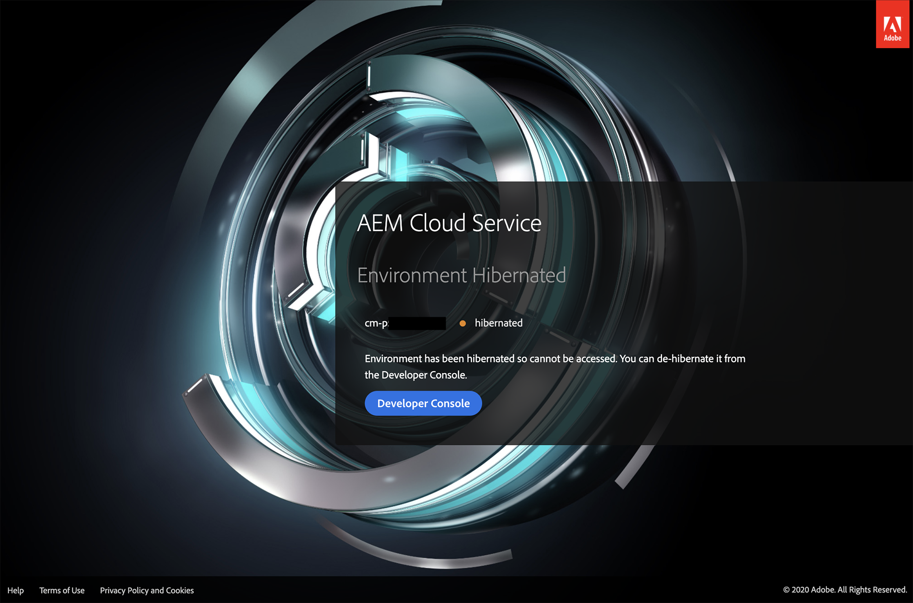

# Mise en veille et réactivation d’environnements Sandbox {#hibernating-introduction}

Les environnements d’un programme Sandbox passent en mode veille si aucune activité n’est détectée pendant huit heures. La mise en veille est propre aux environnements de programme Sandbox. Les environnements de programme de production ne peuvent pas être mis en veille.

## Mise en veille {#hibernation-introduction}

La mise en veille peut se produire automatiquement ou manuellement.

* **Automatique** - Les environnements de programme Sandbox sont automatiquement mis en veille après huit heures d’inactivité. L’inactivité est définie comme l’absence de requêtes aux services de création, de prévisualisation et de publication.
* **Manuelle** - Vous pouvez mettre en veille manuellement un environnement de programme Sandbox. Il n’est pas nécessaire de le faire, car la veille se produit automatiquement comme décrit précédemment.

Les environnements de programme Sandbox passent en mode veille en quelques minutes. Les données sont conservées pendant la veille.

### Mise en veille manuelle d’un environnement de programme Sandbox {#using-manual-hibernation}

Vous pouvez mettre en veille manuellement votre programme Sandbox à partir de la Developer Console. Tout utilisateur de Cloud Manager peut accéder au Developer Console d’un programme Sandbox.

**Mise en veille manuelle d’un environnement de programme Sandbox :**

1. Connectez-vous à Cloud Manager à l’adresse [my.cloudmanager.adobe.com](https://my.cloudmanager.adobe.com/) et sélectionnez l’organisation appropriée.

1. Sur la console **[Mes programmes](/help/implementing/cloud-manager/navigation.md#my-programs)**, cliquez sur un *programme Sandbox* que vous souhaitez mettre en veille pour en afficher les détails.

1. Sur la carte **Environnements**, cliquez sur  puis sur **Developer Console**.

   * Consultez [Accès à Developer Console](/help/implementing/cloud-manager/manage-environments.md#accessing-developer-console) pour plus d’informations sur Developer Console.

   

1. Sur la page ****, cliquez sur **Mise en veille**.

<!-- UPDATE THESE SCREENSHOTS WHEN NEW AEM DEVELOPER CONSOLE UI IS RELEASED. AS OF OCTOBER 14, 2024, NEW UI IS STILL IN PRIVATE BETA -->

 (Mise en veille)

1. Cliquez sur **Hibernate** (Mise en veille) pour confirmer l’étape.

   

Une fois la mise en veille réussie, la notification de fin du processus de mise en veille de votre environnement s’affiche à l’écran ****.

Dans le Developer Console, cliquez sur le lien **Environnements** dans les chemins de navigation au-dessus de la liste déroulante **Pod** pour afficher les environnements disponibles en veille.

## Réactivation manuelle d’un programme Sandbox à partir de Developer Console {#de-hibernation-introduction}

Vous pouvez mettre en veille manuellement votre programme Sandbox à partir de la Developer Console.

>[!IMPORTANT]
>
>Un utilisateur disposant d’une de rôle de **développeur** peut réactiver un environnement de programme Sandbox.

**Pour réactiver manuellement un programme Sandbox à partir de Developer Console :**

1. Connectez-vous à Cloud Manager à l’adresse [my.cloudmanager.adobe.com](https://my.cloudmanager.adobe.com/) et sélectionnez l’organisation appropriée.

1. Dans la console **[Mes programmes](/help/implementing/cloud-manager/navigation.md#my-programs)**, cliquez sur le programme que vous souhaitez réactiver pour en afficher les détails.

1. Sur la carte **Environnements**, cliquez sur  puis sur **Developer Console**.

   * Consultez [Accès à Developer Console](/help/implementing/cloud-manager/manage-environments.md#accessing-developer-console) pour plus d’informations sur Developer Console.

1. Cliquez sur **De-hibernate**.

    (Réactiver)

1. Cliquez sur **De-hibernate** (Réactiver) pour confirmer l’étape.

   

1. Une notification vous informe du début du processus de sortie d’hibernation et vous communique sa progression.

   

1. Une fois le processus terminé, l’environnement de programme Sandbox redevient actif.

   

Dans le Developer Console, cliquez sur le lien **Environnements** dans les chemins de navigation au-dessus de la liste déroulante **Pod** pour accéder aux environnements disponibles en vue de la réactivation.

### Autorisations de réactivation {#permissions-de-hibernate}

Tout utilisateur disposant d&#39;un profil de produit qui lui donne accès à AEM as a Cloud Service peut accéder à **Developer Console**. Cela leur permet de réactiver l’environnement.

## Accès à un environnement mis en veille {#accessing-hibernated-environment}

Lorsqu’un utilisateur envoie une requête de navigateur au service de création, de prévisualisation ou de publication d’un environnement mis en veille, il rencontre une page de destination. Cette page explique le statut de mise en veille de l’environnement et fournit un lien vers le Developer Console de réactivation.

## Déploiements et mises à jour d’AEM {#deployments-updates}

Les environnements mis en veille permettent toujours les déploiements et les mises à niveau manuelles d’AEM.

* Un utilisateur utilise un pipeline pour déployer du code personnalisé dans des environnements mis en veille. L’environnement reste en veille et le nouveau code apparaît dans l’environnement une fois réactivé.

* Les mises à niveau d’AEM peuvent être appliquées aux environnements mis en veille et peuvent être déclenchées manuellement à partir de Cloud Manager. L’environnement reste en veille et la nouvelle version apparaît dans l’environnement une fois ce dernier réactivé.

## Mise en veille et suppression {#hibernation-deletion}

* Les environnements d’un programme Sandbox sont automatiquement mis en veille après huit heures d’inactivité.
   * L’inactivité est définie comme l’absence de requêtes aux services de création, de prévisualisation et de publication.
   * Une fois mis en veille, ils peuvent être [réactivés manuellement](#de-hibernation-introduction).
* Les programmes Sandbox sont supprimés après six mois de mise en veille continue, après quoi ils peuvent être recréés.

>[!NOTE]
>
>Seuls les environnements Sandbox sont automatiquement supprimés après six mois de mise en veille continue. Le programme Sandbox avec son référentiel et son code est conservé.
