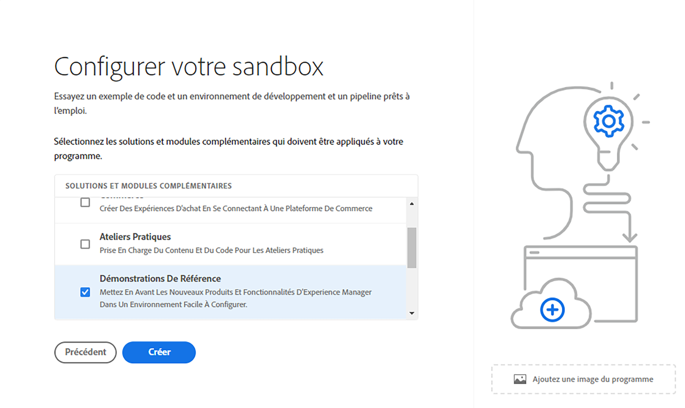

# Présentation des programmes Sandbox {#sandbox-programs}

Découvrez les programmes Sandbox et leurs différences par rapport aux programmes de production.

## Présentation {#introduction}

Un programme Sandbox est généralement créé pour servir à la formation, à l’exécution de démonstrations, à l’activation ou aux preuves de concept (POC), ils ne sont donc pas destinés à transporter du trafic en direct.

Un programme sandbox est l’un des deux types de programmes disponibles dans AEM Cloud Service, l’autre étant un [programme de production](introduction-production-programs.md). Voir [Présentation des programmes et des types de programmes](/help/implementing/cloud-manager/getting-access-to-aem-in-cloud/program-types.md) pour en savoir plus sur les types de programmes.

## Création automatique {#auto-creation}

Les programmes Sandbox proposent la création automatique. Chaque fois que vous [créez un programme sandbox](/help/implementing/cloud-manager/getting-access-to-aem-in-cloud/creating-sandbox-programs.md), Cloud Manager automatiquement :

* Ajoute des solutions AEM Sites, Assets et Edge Delivery Services comme solutions par défaut à votre programme.

  

* Configurez un référentiel git de projet avec un exemple de projet basé sur l’[archétype de projet AEM](https://experienceleague.adobe.com/fr/docs/experience-manager-core-components/using/developing/archetype/overview).
* Création d’un environnement de développement.
* Création d’un pipeline hors production qui se déploie vers l’environnement de développement.

Un programme d’environnement de test n’a qu’un seul environnement de développement.

## Limites et conditions {#limitations}

Étant donné qu’ils ne sont pas destinés au trafic en direct, les programmes Sandbox présentent certaines limites et conditions d’utilisation, ce qui les différencie des programmes de production.

| Limitation/condition | Description |
| --- | --- |
| Pas de trafic en direct | Les programmes Sandbox ne sont pas destinés à transporter du trafic en direct et ne sont donc pas soumis aux [engagements AEM as a Cloud Service](https://www.adobe.com/fr/legal/service-commitments.html). |
| Aucune mise à l’échelle automatique | Les environnements créés dans un programme Sandbox ne sont pas configurés pour la mise à l’échelle automatique. Par conséquent, ils ne conviennent pas aux tests de performances ou de charge. |
| Aucun domaine personnalisé ni Liste autorisée IP | [Les domaines personnalisés](/help/implementing/cloud-manager/custom-domain-names/introduction.md) et les [Listes autorisées IP](/help/implementing/cloud-manager/ip-allow-lists/introduction.md) ne sont pas disponibles dans les programmes Sandbox. |
| Aucune autre zone de publication | [D’autres régions de publication](/help/operations/additional-publish-regions.md) ne sont pas disponibles dans les programmes Sandbox. |
| No 99.99% SLA | [99,99 % SLA](/help/implementing/cloud-manager/getting-access-to-aem-in-cloud/creating-production-programs.md#sla) ne s’applique pas aux programmes Sandbox. |
| Aucune mise en réseau avancée | Les [fonctionnalités de mise en réseau avancées](/help/security/configuring-advanced-networking.md) (par exemple, la configuration en libre-service de réseaux VPN, de ports non standards, d’adresses IP de sortie dédiées, etc.) ne sont pas disponibles dans les programmes Sandbox. |
| Aucune mise à jour d’AEM automatique | Les mises à jour AEM ne sont pas automatiquement transmises aux programmes Sandbox, mais peuvent être appliquées manuellement aux environnements dans votre programme Sandbox.  ・ Une mise à jour manuelle ne peut être exécutée que si l’environnement ciblé dispose d’un pipeline correctement configuré.  ・ Une mise à jour manuelle d’un environnement de production ou d’évaluation met automatiquement à jour l’autre. Le jeu d’environnements Production+Évaluation doit se trouver dans la même version AEM. Pour plus d’informations, voir [AEM mises à jour de version](/help/implementing/deploying/aem-version-updates.md). Voir [Mise à jour de l’environnement](/help/implementing/cloud-manager/manage-environments.md#updating-dev-environment) pour savoir comment mettre à jour un environnement. |
| Pas de support technique | Étant donné qu’un programme d’environnement de test est généralement créé à des fins de formation, d’exécution de démonstrations, d’activation ou de preuves de concept (BAT), le support technique n’est pas disponible pour les problèmes rencontrés dans un programme d’environnement de test. Si vous rencontrez des problèmes lors de la création et de la gestion de vos programmes Sandbox, ces problèmes sont pris en charge par le support technique. |
| Mise en veille et suppression | Les environnements d’un programme Sandbox sont automatiquement mis en veille après huit heures d’inactivité. Les environnements Sandbox sont supprimés après six mois de mise en veille continus. Voir [Mise en veille et réactivation d’environnements Sandbox](/help/implementing/cloud-manager/getting-access-to-aem-in-cloud/hibernating-environments.md) pour plus d’informations sur la réactivation et la suppression automatique d’environnements Sandbox. |
