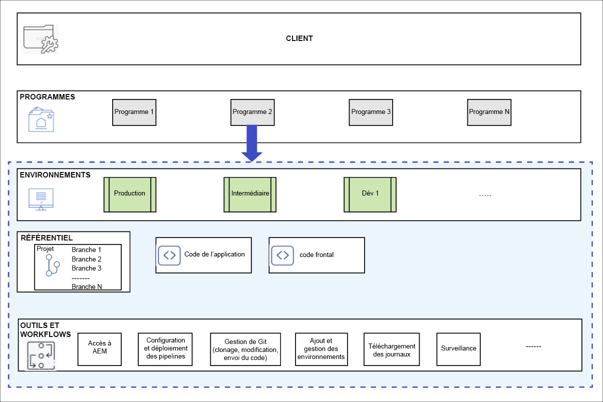

# Programmes et types de programmes {#understanding-programs}

Cloud Manager repose sur une hiérarchie d’entités. Les détails ne sont pas essentiels à votre travail au quotidien dans Cloud Manager, mais un aperçu vous aidera à comprendre les programmes et à configurer vos propres programmes.



* **CLIENT** - Il s’agit du haut de la hiérarchie. Chaque client est configuré avec un identifiant client.
* **PROGRAMS** - Chaque client possède un ou plusieurs programmes, [qui reflètent souvent les solutions sous licence du client](introduction-production-programs.md).
* **ENVIRONNEMENTS** - Chaque programme comporte plusieurs environnements, tels que la production pour le contenu en direct, un pour l’évaluation et un à des fins de développement.
   * Chaque programme ne peut avoir qu’un seul environnement de production, mais plusieurs environnements hors production.
* **RÉFÉRENTIEL** - Les programmes disposent de référentiels Git dans lesquels l’application et le code front-end sont conservés pour les environnements.
* **OUTILS ET WORKFLOWS** - Les pipelines gèrent le déploiement du code des référentiels vers les environnements, tandis que d’autres outils permettent d’accéder aux journaux, à la surveillance et à la gestion de l’environnement.

Un exemple est souvent utile pour contextualiser cette hiérarchie.

* Disons que WKND Travel and Adventure Enterprises est un **client** qui se concentre sur les médias liés aux voyages.
* Disons que le client WKND Travel and Adventure Enterprises peut avoir deux **programmes** : un programme Sites pour WKND Magazine et un programme Assets pour WKND Media.
* Les programmes pour le magazine WKND et les médias WKND auraient tous les deux des **environnements** de développement, d’évaluation et de production.

## Référentiel de code source {#source-code-repository}

Un programme Cloud Manager est fourni avec son propre référentiel Git.

Pour accéder au référentiel git Cloud Manager, les utilisateurs doivent utiliser un client git avec un outil de ligne de commande, un client git visuel autonome ou l’IDE de votre choix, tel qu’Eclipse, IntelliJ ou NetBeans.

Une fois le client Git configuré, vous pouvez gérer votre référentiel Git à partir de l’interface utilisateur de Cloud Manager. Pour en savoir plus sur la gestion de Git à l’aide de l’interface utilisateur de Cloud Manager, consultez la section [Accès à Git](/help/implementing/cloud-manager/managing-code/accessing-repos.md).

Pour commencer à développer l’application AEM Cloud, une copie locale du code de l’application doit être effectuée en l’extrayant du référentiel Cloud Manager vers un emplacement de votre ordinateur local.

```java
$ git clone {URL}
```

Le workflow est donc un workflow Git standard.

1. Un utilisateur clone une copie locale du référentiel Git.
1. L’utilisateur apporte des modifications au référentiel de code local.
1. Une fois prêt, l’utilisateur valide les modifications dans le référentiel Git distant.

La seule différence réside dans le fait que le référentiel Git distant fait partie de Cloud Manager, qui est transparent pour le développeur.

## Types de programmes {#program-types}

Un utilisateur peut créer un programme **production** ou un programme **sandbox**.

* Un **programme de production** est créé pour activer le trafic en direct pour votre site.
   * Consultez [Présentation des programmes de production](/help/implementing/cloud-manager/getting-access-to-aem-in-cloud/introduction-production-programs.md) pour plus d’informations.
* Un **programme sandbox** est généralement créé pour les besoins de formation, à des fins de démonstration, d’activation, de preuve de concept ou de documentation.
   * Un environnement de test n’est pas destiné à transporter du trafic en direct et comporte des restrictions qu’un programme de production ne prévoit pas.
   * Elle comprend des sites, Assets et des Edge Delivery Services. Elle est fournie avec une branche git automatiquement renseignée avec un exemple de code, un environnement de développement et un pipeline hors production.
   * Consultez [Présentation des programmes de sandbox](/help/implementing/cloud-manager/getting-access-to-aem-in-cloud/introduction-sandbox-programs.md) pour plus d’informations.
